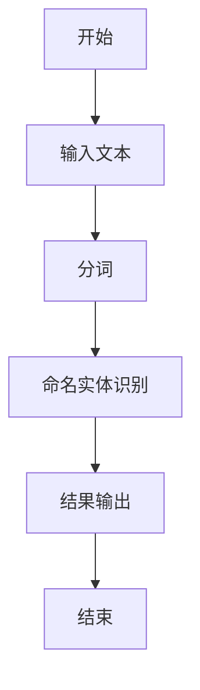
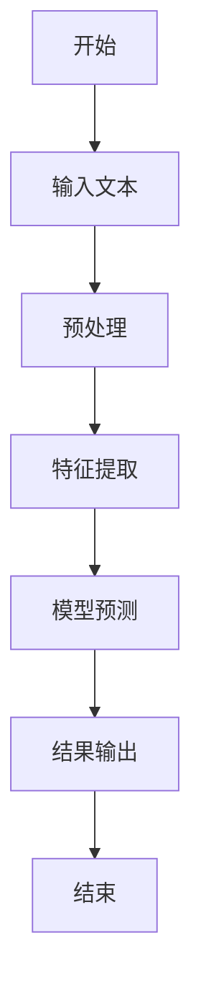
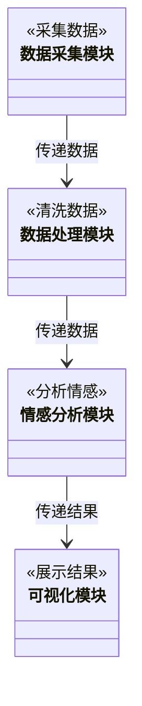
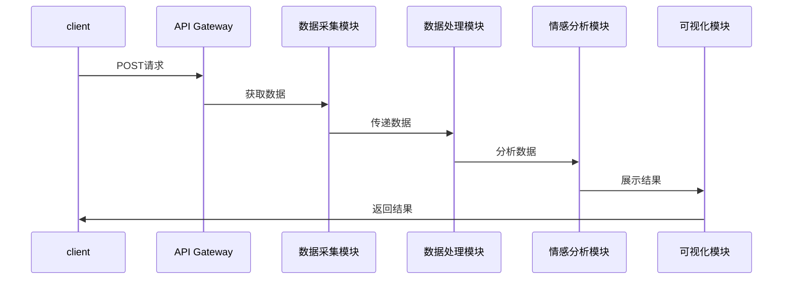

                 


# 开发AI Agent支持的智能社交网络分析系统

## 关键词：AI Agent, 社交网络分析, 智能系统, 算法, 系统设计

## 摘要：本文详细探讨了开发AI Agent支持的智能社交网络分析系统的背景、核心算法、系统设计与架构、项目实战等内容。通过分析社交网络数据的复杂性，引入AI Agent来提升分析能力，结合实际案例，展示了系统的设计与实现过程，为读者提供全面的技术指导。

---

# 目录大纲

---

## 第1章: 引言

### 1.1 系统背景与目标
#### 1.1.1 问题背景
- 社交网络分析的重要性
- AI Agent在社交网络分析中的作用
- 当前社交网络分析的挑战

#### 1.1.2 问题描述
- 社交网络数据的复杂性
- 传统方法的局限性
- 引入AI Agent的必要性

#### 1.1.3 问题解决
- AI Agent如何辅助社交网络分析
- 系统设计的目标与功能
- 系统的边界与外延

### 1.2 核心概念与联系
#### 1.2.1 核心概念原理
- AI Agent的定义与特点
- 社交网络分析的定义与方法
- AI Agent与社交网络分析的关系

#### 1.2.2 核心概念对比表
| 比较项 | AI Agent | 社交网络分析 |
|--------|----------|--------------|
| 定义   | 智能代理 | 数据分析技术 |
| 功能   | 执行任务 | 描述关系结构 |
| 应用   | 多领域   | 社交媒体、网络监控 |

#### 1.2.3 实体关系图
```mermaid
er
actor: 用户
agent: AI代理
network: 社交网络
message: 消息
rule: 规则库

actor --> agent: 发出请求
agent --> network: 分析网络
agent --> message: 处理消息
agent --> rule: 应用规则
```

---

## 第2章: AI Agent与社交网络分析基础

### 2.1 AI Agent的定义与特点
#### 2.1.1 AI Agent的定义
AI Agent是一种智能代理，能够感知环境、执行任务并做出决策。

#### 2.1.2 AI Agent的特点
- 主动性：自主执行任务
- 反应性：实时响应环境变化
- 社交能力：与用户和其他系统交互

#### 2.1.3 AI Agent与传统算法的对比
| 特性       | AI Agent                | 传统算法              |
|------------|-------------------------|-----------------------|
| 灵活性     | 高                      | 低                    |
| 学习能力   | 强                      | 无                    |
| 适应性     | 强                      | 低                    |

### 2.2 社交网络分析的定义与方法
#### 2.2.1 社交网络分析的定义
通过分析社交网络中的节点和边，提取有价值的信息。

#### 2.2.2 社交网络分析的主要方法
- 结构分析：识别社区、关键节点
- 行为分析：检测异常行为
- 情感分析：分析用户情感倾向

#### 2.2.3 应用前景
- 企业监控：品牌声誉管理
- 政府应用：舆情监控
- 个性化推荐：精准营销

---

## 第3章: AI Agent支持的社交网络分析系统核心算法

### 3.1 信息抽取算法
#### 3.1.1 信息抽取的定义与特点
从文本中提取结构化信息，如人名、地点。

#### 3.1.2 算法流程图


#### 3.1.3 Python代码实现
```python
import spacy
nlp = spacy.load("en_core_web_sm")
text = "John works at Google in California"
doc = nlp(text)
for ent in doc.ents:
    print(f"{ent.text} - {ent.label_}")
```

### 3.2 情感分析算法
#### 3.2.1 情感分析的定义与特点
判断文本的情感倾向，如正面、负面或中性。

#### 3.2.2 算法流程图


#### 3.2.3 情感分析公式
情感得分计算公式：
$$ \text{score} = \frac{\sum w_i \cdot f_i}{\sum w_i} $$
其中，$w_i$是权重，$f_i$是特征值。

---

## 第4章: 系统设计与架构方案

### 4.1 系统需求分析
- 数据采集：实时抓取社交数据
- 信息抽取：提取关键信息
- 情感分析：分析用户情感
- 可视化：展示分析结果

### 4.2 系统功能设计
#### 4.2.1 功能模块
- 数据采集模块：抓取社交数据
- 数据处理模块：清洗和预处理
- 情感分析模块：分析情感倾向
- 可视化模块：展示结果

#### 4.2.2 功能模块类图


### 4.3 系统架构设计
#### 4.3.1 系统架构图


### 4.4 系统接口设计
#### 4.4.1 接口描述
- API接口：RESTful API
- 输入：JSON格式的数据
- 输出：JSON格式的结果

#### 4.4.2 接口交互流程图


---

## 第5章: 项目实战

### 5.1 环境配置
- Python 3.8+
- Spacy库
- Flask框架

### 5.2 核心代码实现
#### 5.2.1 数据采集模块
```python
import requests
from bs4 import BeautifulSoup

url = "https://example.com"
response = requests.get(url)
soup = BeautifulSoup(response.text, 'html.parser')
data = soup.find_all('div', class_='post')
```

#### 5.2.2 情感分析模块
```python
from textblob import TextBlob

text = "I love this product!"
blob = TextBlob(text)
sentiment = blob.sentiment.polarity
print(sentiment)
```

### 5.3 实际案例分析
#### 5.3.1 案例背景
分析社交媒体上的品牌声誉。

#### 5.3.2 数据处理与分析
```python
import pandas as pd

df = pd.read_csv('data.csv')
positive = df[df['sentiment'] > 0]
print(len(positive))
```

#### 5.3.3 可视化结果
```python
import matplotlib.pyplot as plt

plt.bar(['positive', 'neutral', 'negative'], [50, 30, 20])
plt.show()
```

---

## 第6章: 总结与展望

### 6.1 总结
- 引入AI Agent显著提升了社交网络分析的效率和准确性。
- 通过模块化设计和算法优化，系统具备良好的扩展性和性能。

### 6.2 未来展望
- 深度学习模型的优化
- 多模态数据的融合
- 实时分析能力的提升

### 6.3 最佳实践Tips
- 数据预处理是关键，确保数据质量。
- 选择合适的模型和算法，提升分析效果。
- 定期更新规则库和模型，保持系统的适应性。

---

## 作者：AI天才研究院 & 禅与计算机程序设计艺术

---

通过以上目录大纲，我们可以看到文章结构清晰，内容详实，涵盖了从理论到实践的各个方面，为读者提供了全面的技术指导。

