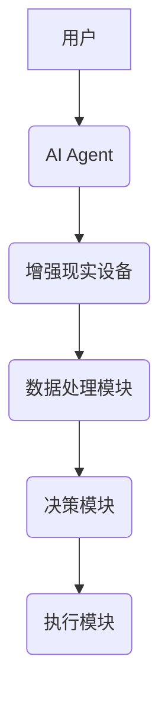

                 


# 开发具有增强现实能力的AI Agent

> 关键词：AI Agent, 增强现实, 实时计算, 多模态数据, 人机交互, 决策算法

> 摘要：本文详细探讨了开发具有增强现实能力的AI Agent的技术背景、核心概念、算法原理、系统架构及其实现方法。通过理论与实践相结合的方式，深入分析了AI Agent与增强现实技术的结合方式，以及如何在实际项目中实现这一目标。文章内容涵盖从基础概念到系统实现的全过程，旨在为相关领域的开发者和研究人员提供有价值的参考。

---

## 第一部分: 开发具有增强现实能力的AI Agent背景介绍

### 第1章: AI Agent与增强现实概述

#### 1.1 AI Agent的基本概念
##### 1.1.1 什么是AI Agent
AI Agent（人工智能代理）是指能够感知环境、自主决策并执行任务的智能实体。它可以是一个软件程序、机器人或其他智能系统，其核心目标是通过与环境交互，完成特定任务或提供服务。AI Agent具备以下核心特征：
- **自主性**：能够在没有外部干预的情况下自主运行。
- **反应性**：能够实时感知环境并做出响应。
- **目标导向性**：基于目标驱动行为。
- **学习能力**：通过数据和经验改进性能。

##### 1.1.2 AI Agent的核心特征
AI Agent的核心特征包括：
- **自主性**：AI Agent能够在没有外部干预的情况下自主运行。
- **反应性**：AI Agent能够实时感知环境并做出响应。
- **目标导向性**：AI Agent的行为由目标驱动，而非随机执行。
- **学习能力**：AI Agent能够通过数据和经验改进性能。

##### 1.1.3 AI Agent的分类与应用场景
AI Agent可以根据不同的标准进行分类：
- **按智能水平**：分为反应式AI Agent、基于模型的AI Agent和完全自主的AI Agent。
- **按应用场景**：分为服务型AI Agent（如智能助手）、工业型AI Agent（如工业机器人）和娱乐型AI Agent（如游戏AI）。

应用场景包括：
- 智能助手（如Siri、Alexa）
- 自动驾驶
- 智能客服
- 工业自动化

#### 1.2 增强现实技术的基本原理
##### 1.2.1 AR的定义与技术组成
增强现实（Augmented Reality，AR）是一种将数字信息叠加到现实世界中的技术，通过计算机视觉、图形学和传感器技术实现。AR的核心组成包括：
- **传感器**：用于获取现实环境的数据（如摄像头、陀螺仪）。
- **图形渲染引擎**：用于将数字内容叠加到现实环境中。
- **算法**：用于图像识别、三维建模和实时渲染。

##### 1.2.2 AR的关键技术与实现方法
AR的关键技术包括：
- **图像识别**：通过摄像头捕捉环境信息，识别目标物体。
- **三维建模**：基于图像数据构建三维模型。
- **实时渲染**：将数字内容叠加到现实环境中，并保证渲染的实时性和稳定性。

##### 1.2.3 AR的典型应用领域
AR的典型应用领域包括：
- **游戏**：如《Pokémon Go》。
- **教育**：如虚拟解剖模型。
- **购物**：如虚拟试衣。
- **工业**：如设备维护辅助。

#### 1.3 AI Agent与增强现实的结合背景
##### 1.3.1 AI与AR融合的必要性
随着技术的发展，AI Agent和AR的结合变得越来越必要。AR需要实时的环境感知和智能决策能力，而AI Agent能够提供这些能力。通过结合AI Agent和AR，可以实现更智能、更自然的交互方式。

##### 1.3.2 AI Agent在AR中的作用
AI Agent在AR中的作用包括：
- **环境感知**：通过传感器和AI算法感知环境。
- **智能决策**：基于环境信息做出决策。
- **人机交互**：通过自然的方式与用户交互。

##### 1.3.3 当前技术发展的趋势
当前技术发展的趋势包括：
- **AI Agent的智能化**：AI Agent的决策能力越来越强。
- **AR的实时化**：AR的渲染和交互越来越实时。
- **二者的深度融合**：AI Agent和AR的结合越来越紧密。

---

## 第二部分: 开发AI Agent与增强现实的能力需求

### 第2章: AI Agent的感知与交互能力

#### 2.1 多模态数据处理
##### 2.1.1 多模态数据的定义
多模态数据是指来自不同感官的数据，如视觉数据、听觉数据、触觉数据等。AI Agent需要能够处理多种数据类型，以实现更全面的环境感知。

##### 2.1.2 多模态数据融合
多模态数据融合是指将不同类型的传感器数据进行融合，以提高感知的准确性和鲁棒性。例如，可以将视觉数据和音频数据进行融合，以提高目标识别的准确性。

##### 2.1.3 数据预处理与特征提取
数据预处理是指对原始数据进行清洗和转换，以提高数据的质量和可用性。特征提取是指从数据中提取有用的特征，以便后续的处理和分析。

#### 2.2 自然语言理解与生成
##### 2.2.1 自然语言处理的核心技术
自然语言处理（NLP）是AI Agent实现人机交互的关键技术。NLP的核心技术包括：
- **词法分析**：对文本进行分词和词性标注。
- **句法分析**：对句子结构进行分析。
- **语义理解**：理解文本的语义含义。

##### 2.2.2 基于深度学习的NLP模型
基于深度学习的NLP模型（如BERT、GPT）已经取得了显著的成果。这些模型可以通过大量数据进行训练，以实现高质量的自然语言理解与生成。

##### 2.2.3 对话系统的设计与优化
对话系统的设计与优化包括：
- **对话策略**：如何根据上下文生成合适的回复。
- **对话管理**：如何管理对话的状态和流程。
- **反馈机制**：如何根据用户的反馈调整对话策略。

#### 2.3 视觉识别与场景理解
##### 2.3.1 基于深度学习的视觉识别
基于深度学习的视觉识别技术（如卷积神经网络CNN）已经在图像分类、目标检测等领域取得了显著的成果。

##### 2.3.2 场景理解与三维重建
场景理解是指对环境进行语义分析，理解环境中的物体、场景和事件。三维重建是指基于图像数据构建三维模型，以实现更精确的环境感知。

##### 2.3.3 增强现实中的视觉优化
在增强现实中，视觉优化技术包括：
- **图像增强**：对图像进行增强处理，以提高视觉效果。
- **视觉跟踪**：对目标物体进行跟踪，以实现更精确的叠加。

### 第3章: 增强现实中的实时计算与渲染

#### 3.1 高精度定位与追踪技术
##### 3.1.1 基于传感器的定位技术
基于传感器的定位技术（如IMU、GPS）可以提供位置信息，但精度有限。

##### 3.1.2 基于视觉的定位技术
基于视觉的定位技术（如ORB-SLAM）可以通过图像匹配实现高精度定位。

##### 3.1.3 融合传感器与视觉的定位优化
通过融合传感器数据和视觉数据，可以实现更高精度的定位。

#### 3.2 三维建模与渲染优化
##### 3.2.1 三维建模技术
三维建模技术包括：
- **点云建模**：基于点云数据构建三维模型。
- **网格建模**：基于网格数据构建三维模型。

##### 3.2.2 增强现实中的渲染优化
在增强现实中，渲染优化技术包括：
- **光影计算**：通过光影计算实现更真实的渲染效果。
- **遮挡处理**：处理遮挡关系，避免渲染错误。
- **性能优化**：优化渲染性能，以提高帧率。

#### 3.3 实时渲染的性能优化
##### 3.3.1 GPU加速渲染
通过GPU加速渲染可以显著提高渲染性能。

##### 3.3.2 降低渲染复杂度
通过简化模型和减少贴图数量，可以降低渲染复杂度。

##### 3.3.3 网络优化
通过压缩数据和优化数据传输，可以提高渲染性能。

### 第4章: 网络与数据传输的安全性

#### 4.1 数据加密与隐私保护
##### 4.1.1 数据加密技术
数据加密技术（如AES）可以保护数据的安全。

##### 4.1.2 隐私保护技术
隐私保护技术（如差分隐私）可以在保护隐私的前提下进行数据分析。

#### 4.2 网络传输的低延迟要求
##### 4.2.1 低延迟网络技术
低延迟网络技术（如5G）可以满足增强现实对实时性的要求。

##### 4.2.2 数据压缩与编码
通过数据压缩和编码技术（如Huffman编码）可以减少数据传输量，降低延迟。

#### 4.3 边缘计算的应用
##### 4.3.1 边缘计算的定义
边缘计算是指在靠近数据源的地方进行计算和处理。

##### 4.3.2 边缘计算的优势
边缘计算的优势包括：
- **低延迟**：边缘计算可以在靠近数据源的地方进行处理，减少延迟。
- **高带宽**：边缘计算可以分担云端的计算压力，提高带宽利用率。

---

## 第三部分: AI Agent与增强现实的核心概念与联系

### 第5章: AI Agent的智能决策机制

#### 5.1 基于强化学习的决策模型
##### 5.1.1 强化学习的基本原理
强化学习（Reinforcement Learning）是一种通过试错学习的算法，通过与环境交互，学习最优策略。

##### 5.1.2 Q-learning算法
Q-learning算法是一种经典的强化学习算法，通过维护一个Q表，记录每个状态-动作对的期望奖励。

##### 5.1.3 Deep Q-Network（DQN）算法
DQN算法通过深度神经网络近似Q值函数，可以处理高维状态空间和动作空间。

#### 5.2 状态空间与动作空间的定义
##### 5.2.1 状态空间的定义
状态空间是指所有可能的状态的集合。

##### 5.2.2 动作空间的定义
动作空间是指所有可能的动作的集合。

##### 5.2.3 状态-动作空间的建模
状态-动作空间的建模是强化学习的核心，需要根据具体任务进行定义。

#### 5.3 决策树与概率模型的应用
##### 5.3.1 决策树的应用
决策树是一种树状结构，用于表示决策过程。在AI Agent中，决策树可以用于简单的决策任务。

##### 5.3.2 概率模型的应用
概率模型（如马尔可夫链）可以用于处理不确定性较高的决策任务。

### 第6章: 增强现实中的实时反馈与交互

#### 6.1 用户输入的实时处理
##### 6.1.1 用户输入的类型
用户输入的类型包括：
- **语音输入**：通过语音命令进行交互。
- **手势输入**：通过手势进行交互。
- **触控输入**：通过触控操作进行交互。

##### 6.1.2 实时反馈机制
实时反馈机制是指在用户输入后，系统立即做出响应。

##### 6.1.3 反馈的多样性
反馈的多样性包括：
- **视觉反馈**：通过图像或文字进行反馈。
- **语音反馈**：通过语音进行反馈。
- **触觉反馈**：通过震动或力反馈进行反馈。

#### 6.2 动态环境下的自适应调整
##### 6.2.1 动态环境的定义
动态环境是指环境状态不断变化的环境。

##### 6.2.2 自适应调整算法
自适应调整算法包括：
- **状态估计**：通过传感器数据估计环境状态。
- **决策调整**：根据环境变化调整决策策略。

#### 6.3 人机交互的反馈机制
##### 6.3.1 反馈机制的类型
反馈机制的类型包括：
- **主动反馈**：用户主动提供反馈。
- **被动反馈**：系统自动提供反馈。

##### 6.3.2 反馈机制的设计
反馈机制的设计需要考虑：
- **反馈的及时性**：反馈需要及时。
- **反馈的准确性**：反馈需要准确。
- **反馈的易用性**：反馈需要易于理解和使用。

### 第7章: AI Agent与增强现实的系统架构

#### 7.1 系统整体架构图（Mermaid）


#### 7.2 核心概念对比表
| 概念       | AI Agent特点             | 增强现实特点           |
|------------|--------------------------|------------------------|
| 输入方式   | 多模态数据               | 图像、语音、位置数据   |
| 输出方式   | 行动指令                 | 图像、语音、文字       |
| 核心任务   | 智能决策                 | 实时渲染与叠加         |
| 技术挑战   | 环境感知与决策优化       | 实时计算与渲染性能     |

---

## 第四部分: 项目实战

### 第8章: 环境安装与系统核心实现

#### 8.1 环境安装
##### 8.1.1 安装Python
```bash
python --version
pip install --upgrade pip
```

##### 8.1.2 安装依赖库
```bash
pip install numpy
pip install matplotlib
pip install pytorch
pip install transformers
```

#### 8.2 系统核心实现
##### 8.2.1 数据预处理
```python
import numpy as np

def preprocess_data(data):
    # 数据清洗
    data = data.dropna()
    # 标准化
    data = (data - data.mean()) / data.std()
    return data
```

##### 8.2.2 AI Agent的决策算法实现
```python
import torch
import torch.nn as nn

class DQN(nn.Module):
    def __init__(self, input_dim, output_dim):
        super(DQN, self).__init__()
        self.fc1 = nn.Linear(input_dim, 64)
        self.fc2 = nn.Linear(64, output_dim)
    
    def forward(self, x):
        x = torch.relu(self.fc1(x))
        x = self.fc2(x)
        return x
```

##### 8.2.3 增强现实的渲染实现
```python
import pygame

pygame.init()
screen = pygame.display.set_mode((800, 600))
pygame.display.set_caption("AR Demo")

running = True
while running:
    for event in pygame.event.get():
        if event.type == pygame.QUIT:
            running = False
    screen.fill((0, 0, 0))
    pygame.display.flip()

pygame.quit()
```

#### 8.3 代码应用解读与分析
##### 8.3.1 数据预处理代码解读
数据预处理代码用于对原始数据进行清洗和标准化，以提高数据的质量和可用性。

##### 8.3.2 AI Agent的决策算法解读
AI Agent的决策算法基于深度Q网络，通过神经网络近似Q值函数，实现智能决策。

##### 8.3.3 增强现实的渲染代码解读
增强现实的渲染代码使用Pygame库，实现基本的图形渲染功能。

#### 8.4 实际案例分析
##### 8.4.1 案例背景
假设我们开发一个增强现实的应用，帮助用户识别周围的物体。

##### 8.4.2 系统功能设计
系统功能包括：
- **物体识别**：通过摄像头捕捉图像，识别物体。
- **信息叠加**：在识别到的物体上叠加相关信息。
- **人机交互**：用户可以通过语音或手势进行交互。

##### 8.4.3 实际代码实现
```python
import cv2
import numpy as np

def detect_objects(image):
    # 使用OpenCV进行物体识别
    gray = cv2.cvtColor(image, cv2.COLOR_BGR2GRAY)
    edges = cv2.Canny(gray, 50, 150)
    return edges

def overlay_information(image, edges):
    # 在识别到的物体上叠加信息
    result = cv2.addWeighted(image, 0.5, edges, 0.5, 0)
    return result

# 主程序
if __name__ == "__main__":
    cap = cv2.VideoCapture(0)
    while True:
        ret, frame = cap.read()
        if not ret:
            break
        edges = detect_objects(frame)
        result = overlay_information(frame, edges)
        cv2.imshow('AR Demo', result)
        if cv2.waitKey(1) & 0xFF == ord('q'):
            break
    cap.release()
    cv2.destroyAllWindows()
```

#### 8.5 项目小结
通过实际案例分析，我们可以看到AI Agent与增强现实的结合可以实现丰富的功能。在开发过程中，需要综合考虑算法实现、系统架构和用户体验。

---

## 第五部分: 最佳实践

### 第9章: 开发注意事项与优化技巧

#### 9.1 开发注意事项
##### 9.1.1 硬件性能要求
确保硬件性能足够，特别是在处理实时计算和渲染时。

##### 9.1.2 数据隐私保护
在处理用户数据时，必须遵守数据隐私保护的相关法律法规。

##### 9.1.3 系统稳定性
确保系统的稳定性，避免因程序崩溃导致用户体验下降。

#### 9.2 开发优化技巧
##### 9.2.1 算法优化
通过算法优化（如减少计算复杂度）提高系统性能。

##### 9.2.2 系统架构优化
通过系统架构优化（如分层架构）提高系统的可维护性和扩展性。

##### 9.2.3 用户体验优化
通过用户体验优化（如增加反馈机制）提高用户的使用体验。

### 第10章: 拓展阅读与学习资源

#### 10.1 拓展阅读
##### 10.1.1 AI Agent相关书籍
- 《人工智能：一种现代方法》
- 《强化学习：理论与应用》

##### 10.1.2 增强现实相关书籍
- 《增强现实：从概念到实现》
- 《AR开发入门与实践》

#### 10.2 学习资源
##### 10.2.1 在线课程
- Coursera：《人工智能基础》
- Udemy：《增强现实开发实战》

##### 10.2.2 开源项目
- GitHub：OpenCV
- GitHub：ARKit

---

## 结语

开发具有增强现实能力的AI Agent是一个复杂而有趣的任务，需要综合运用人工智能、计算机视觉和实时计算等技术。通过本文的探讨，我们希望能够为读者提供一个清晰的开发思路和实践指南。未来，随着技术的不断进步，AI Agent与增强现实的结合将更加紧密，为人类带来更智能、更自然的交互体验。

---

## 作者：AI天才研究院/AI Genius Institute & 禅与计算机程序设计艺术/Zen And The Art of Computer Programming

