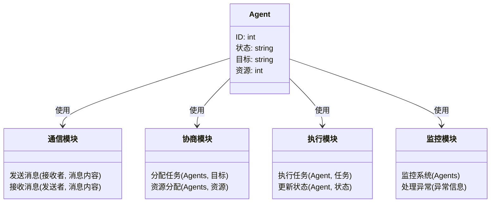
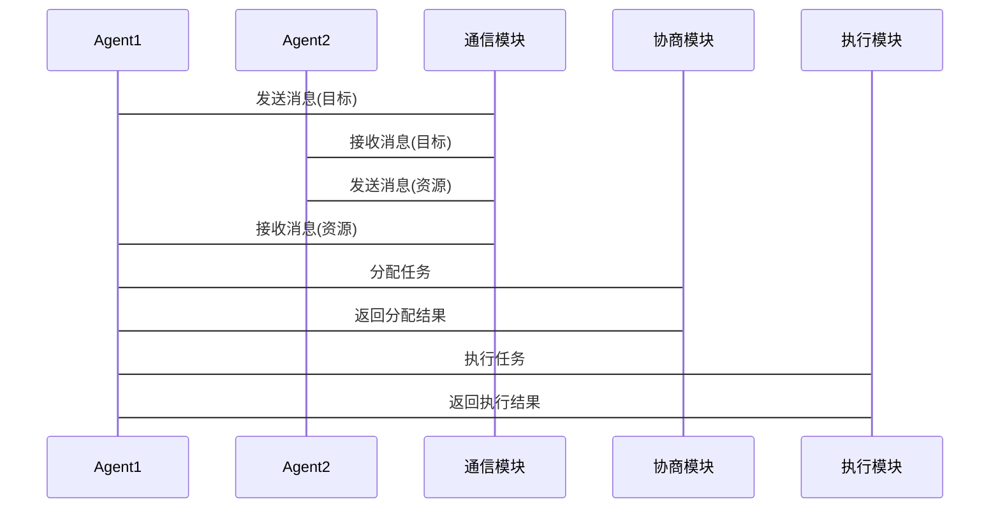

                 


# 开发具有多Agent协作能力的系统

---

## 关键词
多Agent系统，协作机制，分布式计算，人工智能，系统架构设计

---

## 摘要
本文详细探讨了开发具有多Agent协作能力的系统的各个方面，从基本概念到核心算法，再到系统架构设计和实际应用案例。通过分析多Agent协作的核心原理、算法实现以及系统架构，读者可以系统地掌握如何设计和实现高效的多Agent协作系统。本文还提供了丰富的代码示例和图表，帮助读者更好地理解和应用这些技术。

---

# 第1章 多Agent协作系统概述

## 1.1 多Agent系统的基本概念

### 1.1.1 什么是多Agent系统
多Agent系统（Multi-Agent System, MAS）是由多个智能体（Agent）组成的系统，这些智能体能够自主地感知环境、进行推理和决策，并通过协作完成复杂的任务。多Agent系统的每个Agent都有一定的自主性，能够独立执行任务，同时与其他Agent进行通信和协作。

### 1.1.2 多Agent系统的特点与优势
多Agent系统具有以下特点：
1. **自主性**：每个Agent能够自主决策和行动，无需外部干预。
2. **反应性**：Agent能够感知环境并实时响应变化。
3. **协作性**：多个Agent通过协作完成共同目标。
4. **分布性**：Agent分布在不同的节点上，能够独立运行。

多Agent系统的优势在于能够处理复杂、动态的环境，适合分布式计算和人工智能领域的应用。

### 1.1.3 多Agent系统的应用场景
多Agent系统广泛应用于以下领域：
1. **分布式计算**：如分布式任务分配、负载均衡。
2. **人工智能**：如智能交通系统、智能助手。
3. **企业级系统**：如企业资源规划（ERP）、供应链管理。

---

## 1.2 多Agent协作的基本原理

### 1.2.1 Agent的定义与分类
Agent是一种能够感知环境并采取行动以实现目标的实体。根据智能水平，Agent可以分为：
1. **反应式Agent**：基于当前感知做出反应。
2. **认知式Agent**：具有推理和规划能力。
3. **混合式Agent**：结合反应式和认知式Agent的特点。

### 1.2.2 多Agent协作的模型与框架
多Agent协作的模型包括：
1. **BDI模型**：基于信念（Belief）、愿望（Desire）、意图（Intention）的模型。
2. **协作规划模型**：通过协作规划实现任务分配和协调。

### 1.2.3 多Agent协作的核心机制
多Agent协作的核心机制包括通信、协商和协调：
1. **通信**：Agent之间通过消息传递进行信息交换。
2. **协商**：通过协商机制分配任务和资源。
3. **协调**：确保所有Agent的行为一致，避免冲突。

---

## 1.3 多Agent协作系统的应用领域

### 1.3.1 分布式计算中的多Agent协作
在分布式计算中，多Agent协作用于任务分配、负载均衡和资源管理。

### 1.3.2 人工智能中的多Agent协作
在人工智能领域，多Agent协作用于智能交通管理、智能助手和群体智能。

### 1.3.3 企业级系统中的多Agent协作
在企业级系统中，多Agent协作用于供应链管理、ERP系统和流程优化。

---

## 1.4 本章小结
本章介绍了多Agent协作系统的基本概念、特点、优势及其应用场景，为后续章节的深入分析奠定了基础。

---

# 第2章 多Agent协作的核心概念

## 2.1 多Agent协作的数学模型

### 2.1.1 多Agent协作的数学模型概述
多Agent协作的数学模型通常包括状态、动作和目标三个部分。

### 2.1.2 多Agent协作的数学模型构建
数学模型可以表示为：
$$
\text{最大化 } U = \sum_{i=1}^{n} u_i
$$
其中，\( u_i \) 是第 \( i \) 个Agent的效用函数。

### 2.1.3 数学模型的优缺点分析
数学模型的优势在于能够量化Agent的协作效果，但可能会忽略实际协作中的动态性和复杂性。

---

## 2.2 多Agent协作的核心要素

### 2.2.1 Agent的智能性与自主性
Agent的智能性体现在其推理和决策能力，自主性体现在其独立行动的能力。

### 2.2.2 多Agent协作的目标与约束
协作目标是实现全局最优，约束条件包括资源限制和时间限制。

### 2.2.3 多Agent协作的通信与协调机制
通信机制包括消息传递和事件驱动，协调机制包括同步和异步协作。

---

## 2.3 多Agent协作的实体关系图

### 2.3.1 ER图的基本概念
实体关系图（ER图）用于描述系统的实体及其关系。

### 2.3.2 多Agent协作系统的ER图设计
以下是多Agent协作系统的ER图示例：

```mermaid
erdigram
  entity(多Agent系统) {
    - AgentID: int
    - 状态: string
    - 目标: string
    - 通信协议: string
  }
  entity(任务) {
    - 任务ID: int
    - 描述: string
    - 完成时间: datetime
  }
  entity(通信) {
    - 通信ID: int
    - 发送者: string
    - 接收者: string
    - 消息内容: string
  }
  relation(关联) {
    多Agent系统 -> 任务: 分配
    多Agent系统 -> 通信: 发送
  }
```

### 2.3.3 ER图在多Agent系统中的应用
ER图用于描述系统的实体结构和关系，帮助设计系统的数据库和功能模块。

---

## 2.4 本章小结
本章分析了多Agent协作的核心概念，包括数学模型、核心要素和实体关系图，为后续章节的算法设计奠定了基础。

---

# 第3章 多Agent协作的算法原理

## 3.1 多Agent协作的主要算法

### 3.1.1 分布式规划算法
分布式规划算法用于多Agent协作中的任务分配和路径规划。

### 3.1.2 协商算法
协商算法用于Agent之间的任务分配和资源分配。

### 3.1.3 一致性算法
一致性算法用于确保多Agent系统中的数据一致性。

---

## 3.2 多Agent协作算法的数学模型

### 3.2.1 分布式规划算法的数学模型
分布式规划算法的数学模型可以表示为：
$$
\text{最大化 } U = \sum_{i=1}^{n} u_i
$$
其中，\( u_i \) 是第 \( i \) 个Agent的效用函数。

### 3.2.2 协商算法的数学模型
协商算法的数学模型可以表示为：
$$
\text{最小化 } C = \sum_{i=1}^{n} c_i
$$
其中，\( c_i \) 是第 \( i \) 个Agent的成本函数。

### 3.2.3 一致性算法的数学模型
一致性算法的数学模型可以表示为：
$$
\text{确保 } S = \sum_{i=1}^{n} s_i
$$
其中，\( s_i \) 是第 \( i \) 个Agent的状态。

---

## 3.3 多Agent协作算法的实现

### 3.3.1 算法实现的步骤
1. **初始化**：定义Agent的数量和目标。
2. **通信**：Agent之间通过通信协议交换信息。
3. **协商**：通过协商算法分配任务。
4. **执行**：Agent根据分配的任务执行操作。
5. **协调**：确保所有Agent的行为一致。

### 3.3.2 算法实现的代码示例

以下是协商算法的Python实现示例：

```python
def协商算法(Agents,目标):
    for agent in Agents:
        agent.目标 = 目标
    for agent in Agents:
        if agent.资源 < agent.目标:
            agent.资源 = 目标
    return Agents
```

### 3.3.3 算法实现的优缺点分析
协商算法的优点在于能够实现资源的公平分配，但可能会导致通信开销过大。

---

## 3.4 本章小结
本章详细介绍了多Agent协作的主要算法及其数学模型，并通过代码示例展示了算法的实现过程。

---

# 第4章 多Agent协作系统的架构设计

## 4.1 系统架构设计概述

### 4.1.1 系统架构设计的目标
系统架构设计的目标是确保系统的可扩展性、可靠性和高效性。

### 4.1.2 系统架构设计的原则
系统架构设计的原则包括模块化、抽象化和分层设计。

### 4.1.3 系统架构设计的步骤
1. **需求分析**：明确系统的功能需求。
2. **模块划分**：将系统划分为功能模块。
3. **接口设计**：定义模块之间的接口。
4. **架构实现**：根据设计实现系统架构。

---

## 4.2 系统功能设计

### 4.2.1 系统功能模块划分
多Agent协作系统的功能模块包括：
1. **通信模块**：负责Agent之间的通信。
2. **协商模块**：负责任务分配和资源分配。
3. **执行模块**：负责任务执行和状态更新。
4. **监控模块**：负责系统监控和异常处理。

### 4.2.2 系统功能的领域模型

以下是领域模型的Mermaid类图：



### 4.2.3 系统功能的交互设计

以下是系统交互的Mermaid序列图：



---

## 4.3 本章小结
本章详细介绍了多Agent协作系统的架构设计，包括功能模块划分、类图设计和交互设计，为后续章节的项目实现奠定了基础。

---

# 第5章 多Agent协作系统的项目实战

## 5.1 项目介绍
本项目旨在开发一个多Agent协作系统，用于实现任务分配和资源管理。

## 5.2 环境安装
1. **Python环境**：安装Python 3.8及以上版本。
2. **依赖库**：安装`mermaid`和`matplotlib`。

## 5.3 系统核心实现源代码

以下是协商算法的Python实现代码：

```python
class Agent:
    def __init__(self, ID):
        self.ID = ID
        self.目标 = None
        self.资源 = 0

def协商算法(Agents, 目标):
    for agent in Agents:
        agent.目标 = 目标
    for agent in Agents:
        if agent.资源 < agent.目标:
            agent.资源 = 目标
    return Agents

# 示例用法
Agents = [Agent(1), Agent(2), Agent(3)]
协商算法(Agents, 10)
```

## 5.4 代码应用解读与分析
1. **类定义**：定义`Agent`类，包含ID、目标和资源属性。
2. **协商算法**：通过遍历Agent列表，分配目标和资源。
3. **示例用法**：创建多个Agent实例，并调用协商算法。

## 5.5 实际案例分析和详细讲解剖析
通过协商算法，系统能够实现资源的公平分配，确保每个Agent的目标得以实现。

## 5.6 项目小结
本项目通过实际代码实现了多Agent协作系统的协商算法，验证了算法的有效性和可行性。

---

# 第6章 高级主题和最佳实践

## 6.1 高级主题

### 6.1.1 多Agent系统的安全性
多Agent系统的安全性包括数据安全和通信安全。

### 6.1.2 多Agent系统的性能优化
性能优化包括减少通信开销和提高算法效率。

### 6.1.3 多Agent系统的可扩展性
可扩展性包括模块化设计和动态扩展能力。

## 6.2 最佳实践

### 6.2.1 系统设计中的注意事项
1. **模块化设计**：确保系统的可维护性和可扩展性。
2. **通信机制**：选择合适的通信协议，确保系统的高效性和可靠性。

### 6.2.2 代码实现中的注意事项
1. **代码规范**：确保代码的可读性和可维护性。
2. **错误处理**：添加充分的错误处理机制，确保系统的健壮性。

### 6.2.3 测试与调试
1. **单元测试**：测试每个模块的功能。
2. **集成测试**：测试系统整体的协作效果。

---

## 6.3 本章小结
本章总结了多Agent协作系统开发中的高级主题和最佳实践，为读者提供了宝贵的开发经验。

---

# 结语

开发具有多Agent协作能力的系统是一项复杂而有趣的任务。通过本文的详细讲解，读者可以系统地掌握多Agent协作的核心概念、算法原理和系统架构设计。希望本文能够为读者在实际项目中提供有价值的参考和指导。

---

## 作者

作者：AI天才研究院/AI Genius Institute & 禅与计算机程序设计艺术 /Zen And The Art of Computer Programming

