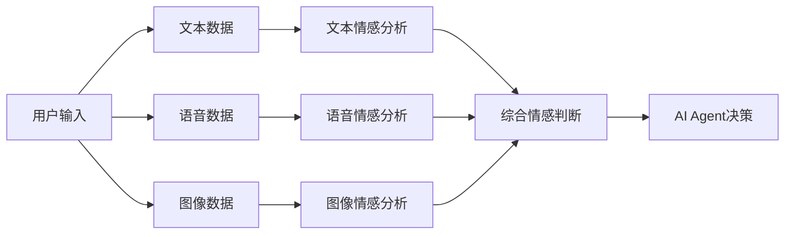
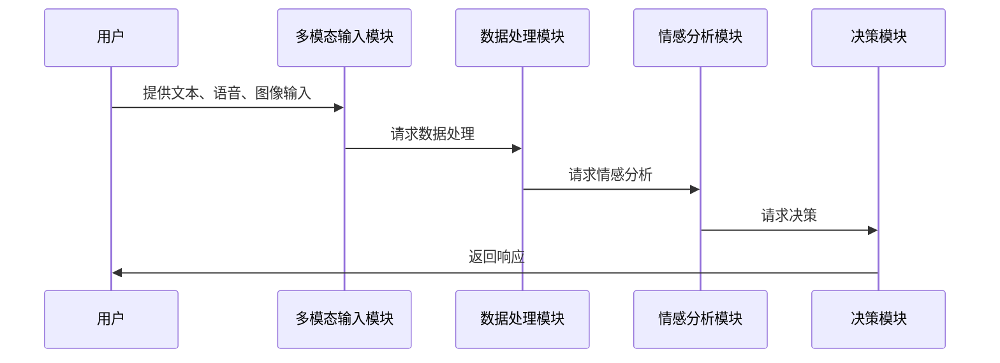

                 

# 开发具有多模态情感分析能力的AI Agent

> 关键词：多模态情感分析、AI Agent、文本分析、语音分析、图像分析、深度学习

> 摘要：本文深入探讨了开发具有多模态情感分析能力的AI Agent的技术细节。首先，我们介绍了多模态情感分析的背景、定义及其在AI Agent中的应用价值。接着，详细分析了多模态数据的特征、情感分析模型的原理及AI Agent的结构与功能。然后，我们从算法原理的角度，探讨了多模态数据的预处理、特征提取及情感分析模型的融合方法。最后，通过实际项目案例，详细讲解了AI Agent的系统架构设计、接口设计及实现过程，并总结了开发中的注意事项及未来研究方向。

---

# 第一部分: 多模态情感分析与AI Agent概述

---

## 第1章: 多模态情感分析与AI Agent背景介绍

### 1.1 多模态情感分析的定义与背景

#### 1.1.1 情感分析的定义与演进
情感分析是自然语言处理（NLP）中的一个经典任务，旨在通过分析文本数据来判断作者的情感倾向（如正面、负面或中性）。随着技术的发展，情感分析从最初的单模态文本分析扩展到多模态数据的融合分析。

#### 1.1.2 多模态数据的引入与意义
多模态数据（包括文本、语音、图像等）的引入使得情感分析更加精准和全面。通过结合多种数据源，AI Agent能够更准确地理解用户的意图和情感。

#### 1.1.3 多模态情感分析的应用场景
多模态情感分析在智能客服、虚拟助手、社交媒体分析等领域有广泛应用。例如，在智能客服中，通过分析用户的文本、语音和表情图片，可以更准确地理解用户的情感状态。

---

### 1.2 AI Agent的基本概念与特点

#### 1.2.1 AI Agent的定义与分类
AI Agent是一种能够感知环境并采取行动以实现目标的智能实体。它可以分为简单反射型、基于模型的反应型、目标驱动型和实用驱动型等类别。

#### 1.2.2 多模态情感分析在AI Agent中的作用
多模态情感分析使AI Agent能够更好地理解用户的输入，从而提供更个性化的服务。例如，在虚拟助手中，通过分析用户的语气和表情，可以更准确地理解用户的需求。

#### 1.2.3 多模态情感分析的挑战与机遇
多模态情感分析的挑战包括数据融合的难度、模型的复杂性以及计算资源的需求。然而，这些挑战也带来了新的研究方向和技术突破的机遇。

---

## 1.3 问题背景与技术挑战

### 1.3.1 多模态数据融合的难点
多模态数据的异构性和多样性增加了数据融合的难度。如何有效地将文本、语音和图像等数据结合起来，是一个关键的技术挑战。

### 1.3.2 情感分析的复杂性与不确定性
情感分析不仅需要处理文本中的情感倾向，还需要考虑上下文、语境等因素。多模态数据的引入进一步增加了分析的复杂性。

### 1.3.3 AI Agent的实时性与交互性要求
AI Agent需要在实时交互中快速响应用户的需求，这对多模态情感分析的计算效率提出了更高的要求。

---

## 1.4 本章小结

---

# 第2章: 多模态情感分析与AI Agent的核心概念

---

## 2.1 多模态数据的特征与属性

### 2.1.1 文本数据的特征
文本数据具有语义丰富、语法复杂等特点，可以通过词袋模型、词嵌入等方法进行特征提取。

### 2.1.2 语音数据的特征
语音数据包括音调、语速、音高变化等特征，可以通过语音信号处理技术提取。

### 2.1.3 图像数据的特征
图像数据包括颜色、纹理、形状等特征，可以通过计算机视觉技术进行特征提取。

---

## 2.2 情感分析模型的原理与结构

### 2.2.1 单模态情感分析模型
单模态情感分析模型主要基于文本、语音或图像中的单一数据源进行情感分析。

### 2.2.2 多模态情感分析模型的融合方式
多模态情感分析模型可以通过晚期融合、早期融合和深度融合等方式结合多种数据源。

---

## 2.3 AI Agent的结构与功能

### 2.3.1 感知层
感知层负责接收和解析多模态输入数据，包括文本、语音和图像的处理。

### 2.3.2 理解层
理解层负责对多模态数据进行语义理解和情感分析，生成初步的分析结果。

### 2.3.3 决策层
决策层根据分析结果生成响应或行动计划，指导AI Agent的下一步操作。

---

## 2.4 多模态情感分析与AI Agent的实体关系图

---

## 2.5 本章小结

---

# 第3章: 多模态情感分析的算法原理

---

## 3.1 多模态数据预处理

### 3.1.1 文本预处理
文本预处理包括分词、去停用词、词干提取等步骤。

### 3.1.2 语音预处理
语音预处理包括降噪、特征提取（如MFCC）等步骤。

### 3.1.3 图像预处理
图像预处理包括归一化、边缘检测等步骤。

---

## 3.2 多模态特征提取

### 3.2.1 文本特征提取
文本特征提取可以使用词袋模型或词嵌入（如Word2Vec、BERT）。

### 3.2.2 语音特征提取
语音特征提取常用梅尔频率倒谱系数（MFCC）。

### 3.2.3 图像特征提取
图像特征提取可以使用卷积神经网络（CNN）提取图像特征。

---

## 3.3 情感分析模型的融合方法

### 3.3.1 晚期融合
晚期融合是在模型的输出层对多模态特征进行融合。

### 3.3.2 早期融合
早期融合是在模型的中间层对多模态特征进行融合。

### 3.3.3 深度融合
深度融合是通过设计深度神经网络结构，将多模态特征深度融合。

---

## 3.4 多模态情感分析的数学模型

### 情感分析损失函数
$$ L = -\sum_{i=1}^{n} y_i \log p_i + (1 - y_i) \log (1 - p_i) $$
其中，$y_i$ 是真实标签，$p_i$ 是预测概率。

---

## 3.5 本章小结

---

# 第4章: AI Agent的系统架构设计

---

## 4.1 系统功能设计

### 4.1.1 多模态数据输入模块
负责接收文本、语音和图像输入。

### 4.1.2 数据处理模块
负责对输入数据进行预处理和特征提取。

### 4.1.3 情感分析模块
负责对多模态特征进行融合和情感分析。

### 4.1.4 决策与响应模块
根据分析结果生成响应或行动计划。

---

## 4.2 系统架构设计

### 4.2.1 分层架构
系统分为感知层、理解层和决策层。

### 4.2.2 微服务架构
系统功能模块化，便于扩展和维护。

---

## 4.3 系统接口设计

### 4.3.1 数据接口
定义多模态数据的输入接口。

### 4.3.2 模型接口
定义情感分析模型的调用接口。

### 4.3.3 响应接口
定义AI Agent的响应输出接口。

---

## 4.4 系统交互流程

---

## 4.5 本章小结

---

# 第5章: 项目实战与优化

---

## 5.1 环境安装与配置

### 5.1.1 安装Python环境
使用Anaconda或virtualenv管理Python环境。

### 5.1.2 安装依赖库
安装必要的库，如TensorFlow、Keras、OpenCV等。

---

## 5.2 数据集准备

### 5.2.1 文本数据集
使用公开的情感分析数据集（如IMDB数据集）。

### 5.2.2 语音数据集
使用开源的语音数据集（如LibriSpeech）。

### 5.2.3 图像数据集
使用公开的图像数据集（如ImageNet）。

---

## 5.3 模型实现与训练

### 5.3.1 文本情感分析模型
实现基于BERT的情感分析模型。

### 5.3.2 语音情感分析模型
实现基于CNN的语音情感分析模型。

### 5.3.3 图像情感分析模型
实现基于ResNet的图像情感分析模型。

---

## 5.4 模型融合与优化

### 5.4.1 晚期融合
在模型的输出层进行融合。

### 5.4.2 早期融合
在模型的中间层进行融合。

### 5.4.3 深度融合
设计深度神经网络结构进行深度融合。

---

## 5.5 实验结果与分析

### 5.5.1 实验设计
设计实验对比不同融合方式的效果。

### 5.5.2 实验结果
展示不同融合方式下的准确率、召回率等指标。

### 5.5.3 结果分析
分析实验结果，总结多模态情感分析的优势。

---

## 5.6 本章小结

---

# 第6章: 总结与展望

---

## 6.1 本章小结

### 6.1.1 核心内容回顾
总结本文的核心内容，包括多模态情感分析的定义、算法原理及AI Agent的系统架构。

---

## 6.2 注意事项与建议

### 6.2.1 数据质量的重要性
强调高质量数据对模型性能的影响。

### 6.2.2 模型优化的建议
建议在实际应用中根据具体需求优化模型结构。

---

## 6.3 未来研究方向

### 6.3.1 更复杂的多模态融合方法
探索更复杂的多模态数据融合方法。

### 6.3.2 实时性优化
研究如何在保证准确性的前提下提升模型的实时性。

### 6.3.3 新兴技术的应用
探索量子计算、元学习等新兴技术在多模态情感分析中的应用。

---

## 6.4 本章小结

---

# 作者：AI天才研究院/AI Genius Institute & 禅与计算机程序设计艺术 /Zen And The Art of Computer Programming

