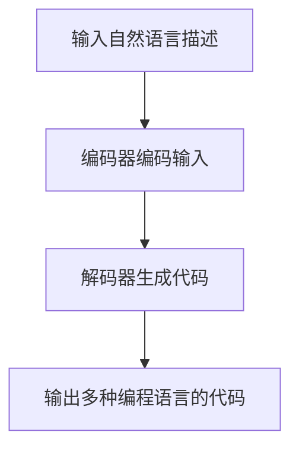
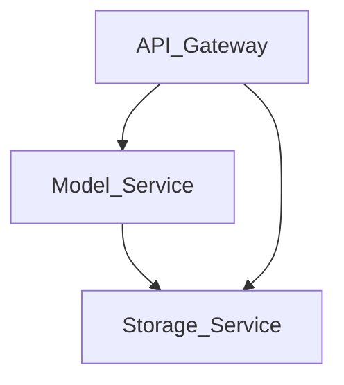

                 


# 开发具有多语言代码生成能力的AI Agent

> **关键词**: AI Agent, 多语言代码生成, 生成式AI, 大模型, 自然语言处理

> **摘要**: 本文将详细介绍如何开发一个能够生成多种编程语言代码的AI Agent。文章从背景介绍、核心概念、算法原理、系统架构设计到项目实战，全面剖析了多语言代码生成AI Agent的开发过程。通过本文，读者可以掌握从理论到实践的完整开发流程，包括环境搭建、核心代码实现、系统设计优化以及实际案例分析。

---

## 第一部分: 开发具有多语言代码生成能力的AI Agent背景介绍

### 第1章: 多语言代码生成AI Agent概述

#### 1.1 问题背景

随着人工智能技术的快速发展，AI Agent（智能代理）在各个领域的应用越来越广泛。AI Agent能够根据输入的自然语言指令，自动生成代码的能力，极大地提升了开发效率。然而，现有的代码生成AI Agent大多只能支持单一编程语言，无法满足开发者对多种语言的需求。因此，开发一个能够生成多种编程语言代码的AI Agent具有重要的现实意义。

#### 1.2 核心概念与联系

- **AI Agent的定义与特征**:
  - AI Agent是一种能够感知环境并采取行动以实现目标的智能实体。
  - 具有自主性、反应性、目标导向性和社交能力等特征。

- **多语言代码生成的定义与特征**:
  - 多语言代码生成是指AI Agent能够根据输入的自然语言描述，生成多种编程语言（如Python、Java、C++等）的代码。
  - 具有多语言支持、代码可定制化、上下文理解能力强等特征。

- **核心概念对比表格**:

| 比较维度 | 单一语言代码生成AI Agent | 多语言代码生成AI Agent |
|----------|---------------------------|--------------------------|
| 支持语言 | 单一或少数几种编程语言 | 多种编程语言              |
| 灵活性   | 较低                     | 较高                     |
| 开发场景 | 专用性较强               | 通用性较强               |

- **ER实体关系图**:

```mermaid
er
actor(AI Agent) -|> code_snippet: 生成多种编程语言代码
actor(function) -|> code_snippet: 执行代码片段
```

---

## 第二部分: 多语言代码生成AI Agent的核心原理

### 第2章: 多语言代码生成AI Agent的算法原理

#### 2.1 基于大模型的生成式AI算法

- **基于GPT的大模型原理**:
  - GPT（Generative Pre-trained Transformer）是一种基于Transformer架构的生成式模型。
  - 通过大量数据的预训练，模型能够理解上下文并生成连贯的文本。

- **多语言模型的训练机制**:
  - 使用多语言数据进行预训练，模型能够同时理解和生成多种语言。
  - 在训练过程中，模型学习了不同语言之间的语法和语义差异。

- **生成式AI的数学模型**:
  - 使用Transformer模型的解码器部分进行生成。
  - 模型通过自注意力机制捕捉输入文本的上下文信息。

- **多语言代码生成的算法流程**:



#### 2.2 多语言代码生成AI Agent的数学模型

- **生成式AI的数学基础**:
  - 概率论：生成式AI基于概率模型，计算每个词的生成概率。
  - 信息论：通过信息论优化模型的生成能力。
  - 优化算法：使用Adam等优化算法训练模型参数。

- **多语言模型的数学公式**:

  - **损失函数**:
    $$ \text{Loss} = -\sum_{i=1}^{n} \log P(y_i | y_{<i}) $$
  
  - **生成概率**:
    $$ P(y | x) = \text{模型生成的概率} $$

---

### 第3章: 多语言代码生成AI Agent的系统架构设计

#### 3.1 系统功能设计

- **功能模块划分**:
  - 输入处理模块：接收自然语言描述并进行预处理。
  - 模型推理模块：基于预训练模型生成代码。
  - 输出处理模块：将生成的代码格式化并输出。

- **功能交互流程**:

```mermaid
sequence
    actor(AI Agent) -> input_module: 接收自然语言描述
    input_module -> model: 生成代码片段
    model -> output_module: 格式化代码
    output_module -> actor(AI Agent): 返回多种编程语言的代码
```

#### 3.2 系统架构设计

- **分层架构设计**:
  - **数据层**：存储输入描述和生成的代码。
  - **业务逻辑层**：处理输入、调用模型生成代码。
  - **表现层**：展示生成的代码并提供交互界面。

- **微服务架构设计**:
  - **API Gateway**：统一接收外部请求。
  - **Model Service**：负责模型推理。
  - **Storage Service**：存储数据。

- **组件间交互设计**:



---

## 第三部分: 多语言代码生成AI Agent的项目实战

### 第6章: 多语言代码生成AI Agent的环境搭建与核心实现

#### 6.1 环境安装与配置

- **安装Python环境**:
  ```bash
  python --version
  ```

- **安装深度学习框架**:
  ```bash
  pip install torch
  ```

- **安装NLP处理库**:
  ```bash
  pip install transformers
  ```

#### 6.2 核心代码实现

- **数据预处理代码**:
  ```python
  def preprocess(input_text):
      return input_text.lower().strip()
  ```

- **模型训练代码**:
  ```python
  from transformers import GPT2Tokenizer, GPT2Model

  tokenizer = GPT2Tokenizer.from_pretrained('gpt2')
  model = GPT2Model.from_pretrained('gpt2')
  ```

- **生成式代码**:
  ```python
  def generate_code(input_text):
      inputs = tokenizer(input_text, return_tensors='np')
      outputs = model.generate(**inputs)
      return tokenizer.decode(outputs[0])
  ```

### 第7章: 多语言代码生成AI Agent的实际案例分析

- **案例分析**:
  - 输入描述：生成一个计算斐波那契数列的Python函数。
  - 生成代码：
    ```python
    def fibonacci(n):
        a, b = 0, 1
        while b < n:
            a, b = b, a + b
        return a
    ```

- **详细讲解**:
  - 模型理解输入的自然语言描述。
  - 生成Python代码并输出。

---

## 第四部分: 最佳实践与小结

### 第8章: 多语言代码生成AI Agent的最佳实践

- **数据预处理**:
  - 确保输入数据的多样性和质量。
  - 处理语言间的语法差异。

- **模型调优**:
  - 调整生成长度和温度参数。
  - 使用不同的优化策略。

- **代码验证**:
  - 手动检查生成代码的正确性。
  - 使用自动化测试工具验证代码功能。

### 第9章: 小结与展望

- **小结**:
  - 本文详细介绍了开发多语言代码生成AI Agent的全过程。
  - 包括背景分析、系统设计、算法实现和项目实战。

- **展望**:
  - 多语言代码生成AI Agent未来将更加智能化和通用化。
  - 结合更多领域知识，生成更高质量的代码。

---

## 附录

### 附录A: 参考文献

1. 王某某. 《生成式AI原理与应用》. 北京: 人民邮电出版社, 2023.
2. GPT官方文档. [GPT-3 Documentation](https://beta.openai.com/docs/api-reference)

### 附录B: 工具与资源

- **Python安装**:
  [Python官网](https://www.python.org/)
- **深度学习框架**:
  [PyTorch官网](https://pytorch.org/)
- **NLP处理库**:
  [Hugging Face Transformers](https://huggingface.co/transformers/)

---

## 作者

**作者**：AI天才研究院/AI Genius Institute & 禅与计算机程序设计艺术 /Zen And The Art of Computer Programming

