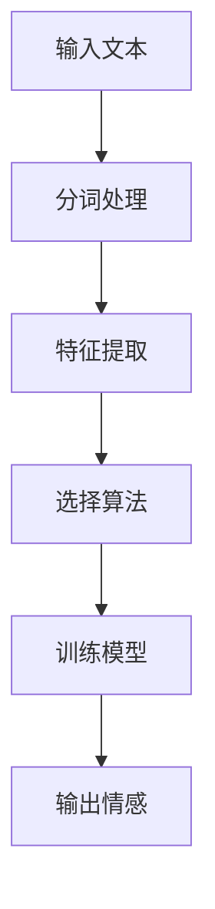

                 


# 开发具有情感分析能力的AI Agent

## 关键词
情感分析, AI Agent, 自然语言处理, 深度学习, 机器学习, 人工智能

## 摘要
本文将详细探讨如何开发具有情感分析能力的AI Agent。首先，我们将介绍情感分析和AI Agent的基本概念及其在现实中的应用。接着，深入分析情感分析的核心算法和AI Agent的系统架构设计。通过具体的项目实战，展示如何在实际开发中应用这些技术。最后，我们将总结开发过程中的一些经验和最佳实践，展望未来的发展方向。

---

# 第1章: 情感分析与AI Agent的背景介绍

## 1.1 情感分析的核心概念
### 1.1.1 情感分析的定义与问题背景
情感分析（Sentiment Analysis）是自然语言处理（NLP）中的一个经典任务，旨在判断文本中表达的情感倾向。例如，判断一条社交媒体上的评论是正面、负面还是中性。情感分析在社交媒体监控、市场调研、客户反馈分析等领域有广泛应用。

### 1.1.2 情感分析的应用场景
- **社交媒体分析**：分析用户对品牌或产品的看法。
- **客户反馈分析**：帮助企业改进产品和服务。
- **舆情监控**：实时监测公众对某个事件或人物的情绪倾向。

### 1.1.3 情感分析的边界与外延
- **边界**：情感分析通常处理显式表达的情感，而非隐含情感或复杂情绪（如讽刺、 sarcasm）。
- **外延**：情感分析可以扩展到情感强度分析、情感分类（如正面、负面、中性）等。

## 1.2 AI Agent的基本概念
### 1.2.1 AI Agent的定义与特点
AI Agent（人工智能代理）是指能够感知环境并采取行动以实现目标的智能体。AI Agent具有以下特点：
- **自主性**：能够在没有外部干预的情况下运行。
- **反应性**：能够实时感知环境并做出反应。
- **目标导向**：所有行为都以实现特定目标为导向。

### 1.2.2 AI Agent的分类与功能
- **分类**：
  - **简单反射型AI Agent**：基于预定义规则做出反应。
  - **基于模型的反应型AI Agent**：使用内部模型来理解和预测环境。
  - **目标驱动型AI Agent**：根据目标选择最优行动。
- **功能**：
  - **感知**：通过传感器或API获取环境信息。
  - **决策**：基于感知信息做出决策。
  - **行动**：执行决策动作。

### 1.2.3 情感分析在AI Agent中的作用
情感分析是AI Agent与人类交互的关键技术。通过情感分析，AI Agent能够理解用户的意图和情感状态，从而提供更个性化的服务。

---

# 第2章: 情感分析的核心概念与联系

## 2.1 情感分析的原理与方法
### 2.1.1 基于规则的情感分析
- **原理**：通过预定义的规则和情感词典匹配文本中的情感关键词。
- **优点**：简单易实现，适用于特定领域。
- **缺点**：难以处理复杂的情感语境，如否定词和复杂句式。

### 2.1.2 统计学习的情感分析
- **原理**：基于统计学习方法（如Naive Bayes、SVM）训练模型，通过特征提取（如词频、n-gram）进行分类。
- **优点**：能够捕捉到数据中的统计规律。
- **缺点**：对特征工程依赖较高，且难以处理语义信息。

### 2.1.3 深度学习的情感分析
- **原理**：使用深度学习模型（如LSTM、BERT）学习文本的语义表示，并通过模型参数优化进行情感分类。
- **优点**：能够捕捉到文本的深层语义信息，准确率高。
- **缺点**：需要大量标注数据和计算资源。

## 2.2 情感分析与AI Agent的关系
### 2.2.1 情感分析在AI Agent中的作用
- **输入处理**：分析用户的输入文本，提取情感信息。
- **决策支持**：根据情感信息调整AI Agent的响应策略。
- **反馈优化**：通过情感分析结果优化与用户的交互体验。

### 2.2.2 AI Agent如何利用情感分析
- **个性化服务**：根据用户情感状态提供定制化服务。
- **情感驱动的交互**：通过情感分析调整对话语气和内容。
- **情感监控**：实时监控用户对服务的情感反馈。

### 2.2.3 情感分析与AI Agent的交互流程
- **输入**：用户发送一条带有情感倾向的文本。
- **处理**：AI Agent调用情感分析模块，判断文本的情感倾向。
- **决策**：根据情感倾向调整响应内容。
- **输出**：返回个性化回复。

---

# 第3章: 情感分析的算法原理

## 3.1 情感分析的经典算法
### 3.1.1 Naive Bayes算法
- **原理**：基于贝叶斯定理，通过计算条件概率进行分类。
- **公式**：
  $$ P(y|x) = \frac{P(x|y)P(y)}{P(x)} $$
  其中，$y$表示情感类别（正面或负面），$x$表示文本特征。

### 3.1.2 支持向量机（SVM）算法
- **原理**：通过构建超平面将数据点分为不同类别。
- **优点**：在小规模数据上表现优异。

### 3.1.3 深度学习模型（如LSTM、BERT）
- **LSTM模型**：
  $$ f(t) = \text{tanh}(W_f \cdot [h_{t-1}, x_t] + b_f) $$
  其中，$h_{t-1}$表示前一时刻的隐藏状态，$x_t$表示当前输入。
- **BERT模型**：通过预训练和微调的方式进行情感分类。

## 3.2 情感分析算法的流程图


## 3.3 情感分析算法的数学模型
### 3.3.1 Naive Bayes的概率公式
$$ P(y|x) = \frac{P(x|y)P(y)}{P(x)} $$

### 3.3.2 LSTM的结构公式
$$ f(t) = \text{tanh}(W_f \cdot [h_{t-1}, x_t] + b_f) $$

---

# 第4章: AI Agent的系统分析与架构设计

## 4.1 AI Agent的系统架构
### 4.1.1 AI Agent的功能模块
- **感知模块**：负责接收输入并进行初步处理。
- **情感分析模块**：对输入文本进行情感分析。
- **决策模块**：根据情感分析结果做出决策。
- **行动模块**：执行决策动作。

### 4.1.2 情感分析模块的设计
- **数据预处理**：包括分词、去停用词等。
- **特征提取**：提取文本特征，如词袋模型、TF-IDF。
- **模型选择**：选择合适的模型进行情感分类。

### 4.1.3 AI Agent的交互流程
1. 用户输入文本。
2. 感知模块接收输入并进行分词处理。
3. 情感分析模块提取特征并进行分类。
4. 决策模块根据分类结果做出响应策略。
5. 行动模块执行响应动作。

## 4.2 情感分析模块的系统设计
### 4.2.1 情感分析模块的功能需求
- **支持多种情感分类任务**：如二分类（正面/负面）或多分类。
- **支持多种输入格式**：如文本、语音等。
- **支持实时处理**：能够快速返回结果。

### 4.2.2 情感分析模块的接口设计
- **输入接口**：接收文本或语音数据。
- **输出接口**：返回情感分析结果。
- **日志接口**：记录分析结果和时间戳。

### 4.2.3 情感分析模块的交互流程
1. 用户发送一条带有情感倾向的文本。
2. 情感分析模块接收文本并进行分词处理。
3. 提取文本特征并进行情感分类。
4. 返回分类结果。

---

# 第5章: 情感分析与AI Agent的项目实战

## 5.1 项目环境的安装与配置
### 5.1.1 安装Python与相关库
- **安装Python**：确保Python版本为3.6或更高。
- **安装相关库**：如`numpy`、`pandas`、`scikit-learn`、`tensorflow`等。

```bash
pip install numpy pandas scikit-learn tensorflow
```

### 5.1.2 安装深度学习框架（如TensorFlow、PyTorch）
```bash
pip install tensorflow
pip install torch
```

## 5.2 情感分析模块的核心实现
### 5.2.1 数据预处理代码
```python
import pandas as pd
from sklearn.model_selection import train_test_split
from sklearn.feature_extraction.text import TfidfVectorizer
from sklearn.naive_bayes import MultinomialNB

# 加载数据
data = pd.read_csv('sentiment_data.csv')
X = data['text']
y = data['label']

# 分割数据
X_train, X_test, y_train, y_test = train_test_split(X, y, test_size=0.2)

# 特征提取
vectorizer = TfidfVectorizer()
X_train_vec = vectorizer.fit_transform(X_train)
X_test_vec = vectorizer.transform(X_test)

# 训练模型
model = MultinomialNB()
model.fit(X_train_vec, y_train)
```

### 5.2.2 情感分析模块的代码实现
```python
import tensorflow as tf
from tensorflow.keras import layers

# 定义模型
model = tf.keras.Sequential()
model.add(layers.Embedding(input_dim=10000, output_dim=50))
model.add(layers.LSTM(64))
model.add(layers.Dense(1, activation='sigmoid'))

# 编译模型
model.compile(loss='binary_crossentropy', optimizer='adam', metrics=['accuracy'])

# 训练模型
model.fit(X_train_vec, y_train, epochs=5, batch_size=32)
```

## 5.3 项目实战中的实际案例分析
### 5.3.1 数据集介绍
- 数据集：IMDB情感分析数据集，包含正面和负面电影评论。
- 数据预处理：分词、去停用词、特征提取。

### 5.3.2 模型训练与评估
- 训练模型：使用深度学习模型（如LSTM）进行训练。
- 模型评估：计算准确率、召回率、F1分数。

---

# 第6章: 总结与展望

## 6.1 总结
- **情感分析**：情感分析是理解用户情感的重要技术，能够帮助AI Agent更好地与用户交互。
- **AI Agent**：AI Agent通过整合情感分析技术，能够提供更智能化、个性化的服务。

## 6.2 展望
- **技术进步**：随着深度学习技术的发展，情感分析的准确率和鲁棒性将进一步提高。
- **应用场景扩展**：情感分析将应用于更多领域，如医疗、教育、金融等。
- **多模态情感分析**：结合图像、语音等多种模态信息，实现更全面的情感分析。

---

# 作者：AI天才研究院/AI Genius Institute & 禅与计算机程序设计艺术 /Zen And The Art of Computer Programming

---

通过本文的详细讲解，读者可以全面了解如何开发具有情感分析能力的AI Agent，从理论到实践，逐步掌握相关技术和方法。希望本文能够为读者在情感分析和AI Agent领域提供有价值的参考和指导。

