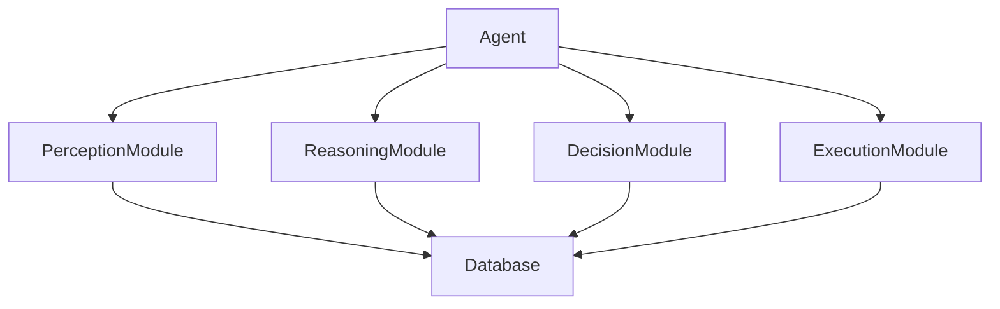
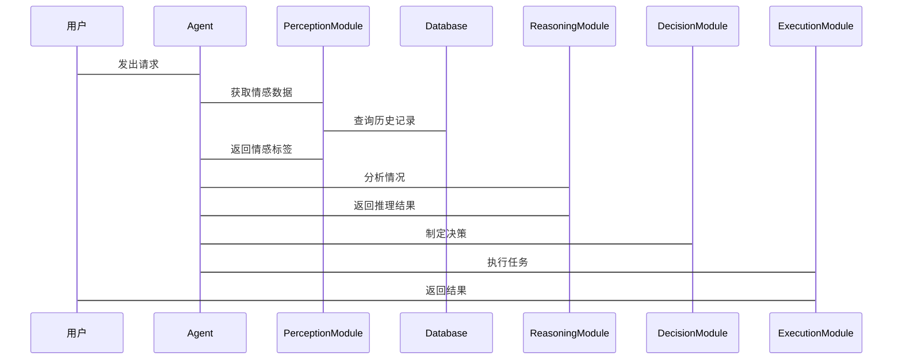

                 


# 开发具有情感计算能力的AI Agent

> 关键词：情感计算，AI Agent，人工智能，深度学习，自然语言处理

> 摘要：本文详细探讨了开发具有情感计算能力的AI Agent的过程，从背景介绍到核心算法，再到系统架构和项目实战，全面解析了情感计算与AI Agent的结合及其应用。

---

# 第一部分: 情感计算与AI Agent概述

## 第1章: 情感计算与AI Agent的背景介绍

### 1.1 问题背景与描述

#### 1.1.1 情感计算的定义与目标

情感计算（Affective Computing）是一种通过计算机技术来识别、理解、分析和处理人类情感的学科。它的目标是让计算机系统能够像人类一样，具备感知和处理情感的能力，从而更好地与人类进行交互。

#### 1.1.2 AI Agent的基本概念与功能

AI Agent（人工智能代理）是一种能够感知环境、自主决策并执行任务的智能体。它可以理解为一个能够主动采取行动以实现目标的计算机程序。AI Agent的核心功能包括感知、推理、决策和执行。

#### 1.1.3 情感计算在AI Agent中的作用

将情感计算集成到AI Agent中，可以使AI Agent不仅能够理解用户的意图，还能感知用户的情感状态，从而提供更加智能化和个性化的服务。

---

### 1.2 问题解决与边界

#### 1.2.1 情感计算的核心问题与解决方案

情感计算的核心问题是如何准确地识别和理解人类的情感。常见的解决方案包括基于规则的特征提取、统计学习方法和深度学习方法。

#### 1.2.2 AI Agent的边界与外延

AI Agent的边界在于其功能和能力的限制。它能够处理的任务范围决定了其边界。外延则包括与AI Agent交互的环境、用户和其他系统的接口。

#### 1.2.3 情感计算与AI Agent的结合点

情感计算与AI Agent的结合点在于情感数据的采集、分析和应用。AI Agent通过情感计算技术，可以更好地理解用户的需求和情感状态，从而提供更精准的服务。

---

### 1.3 概念结构与核心要素

#### 1.3.1 情感计算的模型与框架

情感计算的模型通常包括情感识别、情感分析和情感生成三个部分。常见的框架包括基于规则的模型和基于深度学习的模型。

#### 1.3.2 AI Agent的组成与功能模块

AI Agent的组成包括感知模块、推理模块、决策模块和执行模块。感知模块负责获取环境信息，推理模块负责分析信息，决策模块负责制定行动计划，执行模块负责执行任务。

#### 1.3.3 情感计算与AI Agent的交互机制

情感计算与AI Agent的交互机制包括情感数据的采集、分析和反馈。AI Agent通过情感数据调整其行为，以更好地满足用户的情感需求。

---

## 第2章: 情感计算与AI Agent的核心概念与联系

### 2.1 核心概念原理

#### 2.1.1 情感计算的基本原理

情感计算的基本原理是通过分析文本、语音或面部表情等数据，提取情感特征，并利用这些特征进行情感分类。

#### 2.1.2 AI Agent的工作原理

AI Agent的工作原理是通过感知环境信息，利用推理和决策模块制定行动计划，并通过执行模块完成任务。

#### 2.1.3 情感计算与AI Agent的协同机制

情感计算与AI Agent的协同机制是通过情感数据的共享和应用，使AI Agent能够根据用户的情感状态调整其行为。

---

### 2.2 核心概念属性特征对比

| 特征 | 情感计算 | AI Agent |
|------|----------|----------|
| 输入 | 文本、语音、面部表情 | 环境信息 |
| 输出 | 情感标签 | 行动计划 |
| 目标 | 理解情感 | 完成任务 |
| 方法 | 统计学习、深度学习 | 规则推理、强化学习 |

---

### 2.3 ER实体关系图

```mermaid
er
actor(Agent, 情感数据, 用户)
relationship(拥有, 包含)
```

---

## 第3章: 情感计算与AI Agent的算法原理

### 3.1 情感计算的算法原理

#### 3.1.1 基于深度学习的情感分析算法

使用卷积神经网络（CNN）进行情感分析：

$$
v_i = \sum_{j=1}^{n} w_{ij} \cdot t_j
$$

其中，$v_i$ 是第 $i$ 个词的向量，$w_{ij}$ 是权重，$t_j$ 是输入的文本特征。

#### 3.1.2 基于规则的情感分析算法

通过预定义的规则对文本进行情感分类。

#### 3.1.3 情感迁移学习的原理

通过迁移学习技术，利用已有的情感分析模型进行微调。

---

### 3.2 AI Agent的算法原理

#### 3.2.1 基于规则的决策树算法

通过决策树模型进行路径选择。

#### 3.2.2 基于深度学习的强化学习算法

使用强化学习算法（如DQN）进行决策。

#### 3.2.3 情感驱动的生成式算法

利用生成模型（如Transformer）生成回复。

---

### 3.3 情感计算与AI Agent的协同算法

#### 3.3.1 情感数据驱动的决策算法

通过情感数据调整决策策略。

#### 3.3.2 情感反馈机制的优化算法

根据用户的情感反馈优化AI Agent的行为。

#### 3.3.3 情感记忆网络的构建算法

构建情感记忆网络，记录用户的情感变化。

---

## 第4章: 情感计算与AI Agent的数学模型与公式

### 4.1 情感计算的数学模型

#### 4.1.1 情感分析的向量空间模型

$$
v_i = \sum_{j=1}^{n} w_{ij} \cdot t_j
$$

#### 4.1.2 情感分类的逻辑回归模型

$$
P(y=1|x) = \frac{e^{w \cdot x}}{1 + e^{w \cdot x}}
$$

---

### 4.2 AI Agent的数学模型

#### 4.2.1 基于决策树的分类模型

通过决策树模型进行分类。

#### 4.2.2 基于强化学习的策略梯度模型

$$
\theta_{t+1} = \theta_t + \alpha \nabla_\theta J(\theta)
$$

---

## 第5章: 情感计算与AI Agent的系统架构设计

### 5.1 问题场景介绍

AI Agent需要在实际场景中处理用户的请求，并根据用户的情感状态提供相应的服务。

### 5.2 系统功能设计

#### 5.2.1 领域模型类图

```mermaid
classDiagram
    class Agent {
        + perception: 感知模块
        + reasoning: 推理模块
        + decision: 决策模块
        + execution: 执行模块
    }
    class PerceptionModule {
        + receiveInput(input)
        + analyzeEmotion(emotion)
    }
    class ReasoningModule {
        + analyzeSituation(situation)
        + derivePlan(plan)
    }
    class DecisionModule {
        + makeDecision(decision)
    }
    class ExecutionModule {
        + executeAction(action)
    }
    Agent o PerceptionModule
    Agent o ReasoningModule
    Agent o DecisionModule
    Agent o ExecutionModule
```

---

### 5.3 系统架构设计



---

### 5.4 系统接口设计

定义AI Agent与外部系统之间的接口，包括输入接口和输出接口。

---

### 5.5 系统交互流程



---

## 第6章: 情感计算与AI Agent的项目实战

### 6.1 环境安装

安装必要的依赖库，如TensorFlow、Keras、Python等。

### 6.2 系统核心实现

#### 6.2.1 情感分析模块实现

```python
import tensorflow as tf
from tensorflow import keras

model = keras.Sequential([
    keras.layers.Conv1D(32, 5, activation='relu', input_shape=(None, 1)),
    keras.layers.MaxPooling1D(2),
    keras.layers.Flatten(),
    keras.layers.Dense(64, activation='relu'),
    keras.layers.Dense(1, activation='sigmoid')
])
```

#### 6.2.2 AI Agent核心功能实现

```python
class Agent:
    def __init__(self):
        self.perception = PerceptionModule()
        self.reasoning = ReasoningModule()
        self.decision = DecisionModule()
        self.execution = ExecutionModule()
```

---

### 6.3 代码应用解读与分析

详细解读上述代码的功能和实现原理。

---

### 6.4 案例分析与详细讲解

通过具体案例分析，说明情感计算AI Agent的实际应用。

---

## 第7章: 总结与展望

### 7.1 项目小结

总结全文，回顾情感计算AI Agent的核心内容和实现过程。

### 7.2 未来展望

展望情感计算AI Agent的发展方向和技术趋势。

---

# 作者：AI天才研究院/AI Genius Institute & 禅与计算机程序设计艺术 /Zen And The Art of Computer Programming

---

这篇文章详细介绍了情感计算与AI Agent的结合，从理论到实践，层层深入，为读者提供了一套完整的开发思路和实现方案。

