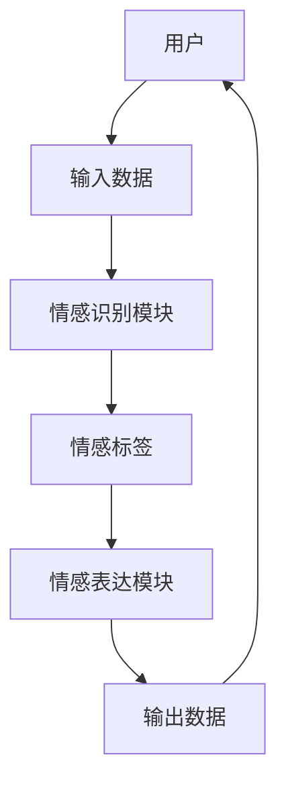
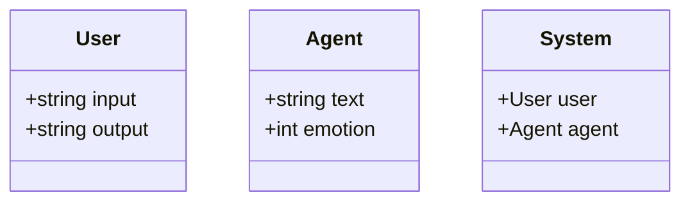
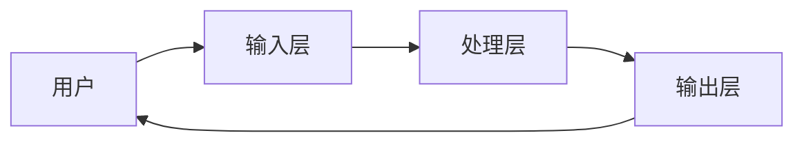
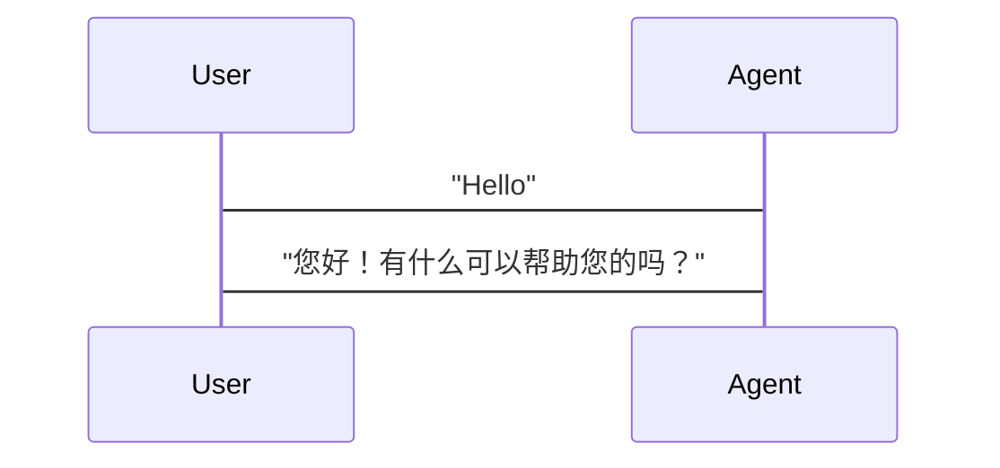

                 


# 开发具有情感识别与表达能力的AI Agent

## 关键词：情感识别，AI Agent，自然语言处理，深度学习，情感表达

## 摘要：  
本文详细探讨了开发具有情感识别与表达能力的AI Agent的关键技术与实现方法。从情感识别与表达的核心概念出发，分析了其在AI Agent中的应用，详细讲解了情感识别与表达的算法原理，设计了系统的整体架构，并通过实战项目展示了如何实现具备情感交互能力的AI Agent。文章还总结了开发中的注意事项和最佳实践，为读者提供了全面的技术指导。

---

# 第1章 情感识别与表达的背景介绍

## 1.1 情感识别的核心概念

### 1.1.1 问题背景与问题描述  
情感识别是指通过分析文本、语音或图像等输入数据，识别出其中隐含的情感倾向（如快乐、悲伤、愤怒等）。在AI Agent中，情感识别是实现人机交互的核心技术之一，它能够帮助AI理解用户的当前情绪状态，从而提供更个性化的服务。

### 1.1.2 问题解决与边界  
情感识别的目标是将非结构化的输入数据转化为结构化的情感信息。其边界包括：  
- 输入数据的类型（文本、语音、图像等）。  
- 情感分类的粒度（如二分类、多分类）。  
- 情感强度的量化（如从-1到1的强度值）。  

### 1.1.3 情感识别的核心要素  
情感识别的核心要素包括：  
1. **输入数据**：文本、语音或图像。  
2. **情感特征**：提取情感相关的特征（如词袋模型、TF-IDF、词嵌入等）。  
3. **分类模型**：使用机器学习或深度学习模型进行分类。  
4. **情感标签**：预定义的情感类别（如正面、负面、中性）。  

---

## 1.2 AI Agent的定义与特点

### 1.2.1 AI Agent的基本概念  
AI Agent是一种能够感知环境、自主决策并执行任务的智能实体。它可以理解用户的需求，通过多模态交互提供服务。

### 1.2.2 AI Agent的核心特点  
1. **自主性**：能够在没有人工干预的情况下运行。  
2. **反应性**：能够实时感知环境并做出响应。  
3. **学习能力**：通过数据不断优化自身的性能。  
4. **交互性**：支持多种交互方式（如文本、语音、图形界面）。  

### 1.2.3 情感识别与表达在AI Agent中的作用  
情感识别与表达是AI Agent实现人性化交互的关键技术。通过情感识别，AI Agent可以理解用户的情绪状态；通过情感表达，AI Agent可以以更自然的方式与用户互动。

---

## 1.3 情感识别与表达的结合

### 1.3.1 情感识别的定义  
情感识别是通过分析输入数据，推断出其中隐含的情感倾向的过程。

### 1.3.2 情感表达的定义  
情感表达是通过生成文本、语音或图像等方式，模拟人类的情感表达过程。

### 1.3.3 在AI Agent中的应用  
1. **情感识别**：用于理解用户的输入数据中的情感倾向。  
2. **情感表达**：用于生成符合用户情感需求的输出内容。  
3. **情感反馈**：通过情感识别和表达的结合，实现更自然的交互体验。

---

# 第2章 情感识别与表达的核心概念与联系

## 2.1 核心概念的原理

### 2.1.1 情感识别的原理  
情感识别的原理包括数据预处理、特征提取和分类器设计。例如，文本情感识别可以通过词嵌入（如Word2Vec）提取特征，然后使用深度学习模型（如LSTM）进行分类。

### 2.1.2 情感表达的原理  
情感表达的原理包括情感生成模型的设计和输出格式的规范。例如，生成正面情感的文本可以通过情感生成模型和模板结合实现。

### 2.1.3 两者结合的原理  
情感识别与表达的结合可以通过反馈机制实现。例如，AI Agent识别到用户的负面情绪后，可以通过情感表达生成相应的安慰性文本。

---

## 2.2 情感识别与表达的对比分析

### 2.2.1 情感识别的特征  
- 输入：非结构化的数据（如文本、语音）。  
- 输出：结构化的情感信息（如情感标签）。  
- 方法：基于特征提取和分类模型。  

### 2.2.2 情感表达的特征  
- 输入：情感需求或情感标签。  
- 输出：自然语言文本或语音。  
- 方法：基于生成模型或模板。  

### 2.2.3 对比表格  

| 特性          | 情感识别                     | 情感表达                     |  
|---------------|------------------------------|------------------------------|  
| 输入          | 文本、语音、图像             | 情感需求或标签               |  
| 输出          | 情感标签或强度值             | 自然语言文本或语音           |  
| 方法          | 特征提取 + 分类模型           | 生成模型或模板               |  

---

## 2.3 系统实体关系图



---

# 第3章 情感识别与表达的算法原理

## 3.1 情感识别算法

### 3.1.1 基于深度学习的情感识别流程


### 3.1.2 情感识别的数学模型  
情感识别的分类模型可以使用LSTM网络，其数学模型如下：

$$
f(x) = \text{LSTM}(x, W, b)
$$

其中，\(x\) 是输入文本，\(W\) 和 \(b\) 是模型的权重和偏置。

### 3.1.3 情感识别的Python代码实现  

```python
import tensorflow as tf
from tensorflow.keras import layers

model = tf.keras.Sequential()
model.add(layers.Embedding(input_dim=10000, output_dim=16))
model.add(layers.LSTM(64))
model.add(layers.Dense(3, activation='softmax'))
model.compile(loss='sparse_categorical_crossentropy', optimizer='adam', metrics=['accuracy'])
```

---

## 3.2 情感表达生成算法

### 3.2.1 基于生成模型的表达生成流程


### 3.2.2 情感表达生成的数学模型  
情感表达生成可以使用变体的GPT模型，其数学模型如下：

$$
p(y|x) = \text{softmax}(Wx + b)
$$

### 3.2.3 情感表达生成的Python代码实现  

```python
import tensorflow as tf
from tensorflow.keras import layers

def generate_response(x):
    model = tf.keras.Sequential()
    model.add(layers.Dense(64, activation='relu', input_dim=3))
    model.add(layers.Dense(256, activation='relu'))
    model.add(layers.Dense(1000, activation='softmax'))
    return model(x)
```

---

# 第4章 系统分析与架构设计

## 4.1 项目背景介绍

### 4.1.1 项目背景  
本项目旨在开发一个支持情感交互的AI Agent，用于提供更智能的客户服务。

### 4.1.2 系统功能设计  



---

## 4.2 系统架构设计

### 4.2.1 系统架构图  



### 4.2.2 接口设计  
系统接口包括：  
1. 用户输入接口。  
2. 情感识别接口。  
3. 情感表达接口。  

### 4.2.3 交互设计  



---

# 第5章 项目实战

## 5.1 搭建开发环境

### 5.1.1 安装Python库  
安装必要的库：  
```bash
pip install tensorflow keras numpy
```

### 5.1.2 环境配置  
配置Python版本为3.8以上。

## 5.2 系统核心实现

### 5.2.1 情感识别实现  

```python
def sentiment_analysis(text):
    model = load_model('sentiment_model.h5')
    prediction = model.predict([text])
    return prediction
```

### 5.2.2 情感表达实现  

```python
def generate_response(emotion):
    if emotion == 'positive':
        return "感谢您的支持！"
    elif emotion == 'negative':
        return "非常抱歉给您带来不好的体验。"
    else:
        return "请问有什么可以帮助您的吗？"
```

## 5.3 实际案例分析

### 5.3.1 案例背景  
开发一个客服聊天机器人，支持情感识别与表达。

### 5.3.2 实现过程  
1. 用户输入文本。  
2. 系统进行情感识别。  
3. 系统根据情感生成响应文本。  

### 5.3.3 代码实现  

```python
user_input = input("请输入您的问题：")
emotion = sentiment_analysis(user_input)
response = generate_response(emotion)
print(response)
```

---

## 5.4 项目小结

### 5.4.1 核心功能实现  
完成了情感识别与表达的核心功能。

### 5.4.2 实践中的注意事项  
1. 数据预处理的重要性。  
2. 模型调优的必要性。  
3. 交互设计的用户体验优化。  

---

# 第6章 最佳实践

## 6.1 小结  
开发具有情感识别与表达能力的AI Agent是一项复杂的任务，需要结合情感计算和自然语言处理技术。

## 6.2 注意事项  
1. 数据质量直接影响模型性能。  
2. 模型的可解释性需要重点关注。  
3. 交互设计要符合用户习惯。  

## 6.3 拓展阅读  
推荐阅读《情感计算：从理论到应用》和《深度学习实战》。

---

# 作者：AI天才研究院 & 禅与计算机程序设计艺术

---

本文通过系统的分析与实践，详细讲解了开发具有情感识别与表达能力的AI Agent的关键技术与实现方法，为读者提供了从理论到实践的全面指导。

