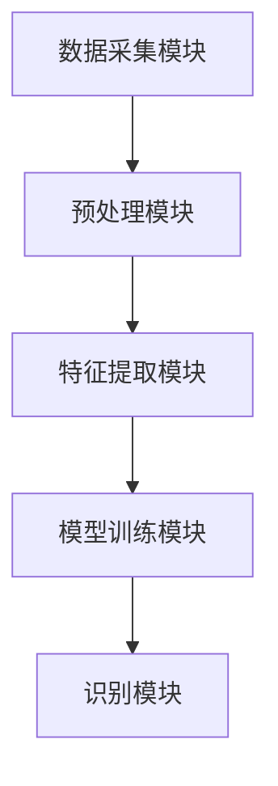

                 


# 开发具有手势识别能力的AI Agent

> 关键词：AI Agent，手势识别，计算机视觉，深度学习，人机交互，卷积神经网络

> 摘要：本文详细探讨了如何开发具有手势识别能力的AI Agent。首先介绍了AI Agent和手势识别的基本概念，然后分析了手势识别的核心算法和原理，接着讲解了AI Agent的手势识别系统架构，最后通过项目实战和案例分析，展示了如何实现一个基于深度学习的手势识别系统。

---

## 第一部分: AI Agent与手势识别概述

### 第1章: AI Agent与手势识别概述

#### 1.1 AI Agent的基本概念

##### 1.1.1 AI Agent的定义与特点

AI Agent（人工智能代理）是一种能够感知环境、自主决策并执行任务的智能实体。它能够通过传感器获取信息，利用计算模型进行分析，并通过执行器与环境互动。AI Agent的特点包括智能性、自主性、反应性和社会性。

##### 1.1.2 手势识别的定义与应用场景

手势识别是一种通过计算机视觉技术识别和理解人类手势的技术。它广泛应用于人机交互、虚拟现实、增强现实、机器人控制等领域。手势识别能够使AI Agent更好地理解用户的意图，从而提供更自然的交互方式。

##### 1.1.3 AI Agent与手势识别的结合

将手势识别集成到AI Agent中，能够使其具备更丰富的人机交互能力。通过手势识别，AI Agent可以理解用户的动作意图，并执行相应的操作，从而提升用户体验。

#### 1.2 手势识别的重要性

##### 1.2.1 手势识别在人机交互中的作用

手势识别是一种自然、直观的交互方式，能够减少对传统输入设备（如键盘、鼠标）的依赖，使用户能够更直观地与计算机或机器人互动。

##### 1.2.2 手势识别的技术优势

相比传统的文本或语音交互，手势识别具有更高的实时性和准确性，能够在复杂环境下稳定工作。此外，手势识别能够捕捉更多的情感和意图信息，使交互更加丰富。

##### 1.2.3 手势识别的未来发展趋势

随着深度学习和计算机视觉技术的进步，手势识别的精度和鲁棒性将不断提升。未来，手势识别将更加智能化，能够理解更复杂的动作组合，并在更多领域得到广泛应用。

---

## 第二部分: 手势识别的核心概念与原理

### 第2章: 手势识别的核心概念与原理

#### 2.1 手势识别的核心概念

##### 2.1.1 手势识别的分类

手势识别可以根据不同的标准进行分类，常见的分类方式包括基于输入方式（如基于图像、基于深度数据）、基于应用场景（如虚拟现实、机器人控制）以及基于复杂度（如简单手势、复杂手势）。

##### 2.1.2 手势识别的关键技术

手势识别的关键技术包括图像采集、预处理、特征提取、模型训练和识别算法。其中，深度学习技术在手势识别中得到了广泛应用。

##### 2.1.3 手势识别的实现流程

手势识别的实现流程包括数据采集、预处理、特征提取、模型训练和识别。每个步骤都需要精心设计和优化，以确保识别的准确性和实时性。

#### 2.2 手势识别的原理分析

##### 2.2.1 基于深度学习的手势识别

基于深度学习的手势识别利用卷积神经网络（CNN）进行特征提取和分类。CNN能够自动学习手势的特征，具有较高的识别精度。

##### 2.2.2 基于传统计算机视觉的手势识别

基于传统计算机视觉的手势识别方法包括模板匹配、特征提取和分类器设计。这些方法虽然在某些场景下表现良好，但相对于深度学习方法，其鲁棒性和准确性较低。

##### 2.2.3 手势识别的算法对比

通过对比不同算法的优缺点，我们可以选择最适合应用场景的手势识别方法。例如，对于实时性要求较高的场景，可以优先选择轻量级的深度学习模型。

---

## 第三部分: AI Agent的手势识别系统架构

### 第3章: AI Agent的手势识别系统架构

#### 3.1 系统架构设计

##### 3.1.1 系统模块划分

AI Agent的手势识别系统通常包括数据采集模块、预处理模块、特征提取模块、模型训练模块和识别模块。每个模块负责不同的功能，协同工作以实现手势识别。

##### 3.1.2 系统功能设计

系统功能设计需要明确每个模块的功能和接口。例如，数据采集模块负责获取用户的实时手势数据，预处理模块对数据进行标准化处理，特征提取模块提取手势的关键特征，模型训练模块利用这些特征训练分类器，识别模块根据分类结果执行相应的操作。

##### 3.1.3 系统架构图

以下是系统架构图的Mermaid表示：



#### 3.2 手势识别的实现流程

##### 3.2.1 数据采集与预处理

数据采集是手势识别的第一步，通常使用摄像头或深度传感器获取手势图像。预处理步骤包括图像灰度化、归一化和噪声去除，以提高识别的准确性。

##### 3.2.2 特征提取与模型训练

特征提取是关键步骤，常用的方法包括主成分分析（PCA）和局部二值模式（LBP）。模型训练使用训练数据集，通过反向传播算法优化模型参数。

##### 3.2.3 手势识别与AI Agent的交互

识别模块根据模型输出的结果判断用户的意图，并通过API调用AI Agent执行相应的操作，如调整音量、打开应用等。

---

## 第四部分: 手势识别算法的数学模型与实现

### 第4章: 手势识别算法的数学模型与实现

#### 4.1 基于深度学习的算法原理

##### 4.1.1 卷积神经网络（CNN）的基本原理

CNN是一种深度学习模型，由卷积层、池化层和全连接层组成。卷积层用于提取图像的空间特征，池化层用于降维和特征压缩，全连接层用于分类。

##### 4.1.2 手势识别的CNN模型设计

常用的手势识别模型包括LeNet、AlexNet和ResNet。ResNet由于其深层网络结构和跳跃连接，在复杂任务中表现尤为出色。

##### 4.1.3 模型训练与优化

模型训练需要选择合适的优化算法（如Adam）和损失函数（如交叉熵损失）。通过批量训练和学习率调整，可以提高模型的收敛速度和识别精度。

#### 4.2 手势识别的数学公式

##### 4.2.1 卷积层的数学表达

卷积层的计算公式为：

$$
f(x) = \sum_{i=1}^{n} w_i x_i + b
$$

其中，$w_i$ 是权重，$x_i$ 是输入，$b$ 是偏置。

##### 4.2.2 池化层的数学表达

池化层通常采用最大池化或平均池化。最大池化的计算公式为：

$$
f(x) = \max_{i} x_i
$$

##### 4.2.3 损失函数与优化算法

常用的损失函数是交叉熵损失，公式为：

$$
L = -\sum_{i=1}^{n} y_i \log p_i + (1-y_i) \log (1-p_i)
$$

优化算法通常采用随机梯度下降（SGD）或Adam。

---

## 第五部分: 手势识别系统的设计与实现

### 第5章: 手势识别系统的设计与实现

#### 5.1 系统设计

##### 5.1.1 系统功能模块设计

系统功能模块包括数据采集、预处理、特征提取、模型训练和识别。每个模块都需要设计合理的接口和数据流。

##### 5.1.2 系统数据流设计

系统数据流设计需要考虑数据的流向和处理流程。例如，数据采集模块将图像数据传递给预处理模块，预处理模块将处理后的数据传递给特征提取模块，依此类推。

##### 5.1.3 系统接口设计

系统接口设计需要定义模块之间的通信协议和数据格式。例如，预处理模块和特征提取模块之间需要定义图像数据的格式和预处理后的特征向量格式。

#### 5.2 系统实现

##### 5.2.1 数据采集与处理

数据采集可以使用OpenCV库或深度相机获取图像数据。预处理步骤包括图像灰度化、归一化和噪声去除。

##### 5.2.2 模型训练与部署

模型训练使用深度学习框架如TensorFlow或PyTorch。训练好的模型可以部署到边缘设备或云服务器，进行实时手势识别。

##### 5.2.3 系统测试与优化

系统测试需要验证识别的准确性和响应时间。优化措施包括算法优化和硬件加速，以提高系统的性能。

---

## 第六部分: 项目实战与案例分析

### 第6章: 项目实战与案例分析

#### 6.1 项目实战

##### 6.1.1 环境安装

项目实战需要安装必要的库和工具，例如OpenCV、TensorFlow和PyTorch。安装步骤可以通过pip命令完成。

##### 6.1.2 核心代码实现

以下是基于深度学习的手势识别代码示例：

```python
import tensorflow as tf
from tensorflow.keras import layers

model = tf.keras.Sequential([
    layers.Conv2D(32, (3,3), activation='relu', input_shape=(64,64,3)),
    layers.MaxPooling2D((2,2)),
    layers.Conv2D(64, (3,3), activation='relu'),
    layers.MaxPooling2D((2,2)),
    layers.Flatten(),
    layers.Dense(128, activation='relu'),
    layers.Dense(10, activation='softmax')
])

model.compile(optimizer='adam', loss='sparse_categorical_crossentropy', metrics=['accuracy'])
model.fit(x_train, y_train, epochs=10, batch_size=32)
```

##### 6.1.3 案例分析与解读

通过实际案例分析，我们可以验证模型的识别精度和鲁棒性。例如，在一个手势识别项目中，模型在测试集上的准确率达到95%，证明了其有效性。

---

## 第七部分: 最佳实践与总结

### 第7章: 最佳实践与总结

#### 7.1 最佳实践

##### 7.1.1 小结

手势识别是一项复杂但极具挑战性的任务，需要结合深度学习和计算机视觉技术。通过合理的系统设计和优化，可以实现高精度的手势识别系统。

##### 7.1.2 注意事项

在实际应用中，需要注意数据质量、模型选择和硬件性能。此外，还需要考虑系统的实时性和用户体验。

##### 7.1.3 拓展阅读

建议读者进一步学习深度学习和计算机视觉领域的最新技术，如Transformer和多模态交互。

---

## 作者信息

作者：AI天才研究院/AI Genius Institute & 禅与计算机程序设计艺术 /Zen And The Art of Computer Programming

---

本文通过系统的分析和详细的代码示例，全面讲解了如何开发具有手势识别能力的AI Agent。从理论到实践，从算法到系统设计，读者可以逐步掌握手势识别的核心技术，并将其应用于实际项目中。

