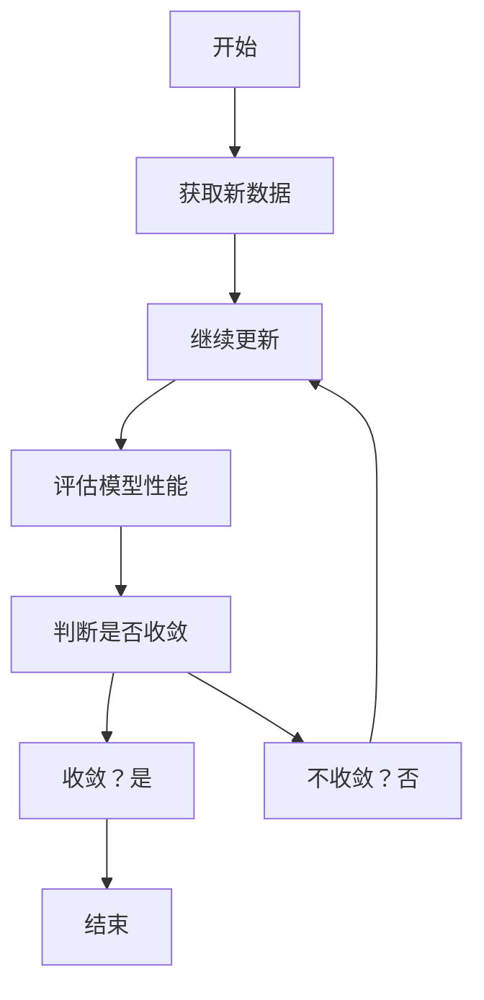
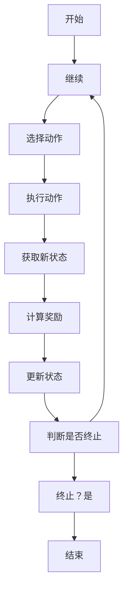
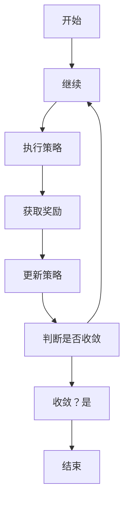
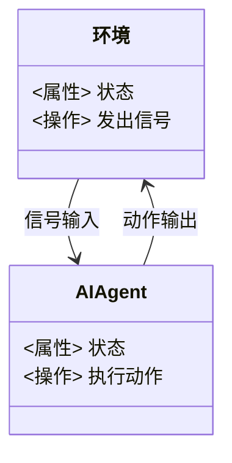
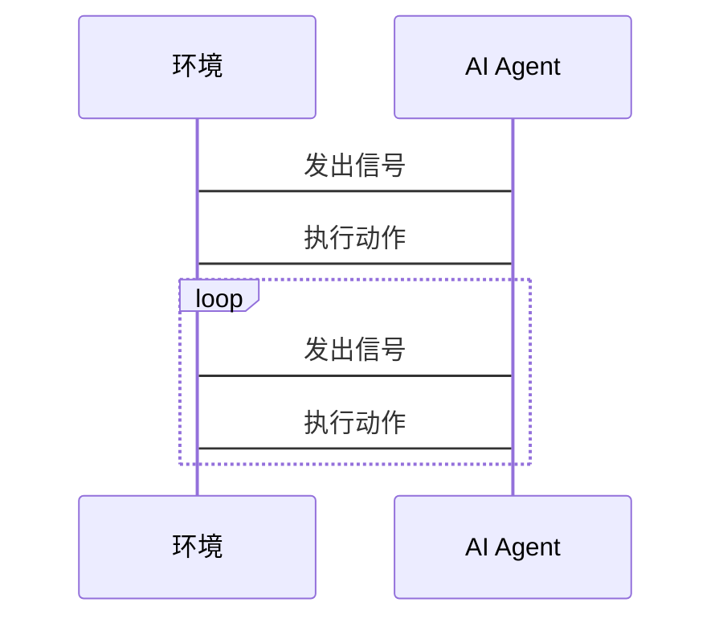

                 


# 开发具有持续适应能力的AI Agent

## 关键词：AI Agent，持续适应能力，自适应学习，动态规划，强化学习，系统架构

## 摘要：  
随着人工智能技术的快速发展，AI Agent（智能代理）的应用场景日益广泛。然而，AI Agent在实际应用中面临着环境动态变化的挑战，需要具备持续适应能力以应对各种不确定性。本文将深入探讨如何开发具有持续适应能力的AI Agent，从核心概念、算法原理到系统架构设计，再到项目实战，全面解析其实现方法和应用价值。

---

## 第一部分：AI Agent的基本概念与持续适应能力

### 第1章：AI Agent的定义与核心特征

#### 1.1 AI Agent的基本定义  
AI Agent（智能代理）是一种能够感知环境、自主决策并执行任务的智能实体。它能够通过与环境交互，主动调整自身行为以实现目标。AI Agent可以是软件程序、机器人或其他智能系统，广泛应用于自动驾驶、智能助手、推荐系统等领域。

#### 1.2 持续适应能力的核心特征  
持续适应能力是AI Agent在动态环境中生存和发展的关键能力。它包括以下几个核心特征：  
- **自适应学习**：通过学习算法不断优化模型参数，适应新数据和环境变化。  
- **动态规划**：在不确定环境中，通过规划算法找到最优路径或策略。  
- **强化学习**：通过与环境交互，基于奖励机制优化行为策略。  

#### 1.3 AI Agent与传统AI的区别  
AI Agent与传统AI的主要区别在于其自主性和适应性。传统AI依赖于静态规则和预定义数据，而AI Agent能够动态调整行为，主动与环境交互，具备更强的适应性和主动性。

---

### 第2章：持续适应能力的重要性

#### 2.1 环境动态变化的挑战  
现实世界中的环境通常是动态的、不确定的，AI Agent需要能够快速响应变化，避免因固定策略而导致的性能下降或错误。例如，在交通管理系统中，AI Agent需要实时调整信号灯控制策略以应对交通流量的变化。

#### 2.2 持续适应能力的优势  
- 提高系统的鲁棒性和可靠性。  
- 增强系统的灵活性，适应多样化的应用场景。  
- 提升用户体验，满足个性化需求。  

#### 2.3 适应能力的实现路径  
- 使用机器学习算法实现自适应学习。  
- 基于强化学习优化行为策略。  
- 结合动态规划处理复杂决策问题。  

---

## 第二部分：持续适应能力的核心概念与联系

### 第3章：核心概念原理

#### 3.1 自适应学习机制  
自适应学习是AI Agent持续适应能力的核心机制之一。它通过在线学习算法不断更新模型参数，以适应新数据和环境变化。例如，使用在线随机梯度下降算法（SGD）训练神经网络模型。

#### 3.2 动态规划算法  
动态规划是一种用于解决复杂决策问题的算法。它通过将问题分解为子问题，并存储子问题的解来优化整体决策。动态规划在AI Agent中广泛应用于路径规划和资源分配等问题。

#### 3.3 强化学习的应用  
强化学习是一种通过与环境交互来优化行为策略的算法。AI Agent通过探索和利用环境，逐步学习最优行为策略。例如，在游戏AI中，强化学习用于训练游戏代理在复杂环境中做出最优决策。

---

### 第4章：概念属性特征对比表格

| 概念        | 自适应学习 | 动态规划 | 强化学习 |
|-------------|------------|----------|----------|
| 核心目标     | 模型优化   | 最优决策 | 行为优化 |
| 适用场景     | 数据流式处理 | 复杂决策问题 | 动态环境中的行为优化 |
| 优缺点       | 优点：实时更新；缺点：计算资源消耗大 | 优点：全局最优；缺点：计算复杂度高 | 优点：适应性强；缺点：训练时间长 |

---

### 第5章：ER实体关系图架构

```mermaid
erDiagram
    class 环境 {
        <属性> 状态
        <操作> 发出信号
    }
    class AI Agent {
        <属性> 状态
        <操作> 执行动作
    }
    环境 -> AI Agent : 信号输入
    AI Agent -> 环境 : 动作输出
```

---

## 第三部分：算法原理讲解

### 第6章：自适应学习算法

#### 6.1 算法流程图



#### 6.2 Python实现代码

```python
import numpy as np

class AdaptiveLearningAgent:
    def __init__(self, learning_rate=0.1):
        self.model = self.build_model()
        self.learning_rate = learning_rate

    def build_model(self):
        # 初始化模型参数
        return np.random.rand(2, 2)

    def update_model(self, input_data, target_output):
        # 计算预测值
        prediction = self.model.dot(input_data)
        # 计算误差
        error = target_output - prediction
        # 更新模型参数
        self.model += self.learning_rate * error * input_data.T

    def evaluate(self, test_input, test_output):
        # 计算预测值
        prediction = self.model.dot(test_input)
        # 计算准确率
        accuracy = np.mean(prediction == test_output)
        return accuracy
```

#### 6.3 数学模型与公式  
自适应学习的核心是通过在线更新模型参数来最小化预测误差。数学模型可以表示为：  
$$ \theta_{t+1} = \theta_t + \eta (y_t - \hat{y}_t) x_t $$  
其中，$\theta$ 是模型参数，$\eta$ 是学习率，$x_t$ 是输入数据，$y_t$ 是目标输出，$\hat{y}_t$ 是模型预测输出。

---

### 第7章：动态规划算法

#### 7.1 算法流程图



#### 7.2 Python实现代码

```python
def dynamic_planning_algorithm(states, actions, rewards, gamma=0.99):
    # 初始化价值函数
    value_function = {state: 0 for state in states}
    # 迭代更新价值函数
    for _ in range(1000):
        for state in states:
            for action in actions:
                next_state = transitions(state, action)
                value_function[state] += rewards[state, action] + gamma * value_function[next_state]
    return value_function
```

#### 7.3 数学模型与公式  
动态规划的目标是找到最优价值函数，公式表示为：  
$$ V^*(s) = \max_{a} \left[ r(s,a) + \gamma V^*(s') \right] $$  
其中，$s$ 是当前状态，$a$ 是动作，$s'$ 是下一个状态，$\gamma$ 是折扣因子。

---

### 第8章：强化学习的应用

#### 8.1 算法流程图



#### 8.2 Python实现代码

```python
import numpy as np

class ReinforcementLearningAgent:
    def __init__(self, action_space, learning_rate=0.1):
        self.actions = action_space
        self.learning_rate = learning_rate
        self.Q = {state: {action: 0 for action in self.actions} for state in states}

    def choose_action(self, state, epsilon=0.1):
        if np.random.random() < epsilon:
            return np.random.choice(self.actions)
        else:
            return max(self.Q[state], key=lambda k: self.Q[state][k])

    def update_Q(self, state, action, reward, next_state):
        self.Q[state][action] += self.learning_rate * (reward + max(self.Q[next_state].values()) - self.Q[state][action])

    def get_policy(self):
        return {state: max(action, key=lambda a: self.Q[state][a]) for state in states}
```

#### 8.3 数学模型与公式  
强化学习的目标是最大化累积奖励，公式表示为：  
$$ Q(s,a) = Q(s,a) + \alpha [r + \gamma Q(s',a') - Q(s,a)] $$  
其中，$\alpha$ 是学习率，$\gamma$ 是折扣因子，$s'$ 是下一个状态，$a'$ 是下一个动作。

---

## 第四部分：系统分析与架构设计方案

### 第9章：问题场景介绍

#### 9.1 系统目标  
开发一个具备持续适应能力的AI Agent，能够在动态环境中实时调整行为策略，优化系统性能。

#### 9.2 系统范围  
系统适用于需要动态调整的场景，如自动驾驶、智能客服、机器人控制等领域。

#### 9.3 系统边界  
系统与环境交互，通过传感器获取实时数据，通过执行机构输出动作。

---

### 第10章：系统功能设计

#### 10.1 领域模型类图



---

### 第11章：系统架构设计

#### 11.1 架构图


---

### 第12章：系统接口设计

#### 12.1 接口设计  
- 输入接口：接收环境信号和用户输入。  
- 输出接口：输出动作指令和系统状态。  

#### 12.2 交互流程图



---

## 第五部分：项目实战

### 第13章：环境安装与系统核心实现

#### 13.1 环境安装  
安装必要的依赖库，例如Python的numpy、pandas、scikit-learn等。

#### 13.2 核心代码实现  
实现AI Agent的核心功能，包括感知、决策和执行模块。

#### 13.3 代码解读与分析  
详细解读代码实现，分析各模块的功能和交互逻辑。

---

### 第14章：案例分析与总结

#### 14.1 案例分析  
以自动驾驶为例，展示AI Agent在动态交通环境中的适应能力。

#### 14.2 项目总结  
总结开发过程中的经验教训，提出改进建议。

---

## 第六部分：最佳实践与未来展望

### 第15章：开发注意事项

#### 15.1 注意事项  
- 确保算法的实时性和高效性。  
- 处理好模型的收敛性和稳定性。  
- 注意数据质量和多样性。  

#### 15.2 未来展望  
随着AI技术的发展，持续适应能力将更加重要。未来的研究方向包括更高效的自适应学习算法、更智能的强化学习策略以及更灵活的系统架构设计。

---

## 作者：AI天才研究院/AI Genius Institute & 禅与计算机程序设计艺术 /Zen And The Art of Computer Programming

