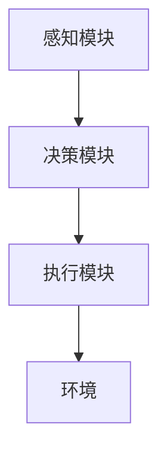
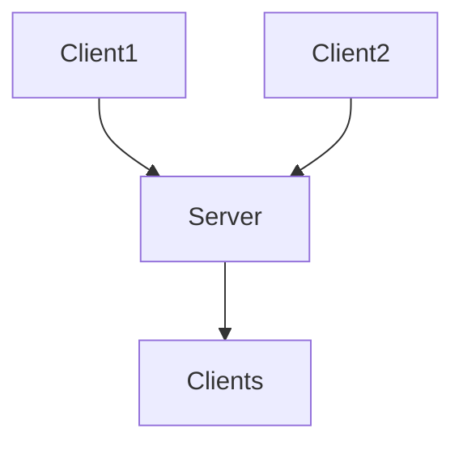
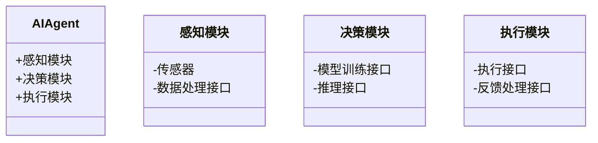

                 


# 《开发具有联邦学习能力的AI Agent》

---

## 关键词：
- 联邦学习（Federated Learning）
- AI Agent
- 分布式机器学习
- 多智能体系统
- 隐私保护
- 系统架构设计

---

## 摘要：
随着人工智能技术的快速发展，AI Agent（智能体）在各个领域的应用越来越广泛。然而，传统的AI Agent在数据集中化和模型训练方面存在隐私和安全问题。联邦学习作为一种分布式机器学习技术，能够在不共享原始数据的情况下进行模型训练，为AI Agent的开发提供了新的可能性。本文将详细探讨如何开发具有联邦学习能力的AI Agent，从联邦学习的核心原理到AI Agent的系统架构设计，再到实际项目的实现，全面解析这一技术的实现细节和应用场景。

---

## 第一部分：核心概念与联系

### 1.1 联邦学习的定义与特点
联邦学习是一种分布式机器学习技术，允许多个参与方在不共享数据的情况下共同训练一个全局模型。其特点包括：
- 数据隐私性：数据不离开原始存储位置。
- 分布式计算：模型更新在各个参与方本地进行。
- 协作性：通过通信协议实现模型参数同步。

#### 联邦学习的分类
联邦学习主要分为三类：
- **横向联邦学习**：适用于数据样本不重叠的场景。
- **纵向联邦学习**：适用于数据特征不重叠的场景。
- **混合联邦学习**：结合横向和纵向的特点。

使用Mermaid图表展示联邦学习的分类：


### 1.2 AI Agent的定义与特点
AI Agent是一种能够感知环境、做出决策并执行动作的智能体。其特点包括：
- 感知能力：通过传感器或接口获取环境信息。
- 决策能力：基于感知信息做出决策。
- 执行能力：通过执行机构或接口与环境交互。

#### AI Agent的系统功能模块
AI Agent的系统功能模块包括：
- **感知模块**：负责数据的采集和处理。
- **决策模块**：负责模型的训练和推理。
- **执行模块**：负责动作的执行和反馈。

使用Mermaid图表展示AI Agent的功能模块：


### 1.3 联邦学习与AI Agent的结合
联邦学习为AI Agent提供了分布式模型训练的能力，使得AI Agent可以在不共享数据的情况下进行联合训练。这种结合主要体现在以下几个方面：
- **数据隐私性**：通过联邦学习，AI Agent可以在保护数据隐私的前提下进行模型训练。
- **协作性**：多个AI Agent可以通过联邦学习协作训练，提升整体模型性能。
- **实时性**：联邦学习的分布式特性使得AI Agent能够实时更新模型，适应动态环境。

---

## 第二部分：算法原理讲解

### 2.1 联邦学习的核心算法
#### 2.1.1 横向联邦学习的算法实现
横向联邦学习的核心算法是联邦平均（FedAvg）算法。其数学模型如下：
$$ \theta_{t+1} = \frac{1}{N} \sum_{i=1}^{N} \theta_i^{new} $$
其中，$\theta_i^{new}$表示第$i$个参与方的新模型参数，$N$表示参与方的数量。

使用Mermaid图表展示FedAvg算法的流程：


#### 2.1.2 纵向联邦学习的算法实现
纵向联邦学习的核心算法是联邦直方（FedHIST）算法。其数学模型如下：
$$ \theta_{t+1} = \theta_t + \eta \sum_{i=1}^{N} \nabla L_i(\theta_t) $$
其中，$\nabla L_i(\theta_t)$表示第$i$个参与方的梯度，$\eta$表示学习率。

### 2.2 联邦学习的隐私与安全
#### 2.2.1 差分隐私（Differential Privacy）
差分隐私通过在数据中添加噪声来保护隐私。其核心思想是：任何单个数据点的变化都不会显著影响全局统计结果。

#### 2.2.2 联邦学习中的隐私保护策略
- **数据加密**：在数据传输过程中使用加密技术。
- **模型加密**：对模型参数进行加密，防止中间人攻击。

---

## 第三部分：系统分析与架构设计方案

### 3.1 系统功能设计
#### 3.1.1 领域模型
使用Mermaid类图展示AI Agent的领域模型：


#### 3.1.2 系统架构设计
使用Mermaid架构图展示AI Agent的系统架构：
```mermaid
container 联邦学习平台 {
    service 联邦协调器
    service 联邦训练服务
    service 联邦推理服务
}
```

### 3.2 接口设计与交互流程
#### 3.2.1 系统接口设计
- **感知接口**：负责数据的采集和处理。
- **决策接口**：负责模型的训练和推理。
- **执行接口**：负责动作的执行和反馈。

#### 3.2.2 交互流程
使用Mermaid序列图展示联邦学习中的交互流程：
```mermaid
sequenceDiagram
    客户端1 ->> 服务端: 发送模型参数
    服务端 ->> 所有客户端: 发送聚合后的模型参数
    客户端2 ->> 服务端: 发送模型参数
    ...
```

---

## 第四部分：项目实战

### 4.1 环境安装
需要安装以下工具：
- Python 3.8+
- PyTorch
- FedML库

### 4.2 核心实现代码
以下是AI Agent的联邦学习实现代码示例：
```python
import fedml
from fedml import联邦学习协调器
from fedml import 模型训练接口

class AI-Agent:
    def __init__(self):
        self.感知模块 = 感知模块()
        self.决策模块 = 模型训练接口()
        self.执行模块 = 执行接口()

    def 感知(self):
        数据 = self.感知模块.采集数据()
        return 数据

    def 决策(self, 数据):
        模型 = self.决策模块.训练模型(数据)
        return 模型

    def 执行(self, 模型):
        动作 = self.执行模块.执行动作(模型)
        return 动作

# 初始化AI Agent
ai_agent = AI-Agent()

# 开始联邦学习
ai_agent.感知()
ai_agent.决策()
ai_agent.执行()
```

### 4.3 实际案例分析
通过一个具体的案例，展示如何利用联邦学习提升AI Agent的模型性能。例如，在医疗领域，多个医院可以在不共享患者数据的情况下，共同训练一个医疗诊断模型。

---

## 第五部分：最佳实践和小结

### 5.1 最佳实践
- **数据预处理**：确保数据的完整性和一致性。
- **模型优化**：选择合适的模型和优化算法。
- **隐私保护**：在数据传输和存储过程中，确保数据的安全性和隐私性。

### 5.2 小结
本文详细探讨了如何开发具有联邦学习能力的AI Agent，从核心概念到算法原理，再到系统架构设计和项目实战，全面解析了这一技术的实现细节和应用场景。通过联邦学习，AI Agent可以在保护数据隐私的前提下，实现模型的联合训练和优化。

### 5.3 注意事项
- **数据安全**：确保数据在传输和存储过程中的安全性。
- **模型收敛性**：选择合适的算法和参数，确保模型能够快速收敛。
- **系统可扩展性**：设计时考虑系统的扩展性，以便未来增加更多的参与方。

### 5.4 拓展阅读
- 《Federated Learning: Challenges, Methods, and Future Directions》
- 《Distributed Machine Learning: Theory and Practice》

---

## 作者信息

作者：AI天才研究院/AI Genius Institute & 禅与计算机程序设计艺术/Zen And The Art of Computer Programming

---

**注**：本文为示例内容，实际撰写时需要根据具体技术细节和实际应用场景进行补充和完善。

