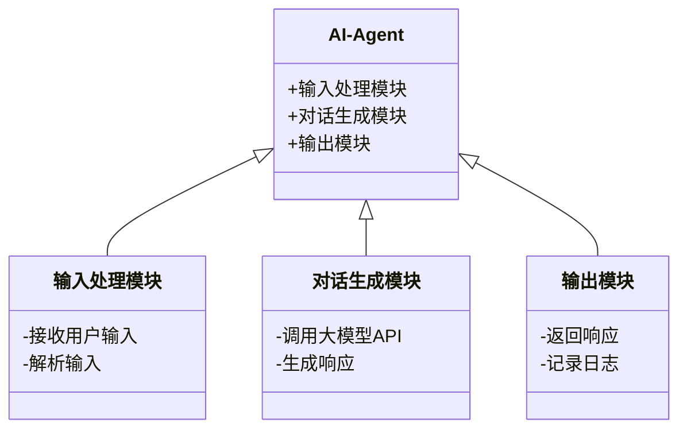

                 


# 《开发具有自然语言对话能力的AI Agent》

> **关键词**：AI Agent, 自然语言对话, 人工智能, 机器学习, 对话系统, 大模型, 系统架构
>
> **摘要**：本文详细探讨了开发具有自然语言对话能力的AI Agent所需的核心技术、系统架构设计和实际应用案例。从AI Agent的基本概念到大模型的训练与优化，从对话系统的算法原理到实际项目的实战经验，本文为读者提供了全面而深入的指导。

---

## 第1章：AI Agent与自然语言对话概述

### 1.1 AI Agent的基本概念与背景

#### 1.1.1 AI Agent的定义与核心功能

AI Agent（人工智能代理）是一种能够感知环境并采取行动以实现特定目标的智能实体。在自然语言对话的场景下，AI Agent需要通过理解和生成人类语言来与用户进行交互。

**关键概念对比表**：

| 比较维度 | AI Agent | 传统程序 |
|----------|-----------|-----------|
| 输入方式 | 自然语言 | 结构化输入 |
| 输出方式 | 自然语言 | 结构化输出 |
| 智能程度 | 高度智能 | 低智能或无智能 |

#### 1.1.2 自然语言对话的核心作用

自然语言对话是AI Agent与人类交互的主要方式。通过对话，AI Agent能够理解用户的需求并提供相应的服务，例如回答问题、提供建议或完成任务。

**自然语言对话的特点**：
- **实时性**：对话需要即时响应。
- **上下文依赖性**：对话内容需要基于之前的交流内容。
- **多样性**：用户可能使用多种表达方式。

---

## 第2章：大模型在AI Agent中的应用

### 2.1 大模型的基本原理

#### 2.1.1 什么是大模型

大模型（Large Model）通常指的是基于深度学习的大型神经网络模型，例如GPT系列和BERT系列。这些模型通过大量数据的预训练，能够理解和生成人类语言。

**大模型的训练流程**：

1. **数据预处理**：清洗数据、分词、构建语料库。
2. **模型训练**：使用大规模数据进行预训练，通常采用自监督学习。
3. **微调**：在特定任务上进行 fine-tuning，例如对话生成。

**数学公式示例**：

- **交叉熵损失函数**用于模型训练：
  $$ \mathcal{L} = -\sum_{i=1}^{n} y_i \log(p_i) $$
  其中，$y_i$ 是真实标签，$p_i$ 是模型预测的概率。

- **注意力机制**用于处理序列数据：
  $$ \text{Attention}(Q, K, V) = \text{softmax}\left(\frac{QK^T}{\sqrt{d_k}}\right)V $$

### 2.2 常见的大模型介绍

#### 2.2.1 GPT系列模型

GPT（Generative Pre-trained Transformer）是一种基于Transformer架构的生成模型。GPT-3是当前应用最广泛的版本之一，具有175亿个参数。

#### 2.2.2 BERT及其变体

BERT（Bidirectional Encoder Representations from Transformers）是一种基于Transformer的编码模型，主要用于文本理解和问答任务。

#### 2.2.3 其他相关模型

- **GPT-4**：最新版本，具有更强的多模态和推理能力。
- **PaLM**：Google的Pathways Language Model，专为对话任务设计。

---

## 第3章：AI Agent的系统架构与设计

### 3.1 系统架构概述

#### 3.1.1 系统整体架构

AI Agent的系统架构通常包括以下几个模块：
- **输入处理模块**：接收用户的自然语言输入。
- **对话生成模块**：基于输入生成响应。
- **输出模块**：将生成的响应返回给用户。

**系统架构类图**：



---

## 第4章：AI Agent的算法原理

### 4.1 大模型的训练与优化

#### 4.1.1 大模型的预训练过程

预训练是大模型训练的基础，通常采用自监督学习。例如，GPT模型在预训练阶段会预测句子中的缺失词。

**预训练流程**：

1. **数据清洗**：去除噪音数据，分词。
2. **掩码生成**：随机遮盖部分词，生成目标词。
3. **模型训练**：优化器（如Adam）更新参数以最小化损失函数。

**数学公式示例**：

- **掩码语言模型的损失函数**：
  $$ \mathcal{L}_{\text{mlm}} = -\sum_{i=1}^{n} \log(p(y_i|x_i)) $$

---

## 第5章：项目实战

### 5.1 环境安装与配置

#### 5.1.1 安装必要的库

```bash
pip install transformers torch
```

---

## 总结

开发具有自然语言对话能力的AI Agent是一个复杂但极具挑战性的任务。通过结合大模型和系统架构设计，我们可以构建出能够与人类自然交互的智能代理。未来，随着技术的进步，AI Agent将在更多领域发挥重要作用。

---

**作者**：AI天才研究院 & 禅与计算机程序设计艺术

