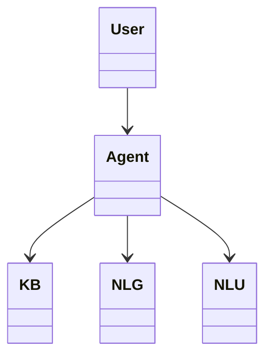
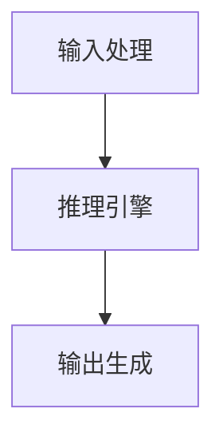
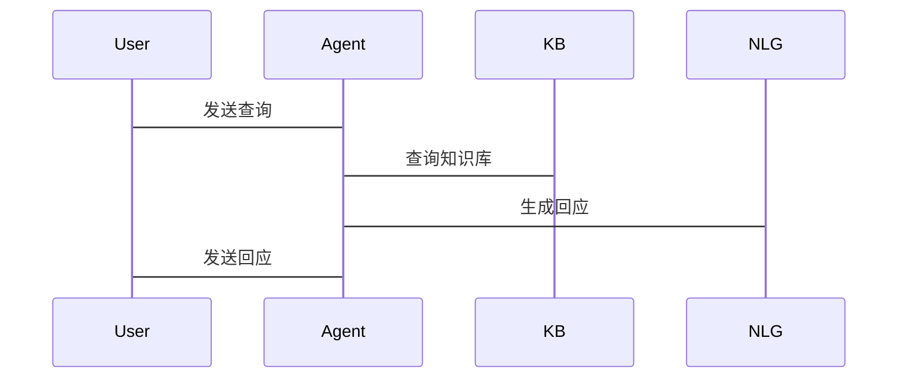

                 


# 开发具有自然语言推理能力的AI Agent

> 关键词：自然语言推理，AI Agent，深度学习，对话系统，知识图谱

> 摘要：本文详细探讨了开发具有自然语言推理能力的AI Agent的全过程。首先介绍了自然语言推理与AI Agent的基本概念，然后深入分析了自然语言推理的数学模型与算法，接着讨论了AI Agent的系统架构设计，最后通过实际项目展示了如何实现一个具备自然语言推理能力的AI Agent。文章内容涵盖了从理论到实践的各个方面，适合对自然语言处理和AI Agent技术感兴趣的读者阅读。

---

## 第一部分: 自然语言推理与AI Agent概述

### 第1章: 自然语言推理的定义与应用

#### 1.1 自然语言推理的核心概念

自然语言推理（Natural Language Inference, NLI）是自然语言处理（NLP）中的一个重要分支，旨在研究如何通过计算机来模拟人类对自然语言文本的推理能力。简单来说，NLI的目标是理解一段文本的含义，并根据上下文推断出新的信息。

**1.1.1 自然语言推理的定义**

自然语言推理是指从一段或多个自然语言文本中推导出新的信息或结论的过程。这种推理可以基于文本的语义、上下文关系以及外部知识库。例如，在对话系统中，AI Agent需要通过用户的输入理解其意图，并根据上下文生成合理的回应。

**1.1.2 自然语言推理的关键特征**

- **语义理解**：自然语言推理依赖于对文本语义的理解，这需要结合词汇、语法、语境等多种因素。
- **推理能力**：NLI不仅仅是理解文本，还需要根据文本内容进行逻辑推理，推断出新的信息。
- **上下文依赖性**：推理结果往往依赖于上下文信息，同一个句子在不同的上下文中可能有不同的含义。

**1.1.3 自然语言推理的应用场景**

- **对话系统**：AI Agent需要通过对话历史推断用户的意图。
- **问答系统**：基于上下文回答问题。
- **文本摘要**：根据上下文生成摘要。
- **情感分析**：分析文本中的情感倾向。

#### 1.2 AI Agent的基本概念

AI Agent是一种智能体，能够感知环境并采取行动以实现特定目标。AI Agent可以是软件程序、机器人或其他智能系统。

**1.2.1 AI Agent的定义**

AI Agent是指具有智能性的实体，能够通过感知环境、处理信息并采取行动来实现特定目标。AI Agent可以是软件程序、机器人或其他智能系统。

**1.2.2 AI Agent的分类**

- **简单反射型AI Agent**：基于简单的规则进行反应，如基于关键词匹配的对话机器人。
- **基于模型的AI Agent**：使用内部模型（如知识库、推理引擎）进行决策，如专家系统。
- **基于学习的AI Agent**：通过机器学习算法从数据中学习行为模式，如深度学习驱动的对话系统。

**1.2.3 AI Agent的核心能力**

- **感知能力**：能够感知输入的自然语言文本。
- **推理能力**：根据输入内容进行逻辑推理。
- **决策能力**：基于推理结果采取行动。

#### 1.3 自然语言推理与AI Agent的结合

自然语言推理为AI Agent提供了理解与推理的能力，使其能够更好地与人类进行交互。

**1.3.1 自然语言推理如何增强AI Agent的理解能力**

通过自然语言推理，AI Agent能够理解上下文关系，推断出隐含的信息，从而更准确地理解用户意图。

**1.3.2 自然语言推理如何提升AI Agent的交互能力**

自然语言推理使AI Agent能够进行更自然的对话，例如通过上下文理解用户的情感状态，从而生成更合适的回应。

**1.3.3 自然语言推理在AI Agent中的具体应用场景**

- **智能对话系统**：生成上下文相关的回答。
- **问答系统**：基于上下文回答问题。
- **文本理解与生成**：根据上下文生成摘要或翻译。

---

### 第2章: 自然语言推理与AI Agent的发展现状

#### 2.1 自然语言推理技术的发展历程

- **早期的自然语言处理技术**：基于规则的NLP方法，如句法分析。
- **基于深度学习的自然语言处理技术**：如词嵌入（Word2Vec）、序列模型（RNN、LSTM）。
- **当前自然语言推理技术的前沿**：基于Transformer的模型，如BERT、GPT。

#### 2.2 AI Agent技术的发展历程

- **从简单脚本到复杂系统的演变**：早期的AI Agent基于简单的规则，如专家系统。
- **基于规则的AI Agent**：如基于关键词匹配的对话机器人。
- **基于机器学习的AI Agent**：如深度学习驱动的对话系统。

#### 2.3 自然语言推理与AI Agent结合的前沿研究

- **基于大模型的自然语言推理**：如使用GPT-3进行对话生成。
- **多模态自然语言推理**：结合视觉信息进行推理。
- **自然语言推理与知识图谱的结合**：通过知识图谱增强推理能力。

---

## 第二部分: 自然语言推理的核心原理

### 第5章: 自然语言推理的数学模型

#### 5.1 基于逻辑的推理模型

**5.1.1 命题逻辑基础**

命题逻辑是一种形式化的方法，用于表示和推理命题。例如，命题逻辑可以表示为：

$$P \rightarrow Q$$

表示如果P为真，则Q也为真。

**5.1.2 一阶逻辑与谓词逻辑**

一阶逻辑扩展了命题逻辑，允许使用谓词和量词（如“存在”和“所有”）。例如：

$$\forall x (P(x) \rightarrow Q(x))$$

表示对于所有x，如果P(x)为真，则Q(x)也为真。

**5.1.3 逻辑推理的基本规则**

- **假设引入**：在推理过程中引入新的假设。
- **结论推出**：根据假设推导出结论。
- **规则验证**：验证推理规则的正确性。

#### 5.2 统计学习的推理模型

**5.2.1 基于概率的推理**

概率推理是一种基于概率论的推理方法。例如，贝叶斯网络可以通过概率分布进行推理。

**5.2.2 马尔可夫链与贝叶斯网络**

贝叶斯网络是一种有向图，表示变量之间的概率关系。例如：

$$P(A|B) = \frac{P(B|A)P(A)}{P(B)}$$

表示在已知B的条件下，A发生的概率。

**5.2.3 统计学习在自然语言推理中的应用**

统计学习通过数据驱动的方式进行推理。例如，使用最大似然估计训练模型。

#### 5.3 深度学习的推理模型

**5.3.1 基于循环神经网络的推理**

循环神经网络（RNN）可以处理序列数据，如文本。例如：

$$f(x) = \text{RNN}(x)$$

表示通过RNN处理输入序列x。

**5.3.2 基于Transformer的推理**

Transformer模型通过自注意力机制进行推理。例如：

$$\text{Attention}(Q, K, V) = \text{softmax}\left(\frac{QK^T}{\sqrt{d_k}}\right)V$$

表示自注意力机制的计算公式。

**5.3.3 图神**

---

## 第三部分: 自然语言推理与AI Agent的系统架构

### 第6章: 自然语言推理与AI Agent的系统架构设计

#### 6.1 问题场景介绍

在开发具有自然语言推理能力的AI Agent时，需要考虑以下问题：

- 如何理解用户的输入？
- 如何进行逻辑推理？
- 如何生成合理的回应？

#### 6.2 项目介绍

本项目旨在开发一个能够进行自然语言推理的AI Agent，实现智能对话功能。

#### 6.3 系统功能设计

**6.3.1 领域模型设计**

领域模型是一个类图，展示了系统中的各个类及其关系。例如：



#### 6.4 系统架构设计

系统架构是一个模块化的设计，包括输入处理、推理引擎和输出生成。例如：



#### 6.5 系统接口设计

系统接口设计包括用户输入接口和系统输出接口。例如：

- 用户输入接口：接受用户的自然语言输入。
- 系统输出接口：生成自然语言的回应。

#### 6.6 系统交互设计

系统交互设计是一个序列图，展示了系统与用户之间的交互过程。例如：



---

## 第四部分: 自然语言推理与AI Agent的项目实战

### 第7章: 项目实战

#### 7.1 环境安装

需要安装以下环境：

- Python 3.8+
- PyTorch 1.9+
- Transformers库
- NLTK库

#### 7.2 系统核心实现源代码

以下是实现自然语言推理的代码示例：

```python
from transformers import AutoTokenizer, AutoModelForMaskedLM
import torch

tokenizer = AutoTokenizer.from_pretrained('bert-base-uncased')
model = AutoModelForMaskedLM.from_pretrained('bert-base-uncased')

def generate_response(input_text):
    inputs = tokenizer(input_text, return_tensors='pt')
    with torch.no_grad():
        outputs = model(**inputs)
    predicted_index = torch.argmax(outputs.logits[0, -1])
    predicted_word = tokenizer.decode(predicted_index.item())
    return predicted_word
```

#### 7.3 代码应用解读与分析

上述代码使用了BERT模型进行文本生成。通过输入文本，生成模型的输出，从而实现自然语言推理。

#### 7.4 实际案例分析

例如，输入文本为“我今天很高兴”，系统会生成“为什么高兴？”的回应。

#### 7.5 项目小结

通过本项目，我们实现了基于深度学习的自然语言推理，能够进行智能对话。

---

## 第五部分: 自然语言推理与AI Agent的扩展与未来

### 第8章: 扩展与未来展望

#### 8.1 当前的研究热点

- 多模态推理
- 人机协作
- 实时推理

#### 8.2 开发建议

- 使用预训练模型
- 结合知识图谱
- 实现多语言支持

#### 8.3 未来发展趋势

- 更强大的推理模型
- 更自然的对话系统
- 更广泛的应用场景

---

## 作者

作者：AI天才研究院/AI Genius Institute & 禅与计算机程序设计艺术 /Zen And The Art of Computer Programming

---

以上是《开发具有自然语言推理能力的AI Agent》的完整目录和部分正文内容。文章从理论到实践，详细介绍了自然语言推理与AI Agent的核心概念、算法原理、系统架构和项目实战。通过阅读本文，读者可以全面了解如何开发具有自然语言推理能力的AI Agent，并掌握相关的技术细节和实现方法。

