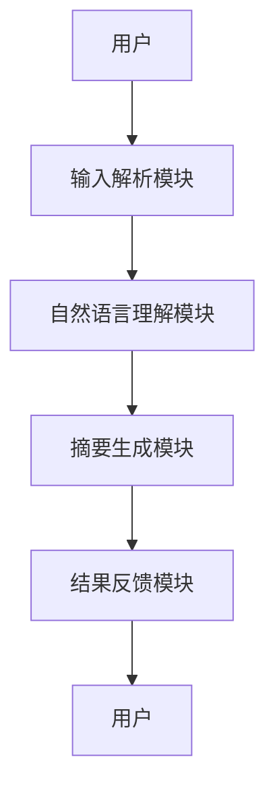

                 


# 《开发具有自然语言摘要能力的AI Agent》

---

## 关键词：
- 自然语言处理
- AI Agent
- 文本摘要
- 机器学习
- Transformer模型
- 指针生成网络

---

## 摘要：
本文详细探讨了开发具有自然语言摘要能力的AI Agent的关键技术与实现方法。首先，我们介绍了自然语言处理和AI Agent的基本概念及其在摘要任务中的应用。接着，深入分析了自然语言摘要的核心算法原理，包括指针生成网络和基于Transformer的模型。然后，我们从系统架构的角度，详细阐述了AI Agent的设计与实现，包括系统功能设计、架构图和接口设计。最后，通过实际项目案例，展示了如何实现一个具有自然语言摘要能力的AI Agent，并讨论了其优化与部署策略。本文适合对自然语言处理和AI Agent感兴趣的读者阅读，旨在为他们提供从理论到实践的全面指导。

---

# 第一部分: 自然语言处理与AI Agent基础

## 第1章: 自然语言处理与AI Agent概述

### 1.1 自然语言处理的基本概念

#### 1.1.1 自然语言处理的定义与目标
自然语言处理（Natural Language Processing, NLP）是计算机科学与人工智能交叉领域的重要分支，旨在使计算机能够理解、解析和生成人类语言。NLP的目标是实现人与计算机之间的自然语言交流，从而解决信息处理、文本分析和生成等问题。

#### 1.1.2 自然语言处理的核心任务
- **文本理解**：包括文本分类、命名实体识别、情感分析等任务，旨在从文本中提取有用的信息。
- **文本生成**：包括机器翻译、对话生成、文本摘要等任务，旨在生成符合语法规则的自然语言文本。

#### 1.1.3 自然语言处理的挑战与现状
自然语言处理的挑战主要体现在语言的模糊性、语义复杂性以及跨语言差异等方面。尽管深度学习技术的引入（如Transformer模型）显著提升了NLP的性能，但如何在复杂场景下实现高准确率的自然语言处理仍是一个开放性问题。

### 1.2 AI Agent的基本概念

#### 1.2.1 AI Agent的定义与特点
AI Agent（人工智能代理）是一种能够感知环境并采取行动以实现目标的智能实体。AI Agent的特点包括自主性、反应性、目标导向性和社会性。AI Agent能够通过传感器获取环境信息，并通过执行器与环境交互。

#### 1.2.2 AI Agent的分类与应用场景
- **简单反射型Agent**：基于当前感知直接采取行动，适用于简单的决策任务。
- **基于模型的反射型Agent**：维护环境模型，并基于模型进行推理和决策，适用于复杂场景。
- **目标驱动型Agent**：具有明确的目标，并采取行动以最大化目标的实现。

应用场景包括智能助手（如Siri、Alexa）、推荐系统、自动驾驶等。

### 1.2.3 自然语言处理在AI Agent中的作用
自然语言处理是AI Agent实现人机交互的核心技术。通过NLP技术，AI Agent能够理解用户的输入（如语音或文本），并生成符合语境的回应。这种能力使得AI Agent能够为用户提供更智能化的服务。

---

## 第2章: 自然语言摘要的核心概念

### 2.1 自然语言摘要的定义与目标

#### 2.1.1 自然语言摘要的基本概念
文本摘要（Text Summarization）是从较长的文本中提取关键信息，生成简洁的摘要文本的过程。摘要的目标是保留原文的核心内容，同时去除冗余信息。

#### 2.1.2 自然语言摘要的实现目标
- **信息提取**：从原文中提取关键信息，确保摘要的准确性。
- **信息生成**：生成符合语法规则的摘要文本，确保摘要的可读性。

### 2.2 自然语言摘要的关键技术

#### 2.2.1 文本理解与生成技术
文本理解是摘要的第一步，需要对原文进行语义分析，提取关键信息。文本生成则是基于理解结果，生成符合要求的摘要。

#### 2.2.2 摘要评估指标与方法
常用的摘要评估指标包括：
- **BLEU**：基于编辑距离的评估指标。
- **ROUGE**：基于召回率的评估指标。
- **METEOR**：结合编辑距离和语义相似度的评估指标。

### 2.3 自然语言摘要的应用场景

#### 2.3.1 信息抽取与知识管理
通过摘要技术，可以快速提取文档中的关键信息，帮助用户进行知识管理。

#### 2.3.2 人机交互与对话系统
摘要技术可以用于对话系统的回复生成，提升用户体验。

#### 2.3.3 内容生成与创作支持
摘要技术可以辅助内容创作者快速生成文章草稿，提高创作效率。

---

# 第二部分: 自然语言摘要的算法原理

## 第3章: 自然语言摘要的算法原理

### 3.1 指针生成网络（Pointer-Generator Network）

#### 3.1.1 指针生成网络的结构
指针生成网络由编码器和解码器组成。编码器将输入文本编码为向量表示，解码器根据编码结果生成摘要。

#### 3.1.2 指针生成网络的工作原理
- **编码器**：将输入文本转换为序列向量。
- **解码器**：根据编码结果生成摘要，同时使用指针机制选择原文中的词语。

#### 3.1.3 指针生成网络的优缺点
优点：能够直接引用原文中的词语，减少生成错误。
缺点：生成的摘要可能缺乏创新性，难以生成新的表达。

### 3.2 基于Transformer的摘要模型

#### 3.2.1 Transformer模型的基本结构
Transformer模型由编码器和解码器堆叠而成，通过自注意力机制捕捉文本中的语义信息。

#### 3.2.2 基于Transformer的摘要模型改进
- **位置编码**：为每个位置添加位置信息，帮助模型理解上下文。
- **残差连接**：通过残差连接提升模型的稳定性。

#### 3.2.3 基于Transformer的摘要模型数学表达
编码器的自注意力机制：
$$
\text{Attention}(Q, K, V) = \text{softmax}\left(\frac{QK^T}{\sqrt{d_k}}\right)V
$$

---

## 第4章: 基于深度学习的自然语言摘要算法

### 4.1 深度学习在自然语言处理中的应用
深度学习通过端到端的训练方式，显著提升了自然语言处理的性能。

### 4.2 基于Transformer的自然语言摘要模型
- **编码器**：将输入文本编码为向量表示。
- **解码器**：根据编码结果生成摘要。

### 4.3 模型训练与优化
- **训练数据**：使用大规模的文本数据进行训练。
- **损失函数**：使用交叉熵损失函数优化模型。
- **训练策略**：采用学习率衰减和早停策略，防止过拟合。

---

## 第5章: 自然语言摘要算法的实现

### 5.1 环境配置
- **Python**：3.8及以上版本
- **TensorFlow**：2.0及以上版本
- **Hugging Face Transformers**：库用于加载预训练模型

### 5.2 模型实现

```python
from transformers import AutoTokenizer, AutoModelForSeq2Seq
import torch

tokenizer = AutoTokenizer.from_pretrained('t5-base')
model = AutoModelForSeq2Seq.from_pretrained('t5-base')

def summarize(text):
    inputs = tokenizer.encode("summarize: " + text, return_tensors='pt', max_length=512)
    outputs = model.generate(inputs.input_ids, max_length=150, min_length=30, do_sample=False)
    summary = tokenizer.decode(outputs[0], skip_special_tokens=True)
    return summary
```

### 5.3 代码解读与分析
- **Tokenizer**：用于将文本转换为模型可接受的格式。
- **Model**：预训练的Transformer模型，用于生成摘要。
- **Summarize函数**：输入文本，返回生成的摘要。

### 5.4 实际案例分析
- **输入文本**：一篇新闻文章。
- **输出摘要**：文章的核心内容，长度控制在150个词以内。

---

## 第6章: 自然语言摘要算法的优化与部署

### 6.1 模型优化策略
- **剪枝**：通过剪枝技术减少模型参数，降低计算复杂度。
- **知识蒸馏**：将大模型的知识迁移到小模型，保持性能的同时减少计算成本。

### 6.2 部署与应用
- **API接口设计**：将模型封装为API，方便其他系统调用。
- **在线服务部署**：使用云服务（如AWS、Azure）部署模型，提供实时摘要服务。

---

## 第三部分: AI Agent的系统设计与实现

## 第7章: AI Agent的系统架构设计

### 7.1 问题场景介绍
- **用户需求**：用户希望AI Agent能够理解并生成自然语言摘要。
- **系统目标**：设计一个能够理解用户指令并生成摘要的AI Agent。

### 7.2 系统功能设计
- **输入解析**：解析用户的输入指令。
- **摘要生成**：根据指令生成摘要。
- **结果反馈**：将摘要结果反馈给用户。

### 7.3 系统架构图


---

## 第8章: AI Agent的实现与测试

### 8.1 系统实现
- **输入解析模块**：解析用户的输入指令。
- **自然语言理解模块**：理解用户指令并提取关键信息。
- **摘要生成模块**：根据理解结果生成摘要。
- **结果反馈模块**：将摘要结果反馈给用户。

### 8.2 系统测试
- **功能测试**：测试各模块的功能是否正常。
- **性能测试**：测试系统的响应时间和处理能力。
- **用户体验测试**：测试用户的使用体验。

---

## 第9章: 优化与部署

### 9.1 系统优化
- **性能优化**：通过优化算法和硬件配置，提升系统性能。
- **用户体验优化**：通过改进交互设计，提升用户体验。

### 9.2 部署策略
- **云部署**：使用云服务部署系统，提供实时服务。
- **本地部署**：提供本地部署选项，满足用户的个性化需求。

---

## 第10章: 总结与展望

### 10.1 总结
本文详细探讨了开发具有自然语言摘要能力的AI Agent的关键技术与实现方法，从算法原理到系统设计，再到项目实战，为读者提供了全面的指导。

### 10.2 展望
未来，随着深度学习技术的不断发展，自然语言摘要能力的AI Agent将更加智能化和个性化。如何在复杂场景下实现高准确率的摘要，以及如何提升用户体验，是未来研究的重要方向。

---

## 作者：AI天才研究院/AI Genius Institute & 禅与计算机程序设计艺术 /Zen And The Art of Computer Programming

---

以上是《开发具有自然语言摘要能力的AI Agent》的完整目录大纲，希望对您有所帮助！

