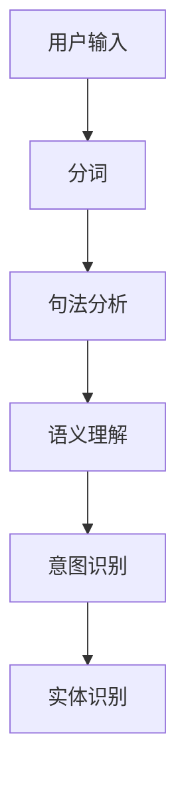
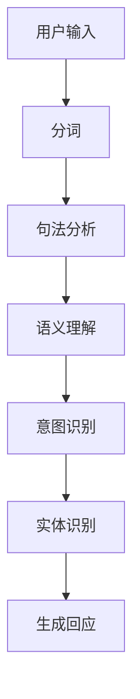

                 


# 开发具有自然语言理解能力的AI Agent

## 关键词：自然语言理解，AI Agent，NLU，人工智能，机器学习

## 摘要：本文将详细探讨如何开发具有自然语言理解能力的AI Agent。从基础概念到高级算法，从系统设计到项目实战，全面解析NLU在AI Agent中的应用。通过理论与实践相结合的方式，帮助读者掌握开发具备自然语言交互能力的智能代理系统的必备技能。

---

# 第一部分: 自然语言理解与AI Agent基础

## 第1章: 自然语言理解与AI Agent概述

### 1.1 什么是AI Agent
#### 1.1.1 AI Agent的定义
人工智能代理（AI Agent）是指能够感知环境并采取行动以实现目标的智能实体。AI Agent可以是软件程序、机器人或其他智能系统，其核心能力在于通过传感器获取信息、通过执行器与环境交互，并基于内部逻辑或算法做出决策。

#### 1.1.2 自然语言理解在AI Agent中的作用
自然语言理解（NLU）是AI Agent实现人机交互的核心技术。通过NLU，AI Agent能够解析用户的自然语言输入，理解其意图、情感和需求，从而提供准确的回应或执行相应的操作。例如，智能音箱通过NLU技术理解用户的语音指令，执行播放音乐、设置闹钟等任务。

#### 1.1.3 AI Agent的应用场景与边界
AI Agent的应用场景非常广泛，包括但不限于：
- 智能音箱（如Amazon Alexa、Google Nest）
- 智能助手（如Siri、Google Assistant）
- 聊天机器人（如微信机器人、客服机器人）
- 智慧家居系统
- 无人驾驶中的语音交互系统

AI Agent的边界主要体现在其理解和处理能力的限制。当前的NLU技术虽然取得了显著进展，但仍难以处理复杂的上下文依赖、多意图混合以及极端语境中的理解问题。

---

### 1.2 自然语言理解的核心概念
#### 1.2.1 什么是自然语言理解
自然语言理解（NLU）是人工智能领域的分支，旨在使计算机能够理解、解析和生成人类语言。NLU的核心任务包括分词、句法分析、语义理解、意图识别和实体抽取。

#### 1.2.2 NLU的关键技术与挑战
NLU的关键技术包括：
- **分词**：将连续的文本分割成有意义的词语或短语。
- **句法分析**：分析句子的语法结构，识别主语、谓语等成分。
- **语义理解**：理解文本的含义，提取意图和实体信息。
- **意图识别**：确定用户的主要意图。
- **实体抽取**：从文本中提取特定的实体信息（如人名、地名、时间等）。

NLU的挑战在于处理语言的模糊性、歧义性以及不同语言的多样性。例如，中文中的“歧义词”和“同音异义词”会增加NLU的难度。

#### 1.2.3 NLU与NLG的关系
NLU（Natural Language Understanding）与NLG（Natural Language Generation）是自然语言处理的两个主要方向。NLU负责理解输入，而NLG负责生成输出。AI Agent通常需要同时具备NLU和NLG能力，才能实现完整的自然语言交互。

---

### 1.3 自然语言理解的背景与现状
#### 1.3.1 自然语言理解的发展历程
自然语言理解的研究可以追溯到20世纪50年代。早期的NLU系统基于规则，依赖专家手动编写语法规则和词汇表。随着机器学习和深度学习的兴起，基于数据的NLU技术逐渐取代了传统的基于规则的方法，取得了显著的进展。

#### 1.3.2 当前主流的NLU技术
当前主流的NLU技术包括：
- **基于规则的方法**：通过手动编写规则来处理特定场景的NLU任务。
- **统计方法**：基于概率模型，通过大量标注数据进行训练。
- **深度学习方法**：利用神经网络（如RNN、Transformer）进行特征提取和语义建模。

#### 1.3.3 NLU在AI Agent中的应用前景
随着深度学习技术的不断进步，NLU在AI Agent中的应用前景广阔。未来的NLU系统将更加智能化，能够处理更复杂的语义理解和上下文推理。同时，多模态NLU（结合视觉、听觉等信息）也将成为研究的热点。

---

## 第2章: 自然语言理解的核心概念与联系

### 2.1 自然语言理解的核心原理
#### 2.1.1 语言模型与理解模型的区别
语言模型（LM）主要关注词与词之间的概率关系，用于生成连贯的文本或评估文本的概率。理解模型（如NLU）则专注于从文本中提取语义信息，用于理解用户意图。

#### 2.1.2 分词、句法分析与语义理解的联系
- **分词**：是NLU的基石，将连续文本分割成词语或短语。
- **句法分析**：基于分词结果，分析句子的语法结构。
- **语义理解**：结合句法分析结果，理解文本的含义。

#### 2.1.3 基于规则与基于模型的NLU方法对比
| 对比维度       | 基于规则的NLU | 基于模型的NLU |
|----------------|----------------|----------------|
| 实现方式       | 手工编写规则   | 数据驱动训练   |
| 适用场景       | 特定领域       | 多领域通用     |
| 灵活性         | 较低           | 较高           |
| 维护成本       | 高             | 中             |

---

### 2.2 NLU技术的关键特征对比
#### 2.2.1 NLU技术的优缺点分析
| 技术           | 优点             | 缺点             |
|----------------|------------------|------------------|
| 基于规则       | 精确性高          | 手工规则维护成本高 |
| 基于模型       | 适应性强          | 对数据依赖性强    |

#### 2.2.2 NLU的性能指标与评估方法
NLU的性能指标包括准确率、召回率、F1分数等。常用的评估方法包括人工标注、自动化测试和用户反馈。

---

### 2.3 NLU的实体关系图架构


---

## 第3章: 自然语言理解的算法原理

### 3.1 词嵌入算法
#### 3.1.1 什么是词嵌入
词嵌入是一种将词语表示为低维向量的技术，常见的词嵌入算法包括Word2Vec、GloVe和FastText。

#### 3.1.2 Word2Vec的原理与实现
Word2Vec通过神经网络模型，将词语映射到一个低维向量空间。其核心思想是“词的含义可以通过其上下文来表示”。

#### 3.1.3 Gensim库的使用与代码实现
以下是使用Gensim库实现Word2Vec的代码示例：
```python
from gensim.models import Word2Vec
from gensim.utils import simple_preprocess

# 示例文本
texts = [
    "The quick brown fox jumps over the lazy dog",
    "Never do anything to vex or worry a friend",
]

# 分词处理
corpus = [simple_preprocess(text) for text in texts]

# 训练词嵌入模型
model = Word2Vec(corpus, vector_size=100, window=5, min_count=1, workers=2)

# 查看词向量
print(model.wv['brown'])
```

#### 3.1.4 词嵌入的数学模型
$$ \text{Word2Vec的目标函数} = \sum_{i=1}^{n} \log P(w_i|w_{i-1}) $$

---

### 3.2 注意力机制
#### 3.2.1 注意力机制的原理
注意力机制是一种聚焦于输入序列中重要部分的技术，最早在 Transformer 模型中被提出。

#### 3.2.2 Transformer模型的结构
Transformer模型由编码器和解码器组成，编码器负责将输入序列编码为向量，解码器负责根据编码结果生成输出序列。

#### 3.2.3 自注意力机制的数学公式
$$ \text{注意力权重} = \text{softmax}(QK^T/\sqrt{d_k}) $$

---

## 第4章: 系统分析与架构设计方案

### 4.1 系统架构设计
以下是AI Agent的系统架构图：


---

## 第5章: 项目实战

### 5.1 项目介绍
本项目旨在开发一个简单的AI Agent，能够理解用户的自然语言指令并执行相应操作。

### 5.2 核心实现源代码
以下是AI Agent的核心实现代码：
```python
import spacy

# 加载中文模型
nlp = spacy.load("zh_core_web_sm")

# 用户输入
user_input = "请帮我查找附近的餐馆"

# 分词处理
doc = nlp(user_input)

# 提取实体
entities = [(ent.text, ent.label_) for ent in doc.ents]

# 执行操作
print("提取的实体：", entities)
```

### 5.3 案例分析与详细解读
通过上述代码，AI Agent能够从用户输入中提取实体信息，并根据实体信息执行相应的操作。例如，提取“餐馆”实体后，AI Agent可以调用地图API查找附近的餐馆位置。

---

## 第6章: 总结与展望

### 6.1 本章小结
本文详细介绍了如何开发具有自然语言理解能力的AI Agent，涵盖了从核心概念到算法实现的全过程。

### 6.2 未来展望
未来的NLU技术将更加智能化，能够处理更复杂的语义理解和上下文推理。同时，多模态NLU（结合视觉、听觉等信息）也将成为研究的热点。

### 6.3 最佳实践 tips
- 在实际项目中，建议使用现有的NLU工具（如spaCy、HanLP）来提高开发效率。
- 数据预处理是NLU系统成功的关键，建议投入足够的时间进行数据清洗和标注。

---

# 作者：AI天才研究院 & 禅与计算机程序设计艺术

---

通过本文的详细讲解，读者将能够掌握开发具有自然语言理解能力的AI Agent的核心技能，并在实际项目中灵活应用这些技术。

