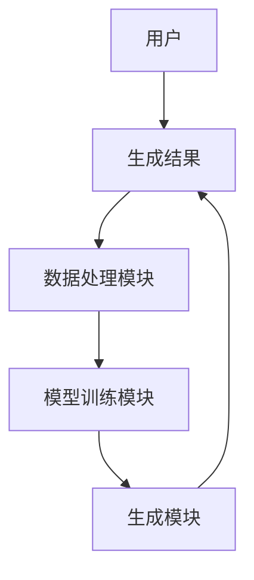

                 


# 开发具有自然语言生成能力的AI Agent

---

## 关键词

- AI Agent
- 自然语言生成
- 人工智能
- 机器学习
- 深度学习

---

## 摘要

本文详细探讨了如何开发具有自然语言生成能力的AI Agent。文章从AI Agent和自然语言生成的基本概念入手，分析了两者的结合原理，详细讲解了自然语言生成的核心算法及其在AI Agent中的应用。通过系统架构设计、接口设计和交互流程的分析，展示了如何构建一个高效的AI Agent系统。最后，通过实际案例分析和项目实战，总结了开发经验和优化技巧，为读者提供了全面的指导。

---

## 第一部分：背景介绍

### 第1章：AI Agent的基本概念

#### 1.1 AI Agent的定义与特点

**1.1.1 AI Agent的定义**

AI Agent（人工智能代理）是一种智能系统，能够感知环境并采取行动以实现特定目标。它通常具备自主性、反应性、目标导向和社会能力等特征。

**1.1.2 AI Agent的核心特点**

- **自主性**：能够在没有外部干预的情况下独立运作。
- **反应性**：能够实时感知环境并做出反应。
- **目标导向**：所有行为都围绕实现特定目标展开。
- **社会能力**：能够与其他系统或人类进行有效交互。

**1.1.3 AI Agent与传统程序的区别**

传统程序通常基于固定的规则执行任务，而AI Agent具备学习和适应能力，能够根据环境变化调整行为。

---

#### 1.2 自然语言生成（NLG）的基础知识

**1.2.1 自然语言生成的定义**

自然语言生成是将结构化的数据转化为自然语言文本的过程，涉及语法、语义和上下文的理解。

**1.2.2 自然语言生成的关键技术**

- **基于规则的方法**：通过预定义的语法规则生成文本。
- **统计模型**：利用概率统计方法预测生成文本。
- **神经网络模型**：使用深度学习生成自然流畅的文本。

**1.2.3 自然语言生成的应用场景**

- 机器翻译
- 问答系统
- 聊天机器人
- 自动摘要

---

#### 1.3 AI Agent与自然语言生成的结合

**1.3.1 AI Agent中自然语言生成的作用**

自然语言生成使AI Agent能够以人类可读的方式输出信息，提升用户体验。

**1.3.2 自然语言生成在AI Agent中的应用领域**

- 智能客服
- 联网设备控制
- 信息检索
- 个性化推荐

**1.3.3 自然语言生成对AI Agent性能的影响**

自然语言生成能力直接影响AI Agent的交互效率和用户满意度。

---

## 第二部分：核心概念与联系

### 第2章：AI Agent的原理

#### 2.1 AI Agent的感知机制

AI Agent通过传感器或API接口获取环境信息，理解用户需求。

#### 2.2 AI Agent的决策机制

基于获取的信息，AI Agent通过算法选择最优行动方案。

#### 2.3 AI Agent的执行机制

根据决策结果，AI Agent执行操作并生成自然语言反馈。

---

### 第3章：自然语言生成的原理

#### 3.1 自然语言生成的核心算法

- **序列到序列模型**：输入序列生成目标序列。
- **Transformer架构**：通过自注意力机制生成文本。

#### 3.2 自然语言生成的训练策略

- **监督学习**：基于大量标注数据进行训练。
- **强化学习**：通过奖励机制优化生成结果。

---

## 第三部分：算法原理

### 第4章：Transformer架构解析

#### 4.1 Transformer的结构

- **编码器**：将输入序列转换为上下文向量。
- **解码器**：根据编码器输出生成目标序列。

#### 4.2 自注意力机制

$$
\text{Attention}(Q, K, V) = \text{softmax}\left(\frac{QK^T}{\sqrt{d_k}}\right)V
$$

其中，\(Q\)、\(K\)、\(V\)分别为查询、键和值矩阵。

---

## 第四部分：系统分析与架构设计

### 第5章：系统架构设计

#### 5.1 系统功能设计

- **数据处理模块**：负责数据预处理和特征提取。
- **模型训练模块**：训练自然语言生成模型。
- **交互模块**：处理用户输入并生成响应。

#### 5.2 系统架构图



---

## 第五部分：项目实战

### 第6章：AI Agent的开发流程

#### 6.1 环境搭建

- 安装Python和相关库（如TensorFlow、Keras）。
- 下载预训练的Transformer模型。

#### 6.2 代码实现

```python
import tensorflow as tf
from tensorflow.keras.layers import Dense, Input, Dropout, LSTM
from tensorflow.keras.models import Model

# 定义编码器
def encoder(input_shape):
    inputs = Input(shape=input_shape)
    x = LSTM(128, return_sequences=True)(inputs)
    x = Dropout(0.5)(x)
    x = Dense(64, activation='relu')(x)
    return Model(inputs=inputs, outputs=x)

# 定义解码器
def decoder(input_shape, encoder_output):
    inputs = Input(shape=input_shape)
    x = LSTM(128, return_sequences=True)(inputs)
    x = Dropout(0.5)(x)
    x = Dense(64, activation='relu')(x)
    x = Dense(1000, activation='softmax')(x)
    return Model(inputs=inputs, outputs=x)

# 组合模型
encoder_model = encoder((None, 100))
decoder_model = decoder((None, 100), encoder_model.output)
```

---

### 第7章：实际案例分析

#### 7.1 案例背景

开发一个智能客服AI Agent，用于处理用户的常见问题。

#### 7.2 案例分析

通过预训练的Transformer模型，AI Agent能够理解用户的问题并生成合适的回答。

---

## 第六部分：高级主题与最佳实践

### 第8章：优化技巧与未来趋势

#### 8.1 模型优化技巧

- 使用更大规模的数据集进行训练。
- 引入上下文信息以提高生成的准确性。

#### 8.2 未来趋势

- 多模态生成：结合视觉和听觉信息生成更丰富的文本。
- 解析式生成：生成可解释的文本。

---

## 结论

开发具有自然语言生成能力的AI Agent是一个复杂但极具潜力的领域。通过深入理解AI Agent和自然语言生成的核心原理，并结合实际项目经验，我们可以构建出更智能、更高效的AI系统。

---

## 作者

作者：AI天才研究院/AI Genius Institute & 禅与计算机程序设计艺术 /Zen And The Art of Computer Programming

