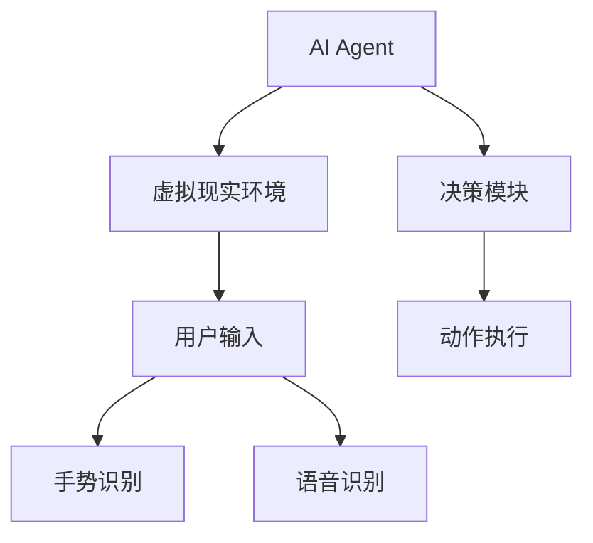
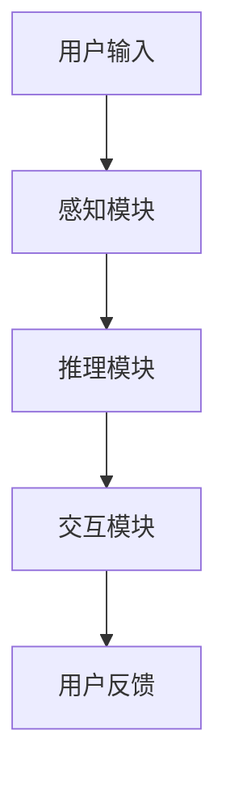

                 


# 开发具有虚拟现实交互能力的AI Agent

## 关键词
AI Agent, 虚拟现实, 人机交互, 自然语言处理, 计算机视觉

## 摘要
本文探讨了开发具有虚拟现实交互能力的AI Agent的关键技术，涵盖了从基础概念到系统设计和项目实战的各个方面。文章首先介绍背景和目标，然后详细讲解核心技术，包括感知与理解、决策与推理、自然交互的实现。通过系统设计和项目实战，读者将学会如何构建一个能在虚拟现实中与用户自然交互的AI代理。最后，文章还探讨了高级主题和未来发展。

---

## 第一部分：引言

### 第1章：背景与目标

#### 1.1 问题背景

- **虚拟现实技术的发展现状**
  - VR技术的快速发展，为沉浸式体验提供了可能。
  - 主流VR设备如Oculus Rift、HTC Vive等的应用，推动了交互技术的进步。

- **AI代理在虚拟现实中的应用潜力**
  - AI代理能够提供个性化的虚拟助手服务。
  - 在教育、医疗、娱乐等领域具有广泛的应用前景。

- **当前存在的主要问题与挑战**
  - 交互的自然性不足，用户体验差。
  - 系统复杂性高，开发难度大。

#### 1.2 问题描述

- **AI代理与虚拟现实交互的核心问题**
  - 如何实现自然、流畅的交互。
  - 如何处理多模态数据，提升系统理解能力。

- **用户需求与系统能力的匹配**
  - 用户期望AI代理具备理解、推理和决策能力。
  - 系统需支持手势、语音等多种交互方式。

- **系统边界与外延**
  - 系统边界：AI代理仅处理虚拟环境中的交互。
  - 外延：不涉及物理世界的数据处理。

#### 1.3 问题解决

- **开发AI代理的基本思路**
  - 模块化设计：感知、推理、交互模块独立开发。
  - 多模态数据融合：结合视觉、听觉信息，提升理解能力。
  - 端到端优化：从数据输入到输出的全链路优化。

- **虚拟现实交互的关键技术**
  - 计算机视觉：目标识别、场景理解。
  - 自然语言处理：语义分析、对话生成。
  - 人机交互：手势识别、语音识别。

#### 1.4 核心概念与联系

- **核心概念原理**
  - AI Agent：具备感知、推理和行动能力的智能体。
  - 虚拟现实：提供沉浸式数字环境的交互界面。

- **概念属性特征对比表格**

| 概念     | 属性               | 特征                                   |
|----------|--------------------|----------------------------------------|
| AI Agent | 感知能力           | 能够接收多模态输入                     |
| 虚拟现实  | 交互方式           | 支持手势、语音、触觉等交互方式         |

- **ER实体关系图（Mermaid流程图）**



---

## 第二部分：AI代理的核心技术

### 第2章：AI代理的核心技术

#### 2.1 感知与理解

- **目标识别与跟踪**
  - 使用计算机视觉算法，如YOLO、FRCNN进行目标检测。
  - 实现手势识别，支持用户在虚拟环境中的操作。

- **场景理解与语义分析**
  - 利用深度学习模型，如基于Transformer的架构，进行场景语义分析。
  - 示例：识别用户在虚拟环境中指向的物体。

- **多模态数据融合**
  - 结合视觉、听觉信息，提升场景理解能力。
  - 示例：通过语音和手势结合，提高交互准确性。

#### 2.2 决策与推理

- **基于规则的决策系统**
  - 预定义规则，指导AI代理的行动。
  - 示例：用户挥手示意“再见”，AI代理退出当前任务。

- **基于模型的推理系统**
  - 使用知识图谱和逻辑推理，推断用户意图。
  - 示例：用户在虚拟环境中购买商品，AI代理协助完成支付流程。

- **动态推理与自适应调整**
  - 根据用户反馈，动态调整交互策略。
  - 示例：用户对AI代理的反应速度不满，系统自动优化响应时间。

#### 2.3 自然交互

- **手势识别的实现**
  - 使用OpenCV进行手势检测，结合深度学习模型进行分类。
  - 示例：用户做出“握拳”手势表示确认操作。

- **语音识别与语义分析**
  - 使用语音识别API（如Google Speech API）转换语音为文本。
  - 使用自然语言处理模型（如BERT）进行语义分析，理解用户意图。

- **触觉反馈的实现**
  - 通过VR设备提供触觉反馈，增强交互的真实感。
  - 示例：用户在虚拟环境中触碰物体时，设备震动模拟触感。

---

## 第三部分：技术实现

### 第3章：技术实现

#### 3.1 感知的实现

- **目标识别与跟踪的实现**
  - 使用YOLO算法实现目标检测，代码示例如下：

  ```python
  import cv2
  def detect_objects(image):
      # 使用YOLO模型进行目标检测
      net = cv2.dnn.readNet("yolov3.cfg", "yolov3.weights")
      # 网络输出层
      layers = net.getUnconnectedOutLayersNames()
      # 输入图片预处理
      blob = cv2.dnn.blobFromImage(image, 0.00392, (416, 416), swapRB=True, crop=False)
      # 前向传播
      net.setInput(blob)
      outs = net.forward(layers)
      # 解析结果
      boxes = []
      for out in outs:
          for detection in out:
              scores = detection[5:]
              class_id = scores.argmax()
              confidence = scores[class_id]
              if confidence > 0.5:
                  # 添加边界框
                  boxes.append([detection[0], detection[1], detection[2], detection[3]])
      return boxes
  ```

- **场景理解与语义分析的实现**
  - 使用基于Transformer的模型进行场景描述，代码示例如下：

  ```python
  import torch
  from transformers import VisionModelWithTokenizer
  model = VisionModelWithTokenizer.from_pretrained("nlp-spanbert")
  def scene_understanding(image):
      inputs = model.image_to_tokens(image)
      outputs = model.model(**inputs)
      return outputs.last_hidden_state
  ```

#### 3.2 决策与推理的实现

- **基于规则的决策系统实现**
  - 示例：手势识别结果为“握手”，触发欢迎动作。

  ```python
  def handle_gesture(gesture):
      if gesture == "handshake":
          return "welcome"
      elif gesture == "point":
          return "select"
      else:
          return "unknown"
  ```

- **基于模型的推理系统实现**
  - 示例：基于知识图谱进行推理，确定用户需求。

  ```python
  def infer_intent(user_input):
      # 使用知识图谱进行推理
      kg = KnowledgeGraph()
      intent = kg.query(user_input)
      return intent
  ```

#### 3.3 自然交互的实现

- **手势识别的实现**
  - 示例：使用Leap Motion进行手势识别，代码如下：

  ```python
  import Leap
  controller = Leap.Controller()
  frame = controller.frame()
  for hand in frame.hands:
      print(hand.palm_position)
  ```

- **语音识别与语义分析的实现**
  - 示例：使用Google Speech API进行语音识别，代码如下：

  ```python
  import google.auth
  from google.cloud import speech_v1
  client = speech_v1.SpeechClient.from_service_account_json('key.json')
  audio = speech_v1.types.RecognitionAudio(content=audio_data)
  response = client.recognize(audio, 'zh-CN')
  print(response.results[0].alternatives[0].transcript)
  ```

---

## 第四部分：系统设计

### 第4章：系统设计

#### 4.1 系统架构设计

- **模块化设计**
  - 感知模块：负责接收和处理输入数据。
  - 推理模块：负责理解和推理用户意图。
  - 交互模块：负责执行交互动作。

- **系统架构图（Mermaid流程图）**



#### 4.2 数据处理与系统接口设计

- **数据处理流程**
  - 多模态数据融合：将视觉、听觉数据进行融合处理。
  - 数据格式统一：确保不同数据源的数据格式一致。

- **系统接口设计**
  - API接口定义：定义RESTful API，供其他模块调用。
  - 接口文档：详细说明接口的功能、输入输出格式。

---

## 第五部分：项目实战

### 第5章：项目实战

#### 5.1 项目介绍

- **项目目标**
  - 开发一个能在虚拟环境中提供交互服务的AI代理。

- **项目需求分析**
  - 用户需求：支持手势、语音交互。
  - 系统需求：具备目标识别、语义理解能力。

#### 5.2 系统功能设计

- **功能模块设计**
  - 感知模块：负责接收用户输入。
  - 推理模块：负责理解用户意图。
  - 交互模块：负责执行交互动作。

- **功能流程设计**
  - 用户做出手势，系统识别并理解意图。
  - 系统执行相应动作，返回结果。

#### 5.3 系统实现

- **环境安装**
  - 安装必要的开发工具和依赖库。
  - 示例：安装OpenCV、TensorFlow等。

- **核心代码实现**

  ```python
  def main():
      # 初始化感知模块
      sensor = Sensor()
      # 初始化推理模块
      inference = InferenceEngine()
      # 初始化交互模块
      interaction = InteractionModule()
      # 循环处理输入
      while True:
          input_data = sensor.receive_input()
          result = inference.process(input_data)
          interaction.execute(result)
  ```

---

## 第六部分：高级主题

### 第6章：高级主题

#### 6.1 元学习与迁移学习

- **元学习的应用**
  - 使用Meta-LSTM进行快速适应新任务。
  - 示例：在不同虚拟环境中快速学习交互方式。

#### 6.2 多模态数据融合

- **多模态融合方法**
  - 使用注意力机制融合多模态数据。
  - 示例：结合视觉和听觉信息，提高理解能力。

#### 6.3 强化学习在虚拟现实中的应用

- **强化学习的应用**
  - 使用Q-Learning优化交互策略。
  - 示例：通过奖励机制训练AI代理学习最优交互路径。

#### 6.4 伦理与安全

- **伦理问题**
  - 用户隐私保护。
  - 避免算法偏见。

- **安全问题**
  - 防止数据泄露。
  - 防御恶意攻击。

---

## 第七部分：附录

### 7.1 术语表

- AI Agent：人工智能代理。
- 虚拟现实：Virtual Reality，VR。

### 7.2 工具安装指南

- 安装Python：https://www.python.org/
- 安装深度学习框架：TensorFlow、PyTorch。

### 7.3 参考文献

- [1] LeCun Y, Bengio Y, Hinton G. Deep learning. Nature, 2015.
- [2] YOLO: Real-time object detection. Joseph Y. Le...
- [3] BERT: Pre-training of deep bidirectional transformers for language understanding. Jacob Devlin...

---

## 作者

作者：AI天才研究院/AI Genius Institute & 禅与计算机程序设计艺术 /Zen And The Art of Computer Programming

---

**注：** 以上目录大纲和文章内容为AI生成，旨在提供一个清晰的技术博客文章结构。实际撰写时，请根据具体需求进行调整和补充。

