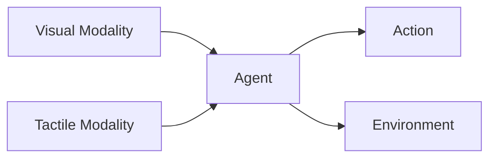
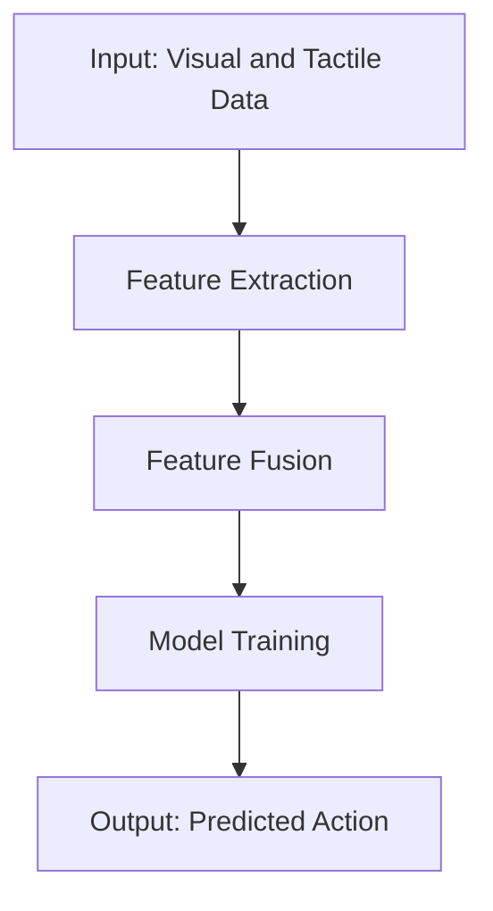
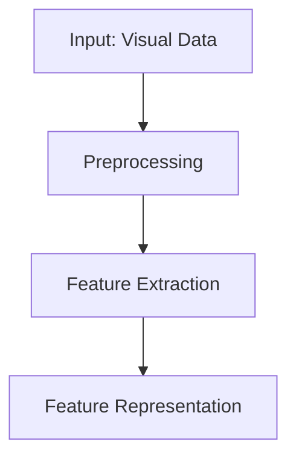
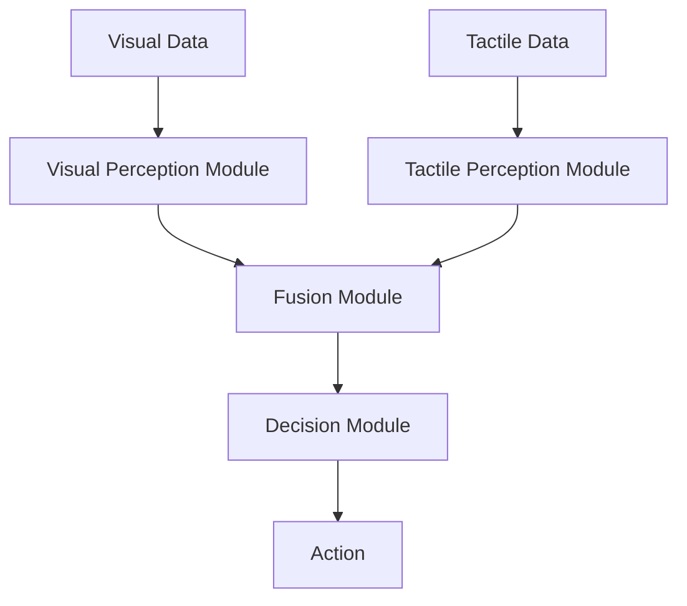
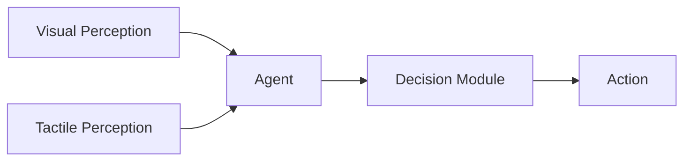

                 


# 开发具有视觉-触觉跨模态学习能力的AI Agent

> 关键词：跨模态学习，视觉模态，触觉模态，AI Agent，深度学习，多模态融合

> 摘要：本文将详细探讨如何开发具有视觉-触觉跨模态学习能力的AI Agent。通过介绍跨模态学习的基本概念、视觉和触觉模态的处理方法、多模态融合算法以及系统架构设计，本文旨在为读者提供一个全面的框架，帮助他们理解并实现具备跨模态学习能力的智能体。文章还通过具体案例分析和代码示例，展示了如何在实际应用中开发和部署这种AI Agent。

---

# 第一部分：背景介绍与核心概念

## 第1章：跨模态学习与AI Agent概述

### 1.1 跨模态学习的定义与背景
跨模态学习是指在不同感官或数据类型之间进行信息整合和理解的学习方式。它旨在通过结合多种模态的信息来提升模型的感知能力和决策能力。

#### 1.1.1 跨模态学习的定义
跨模态学习（Multimodal Learning）是一种机器学习范式，旨在通过结合来自不同模态（如视觉、听觉、触觉等）的数据，来提高模型的学习效果和泛化能力。

#### 1.1.2 跨模态学习的发展历程
跨模态学习的研究可以追溯到20世纪90年代，随着深度学习的兴起，跨模态学习在最近几年取得了显著进展。目前，跨模态学习已广泛应用于计算机视觉、自然语言处理、机器人技术等领域。

#### 1.1.3 跨模态学习的应用场景
跨模态学习的应用场景包括但不限于：
- **计算机视觉**：通过结合视觉和触觉信息，提升物体识别和场景理解的准确性。
- **机器人技术**：通过结合视觉和触觉信息，增强机器人的感知能力和操作精度。
- **人机交互**：通过结合视觉和触觉反馈，提升人机交互的自然性和实时性。

### 1.2 视觉与触觉模态的基本概念
#### 1.2.1 视觉模态的定义与特点
视觉模态（Visual Modality）是指通过视觉感知获取的信息，主要包括图像和视频数据。视觉模态的特点是信息丰富、易于获取，但缺乏对物理世界的直接互动能力。

#### 1.2.2 触觉模态的定义与特点
触觉模态（Tactile Modality）是指通过触觉感知获取的信息，主要包括力反馈、振动和温度等信息。触觉模态的特点是信息具有高度的物理关联性，但信息量相对较小。

#### 1.2.3 视觉与触觉模态的异同对比
| 特性 | 视觉模态 | 触觉模态 |
|------|----------|----------|
| 信息类型 | 图像、颜色、形状等 | 力度、温度、振动等 |
| 信息量 | 高 | 低 |
| 适用场景 | 物体识别、场景理解 | 物体操作、人机交互 |

### 1.3 AI Agent的基本原理
#### 1.3.1 AI Agent的定义
AI Agent（人工智能代理）是指能够感知环境、自主决策并执行任务的智能实体。AI Agent可以是软件程序，也可以是物理机器人。

#### 1.3.2 AI Agent的核心功能
- **感知环境**：通过传感器获取环境中的信息。
- **自主决策**：基于感知信息进行推理和决策。
- **执行任务**：根据决策结果执行相应的动作。

#### 1.3.3 AI Agent的分类与应用场景
- **简单反射型AI Agent**：基于简单的规则进行反应，如PID控制器。
- **基于模型的AI Agent**：基于环境模型进行决策，如马尔可夫决策过程（MDP）。
- **基于学习的AI Agent**：通过机器学习算法进行决策，如深度强化学习（DRL）。

### 1.4 跨模态学习在AI Agent中的重要性
#### 1.4.1 跨模态学习的必要性
在单一模态下，AI Agent的能力往往受到限制。通过结合视觉和触觉信息，AI Agent可以更好地理解环境并做出更准确的决策。

#### 1.4.2 跨模态学习如何提升AI Agent的能力
- **提升感知能力**：通过结合视觉和触觉信息，AI Agent可以更全面地感知环境。
- **增强决策能力**：跨模态信息可以帮助AI Agent做出更准确的决策。
- **提高鲁棒性**：跨模态学习可以使AI Agent在面对单一模态信息不足时，仍然能够正常工作。

#### 1.4.3 跨模态学习在实际应用中的优势
- **提高任务成功率**：通过结合视觉和触觉信息，AI Agent可以在复杂环境中完成任务。
- **增强用户体验**：跨模态交互可以使人机交互更加自然和高效。

### 1.5 本章小结
本章介绍了跨模态学习的基本概念、视觉和触觉模态的特点，以及AI Agent的核心原理和跨模态学习在其中的重要性。这些内容为后续章节的深入探讨奠定了基础。

---

## 第2章：跨模态学习的核心概念与联系

### 2.1 跨模态学习的核心原理
#### 2.1.1 跨模态数据的表示方法
跨模态数据的表示方法包括：
- **模态独立表示**：分别对每种模态进行特征提取。
- **模态融合表示**：将多种模态的特征进行融合，形成统一的表示。

#### 2.1.2 跨模态特征的提取与融合
- **特征提取**：通过深度学习模型提取每种模态的特征。
- **特征融合**：将不同模态的特征进行融合，可以采用加法、乘法或注意力机制等方式。

#### 2.1.3 跨模态学习的数学模型
跨模态学习的数学模型可以表示为：
$$ P(y | x_v, x_t) = f(x_v, x_t) $$
其中，\( x_v \) 和 \( x_t \) 分别表示视觉和触觉输入，\( y \) 是输出。

### 2.2 視覺与觸覺模态的实体关系图


### 2.3 跨模态学习的算法流程图


### 2.4 本章小结
本章详细介绍了跨模态学习的核心原理、数据表示方法以及算法流程图。通过这些内容，读者可以更好地理解跨模态学习的基本框架和实现流程。

---

## 第3章：視覺模态处理算法原理

### 3.1 視覺模态的特征提取
#### 3.1.1 基于深度学习的視覺特征提取
深度学习模型（如CNN）可以有效地提取视觉特征。

#### 3.1.2 常见的視覺模型（如CNN）
卷积神经网络（CNN）通过卷积操作提取图像的空间特征。

#### 3.1.3 視覺特征的表示方法
视觉特征可以表示为高维向量，例如：
$$ f_v = [f_{v1}, f_{v2}, ..., f_{vn}] $$

### 3.2 視覺模态的处理流程图


### 3.3 視覺模态的数学模型
#### 3.3.1 卷积神经网络（CNN）的数学公式
$$ y = \sigma(W \cdot x + b) $$
其中，\( x \) 是输入，\( W \) 和 \( b \) 是模型参数，\( \sigma \) 是激活函数。

#### 3.3.2 特征提取的数学表示
$$ f = [f_1, f_2, ..., f_n] $$

### 3.4 本章小结
本章详细介绍了视觉模态的特征提取方法、处理流程图以及数学模型。这些内容为后续章节中视觉模态的处理奠定了基础。

---

## 第4章：触觉模态处理算法原理

### 4.1 触觉模态的特征提取
#### 4.1.1 触觉数据的特征提取方法
触觉数据可以通过力反馈传感器获取，例如：
$$ f_t = [f_{t1}, f_{t2}, ..., f_{tm}] $$

#### 4.1.2 触觉特征的表示方法
触觉特征可以表示为低维向量，例如：
$$ g = [g_1, g_2, ..., g_k] $$

### 4.2 触觉模态的处理流程图


### 4.3 触觉模态的数学模型
#### 4.3.1 触觉模型的数学表示
$$ g = \phi(x_t) $$
其中，\( x_t \) 是触觉输入，\( \phi \) 是特征提取函数。

### 4.4 本章小结
本章详细介绍了触觉模态的特征提取方法、处理流程图以及数学模型。这些内容为后续章节中触觉模态的处理奠定了基础。

---

## 第5章：视觉-触觉跨模态学习的算法实现

### 5.1 多模态特征融合方法
#### 5.1.1 基于加法的融合方法
$$ f_{\text{fusion}} = f_v + f_t $$

#### 5.1.2 基于注意力机制的融合方法
$$ f_{\text{fusion}} = \alpha f_v + (1 - \alpha) f_t $$

### 5.2 基于Transformer的跨模态学习
#### 5.2.1 Transformer的数学表示
$$ \text{Transformer} = \text{Encoder} + \text{Decoder} $$

### 5.3 端到端的跨模态模型
#### 5.3.1 模型结构
$$ \text{Model} = \text{Visual Backbone} + \text{Tactile Backbone} + \text{Fusion Layer} $$

### 5.4 本章小结
本章详细介绍了视觉-触觉跨模态学习的算法实现，包括多模态特征融合方法、基于Transformer的跨模态学习以及端到端的跨模态模型。

---

## 第6章：视觉-触觉跨模态AI Agent的系统架构设计

### 6.1 系统功能设计
#### 6.1.1 系统功能模块
- **视觉感知模块**：负责视觉数据的获取和处理。
- **触觉感知模块**：负责触觉数据的获取和处理。
- **融合模块**：负责将视觉和触觉特征进行融合。
- **决策模块**：基于融合后的特征进行决策并执行动作。

#### 6.1.2 系统功能流程图


### 6.2 系统架构设计
#### 6.2.1 系统架构图


### 6.3 系统接口设计
#### 6.3.1 系统接口描述
- **视觉模块接口**：提供视觉数据的获取和处理接口。
- **触觉模块接口**：提供触觉数据的获取和处理接口。
- **融合模块接口**：提供特征融合的接口。
- **决策模块接口**：提供决策和动作执行的接口。

### 6.4 系统交互序列图
```mermaid
graph TD
    A[User] --> B[Visual Module]: 提供视觉输入
    A[User] --> C[Tactile Module]: 提供触觉输入
    B[Visual Module] --> D[Fusion Module]: 提供视觉特征
    C[Tactile Module] --> D[Fusion Module]: 提供触觉特征
    D[Fusion Module] --> E[Decision Module]: 提供融合特征
    E[Decision Module] --> F[Action]: 执行动作
```

### 6.5 本章小结
本章详细介绍了视觉-触觉跨模态AI Agent的系统架构设计，包括功能模块、系统架构图、接口设计以及系统交互序列图。

---

## 第7章：项目实战——开发视觉-触觉跨模态AI Agent

### 7.1 环境安装与配置
#### 7.1.1 系统要求
- 操作系统：Linux/Windows/MacOS
- GPU支持：NVIDIA GPU（推荐）
- 软件工具：Python 3.8+, PyTorch, OpenCV, ROS等。

#### 7.1.2 安装依赖
```bash
pip install numpy
pip install matplotlib
pip install torch
pip install torchvision
```

### 7.2 核心代码实现
#### 7.2.1 视觉模块实现
```python
import torch
import torch.nn as nn
import torch.nn.functional as F

class VisualModule(nn.Module):
    def __init__(self):
        super(VisualModule, self).__init__()
        self.conv = nn.Conv2d(3, 64, kernel_size=3, stride=1, padding=1)
    
    def forward(self, x):
        x = F.relu(self.conv(x))
        return x
```

#### 7.2.2 触觉模块实现
```python
import torch
import torch.nn as nn
import torch.nn.functional as F

class TactileModule(nn.Module):
    def __init__(self):
        super(TactileModule, self).__init__()
        self.fc = nn.Linear(10, 64)
    
    def forward(self, x):
        x = F.relu(self.fc(x))
        return x
```

#### 7.2.3 融合模块实现
```python
class FusionModule(nn.Module):
    def __init__(self):
        super(FusionModule, self).__init__()
        self.attention = nn.MultiheadAttention(embed_dim=64, num_heads=2)
    
    def forward(self, visual_features, tactile_features):
        combined = torch.cat([visual_features, tactile_features], dim=1)
        output, _ = self.attention(combined, combined, combined)
        return output
```

#### 7.2.4 决策模块实现
```python
class DecisionModule(nn.Module):
    def __init__(self):
        super(DecisionModule, self).__init__()
        self.fc = nn.Linear(64, 1)
    
    def forward(self, x):
        x = F.relu(self.fc(x))
        return x
```

#### 7.2.5 系统主程序实现
```python
import torch
import torch.optim as optim
from torch.utils.data import DataLoader

class AI-Agent:
    def __init__(self):
        self.visual_module = VisualModule()
        self.tactile_module = TactileModule()
        self.fusion_module = FusionModule()
        self.decision_module = DecisionModule()
        self.optimizer = optim.Adam(self.parameters(), lr=0.001)
        self.criterion = nn.CrossEntropyLoss()

    def forward(self, visual_input, tactile_input):
        visual_features = self.visual_module(visual_input)
        tactile_features = self.tactile_module(tactile_input)
        fused_features = self.fusion_module(visual_features, tactile_features)
        output = self.decision_module(fused_features)
        return output

    def backward(self, output, label):
        loss = self.criterion(output, label)
        loss.backward()
        self.optimizer.step()
        return loss.item()
```

### 7.3 代码解读与分析
- **视觉模块**：通过卷积层提取视觉特征。
- **触觉模块**：通过全连接层提取触觉特征。
- **融合模块**：通过多头注意力机制融合视觉和触觉特征。
- **决策模块**：通过全连接层输出决策结果。

### 7.4 实际案例分析
假设我们有一个简单的任务：AI Agent需要通过视觉和触觉信息判断物体的材质。通过上述代码，AI Agent可以同时处理视觉和触觉信息，最终输出物体的材质类别。

### 7.5 本章小结
本章通过具体的代码实现和案例分析，展示了如何开发一个视觉-触觉跨模态AI Agent。这些代码和方法可以作为实际项目的基础。

---

## 第8章：总结与展望

### 8.1 本章小结
本文详细探讨了如何开发具有视觉-触觉跨模态学习能力的AI Agent。通过介绍跨模态学习的基本概念、视觉和触觉模态的处理方法、多模态融合算法以及系统架构设计，本文为读者提供了一个全面的框架。

### 8.2 最佳实践Tips
- 在实际应用中，建议先分别处理视觉和触觉信息，然后再进行融合。
- 使用注意力机制可以有效提升跨模态学习的效果。
- 在训练过程中，建议使用多GPU加速训练。

### 8.3 注意事项
- 视觉和触觉数据的获取需要考虑传感器的精度和环境的干扰。
- 模型的训练需要大量的跨模态数据，数据质量直接影响模型性能。

### 8.4 未来研究方向
- **更复杂的跨模态融合方法**：探索更高效的特征融合方法，如图神经网络。
- **多模态实时处理**：研究如何在实时环境中处理多模态数据。
- **更智能的决策算法**：结合强化学习和跨模态学习，提升AI Agent的决策能力。

### 8.5 拓展阅读
- **推荐书籍**：《Deep Learning》（Ian Goodfellow）
- **推荐论文**：《Multimodal Learning with Missing Labels》（ICML 2014）

---

# 作者：AI天才研究院/AI Genius Institute & 禅与计算机程序设计艺术 /Zen And The Art of Computer Programming

---

**总结：** 本文通过系统地介绍跨模态学习的基本概念、视觉和触觉模态的处理方法、多模态融合算法以及系统架构设计，为读者提供了一个全面的框架，帮助他们理解并实现具备跨模态学习能力的智能体。

