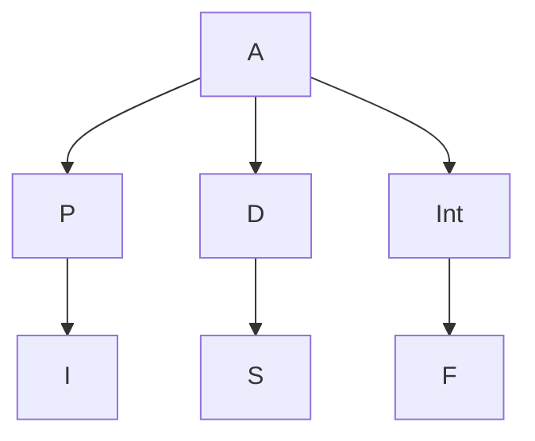
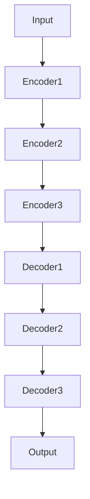
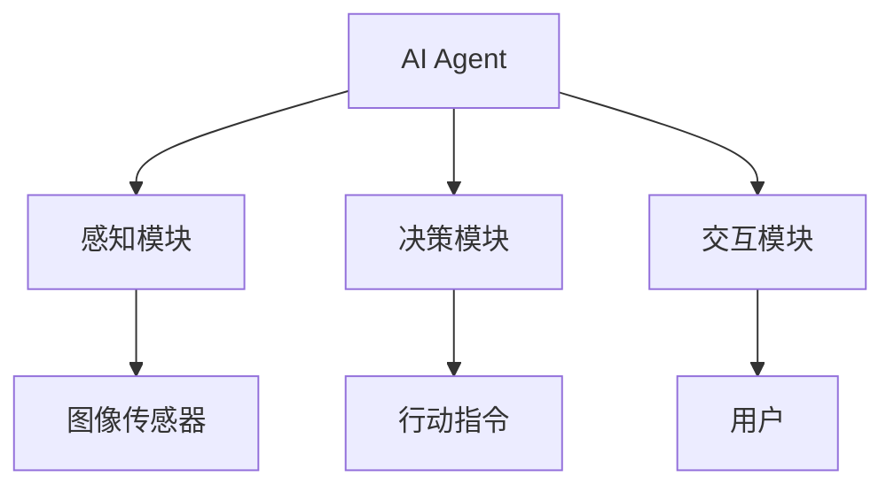
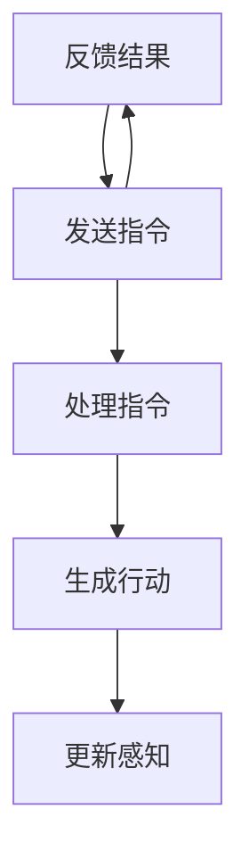

                 


# 开发具有视觉理解能力的AI Agent

## 关键词：AI Agent，视觉理解，计算机视觉，深度学习，人机交互，算法实现

## 摘要：  
本文详细探讨了开发具有视觉理解能力的AI Agent的各个方面，从基础概念到算法实现，再到系统架构和项目实战。文章首先介绍了AI Agent和视觉理解的基本概念，分析了当前技术现状与挑战。接着，深入讲解了视觉理解的核心算法及其数学基础，展示了AI Agent的感知、决策和交互模块的实现原理。通过实际项目案例，本文详细阐述了系统设计、实现和优化的过程，最后总结了开发具有视觉理解能力的AI Agent的关键点和未来发展方向。

---

# 第一部分: 开发具有视觉理解能力的AI Agent基础

---

## 第1章: AI Agent与视觉理解概述

### 1.1 AI Agent的基本概念  
AI Agent（人工智能代理）是指能够感知环境、自主决策并执行任务的智能体。它具备以下核心特征：  
- **自主性**：能够在没有外部干预的情况下独立运行。  
- **反应性**：能够实时感知环境变化并做出响应。  
- **目标导向**：基于目标驱动行为，优化决策过程。  

AI Agent的应用广泛，例如自动驾驶汽车、智能助手（如Siri、Alexa）以及工业机器人等。  

### 1.2 视觉理解的定义与挑战  
视觉理解是指AI系统通过摄像头或传感器获取图像或视频数据，并从中提取语义信息（如物体识别、场景理解）的能力。视觉理解的核心挑战包括：  
- **数据多样性**：真实场景中的光照、姿态、遮挡等因素会显著影响视觉效果。  
- **语义鸿沟**：计算机难以像人类一样理解图像中的上下文关系。  
- **计算效率**：实时应用对计算资源的要求极高。  

### 1.3 本书的目标与结构安排  
本书旨在帮助读者从零开始，掌握开发具有视觉理解能力的AI Agent所需的核心技术。内容安排如下：  
1. 介绍AI Agent和视觉理解的基本概念。  
2. 分析视觉理解的关键算法及其数学基础。  
3. 展示AI Agent的系统架构设计与实现。  
4. 通过实际项目案例，详细讲解开发流程与优化技巧。  

---

## 第2章: AI Agent的核心概念与联系  

### 2.1 AI Agent的核心概念  
AI Agent的核心模块包括：  
- **感知模块**：负责从环境中获取信息（如图像、语音）。  
- **决策模块**：基于感知信息制定行动策略。  
- **交互模块**：通过自然语言或动作与用户或环境互动。  

### 2.2 视觉理解在AI Agent中的作用  
视觉理解是AI Agent实现智能交互的关键技术。通过视觉感知，AI Agent能够：  
- **识别物体**：检测图像中的物体类别（如人、车、树）。  
- **理解场景**：分析场景中的物体布局和关系。  
- **指导行动**：根据视觉信息做出决策（如避障、抓取）。  

### 2.3 核心概念对比表格  
下表展示了AI Agent核心模块的功能对比：  

| 模块       | 输入         | 输出         | 核心功能                       |  
|------------|--------------|--------------|--------------------------------|  
| 感知模块   | 图像/视频     | 特征/语义     | 提取视觉信息                   |  
| 决策模块   | 特征/语义     | 行动指令       | 制定行动策略                   |  
| 交互模块   | 行动指令       | 用户反馈       | 实现人机交互                   |  

### 2.4 ER实体关系图  
以下是AI Agent核心模块的实体关系图：  



---

## 第3章: 视觉理解的算法原理  

### 3.1 视觉理解的核心算法  
视觉理解的关键算法包括：  
- **图像处理算法**：如边缘检测、图像分割等。  
- **目标检测算法**：如YOLO、Faster R-CNN。  
- **图像分割算法**：如U-Net、DeepLab。  

### 3.2 图像处理算法原理  
以边缘检测为例，Canny边缘检测算法的步骤如下：  

1. **高斯滤波**：对图像进行平滑处理，去除噪声。  
2. **计算梯度**：获取图像的水平和垂直梯度。  
3. **非极大值抑制**：抑制非边缘点。  
4. **双阈值检测**：提取强边缘点并连接边缘。  

以下为Canny边缘检测的Python实现示例：  

```python
import cv2

def canny_edge_detection(image_path):
    image = cv2.imread(image_path, cv2.IMREAD_GRAYSCALE)
    blurred = cv2.GaussianBlur(image, (5, 5), 0)
    gradient = cv2.Sobel(blurred, cv2.CV_64F, 1, 0, ksize=3)
    edges = cv2.threshold(gradient, 0.05 * gradient.max(), 255, cv2.THRESH_BINARY)[1]
    return edges

image_path = "test.jpg"
edges = canny_edge_detection(image_path)
cv2.imwrite("edges.jpg", edges)
```

### 3.3 目标检测算法原理  
目标检测的典型算法是YOLO（You Only Look Once）。YOLO的核心思想是将图像划分为网格，并预测每个网格中的边界框和物体类别。YOLO的损失函数如下：  

$$ \text{损失} = \lambda_{\text{cls}} \cdot \text{分类损失} + \lambda_{\text{loc}} \cdot \text{定位损失} $$  

其中，$\lambda_{\text{cls}}$ 和 $\lambda_{\text{loc}}$ 是平衡系数。  

### 3.4 图像分割算法原理  
图像分割的典型算法是U-Net。U-Net通过跳跃连接实现特征重用，其编码器-解码器结构如下：  



---

## 第4章: 视觉理解的数学基础  

### 4.1 线性代数基础  
线性代数是视觉理解的核心数学工具，主要包括：  
- **矩阵运算**：如矩阵乘法、转置等。  
- **特征值分解**：用于降维（如PCA）。  

例如，矩阵乘法的定义为：  

$$ C_{ij} = \sum_{k} A_{ik} B_{kj} $$  

### 4.2 概率统计基础  
概率统计用于模型训练与评估，主要包括：  
- **贝叶斯定理**：用于分类任务。  
- **最大似然估计**：用于参数优化。  

贝叶斯定理的公式为：  

$$ P(y|x) = \frac{P(x|y)P(y)}{P(x)} $$  

### 4.3 优化方法基础  
优化方法用于模型训练，主要包括：  
- **梯度下降**：最常用的优化算法。  
- **Adam优化器**：结合了动量和自适应学习率。  

Adam优化器的更新公式为：  

$$ \theta_{t+1} = \theta_t - \eta \frac{m_t}{v_t + \epsilon} $$  

### 4.4 深度学习基础  
深度学习是视觉理解的核心技术，主要包括：  
- **卷积神经网络（CNN）**：用于图像特征提取。  
- **循环神经网络（RNN）**：用于序列数据处理。  

---

## 第5章: AI Agent的算法实现  

### 5.1 感知模块的算法实现  
感知模块的核心算法是目标检测，以YOLO为例，其Python实现如下：  

```python
import torch
import cv2

def detect_objects(image, model):
    model.eval()
    with torch.no_grad():
        inputs = torch.tensor(image).permute(2, 0, 1).float()
        outputs = model(inputs)
        boxes = outputs[0]['boxes'].cpu().numpy()
        labels = outputs[0]['labels'].cpu().numpy()
        return boxes, labels

image = cv2.imread("test.jpg")
boxes, labels = detect_objects(image, model)
```

### 5.2 决策模块的算法实现  
决策模块的核心算法是强化学习，以Q-Learning为例，其Python实现如下：  

```python
import numpy as np

class QLearning:
    def __init__(self, state_space, action_space):
        self.q_table = np.zeros((state_space, action_space))
    
    def choose_action(self, state, epsilon):
        if np.random.random() < epsilon:
            return np.random.randint(action_space)
        else:
            return np.argmax(self.q_table[state])
    
    def update_q_table(self, state, action, reward, next_state, alpha, gamma):
        self.q_table[state][action] = (1 - alpha) * self.q_table[state][action] + alpha * (reward + gamma * np.max(self.q_table[next_state]))

# 示例使用
state_space = 10
action_space = 4
agent = QLearning(state_space, action_space)
epsilon = 0.1
alpha = 0.1
gamma = 0.9

state = 2
action = agent.choose_action(state, epsilon)
reward = 1
next_state = 3
agent.update_q_table(state, action, reward, next_state, alpha, gamma)
```

### 5.3 交互模块的算法实现  
交互模块的核心算法是自然语言处理，以简单的聊天机器人为例，其Python实现如下：  

```python
class ChatBot:
    def __init__(self, responses):
        self.responses = responses
    
    def get_response(self, input_text):
        # 简单的关键词匹配
        for keyword, response in self.responses.items():
            if keyword in input_text:
                return response
        return "抱歉，我还不理解您的问题。"

bot = ChatBot({
    "hello": "你好！有什么可以帮助你的吗？",
    "how are you": "我很好，谢谢！"
})
print(bot.get_response("hello"))  # 输出：你好！有什么可以帮助你的吗？
```

---

## 第6章: AI Agent的系统架构设计  

### 6.1 系统功能设计  
AI Agent的系统功能包括：  
1. **感知模块**：图像采集与特征提取。  
2. **决策模块**：基于特征的行动决策。  
3. **交互模块**：与用户或环境互动。  

### 6.2 系统架构图  
以下是AI Agent的系统架构图：  



### 6.3 接口设计  
系统接口设计包括：  
- **输入接口**：图像、语音输入。  
- **输出接口**：行动指令、文本输出。  

### 6.4 交互流程图  
以下是交互流程图：  



---

## 第7章: 项目实战  

### 7.1 项目环境配置  
项目需要以下环境：  
- Python 3.8+  
- PyTorch 1.9+  
- OpenCV 4.5+  
- NVIDIA GPU（支持CUDA）  

### 7.2 项目核心实现  
以下是目标检测模块的实现：  

```python
import torch
import cv2

def main():
    model = torch.hub.load('ultralytics/yolov5', 'yolov5s')
    image = cv2.imread("test.jpg")
    results = model(image)
    boxes = results.pboxes.cpu().numpy()
    labels = results.pboxes.classes.cpu().numpy()
    print(f"检测到 {len(boxes)} 个目标，类别为：{labels}")

if __name__ == "__main__":
    main()
```

### 7.3 项目优化与部署  
优化措施包括：  
- **模型剪枝**：减少模型参数数量。  
- **量化**：降低模型精度（如FP16）。  

---

## 第8章: 优化与部署  

### 8.1 模型优化技巧  
- 使用模型压缩工具（如TensorFlow Lite、ONNX）。  
- 优化计算图（如合并矩阵乘法）。  

### 8.2 实际部署案例  
以自动驾驶为例，部署流程包括：  
1. 模型量化。  
2. 移植到嵌入式设备。  
3. 实时运行测试。  

---

## 第9章: 总结与展望  

### 9.1 全文总结  
本文详细讲解了开发具有视觉理解能力的AI Agent所需的核心技术，包括感知、决策和交互模块的实现，以及系统架构设计与优化。  

### 9.2 未来展望  
未来，AI Agent的发展将朝着以下几个方向迈进：  
- **更强的视觉理解能力**：通过大模型（如视觉语言模型）提升语义理解能力。  
- **更高效的算法**：优化算法计算效率，实现实时应用。  
- **更广泛的应用场景**：拓展至更多领域（如医疗、教育、农业）。  

---

## 作者：AI天才研究院 & 禅与计算机程序设计艺术

---

**本文内容来源于AI天才研究院的深度研究与实践，转载请注明出处。**

