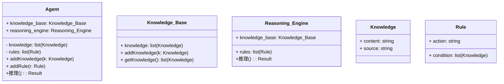

                 


# 开发具有跨域知识推理能力的AI Agent

> 关键词：跨域知识推理, AI Agent, 知识图谱, 逻辑推理, 自然语言处理

> 摘要：本文深入探讨了开发具有跨域知识推理能力的AI Agent的核心概念、算法原理、系统架构设计及项目实战。通过详细分析跨域知识推理的背景、核心原理及其实现方法，结合具体的系统设计和实际案例，展示了如何构建一个能够处理多领域知识整合和推理的智能代理系统。本文旨在为AI开发者和研究人员提供理论指导和实践参考，帮助他们更好地理解和应用跨域知识推理技术。

---

# 第一部分: 跨域知识推理与AI Agent概述

## 第1章: 跨域知识推理的背景与意义

### 1.1 跨域知识推理的定义与背景

#### 1.1.1 什么是跨域知识推理
跨域知识推理是指AI系统能够从多个不同领域中获取信息，并在这些信息之间建立联系，从而进行复杂推理的能力。例如，一个医疗AI Agent可以结合医学知识和患者的行为数据，推断出患者的健康状况。

#### 1.1.2 跨域知识推理的重要性
跨域知识推理是实现智能系统的核心能力之一。它使得AI Agent能够理解上下文、关联不同领域的知识，并根据这些信息做出更准确的决策。

#### 1.1.3 跨域知识推理的应用场景
跨域知识推理广泛应用于智能助手、对话系统、自动驾驶、医疗诊断等领域。例如，在对话系统中，AI Agent需要理解用户的问题，并结合上下文进行推理，提供准确的答案。

---

### 1.2 AI Agent的基本概念

#### 1.2.1 什么是AI Agent
AI Agent（智能代理）是一种能够感知环境、自主决策并采取行动的智能系统。它可以是一个软件程序，也可以是一个物理设备。

#### 1.2.2 AI Agent的核心特征
- **自主性**：AI Agent能够在没有外部干预的情况下独立运行。
- **反应性**：能够实时感知环境并做出反应。
- **推理能力**：能够进行逻辑推理和知识整合。
- **学习能力**：能够通过经验改进自己的性能。

#### 1.2.3 AI Agent与传统程序的区别
传统程序通常是基于固定的规则运行，而AI Agent具备学习和推理能力，能够根据环境变化调整自己的行为。

---

### 1.3 跨域知识推理在AI Agent中的作用

#### 1.3.1 跨域知识推理的必要性
AI Agent需要处理来自不同领域的问题，例如在医疗领域，AI Agent可能需要结合医学知识和患者的行为数据进行推理。

#### 1.3.2 跨域知识推理如何增强AI Agent的能力
通过跨域知识推理，AI Agent能够更好地理解用户的需求，并提供更准确和相关的答案。

#### 1.3.3 跨域知识推理的挑战与机遇
跨域知识推理的实现面临知识整合、推理算法优化等挑战，同时也带来了提升AI Agent智能化水平的机遇。

---

## 第2章: 跨域知识推理的核心概念与联系

### 2.1 跨域知识推理的核心原理

#### 2.1.1 知识表示与推理的基本原理
知识表示是将信息以某种形式存储起来，推理则是根据这些知识进行逻辑推理。

#### 2.1.2 跨域知识的整合机制
跨域知识整合需要将不同领域中的知识进行融合，例如将医学知识与患者数据进行整合。

#### 2.1.3 跨域推理的逻辑框架
跨域推理通常采用多步推理，每一步推理都在特定领域内进行，最终结合多个领域的结果得出结论。

---

### 2.2 跨域知识推理与相关概念对比

#### 2.2.1 跨域知识推理与其他推理方式的对比
- **单领域推理**：仅在单一领域内进行推理。
- **跨域推理**：结合多个领域进行推理。

#### 2.2.2 跨域知识推理与知识图谱的关系
知识图谱是跨域知识推理的重要基础，它将不同领域的知识以图结构表示，为推理提供了丰富的语义信息。

#### 2.2.3 跨域知识推理与自然语言处理的联系
自然语言处理技术用于理解和生成人类语言，跨域知识推理则利用这些语言信息进行逻辑推理。

---

### 2.3 跨域知识推理的ER实体关系图

```mermaid
er
    entity(Agent) {
        id: string
        knowledge_base: string
        reasoning_engine: string
    }
    entity(Knowledge_Base) {
        id: string
        domain: string
        knowledge: string
    }
    entity(Reasoning_Engine) {
        id: string
        logic: string
        rules: string
    }
    relationship(Association) {
        Agent -[has]-> Knowledge_Base
        Agent -[uses]-> Reasoning_Engine
        Knowledge_Base -[related]-> Reasoning_Engine
    }
```

---

## 第3章: 跨域知识推理的算法原理

### 3.1 基于符号逻辑的推理算法

#### 3.1.1 符号逻辑推理的基本原理
符号逻辑推理是基于谓词逻辑的推理方法，例如“如果A，则B”这样的规则。

#### 3.1.2 知识表示的谓词逻辑形式
知识可以表示为谓词-项的形式，例如`Parent(X, Y)`表示X是Y的父母。

#### 3.1.3 推理
通过谓词逻辑规则进行推理，例如使用自然演绎推理或归纳推理。

---

### 3.2 基于深度学习的推理算法

#### 3.2.1 基于神经网络的推理
使用神经网络进行端到端的推理，例如使用图神经网络进行知识图谱推理。

#### 3.2.2 注意力机制在推理中的应用
注意力机制可以帮助模型关注重要的信息，从而提高推理的准确性。

---

### 3.3 跨域知识推理的算法实现

#### 3.3.1 算法选择与优化
根据具体场景选择合适的推理算法，并进行优化。

#### 3.3.2 算法实现步骤
1. 知识表示：将知识转化为计算机可处理的形式。
2. 推理引擎：选择合适的推理算法。
3. 推理过程：根据知识和规则进行推理。

---

# 第二部分: 系统架构与项目实战

## 第4章: 系统架构设计

### 4.1 系统功能设计

#### 4.1.1 功能模块划分
- 知识表示模块
- 推理引擎模块
- 知识整合模块

#### 4.1.2 领域模型


#### 4.1.3 系统架构设计
```mermaid
archi
    title AI Agent Architecture
    agent[AI Agent] -> knowledge_base[Knowledge Base]: has
    agent -> reasoning_engine[Reasoning Engine]: uses
    knowledge_base -> reasoning_engine: related
    knowledge_base -> knowledge_source[Knowledge Sources]: feeds from
    reasoning_engine -> inference_rules[Inference Rules]: uses
```

---

## 第5章: 项目实战

### 5.1 环境搭建

#### 5.1.1 系统需求
- Python 3.8+
- PyTorch 1.9+
- transformers库

#### 5.1.2 安装依赖
```bash
pip install torch transformers
```

---

### 5.2 系统核心实现

#### 5.2.1 知识表示模块
```python
class KnowledgeNode:
    def __init__(self, content, source):
        self.content = content
        self.source = source
```

#### 5.2.2 推理引擎模块
```python
class ReasoningEngine:
    def __init__(self, knowledge_base):
        self.knowledge_base = knowledge_base

    def infer(self, query):
        # 具体推理逻辑
        pass
```

---

## 第6章: 总结与展望

### 6.1 总结
本文详细探讨了开发具有跨域知识推理能力的AI Agent的核心概念、算法原理、系统架构设计及项目实战。通过理论与实践相结合的方式，展示了如何构建一个能够处理多领域知识整合和推理的智能代理系统。

### 6.2 展望
未来，随着AI技术的不断发展，跨域知识推理将在更多领域得到应用。同时，如何提高推理的准确性和效率，以及如何处理更复杂的问题，将是研究的重点。

---

作者：AI天才研究院/AI Genius Institute & 禅与计算机程序设计艺术 /Zen And The Art of Computer Programming

