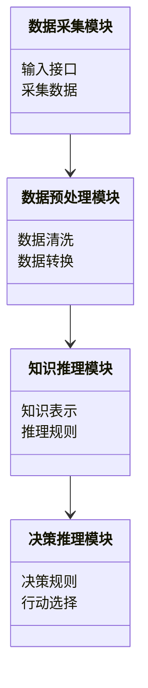
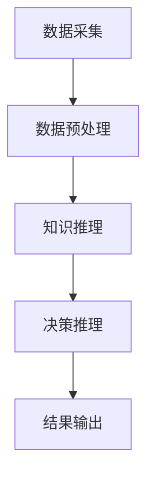
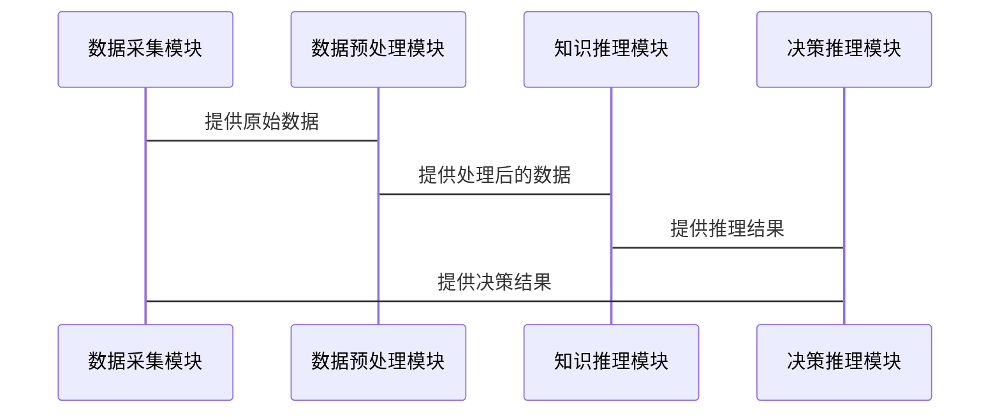

                 


# 开发具有跨模态知识推理与决策能力的AI Agent

> 关键词：跨模态数据处理、知识推理、决策能力、AI Agent、深度学习

> 摘要：本文详细探讨了开发具有跨模态知识推理与决策能力的AI Agent的关键技术。从背景介绍到核心概念，从算法原理到系统架构设计，再到项目实战和最佳实践，全面解析了如何构建具备跨模态数据处理、知识推理和决策能力的智能系统。

---

# 第一部分: 背景介绍

# 第1章: 跨模态知识推理与决策AI Agent的背景介绍

## 1.1 问题背景
### 1.1.1 人工智能发展的现状
人工智能（AI）技术近年来取得了显著进展，尤其是在自然语言处理、计算机视觉和机器人学等领域。然而，现有的AI系统大多局限于单一模态的数据处理，难以有效整合来自不同模态（如文本、图像、语音等）的信息，这限制了其在复杂现实场景中的应用能力。

### 1.1.2 跨模态数据处理的挑战
跨模态数据处理的核心挑战在于不同模态数据的异构性和复杂性。例如，文本数据具有语义丰富性，而图像数据则具有空间结构特性。如何将这些异构数据有效地融合起来，是跨模态推理的关键难题。

### 1.1.3 决策能力在AI Agent中的重要性
AI Agent需要具备在复杂环境中自主决策的能力。传统的基于单一模态的决策系统难以应对现实世界中的多样化和不确定性，因此，开发能够整合多模态信息的决策系统显得尤为重要。

## 1.2 问题描述
### 1.2.1 跨模态数据的特点
跨模态数据指的是来自不同感知渠道的数据，例如文本、图像、语音、视频等。这些数据具有不同的特征和结构，但往往共同描述同一个实体或事件。

### 1.2.2 知识推理的核心问题
知识推理是指通过已有知识和规则，推导出新的结论或关系。在跨模态场景中，知识推理需要结合多模态数据中的信息，以提高推理的准确性和全面性。

### 1.2.3 决策能力的实现难点
决策能力的实现需要综合考虑当前状态、目标和可能的行动后果。在跨模态场景中，决策系统需要处理多种模态的信息，并根据这些信息做出最优选择。

## 1.3 问题解决
### 1.3.1 跨模态数据融合的方法
跨模态数据融合可以通过多种方式实现，例如基于特征的融合、基于语义的融合和基于注意力机制的融合等。

### 1.3.2 知识推理的算法选择
选择适合的推理算法是实现跨模态知识推理的关键。常见的推理算法包括基于规则的推理、基于符号逻辑的推理和基于深度学习的推理等。

### 1.3.3 决策能力的实现策略
决策能力的实现需要结合多模态数据和推理结果，通过优化算法（如强化学习）来实现最优决策。

## 1.4 边界与外延
### 1.4.1 跨模态数据的边界
跨模态数据的边界包括数据的格式、规模和来源等。不同的模态数据具有不同的特点和限制。

### 1.4.2 知识推理的适用范围
知识推理适用于需要基于已有知识进行推导的场景，但其效果受到数据质量和推理算法的限制。

### 1.4.3 决策能力的限制
决策能力的实现受到数据质量和环境复杂性的限制，且需要考虑计算资源和实时性要求。

## 1.5 概念结构与核心要素
### 1.5.1 跨模态数据的组成
跨模态数据由多个模态的数据组成，例如文本、图像、语音等。这些数据需要通过融合和处理，才能共同用于推理和决策。

### 1.5.2 知识推理的逻辑结构
知识推理的逻辑结构包括知识表示、推理规则和推理引擎。知识表示可以采用图结构或符号逻辑等形式，推理规则定义了推理的规则和方法，推理引擎负责执行推理过程。

### 1.5.3 决策能力的实现流程
决策能力的实现流程包括状态感知、目标设定、行动选择和效果评估。这些步骤需要结合多模态数据和推理结果来完成。

---

# 第二部分: 核心概念与联系

# 第2章: 跨模态知识推理与决策的核心概念

## 2.1 跨模态数据处理
### 2.1.1 跨模态数据的定义
跨模态数据是指来自不同感知渠道的数据，例如文本、图像、语音等。这些数据通常描述同一个实体或事件，但具有不同的特征和结构。

### 2.1.2 跨模态数据的类型
跨模态数据的类型包括文本、图像、语音、视频等。每种模态数据都有其独特的特点和处理方法。

### 2.1.3 跨模态数据的处理方法
跨模态数据的处理方法包括特征提取、语义对齐和多模态融合等。特征提取是从单模态数据中提取有用的特征，语义对齐是将不同模态的数据对齐到相同的语义空间，多模态融合是将多个模态的数据融合到一起。

## 2.2 知识推理
### 2.2.1 知识推理的定义
知识推理是指通过已有知识和规则，推导出新的结论或关系。知识推理的核心在于如何有效地利用知识和规则进行推理。

### 2.2.2 知识推理的算法
知识推理的算法包括基于规则的推理、基于符号逻辑的推理和基于深度学习的推理等。基于规则的推理适用于简单的推理场景，基于符号逻辑的推理适用于复杂的推理场景，基于深度学习的推理适用于大数据场景。

### 2.2.3 知识推理的挑战
知识推理的挑战包括知识表示的复杂性、推理规则的不确定性以及推理效率的限制等。

## 2.3 决策能力
### 2.3.1 决策能力的定义
决策能力是指AI Agent在给定状态下，根据目标和环境信息，选择最优行动的能力。

### 2.3.2 决策能力的实现方法
决策能力的实现方法包括基于规则的决策、基于模型的决策和基于强化学习的决策等。基于规则的决策适用于简单的决策场景，基于模型的决策适用于复杂的决策场景，基于强化学习的决策适用于动态环境中的决策场景。

### 2.3.3 决策能力的评估指标
决策能力的评估指标包括决策的准确率、决策的效率、决策的鲁棒性等。

## 2.4 跨模态知识推理与决策的关系
### 2.4.1 跨模态数据在知识推理中的作用
跨模态数据为知识推理提供了多维度的信息，可以提高推理的准确性和全面性。

### 2.4.2 决策能力对知识推理的依赖
决策能力依赖于知识推理的结果，知识推理为决策提供依据。

### 2.4.3 跨模态知识推理与决策的协同优化
跨模态知识推理与决策的协同优化可以通过联合优化算法来实现，例如多目标优化和分布式优化等。

---

# 第三部分: 算法原理讲解

# 第3章: 跨模态知识推理的算法原理

## 3.1 跨模态数据融合算法
### 3.1.1 多模态融合方法
多模态融合方法包括特征融合、语义融合和注意力融合等。特征融合是将不同模态的特征直接融合，语义融合是将不同模态的语义信息进行融合，注意力融合是通过注意力机制来动态调整不同模态的权重。

### 3.1.2 注意力机制在多模态融合中的应用
注意力机制可以用于多模态数据的特征提取和语义对齐。例如，在文本和图像的融合中，可以通过注意力机制来捕捉文本和图像之间的相关性。

### 3.1.3 多模态融合的数学模型
多模态融合的数学模型可以用以下公式表示：
$$
f(x) = \sigma(W_x x + b)
$$
其中，\(x\) 是输入特征，\(W_x\) 是权重矩阵，\(b\) 是偏置项，\(\sigma\) 是激活函数。

## 3.2 知识推理算法
### 3.2.1 基于符号逻辑的推理算法
基于符号逻辑的推理算法通过符号化表示和逻辑推理规则来进行推理。例如，基于一阶逻辑的推理算法可以用于知识图谱的推理。

### 3.2.2 基于深度学习的推理算法
基于深度学习的推理算法通过神经网络来学习推理规则和模式。例如，基于图神经网络的推理算法可以用于知识图谱的推理和实体识别。

### 3.2.3 基于强化学习的推理算法
基于强化学习的推理算法通过强化学习来优化推理过程和结果。例如，基于强化学习的推理算法可以用于动态知识图谱的推理。

## 3.3 决策算法
### 3.3.1 基于Q-learning的决策算法
Q-learning是一种常用的强化学习算法，适用于离散动作空间的决策问题。其核心思想是通过Q值函数来学习状态-动作价值。

### 3.3.2 基于策略梯度的决策算法
策略梯度是一种强化学习算法，适用于连续动作空间的决策问题。其核心思想是通过优化策略函数来最大化期望奖励。

### 3.3.3 基于值函数的决策算法
值函数是一种强化学习算法，通过学习状态值函数或动作值函数来优化决策策略。

---

# 第四部分: 系统架构设计

# 第4章: 跨模态知识推理与决策系统的架构设计

## 4.1 问题场景介绍
### 4.1.1 系统目标
系统的目标是开发一个能够处理多模态数据、具备知识推理和决策能力的AI Agent。

### 4.1.2 系统功能需求
系统的功能需求包括数据采集、数据预处理、知识推理、决策推理和结果输出等。

## 4.2 系统功能设计
### 4.2.1 领域模型设计
领域模型可以用类图表示，展示系统的主要功能模块及其关系。



### 4.2.2 系统架构设计
系统架构可以用分层架构表示，展示系统的各个层次及其关系。



### 4.2.3 接口设计
系统的接口设计包括数据输入接口、模型训练接口和结果输出接口等。

### 4.2.4 交互设计
系统的交互设计可以通过序列图表示，展示系统各模块之间的交互过程。



---

# 第五部分: 项目实战

# 第5章: 跨模态知识推理与决策系统的项目实战

## 5.1 环境安装
### 5.1.1 安装必要的库
安装必要的库，例如TensorFlow、Keras、Python等。

### 5.1.2 配置开发环境
配置开发环境，例如安装Jupyter Notebook、PyCharm等。

## 5.2 核心代码实现
### 5.2.1 数据预处理代码
数据预处理代码示例如下：

```python
import numpy as np

def preprocess_data(data):
    # 数据清洗
    data = data.dropna()
    # 数据转换
    data = data.astype(float)
    return data
```

### 5.2.2 知识推理代码
知识推理代码示例如下：

```python
from tensorflow.keras import layers

def knowledge_reasoning_model():
    input = layers.Input(shape=(input_dim,))
    dense = layers.Dense(64, activation='relu')(input)
    output = layers.Dense(1, activation='sigmoid')(dense)
    model = Model(inputs=input, outputs=output)
    return model
```

### 5.2.3 决策推理代码
决策推理代码示例如下：

```python
from tensorflow.keras import agents

def decision_reasoning_model():
    input = layers.Input(shape=(input_dim,))
    agent = agents.ActorCriticAgent(input_shape=input_dim)
    return agent
```

## 5.3 代码解读与分析
### 5.3.1 数据预处理代码解读
数据预处理代码首先进行数据清洗，去除缺失值，然后将数据转换为浮点数类型。

### 5.3.2 知识推理代码解读
知识推理代码定义了一个简单的深度学习模型，包括输入层、隐藏层和输出层。

### 5.3.3 决策推理代码解读
决策推理代码定义了一个基于Actor-Critic架构的强化学习模型，用于进行决策推理。

## 5.4 实际案例分析
### 5.4.1 案例介绍
案例介绍一个跨模态知识推理与决策系统的实际应用，例如智能客服系统。

### 5.4.2 案例实现
案例实现包括数据采集、数据预处理、知识推理和决策推理等步骤。

### 5.4.3 案例分析
案例分析包括系统性能评估、系统优缺点分析和改进建议。

## 5.5 项目总结
### 5.5.1 项目成果
项目成果包括开发了一个具备跨模态知识推理与决策能力的AI Agent。

### 5.5.2 项目经验
项目经验包括跨模态数据处理的挑战、知识推理算法的选择和决策推理模型的优化。

---

# 第六部分: 最佳实践与小结

# 第6章: 跨模态知识推理与决策系统的最佳实践

## 6.1 最佳实践
### 6.1.1 数据质量的重要性
数据质量对跨模态知识推理与决策系统的性能有重要影响，需要重视数据的清洗和预处理。

### 6.1.2 模型调参的技巧
模型调参是提高系统性能的重要手段，可以通过网格搜索和随机搜索等方法进行优化。

### 6.1.3 系统优化的建议
系统优化建议包括算法优化、数据优化和计算资源优化等。

## 6.2 小结
### 6.2.1 跨模态知识推理与决策的核心技术
跨模态知识推理与决策的核心技术包括跨模态数据融合、知识推理算法和决策推理算法等。

### 6.2.2 系统开发的关键点
系统开发的关键点包括数据处理、模型选择和系统优化等。

## 6.3 注意事项
### 6.3.1 数据隐私问题
跨模态数据处理需要考虑数据隐私问题，确保数据的安全性和合规性。

### 6.3.2 算法的可解释性
算法的可解释性是跨模态知识推理与决策系统的重要特性，需要在设计和实现过程中加以考虑。

### 6.3.3 系统的可扩展性
系统的可扩展性是跨模态知识推理与决策系统的重要特性，需要在设计和实现过程中加以考虑。

## 6.4 拓展阅读
### 6.4.1 相关书籍
推荐的相关书籍包括《深度学习》、《强化学习》和《跨模态数据处理》等。

### 6.4.2 相关论文
推荐的相关论文包括《Multi-modal machine learning》、《Knowledge reasoning in AI》和《Decision making in intelligent systems》等。

---

# 作者：AI天才研究院/AI Genius Institute & 禅与计算机程序设计艺术 /Zen And The Art of Computer Programming

---

**注：以上是一个详细的目录大纲，具体内容需要根据实际需求进行补充和扩展。**

