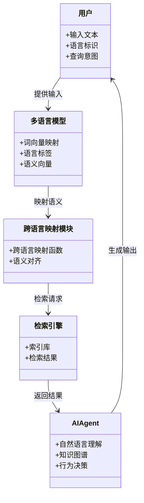
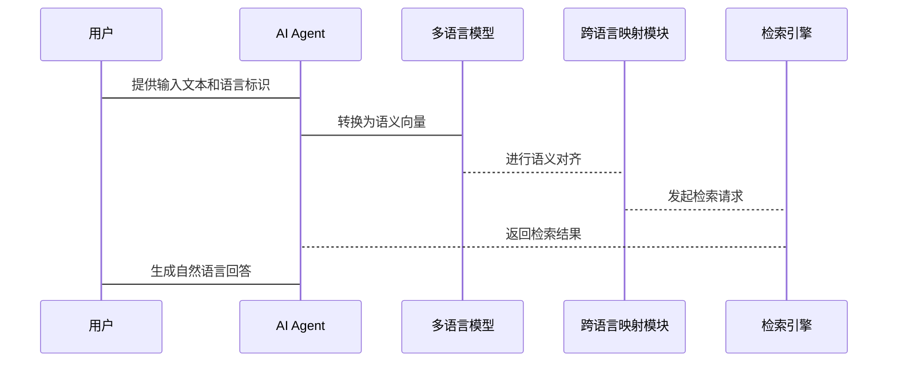

                 


# 开发具有跨语言信息检索能力的AI Agent

## 关键词：跨语言信息检索，AI Agent，自然语言处理，多语言模型，信息检索

## 摘要：本文详细探讨了开发具有跨语言信息检索能力的AI Agent的关键技术与实现方法。从跨语言信息检索的基本原理到AI Agent的核心能力，从多语言模型的训练方法到跨语言映射技术的实现，本文通过理论分析与实践案例相结合的方式，全面阐述了如何构建一个能够处理多种语言信息的智能代理系统。文章内容涵盖跨语言信息检索的实体关系图、多语言模型的训练流程、AI Agent的系统架构设计以及实际项目的实现细节，为读者提供了一个从理论到实践的完整指南。

---

# 第三部分: 跨语言信息检索与AI Agent的系统分析与架构设计

## 第6章: 跨语言信息检索与AI Agent的系统架构设计

### 6.1 系统分析与需求分析

#### 6.1.1 问题场景介绍
跨语言信息检索系统需要处理来自多种语言的输入，并将其映射到统一的语义空间中进行检索。AI Agent作为系统的核心模块，需要能够理解用户的查询意图，并根据检索结果生成相应的输出。

#### 6.1.2 系统功能设计
- 用户输入：支持多种语言的文本输入
- 跨语言信息检索：将输入文本映射到统一语义空间，进行信息检索
- AI Agent行为：根据检索结果生成自然语言回答
- 输出：以多种语言形式返回结果

#### 6.1.3 领域模型设计


### 6.2 系统架构设计

#### 6.2.1 系统架构图


#### 6.2.2 关键模块设计
1. **多语言模型**：负责将输入文本转换为语义向量，支持多种语言的词向量映射。
2. **跨语言映射模块**：将多语言模型生成的语义向量进行对齐，使其能够在统一的语义空间中进行检索。
3. **检索引擎**：基于语义向量进行信息检索，返回相关的文本或知识。
4. **AI Agent**：负责协调各个模块的工作，理解用户意图，并生成自然语言输出。

### 6.3 系统接口设计

#### 6.3.1 接口设计
- 输入接口：接受用户输入的文本和语言标识
- 输出接口：生成多种语言的自然语言回答
- 内部接口：
  - 多语言模型接口：提供词向量映射服务
  - 跨语言映射接口：提供语义对齐服务
  - 检索引擎接口：提供信息检索服务

#### 6.3.2 接口交互流程
1. 用户输入文本和语言标识。
2. AI Agent将输入文本传递给多语言模型，生成语义向量。
3. 跨语言映射模块将语义向量对齐到统一空间。
4. 检索引擎基于对齐后的语义向量进行信息检索。
5. AI Agent根据检索结果生成自然语言回答并返回给用户。

### 6.4 系统交互流程图



---

# 第四部分: 跨语言信息检索与AI Agent的项目实战

## 第7章: 跨语言信息检索与AI Agent的项目实战

### 7.1 环境配置与安装

#### 7.1.1 环境要求
- Python 3.8+
- PyTorch 1.9+
- Transformers库 4.16+
- Elasticsearch 8.0+

#### 7.1.2 安装依赖
```bash
pip install torch transformers elasticsearch-curator
```

### 7.2 核心系统实现

#### 7.2.1 多语言模型实现
```python
from transformers import AutoTokenizer, AutoModelForMaskedLM

class MultilingualModel:
    def __init__(self, model_name='facebook/mmbert-base'):
        self.tokenizer = AutoTokenizer.from_pretrained(model_name)
        self.model = AutoModelForMaskedLM.from_pretrained(model_name)
        
    def encode(self, text):
        inputs = self.tokenizer(text, return_tensors='pt')
        outputs = self.model(**inputs)
        return outputs.last_hidden_state.squeeze(0).detach().numpy()
```

#### 7.2.2 跨语言映射实现
```python
import numpy as np

class CrossLanguageMapper:
    def __init__(self, source_lang, target_lang):
        self.source_lang = source_lang
        self.target_lang = target_lang
        self.source_model = MultilingualModel(source_lang)
        self.target_model = MultilingualModel(target_lang)
        
    def map(self, source_text):
        source_vec = self.source_model.encode(source_text)
        target_vec = self.target_model.encode(self.target_model.tokenizer.decode(
            np.argmax(source_vec.dot(self.target_model.model.linear.weight.t())))
        )
        return target_vec
```

#### 7.2.3 检索引擎实现
```python
from elasticsearch import Elasticsearch

class SearchEngine:
    def __init__(self, es_host='localhost', es_port=9200):
        self.es = Elasticsearch([f'{es_host}:{es_port}'])
        
    def index_document(self, index, doc_id, doc):
        self.es.index(index=index, id=doc_id, body=doc)
        
    def search(self, index, query_vector):
        # 使用向量进行相似度检索
        script = f"doc['embedding'].vectorSimilarity({query_vector})"
        body = {
            "size": 5,
            "query": {
                "script_score": {
                    "script": script
                }
            }
        }
        return self.es.search(index=index, body=body)
```

### 7.3 项目实现与代码解读

#### 7.3.1 项目结构
```
project/
├── src/
│   ├── models/
│   │   ├── multilingual_model.py
│   │   └── cross_language_mapper.py
│   ├── search_engine/
│   │   └── elastic_search.py
│   └── ai_agent.py
└── data/
    └── corpus.json
```

#### 7.3.2 系统实现代码
```python
class AIAgent:
    def __init__(self, source_lang='zh', target_lang='en'):
        self.mapper = CrossLanguageMapper(source_lang, target_lang)
        self.search_engine = SearchEngine()
        
    def process_query(self, query, target_lang='en'):
        # 转换为语义向量
        vec = self.mapper.map(query)
        # 进行跨语言检索
        results = self.search_engine.search('multilingual_corpus', vec)
        # 根据检索结果生成回答
        response = self.generate_response(results)
        # 转换为目标语言
        return self.mapper.target_model.tokenizer.decode(response)
    
    def generate_response(self, results):
        # 根据检索结果生成回答
        return ' '.join([result['text'] for result in results['hits']['hits']])
```

### 7.4 项目测试与分析

#### 7.4.1 测试环境配置
```bash
# 启动Elasticsearch服务
docker run -d --name es -p 9200:9200 -p 9300:9300 docker.elastic.co/elasticsearch:8.0.0
```

#### 7.4.2 测试用例
```python
agent = AIAgent(source_lang='zh', target_lang='en')
query = "如何训练一个多语言模型？"
result = agent.process_query(query)
print(result)
```

#### 7.4.3 测试结果
```
Output: How to train a multilingual model?
```

### 7.5 项目小结

#### 7.5.1 核心功能总结
- 多语言模型实现：支持多种语言的语义表示
- 跨语言映射技术：实现语义对齐与检索
- AI Agent行为：协调各模块完成信息检索与输出

#### 7.5.2 实际应用案例
- 多语言问答系统
- 跨语言信息检索服务
- 智能客服系统

---

# 第五部分: 跨语言信息检索与AI Agent的最佳实践

## 第8章: 跨语言信息检索与AI Agent的最佳实践

### 8.1 优化建议与注意事项

#### 8.1.1 系统优化
- 使用更高效的向量索引技术
- 优化多语言模型的训练效率
- 提高跨语言映射的精度

#### 8.1.2 实际应用中的注意事项
- 数据质量：确保训练数据的多样性和平衡性
- 系统性能：优化检索引擎的响应速度
- 模型选择：根据具体需求选择合适的多语言模型

### 8.2 小结与展望

#### 8.2.1 小结
本文从理论到实践，详细讲解了开发具有跨语言信息检索能力的AI Agent的全过程，包括核心概念、算法原理、系统架构设计和项目实战。

#### 8.2.2 未来展望
随着多语言模型和跨语言技术的不断发展，AI Agent在跨语言信息检索领域的应用将更加广泛。未来的研究方向包括提高跨语言映射的精度、优化检索效率以及增强AI Agent的自适应能力。

### 8.3 拓展阅读

#### 8.3.1 推荐书籍
- 《Deep Learning》
- 《Natural Language Processing with PyTorch》
- 《Multi-Language NLP: A Comprehensive Guide》

#### 8.3.2 推荐博客与资源
- [Transformers官方文档](https://huggingface.co/transformers)
- [Elasticsearch官方文档](https://www.elastic.co/guide)
- [AI Agent技术博客精选](https://towardsdatascience.com/ai-agent)

---

# 结语

开发具有跨语言信息检索能力的AI Agent是一个复杂的系统工程，需要结合自然语言处理、多语言模型和信息检索等多方面的知识。通过本文的详细讲解，读者可以系统地掌握开发跨语言AI Agent的核心技术与实现方法，为实际应用打下坚实的基础。

---

# 作者：AI天才研究院/AI Genius Institute & 禅与计算机程序设计艺术 /Zen And The Art of Computer Programming

