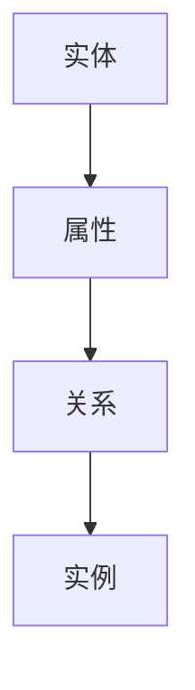
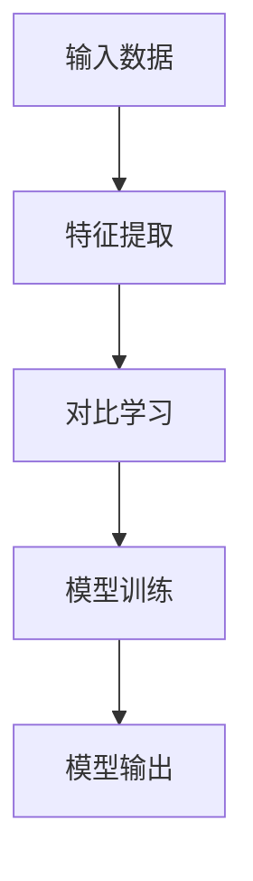
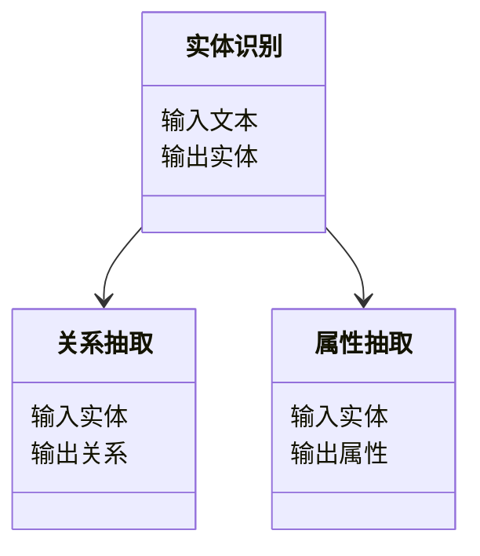
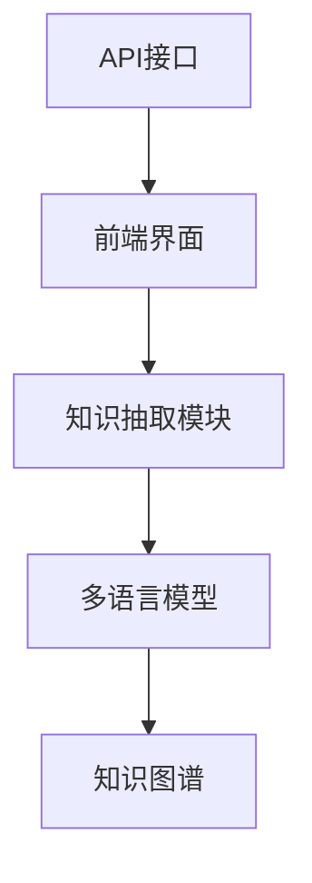
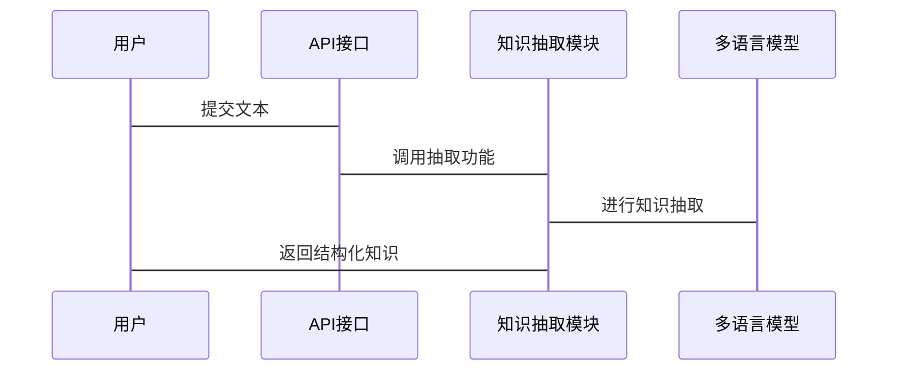

                 


# 开发具有跨语言知识抽取能力的AI Agent

> 关键词：跨语言知识抽取、AI Agent、自然语言处理、对比学习、多语言模型

> 摘要：本文将详细探讨开发具有跨语言知识抽取能力的AI Agent所需的关键技术与实现方法。从背景介绍到核心算法，从系统架构设计到项目实战，全面解析如何构建能够理解并处理多种语言信息的智能代理系统。文章将结合对比学习、跨语言迁移等技术，深入分析实现跨语言知识抽取的数学模型与算法原理，并通过实际案例展示如何将理论应用于实践。

---

# 第一部分: 背景介绍与核心概念

# 第1章: 背景介绍

## 1.1 跨语言知识抽取的背景与意义
### 1.1.1 知识抽取的定义与核心概念
知识抽取是指从文本中提取出结构化知识的过程，通常包括实体识别、关系抽取和属性抽取等任务。跨语言知识抽取则是在多种语言环境下完成这些任务，要求AI Agent能够理解并处理不同语言的文本信息。

### 1.1.2 背景与需求
随着全球化的发展，跨语言交流的需求日益增长。AI Agent需要在多语言环境下工作，能够处理中文、英文、法语等多种语言的文本信息，为用户提供跨语言的知识服务。

### 1.1.3 跨语言知识抽取的核心目标
跨语言知识抽取的核心目标是通过技术手段，将多种语言的文本信息转化为结构化的知识表示，使得AI Agent能够理解并利用这些知识进行推理和决策。

## 1.2 跨语言知识抽取的技术挑战
### 1.2.1 多语言模型的构建与优化
不同语言的语法结构和语义差异给跨语言知识抽取带来了挑战。如何构建能够同时处理多种语言的模型，是技术的核心难点。

### 1.2.2 跨语言迁移学习
通过对比学习和迁移学习技术，将一种语言的知识迁移到另一种语言，是实现跨语言知识抽取的重要手段。

### 1.2.3 知识表示的统一性与可扩展性
如何将不同语言的知识统一表示，并具备良好的可扩展性，是跨语言知识抽取的关键问题。

## 1.3 跨语言知识抽取的解决思路
### 1.3.1 对比学习与跨语言迁移
通过对比学习，将不同语言的文本映射到相同的语义空间，从而实现跨语言知识的抽取。

### 1.3.2 多语言模型的设计与优化
设计能够同时处理多种语言的模型架构，并通过数据增强、模型初始化等技术优化模型性能。

### 1.3.3 知识图谱的构建与应用
构建跨语言的知识图谱，并利用知识图谱进行推理和决策，是跨语言知识抽取的重要应用方向。

## 1.4 本章小结
本章从背景与需求出发，分析了跨语言知识抽取的核心目标与技术挑战，并提出了对比学习与多语言模型相结合的解决思路。

---

# 第2章: 跨语言知识抽取的核心概念

## 2.1 跨语言知识抽取的核心原理
### 2.1.1 多语言模型的基本原理
多语言模型通过共享不同语言的语义信息，实现对多种语言的共同理解和处理。

### 2.1.2 知识抽取的关键技术
知识抽取的关键技术包括实体识别、关系抽取和属性抽取，这些技术在跨语言环境下需要进行特定的优化。

### 2.1.3 跨语言环境下的适应性调整
在跨语言环境下，模型需要进行适应性调整，以应对不同语言的语法和语义差异。

## 2.2 跨语言模型的特征对比
### 2.2.1 不同语言模型的特征分析
通过表格对比不同语言模型的特征，包括支持的语言数量、模型结构、训练数据等。

| 模型名称 | 支持语言 | 模型结构 | 训练数据 |
|----------|-----------|----------|----------|
| XLM      | 多语言     | Transformer | 多语言文本数据 |
| M-BERT    | 多语言     | BERT架构 | 多语言文本数据 |
| mBERT     | 多语言     | BERT架构 | 多语言文本数据 |

### 2.2.2 跨语言抽取的性能对比
通过对比实验，分析不同模型在跨语言抽取任务中的性能表现。

### 2.2.3 模型的可扩展性与适应性
分析模型在不同语言环境下的可扩展性和适应性，为实际应用提供参考。

## 2.3 跨语言知识抽取的ER实体关系图


## 2.4 本章小结
本章通过对比分析，阐述了跨语言知识抽取的核心原理与模型特征，并通过ER图展示了跨语言知识抽取的实体关系结构。

---

# 第3章: 跨语言知识抽取的算法原理

## 3.1 对比学习与跨语言迁移
### 3.1.1 对比学习的基本原理
对比学习是一种通过比较不同样本之间的相似性来学习特征表示的方法。

### 3.1.2 跨语言迁移的核心思想
通过对比学习，将不同语言的文本映射到相同的语义空间，实现跨语言知识的迁移。

### 3.1.3 对比学习在跨语言抽取中的应用
通过对比学习，优化多语言模型的语义表示，提升跨语言知识抽取的准确率。

## 3.2 跨语言模型的训练流程
### 3.2.1 对比学习的损失函数
$$ L = \frac{1}{N}\sum_{i=1}^{N} \text{loss}(x_i, y_i) $$

### 3.2.2 多语言模型的训练策略
通过数据增强、模型初始化等策略，优化多语言模型的训练过程。

### 3.2.3 跨语言迁移的实现步骤


## 3.3 知识抽取的数学模型
### 3.3.1 对比学习的数学表达
$$ \text{loss}(x_i, y_i) = \text{contrastive}(x_i, y_i) $$

### 3.3.2 跨语言模型的参数共享
$$ \theta_{\text{shared}} = \theta_{\text{en}} + \theta_{\text{zh}} $$

## 3.4 本章小结
本章通过对比学习与跨语言迁移的原理分析，详细阐述了跨语言知识抽取的算法实现。

---

# 第4章: 系统分析与架构设计

## 4.1 问题场景介绍
### 4.1.1 系统需求
系统需要支持多种语言的知识抽取，能够处理中文、英文等语言的文本信息。

### 4.1.2 功能需求
系统需要具备实体识别、关系抽取和属性抽取功能，并能够将抽取的知识表示为结构化的数据。

## 4.2 系统功能设计
### 4.2.1 领域模型设计


### 4.2.2 系统架构设计


### 4.2.3 系统接口设计
系统接口包括文本输入接口、知识抽取接口和知识查询接口。

## 4.3 系统交互设计
### 4.3.1 用户与系统交互流程


## 4.4 本章小结
本章通过系统分析与架构设计，明确了跨语言知识抽取系统的实现路径。

---

# 第5章: 项目实战与案例分析

## 5.1 环境安装与配置
### 5.1.1 环境需求
需要安装Python、TensorFlow、Transformers等依赖库。

### 5.1.2 安装步骤
```bash
pip install python>=3.8
pip install tensorflow==2.5
pip install transformers==4.12
```

## 5.2 核心代码实现
### 5.2.1 多语言模型的加载与初始化
```python
from transformers import AutoTokenizer, AutoModelForMaskedLM
tokenizer = AutoTokenizer.from_pretrained('bert-base-multilingual')
model = AutoModelForMaskedLM.from_pretrained('bert-base-multilingual')
```

### 5.2.2 对比学习的实现
```python
def contrastive_loss(x, y):
    similarity = (x * y).sum(dim=1)
    loss = (1 - similarity).mean()
    return loss
```

### 5.2.3 知识抽取的实现
```python
def extract_entities(text):
    inputs = tokenizer.encode_plus(text, return_tensors='pt')
    outputs = model(**inputs)
    # 提取实体
    entities = []
    for i in range(len(outputs)):
        for j in range(len(outputs[i])):
            if outputs[i][j] > 0.5:
                entities.append((i, j))
    return entities
```

## 5.3 案例分析与效果展示
### 5.3.1 中英文实体抽取案例
#### 输入文本：
英文：The capital of France is Paris.
中文：法国的首都是巴黎。

#### 输出结果：
英文实体：[('France', 'capital'), ('Paris', 'city')]
中文实体：[('法国', '国家'), ('巴黎', '首都')]

### 5.3.2 跨语言关系抽取案例
#### 输入文本：
英文：Water boils at 100 degrees Celsius.
中文：水在100摄氏度时沸腾。

#### 输出结果：
关系：温度 → 沸点

## 5.4 本章小结
本章通过项目实战，展示了跨语言知识抽取的具体实现过程，并通过案例分析验证了系统的有效性。

---

# 第6章: 最佳实践与注意事项

## 6.1 开发中的注意事项
### 6.1.1 数据预处理
确保多语言数据的均衡与质量，避免模型偏向某一种语言。

### 6.1.2 模型优化
通过超参数调整和模型压缩技术，优化模型的性能与推理速度。

### 6.1.3 知识图谱的构建
确保知识图谱的统一性和可扩展性，为后续推理提供支持。

## 6.2 跨语言知识抽取的局限性
### 6.2.1 跨语言迁移的局限性
不同语言的语义差异可能导致知识抽取的准确性下降。

### 6.2.2 知识图谱的复杂性
跨语言知识图谱的构建与维护需要投入大量资源。

## 6.3 未来发展方向
### 6.3.1 更强的跨语言迁移能力
通过更先进的对比学习和迁移学习技术，提升跨语言知识抽取的性能。

### 6.3.2 更智能的知识表示
研究更高效的知识表示方法，提升知识图谱的推理能力。

## 6.4 本章小结
本章总结了开发跨语言知识抽取AI Agent的最佳实践，并展望了未来的发展方向。

---

# 结语

开发具有跨语言知识抽取能力的AI Agent是一项具有挑战性的任务，但其应用前景广阔。通过对比学习、多语言模型和知识图谱等技术的结合，我们可以构建出能够理解并处理多种语言信息的智能代理系统。未来，随着技术的不断进步，跨语言知识抽取的能力将更加智能化和高效化。

---

作者：AI天才研究院/AI Genius Institute & 禅与计算机程序设计艺术 /Zen And The Art of Computer Programming

