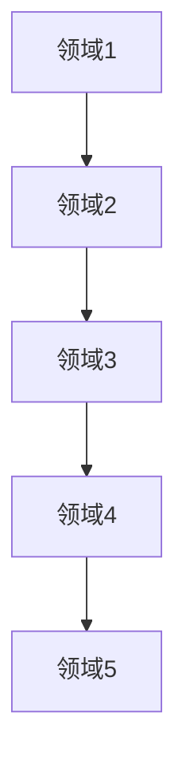
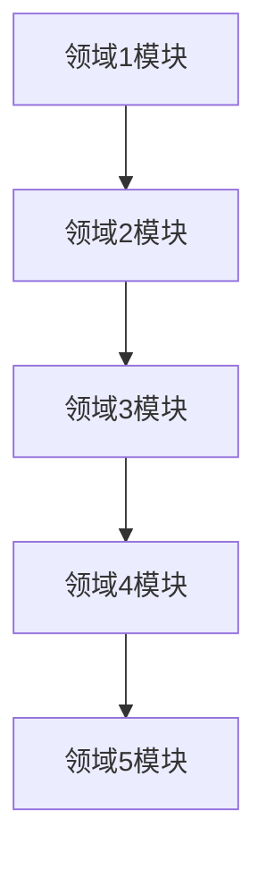

                 


# 开发具有跨领域推理能力的AI Agent

## 关键词：AI Agent、跨领域推理、知识表示、逻辑推理、多领域系统

## 摘要：  
在人工智能领域，开发具有跨领域推理能力的AI Agent是实现真正智能系统的关键。本文将深入探讨跨领域推理的核心概念、算法原理、系统架构设计以及实际项目实现，帮助读者全面理解如何构建具备跨领域推理能力的AI Agent。

---

# 第1章: 背景介绍:跨领域推理能力的AI Agent

## 1.1 问题背景

### 1.1.1 当前AI Agent的发展现状  
AI Agent（智能体）作为人工智能的核心技术之一，近年来取得了显著进展。然而，现有的AI Agent大多局限于特定领域，难以在多个领域之间进行有效的知识迁移和推理。

### 1.1.2 跨领域推理能力的重要性  
跨领域推理能力是实现通用人工智能（AGI）的重要基石。具备这种能力的AI Agent能够理解并整合不同领域的知识，从而在复杂问题中做出更全面的决策。

### 1.1.3 问题解决的必要性  
当前AI Agent在跨领域推理中存在的主要问题包括知识表示的多样性、逻辑推理的复杂性以及多领域协同的难度。解决这些问题将显著提升AI Agent的智能水平。

## 1.2 问题描述

### 1.2.1 跨领域推理能力的定义  
跨领域推理能力是指AI Agent能够理解、整合和推理来自不同领域的知识，从而在复杂环境中做出合理决策的能力。

### 1.2.2 跨领域推理能力的核心要素  
跨领域推理能力的核心要素包括知识表示、逻辑推理、领域协同和自适应学习。

### 1.2.3 跨领域推理能力的边界与外延  
跨领域推理能力的边界在于不同领域的知识整合，外延则涉及多领域知识的协同应用。

## 1.3 问题解决

### 1.3.1 跨领域推理能力的实现方法  
通过知识图谱和符号逻辑等技术，结合深度学习模型，实现跨领域知识的整合与推理。

### 1.3.2 跨领域推理能力的应用场景  
跨领域推理能力适用于医疗、金融、教育等多个领域，能够提升AI Agent的决策能力和问题解决效率。

### 1.3.3 跨领域推理能力的挑战与解决方案  
主要挑战包括知识表示的多样性、推理逻辑的复杂性等。解决方案包括构建统一的知识表示框架和优化推理算法。

## 1.4 本章小结  
本章介绍了跨领域推理能力的定义、核心要素、边界与外延，并探讨了其实现方法和应用场景。下一章将深入探讨跨领域推理能力的核心概念与联系。

---

# 第2章: 跨领域推理能力的核心概念与联系

## 2.1 跨领域推理能力的核心概念

### 2.1.1 跨领域推理能力的定义  
跨领域推理能力是指AI Agent能够理解、整合和推理来自不同领域的知识，从而在复杂环境中做出合理决策的能力。

### 2.1.2 跨领域推理能力的特征  
跨领域推理能力的特征包括知识整合性、逻辑推理性和领域适应性。

### 2.1.3 跨领域推理能力的属性对比表格  

| 属性         | 描述                                   |
|--------------|--------------------------------------|
| 知识整合性   | 能够整合多个领域的知识                 |
| 逻辑推理性   | 具备跨领域的逻辑推理能力               |
| 领域适应性   | 能够快速适应不同领域的知识             |

### 2.1.4 跨领域推理能力的ER实体关系图  


## 2.2 跨领域推理能力的联系

### 2.2.1 跨领域推理能力与知识表示的联系  
跨领域推理能力依赖于知识表示技术，通过构建统一的知识表示框架，实现多领域知识的整合。

### 2.2.2 跨领域推理能力与逻辑推理的联系  
跨领域推理能力的核心是逻辑推理，通过不同领域的逻辑推理模型，实现知识的整合与推理。

### 2.2.3 跨领域推理能力与多领域协同的联系  
跨领域推理能力通过多领域的协同工作，实现复杂问题的解决。

---

# 第3章: 跨领域推理能力的算法原理

## 3.1 跨领域推理能力的算法原理

### 3.1.1 跨领域推理能力的定义  
跨领域推理能力是指AI Agent能够理解、整合和推理来自不同领域的知识，从而在复杂环境中做出合理决策的能力。

### 3.1.2 跨领域推理能力的特征  
跨领域推理能力的特征包括知识整合性、逻辑推理性和领域适应性。

### 3.1.3 跨领域推理能力的数学模型  
跨领域推理能力可以通过以下数学模型进行描述：

$$ P(y|x) = \prod_{i=1}^{n} P(y_i|x_i) $$

其中，$P(y_i|x_i)$ 表示在领域 $i$ 中，事件 $y_i$ 在条件 $x_i$ 下的概率。

### 3.1.4 跨领域推理能力的算法实现  
跨领域推理能力的算法实现可以通过以下步骤进行：

1. **知识整合**：将不同领域的知识整合到统一的知识表示框架中。
2. **逻辑推理**：基于整合的知识，进行跨领域的逻辑推理。
3. **结果优化**：通过优化算法，提升推理的准确性和效率。

---

# 第4章: 跨领域推理能力的系统分析与架构设计方案

## 4.1 系统分析

### 4.1.1 系统分析的方法  
跨领域推理能力的系统分析方法包括需求分析、功能分析和性能分析。

### 4.1.2 系统分析的步骤  
1. **需求分析**：明确系统的目标和需求。
2. **功能分析**：分析系统需要实现的功能。
3. **性能分析**：评估系统的性能指标。

### 4.1.3 系统分析的示例  
以医疗领域的跨领域推理为例，系统需要整合医疗知识库和患者数据，实现疾病的诊断和治疗建议。

## 4.2 系统架构设计

### 4.2.1 系统架构设计的定义  
系统架构设计是指在实现系统之前，对系统的整体结构和功能进行规划和设计。

### 4.2.2 系统架构设计的步骤  
1. **确定系统目标**：明确系统的目标和功能。
2. **模块划分**：将系统划分为不同的功能模块。
3. **模块交互设计**：设计模块之间的交互方式。

### 4.2.3 系统架构设计的示例  



## 4.3 系统接口设计

### 4.3.1 系统接口设计的定义  
系统接口设计是指设计系统与其他模块或外部系统之间的接口。

### 4.3.2 系统接口设计的步骤  
1. **确定接口类型**：明确系统需要哪些接口。
2. **设计接口协议**：设计接口的通信协议和数据格式。
3. **实现接口功能**：实现接口的具体功能。

## 4.4 系统交互设计

### 4.4.1 系统交互设计的定义  
系统交互设计是指设计系统与用户或其他模块之间的交互方式。

### 4.4.2 系统交互设计的步骤  
1. **确定交互目标**：明确交互的目标和需求。
2. **设计交互流程**：设计交互的流程和步骤。
3. **实现交互功能**：实现交互的具体功能。

---

# 第5章: 跨领域推理能力的项目实战

## 5.1 项目环境安装

### 5.1.1 环境安装的步骤  
1. **安装Python**：确保系统安装了Python 3.8或更高版本。
2. **安装依赖库**：安装所需的依赖库，如TensorFlow、PyTorch等。

### 5.1.2 环境安装的代码示例  
```python
# 安装Python依赖库
pip install numpy
pip install matplotlib
pip install scikit-learn
```

### 5.1.3 环境安装的注意事项  
确保安装的Python版本和依赖库版本兼容。

## 5.2 项目核心实现

### 5.2.1 系统分析与设计  
1. **需求分析**：明确项目的功能需求。
2. **系统设计**：设计系统的架构和模块。

### 5.2.2 知识整合与推理  
1. **知识整合**：将不同领域的知识整合到统一的知识表示框架中。
2. **逻辑推理**：基于整合的知识，进行跨领域的逻辑推理。

### 5.2.3 算法实现  
1. **算法选择**：选择适合的算法进行实现。
2. **算法优化**：优化算法的性能和效率。

---

# 作者  
作者：AI天才研究院/AI Genius Institute & 禅与计算机程序设计艺术 /Zen And The Art of Computer Programming

