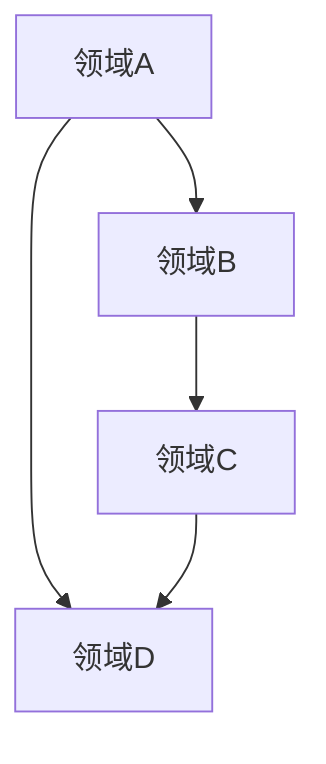
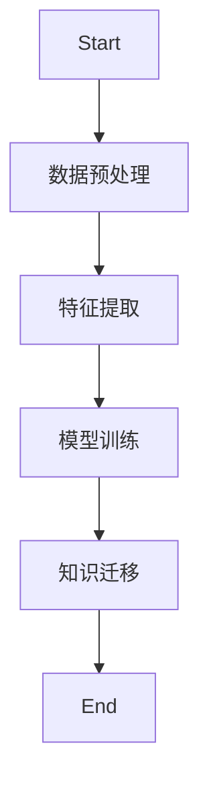

                 


# 开发具有跨领域知识迁移能力的AI Agent

## 关键词：AI Agent, 跨领域知识迁移, 知识图谱, 机器学习, 算法原理

## 摘要：  
本文将详细探讨如何开发具有跨领域知识迁移能力的AI Agent。通过分析AI Agent的基本概念、跨领域知识迁移的核心原理，结合实际应用场景，深入讲解相关算法和系统设计。文章还将通过具体案例展示如何实现跨领域知识迁移，并总结开发过程中需要注意的关键点和最佳实践。

---

# 第一部分: AI Agent与跨领域知识迁移概述

## 第1章: AI Agent的基本概念

### 1.1 AI Agent的定义与特点

AI Agent（人工智能代理）是指能够感知环境、自主决策并执行任务的智能实体。它具备以下特点：
1. **自主性**：能够在没有外部干预的情况下自主运行。
2. **反应性**：能够实时感知环境并做出反应。
3. **目标导向性**：以特定目标为导向，执行任务。
4. **学习能力**：能够通过数据和经验进行自我优化和改进。

### 1.2 跨领域知识迁移的必要性

跨领域知识迁移是指AI Agent能够将一个领域的知识和经验应用到另一个完全不同的领域。这种能力在实际应用中非常重要，尤其是在需要处理多领域问题的场景中。例如，在医疗领域，AI Agent需要能够理解医学知识并将其应用到患者诊断中；在金融领域，AI Agent需要能够理解财务数据并进行投资决策。

### 1.3 AI Agent在实际应用中的价值

AI Agent的跨领域知识迁移能力能够显著提升其在实际应用中的价值：
1. **提高效率**：通过跨领域知识迁移，AI Agent能够快速适应不同领域的需求，提高处理效率。
2. **降低成本**：减少对领域专家的依赖，降低人工成本。
3. **增强适应性**：能够在不同领域间灵活切换，适应多样化的需求。

---

## 第2章: 跨领域知识迁移的背景与应用

### 2.1 跨领域知识迁移的背景分析

随着AI技术的快速发展，跨领域知识迁移的需求日益增长。当前，许多AI系统仅能在单一领域内发挥作用，无法适应多领域的需求。因此，如何实现跨领域知识迁移成为AI研究的重要方向。

### 2.2 跨领域知识迁移的应用场景

跨领域知识迁移在多个领域都有广泛的应用，包括：
1. **医疗领域**：将医学知识应用于患者诊断和治疗方案制定。
2. **法律领域**：将法律知识应用于案件分析和法律文书生成。
3. **金融领域**：将财务知识应用于投资决策和风险管理。

### 2.3 跨领域知识迁移的实际案例

#### 2.3.1 医疗领域的知识迁移案例

在医疗领域，AI Agent可以通过跨领域知识迁移，将医学知识应用于患者诊断。例如，AI Agent可以利用医学知识图谱，将患者症状与疾病相关联，从而帮助医生进行诊断。

#### 2.3.2 法律领域的知识迁移案例

在法律领域，AI Agent可以通过跨领域知识迁移，将法律知识应用于案件分析。例如，AI Agent可以利用法律知识图谱，将案件事实与相关法律条文相关联，从而帮助律师进行案件分析。

#### 2.3.3 金融领域的知识迁移案例

在金融领域，AI Agent可以通过跨领域知识迁移，将财务知识应用于投资决策。例如，AI Agent可以利用财务知识图谱，将公司财务数据与市场趋势相关联，从而帮助投资者进行投资决策。

---

## 第3章: 跨领域知识迁移的核心概念与联系

### 3.1 跨领域知识迁移的核心概念

跨领域知识迁移的核心概念包括：
1. **知识表示**：如何将知识表示为数据结构，以便AI Agent能够理解和应用。
2. **知识迁移**：如何将一个领域的知识迁移到另一个领域。
3. **知识图谱**：一种用于表示知识的图结构，包含实体和关系。

### 3.2 跨领域知识迁移的实体关系图

下图展示了跨领域知识迁移的实体关系图：



### 3.3 跨领域知识迁移的流程图

下图展示了跨领域知识迁移的流程图：



---

## 第4章: 跨领域知识迁移的算法原理

### 4.1 知识表示的数学模型

知识表示可以通过图结构来表示，例如知识图谱。知识图谱中的每个实体和关系都可以表示为图中的节点和边。数学上，知识图谱可以表示为一个三元组（头实体，关系，尾实体）。

### 4.2 知识迁移的数学模型

知识迁移的数学模型可以通过图嵌入技术来实现。图嵌入技术将图中的节点嵌入到低维空间中，以便进行相似性计算。常用的图嵌入技术包括Word2Vec和GraphSAGE。

### 4.3 知识图谱的构建与应用

知识图谱的构建可以通过以下步骤实现：
1. **数据收集**：收集各个领域的数据，包括文本、图像等。
2. **实体识别**：识别数据中的实体。
3. **关系抽取**：抽取实体之间的关系。
4. **图构建**：将实体和关系构建为图结构。
5. **图嵌入**：将图中的节点嵌入到低维空间中。

知识图谱的应用可以通过以下步骤实现：
1. **查询处理**：根据用户的查询，从知识图谱中找到相关实体和关系。
2. **推理与推理**：基于知识图谱进行推理，得出结论。
3. **结果返回**：将推理结果返回给用户。

---

## 第5章: 跨领域知识迁移的系统设计

### 5.1 系统功能设计

跨领域知识迁移的系统功能设计包括：
1. **数据预处理模块**：对数据进行清洗和转换。
2. **特征提取模块**：从数据中提取特征。
3. **模型训练模块**：训练知识迁移模型。
4. **知识迁移模块**：将知识迁移到目标领域。

### 5.2 系统架构设计

下图展示了跨领域知识迁移的系统架构图：


### 5.3 系统接口设计

跨领域知识迁移的系统接口设计包括：
1. **输入接口**：接收输入数据。
2. **输出接口**：返回处理结果。
3. **模型接口**：与知识迁移模型进行交互。

### 5.4 系统交互设计

下图展示了跨领域知识迁移的系统交互图：


---

## 第6章: 跨领域知识迁移的项目实战

### 6.1 环境安装

开发跨领域知识迁移的项目需要以下环境：
1. **Python 3.6以上版本**
2. **TensorFlow或PyTorch框架**
3. **Numpy库**
4. **Scikit-learn库**
5. **网络爬虫工具**

### 6.2 核心代码实现

以下是跨领域知识迁移的核心代码实现：

```python
import numpy as np
from sklearn.manifold import TSNE
from sklearn.decomposition import PCA

# 数据预处理
def preprocess_data(data):
    # 数据清洗
    cleaned_data = data.dropna()
    # 特征提取
    features = cleaned_data.drop('label', axis=1)
    labels = cleaned_data['label']
    return features, labels

# 模型训练
def train_model(features, labels):
    # PCA降维
    pca = PCA(n_components=2)
    reduced_features = pca.fit_transform(features)
    # TSNE嵌入
    tsne = TSNE(n_components=2)
    embedded_features = tsne.fit_transform(reduced_features)
    return embedded_features, labels

# 知识迁移
def knowledge_transfer(embedded_features, labels):
    # 聚类分析
    from sklearn.cluster import KMeans
    kmeans = KMeans(n_clusters=3)
    cluster_labels = kmeans.fit_predict(embedded_features)
    return cluster_labels

# 主程序
def main():
    # 数据加载
    data = pd.read_csv('input.csv')
    features, labels = preprocess_data(data)
    embedded_features, labels = train_model(features, labels)
    cluster_labels = knowledge_transfer(embedded_features, labels)
    print(cluster_labels)

if __name__ == '__main__':
    main()
```

### 6.3 案例分析与详细讲解

通过上述代码，我们可以实现跨领域知识迁移。数据预处理模块对输入数据进行清洗和特征提取，模型训练模块使用PCA和TSNE对特征进行降维和嵌入，知识迁移模块使用KMeans进行聚类分析，实现知识的迁移。

---

## 第7章: 跨领域知识迁移的总结与展望

### 7.1 最佳实践 tips

1. **数据预处理**：确保数据的质量和一致性。
2. **特征提取**：选择合适的特征提取方法。
3. **模型选择**：根据实际需求选择合适的模型。
4. **结果验证**：通过实验验证模型的性能。

### 7.2 小结

跨领域知识迁移是AI Agent开发中的重要部分，能够显著提升AI Agent的智能性和实用性。通过本文的讲解，读者可以了解跨领域知识迁移的核心概念、算法原理和系统设计，并能够通过实际案例实现跨领域知识迁移。

### 7.3 注意事项

1. **数据隐私**：注意保护数据隐私，避免数据泄露。
2. **模型泛化能力**：确保模型具备良好的泛化能力。
3. **算法优化**：不断优化算法，提升性能。

### 7.4 拓展阅读

1. **知识图谱**：深入学习知识图谱的构建与应用。
2. **迁移学习**：研究迁移学习的最新进展。
3. **图嵌入技术**：探索图嵌入技术的更多应用场景。

---

## 作者信息

作者：AI天才研究院/AI Genius Institute & 禅与计算机程序设计艺术 /Zen And The Art of Computer Programming

---

以上是《开发具有跨领域知识迁移能力的AI Agent》的完整目录和内容概览。通过本文，读者可以系统地了解跨领域知识迁移的核心概念、算法原理和系统设计，并能够通过实际案例实现跨领域知识迁移。

