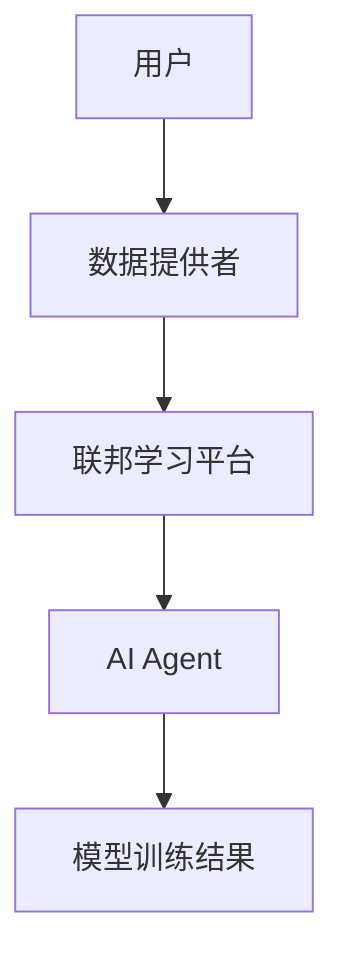
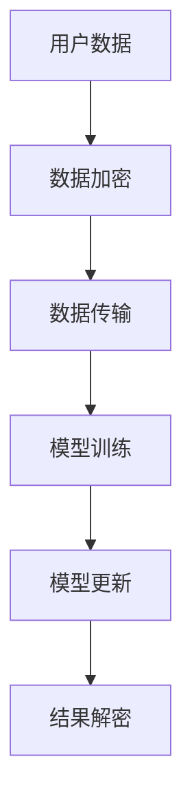
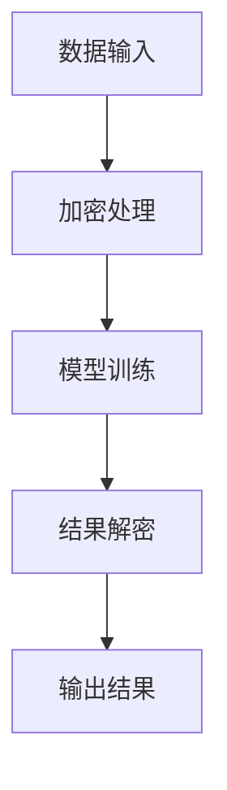
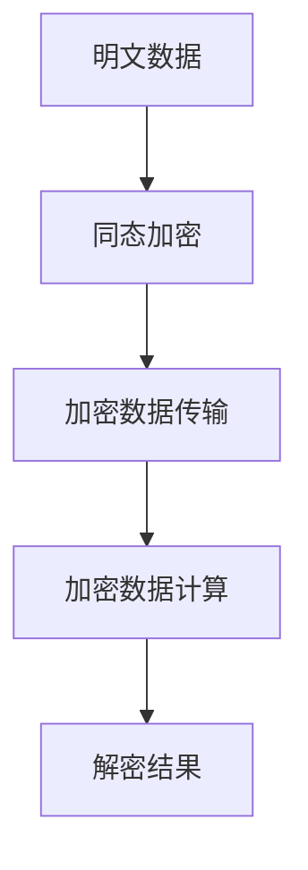
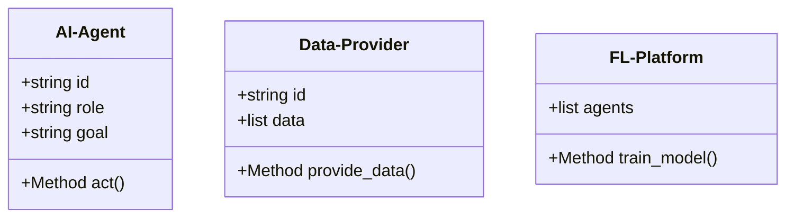
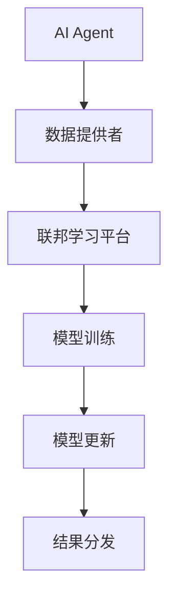
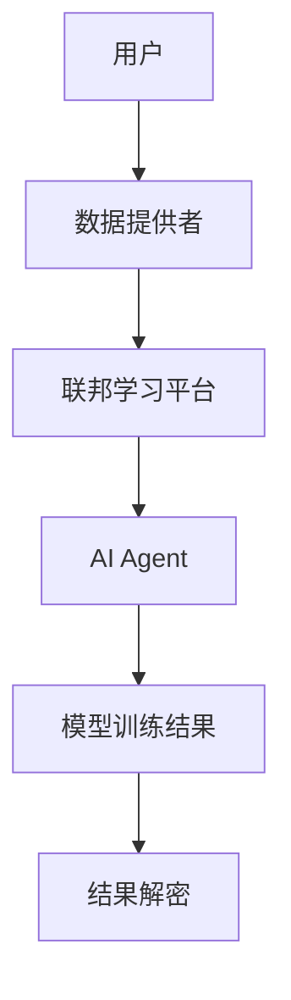

                 


# 开发具有隐私保护联邦学习能力的AI Agent

---

## 关键词：  
隐私保护、联邦学习、AI Agent、数据安全、同态加密、差分隐私、系统架构  

---

## 摘要：  
随着人工智能技术的快速发展，AI Agent 在各个领域的应用越来越广泛。然而，数据隐私和安全问题也随之而来。联邦学习作为一种分布式机器学习技术，能够在保护数据隐私的前提下进行模型训练，成为当前的研究热点。本文将详细探讨如何开发具有隐私保护能力的联邦学习AI Agent，涵盖其核心概念、算法原理、系统架构设计以及实际项目实现。通过本文的分析，读者可以全面理解隐私保护联邦学习的技术细节，并掌握其实现方法。

---

## 第1章: 背景介绍  

### 1.1 AI Agent的基本概念  
AI Agent（人工智能代理）是一种能够感知环境、自主决策并执行任务的智能实体。它具备以下核心特点：  
1. **自主性**：能够在没有外部干预的情况下独立运行。  
2. **反应性**：能够根据环境变化实时调整行为。  
3. **目标导向**：通过实现特定目标来完成任务。  

AI Agent 的应用场景非常广泛，例如自动驾驶、智能客服、推荐系统等。  

### 1.2 隐私保护的重要性  
在AI Agent 的开发中，数据隐私保护至关重要。以下是一些关键点：  
1. **数据泄露风险**：AI Agent 需要处理大量敏感数据，若不加以保护，可能导致数据泄露。  
2. **用户信任**：隐私保护是用户信任的基础，若隐私得不到保障，用户可能拒绝使用相关服务。  
3. **法律法规**：许多国家和地区都出台了严格的隐私保护法规，如GDPR（通用数据保护条例）。  

### 1.3 联邦学习的概念与优势  
联邦学习（Federated Learning）是一种分布式机器学习技术，允许多个参与方在不共享原始数据的情况下共同训练模型。其主要优势包括：  
1. **数据隐私保护**：数据无需离开本地，减少了数据泄露的风险。  
2. **数据多样性**：联邦学习能够利用分布式数据源进行模型训练，提高模型的泛化能力。  
3. **去中心化**：避免了单一数据集中带来的潜在风险。  

---

## 第2章: 隐私保护联邦学习的核心概念与联系  

### 2.1 隐私保护联邦学习的原理  
隐私保护联邦学习通过以下机制实现数据隐私保护：  
1. **数据加密**：使用加密技术对数据进行处理，确保数据在传输和存储过程中的安全性。  
2. **模型更新**：通过安全多方计算或同态加密等技术，在不泄露原始数据的情况下更新模型参数。  

### 2.2 核心概念对比分析  
以下是隐私保护与联邦学习的对比分析：  

| **对比维度** | **隐私保护** | **联邦学习** |  
|--------------|--------------|--------------|  
| **核心目标** | 防止数据泄露 | 分布式模型训练 |  
| **实现方式** | 数据加密、访问控制 | 数据共享、模型更新 |  
| **应用场景** | 保护敏感数据 | 跨机构合作、分布式数据源 |  

### 2.3 实体关系图与流程图  

#### 2.3.1 ER实体关系图  


#### 2.3.2 隐私保护联邦学习流程图  


---

## 第3章: 隐私保护联邦学习的算法原理  

### 3.1 算法原理概述  
隐私保护联邦学习主要依赖以下几种算法：  

#### 3.1.1 安多方计算（SMC）  
安多方计算是一种允许多个参与方在不泄露各自数据的情况下共同计算结果的技术。其核心思想是通过加密协议将数据转化为加密形式，然后在加密状态下进行计算。  

#### 3.1.2 同态加密（HE）  
同态加密是一种允许在加密数据上进行计算的技术，结果解密后与直接在明文上计算结果相同。其数学基础是环同态加密（Ring-Homomorphic Encryption）。  

#### 3.1.3 差分隐私（DP）  
差分隐私通过在数据中添加噪声，使得单个数据点的改变不会对整体统计结果产生显著影响，从而保护个体隐私。  

### 3.2 算法流程图  

#### 3.2.1 安多方计算流程图  


#### 3.2.2 同态加密流程图  


### 3.3 算法实现代码示例  

#### 3.3.1 同态加密实现  
以下是一个简单的同态加密实现示例：  
```python
def encrypt(data):
    # 使用同态加密算法对数据进行加密
    encrypted_data = data + noise
    return encrypted_data

def decrypt(encrypted_data):
    # 对加密数据进行解密
    original_data = encrypted_data - noise
    return original_data
```

#### 3.3.2 差分隐私实现  
以下是一个差分隐私的实现示例：  
```python
def add_noise(data):
    # 添加噪声以保护隐私
    noise = np.random.laplace(0, 1)
    noisy_data = data + noise
    return noisy_data
```

### 3.4 数学公式与模型  

#### 3.4.1 同态加密的数学模型  
$$
\text{加密函数}：E(m) = m + r \mod p \\
\text{解密函数}：D(c) = c \mod p
$$  
其中，\( m \) 是明文，\( r \) 是随机噪声，\( p \) 是模数。  

#### 3.4.2 差分隐私的数学模型  
$$
\text{差分隐私概率}：P(D(c) = y | m = x, m = x') \geq e^{-\epsilon}
$$  
其中，\( \epsilon \) 是隐私预算参数。  

---

## 第4章: 系统架构设计  

### 4.1 问题场景介绍  
在开发隐私保护联邦学习AI Agent时，需要考虑以下问题：  
1. **数据隐私保护**：如何确保数据在传输和存储过程中的安全性？  
2. **模型更新效率**：如何在保护隐私的前提下提高模型训练效率？  
3. **系统可扩展性**：如何设计一个能够支持大规模数据的系统架构？  

### 4.2 系统功能设计  

#### 4.2.1 领域模型（类图）  


#### 4.2.2 系统架构图  


### 4.3 系统接口设计  

#### 4.3.1 数据接口  
```python
interface DataProvider:
    def provide_data():  # 提供加密数据
        pass
```

#### 4.3.2 模型接口  
```python
interface ModelTrainer:
    def train_model(data):  # 在加密数据上训练模型
        pass
```

### 4.4 系统交互流程图  



---

## 第5章: 项目实战  

### 5.1 环境搭建  

#### 5.1.1 开发环境  
1. Python 3.8+  
2. 加密库（如Paillier）  
3. 深度学习框架（如TensorFlow）  

### 5.2 核心实现  

#### 5.2.1 数据加密与解密  
```python
from paillier import PaillierPublicKey, PaillierPrivateKey

# 初始化公钥和私钥
public_key = PaillierPublicKey(n)
private_key = PaillierPrivateKey(p, q, public_key)

# 加密数据
encrypted_data = public_key.encrypt(data)

# 解密数据
decrypted_data = private_key.decrypt(encrypted_data)
```

#### 5.2.2 模型训练  
```python
def model_train(encrypted_data):
    # 使用加密数据训练模型
    model = tf.keras.Sequential([
        tf.keras.layers.Dense(64, activation='relu'),
        tf.keras.layers.Dense(10, activation='softmax')
    ])
    model.compile(optimizer='adam', loss='sparse_categorical_crossentropy', metrics=['accuracy'])
    model.fit(encrypted_data, epochs=10, batch_size=32)
    return model
```

### 5.3 案例分析  

#### 5.3.1 应用场景  
假设我们开发一个医疗AI Agent，用于分析患者的医疗数据，同时保护患者隐私。  

#### 5.3.2 实施步骤  
1. 数据提供者收集患者数据并进行加密。  
2. 联邦学习平台接收加密数据并进行模型训练。  
3. AI Agent 使用训练好的模型为患者提供诊断建议。  

---

## 第6章: 最佳实践与总结  

### 6.1 最佳实践 tips  
1. 在实际应用中，建议结合多种隐私保护技术（如同态加密和差分隐私）以提高安全性。  
2. 定期进行安全审计，确保系统架构和算法的安全性。  
3. 提供清晰的用户隐私政策，增强用户信任。  

### 6.2 小结  
通过本文的分析，我们可以看到，开发具有隐私保护能力的联邦学习AI Agent需要结合多种技术手段，包括数据加密、安多方计算和差分隐私等。只有在确保数据安全的前提下，才能实现高效、可靠的AI Agent开发。  

### 6.3 注意事项  
1. 在实际开发中，需注意加密算法的性能优化，避免影响模型训练效率。  
2. 系统架构设计时，应充分考虑可扩展性和可维护性。  
3. 定期更新隐私保护策略，以应对新的安全威胁。  

### 6.4 拓展阅读  
1. 《Privacy-Preserving Machine Learning with Federated Learning》  
2. 《Homomorphic Encryption: Theory and Practice》  

---

## 作者：AI天才研究院/AI Genius Institute & 禅与计算机程序设计艺术 /Zen And The Art of Computer Programming  

---

以上是关于《开发具有隐私保护联邦学习能力的AI Agent》的技术博客文章的完整目录和内容框架。

