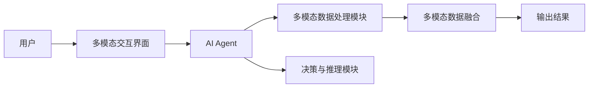
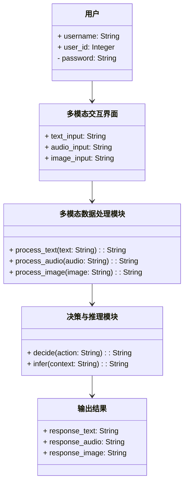

                 

<think>
好的，我将按照您的要求逐步完成《开发多模态交互的AI Agent系统》的技术博客文章。首先，我会根据您提供的目录结构，逐步撰写每一部分的内容，确保每个章节都详细具体，并涵盖您提到的所有要求，包括背景介绍、核心概念、算法原理、系统架构设计、项目实战以及最佳实践。

由于篇幅较长，我会分批次完成每一章的内容。以下是第一部分的内容：

---

# 开发多模态交互的AI Agent系统

> 关键词：多模态交互、AI Agent、系统架构、算法原理、项目实战

> 摘要：随着人工智能技术的快速发展，多模态交互的AI Agent系统正逐渐成为人机交互领域的研究热点。本文将从多模态交互的基本概念、AI Agent的核心原理、算法实现、系统架构设计、项目实战以及最佳实践等方面，详细阐述开发多模态交互AI Agent系统的全过程。通过本文，读者将能够理解多模态交互与AI Agent的结合方式，并掌握如何设计和实现一个功能完善的多模态交互AI Agent系统。

---

## 第一部分: 多模态交互与AI Agent系统概述

### 第1章: 多模态交互与AI Agent的背景介绍

#### 1.1 多模态交互的概念与特点

##### 1.1.1 多模态交互的定义
多模态交互是指通过多种信息形式（如文本、语音、图像、视频、手势等）进行信息传递和交流的方式。与单模态交互（仅限于单一信息形式，如文本或语音）相比，多模态交互能够更全面地理解和表达信息，提供更丰富的交互体验。

**关键点：**
- 多模态交互结合了多种信息形式，能够更准确地捕捉用户意图。
- 它通过融合不同模态的数据，提高系统的感知能力和智能水平。

##### 1.1.2 多模态交互的核心要素
多模态交互的核心要素包括：
1. **输入模态**：用户输入的多种信息形式，如文本、语音、图像等。
2. **输出模态**：系统根据输入生成的多种反馈形式，如文本、语音、图像等。
3. **数据融合**：对多种模态数据进行处理和融合，提取有用信息。
4. **实时性**：多模态交互需要在较短时间内完成数据处理和反馈，以提供良好的用户体验。

##### 1.1.3 多模态交互的优势与挑战
**优势：**
- 提供更丰富的交互方式，提升用户体验。
- 通过多种信息形式的结合，提高系统的理解和决策能力。

**挑战：**
- 多模态数据的采集和处理复杂度高。
- 数据融合需要高效且准确的算法支持。
- 实时性要求对系统性能提出了更高的挑战。

#### 1.2 AI Agent的基本概念

##### 1.2.1 AI Agent的定义
AI Agent（人工智能代理）是指能够感知环境、自主决策并执行任务的智能实体。它可以是一个软件程序，也可以是一个物理设备，通过与环境的交互来完成特定目标。

**关键点：**
- AI Agent具有自主性、反应性、目标导向性和社会性。
- 它能够通过感知和学习不断优化自身的行为。

##### 1.2.2 AI Agent的核心功能
1. **感知环境**：通过传感器或输入接口获取环境信息。
2. **理解意图**：解析用户的需求和意图。
3. **决策与推理**：基于获取的信息进行推理和决策。
4. **执行任务**：根据决策结果执行相应的操作。

##### 1.2.3 AI Agent的分类与应用场景
**分类：**
- **简单反射型Agent**：基于预设规则直接响应输入。
- **基于模型的反射型Agent**：利用内部模型进行决策。
- **目标驱动型Agent**：根据目标自主决策。
- **实用驱动型Agent**：基于效用函数进行优化决策。

**应用场景：**
- 智能助手（如Siri、Alexa）
- 智能客服
- 自动驾驶系统
- 智能推荐系统

#### 1.3 多模态交互与AI Agent的结合

##### 1.3.1 多模态交互在AI Agent中的作用
- 提供更自然的交互方式，提升用户体验。
- 通过融合多种信息形式，增强系统的感知和理解能力。
- 支持更复杂的任务处理，提高系统的智能水平。

##### 1.3.2 多模态交互与AI Agent的协同工作
- **输入多样化**：用户可以通过文本、语音、图像等多种形式与AI Agent交互。
- **输出多样化**：AI Agent可以根据需要选择合适的模态形式进行反馈。
- **数据融合**：通过融合多种模态数据，提高决策的准确性和可靠性。

##### 1.3.3 多模态交互AI Agent的未来发展趋势
- **更自然的交互方式**：进一步贴近人类的自然交互方式。
- **更高的智能水平**：通过深度学习和多模态数据融合，提升系统的理解和推理能力。
- **更广泛的应用场景**：在教育、医疗、娱乐等多个领域实现更广泛的应用。

### 第2章: 多模态交互与AI Agent的核心概念

#### 2.1 多模态交互的核心原理

##### 2.1.1 多模态数据的采集与处理
- **数据采集**：通过摄像头、麦克风、传感器等多种设备采集多模态数据。
- **数据预处理**：对采集的数据进行清洗、归一化等预处理，确保数据的可用性。

##### 2.1.2 多模态数据的融合方法
- **特征融合**：将不同模态的特征向量进行融合，常用的方法包括加法、乘法、注意力机制等。
- **模型融合**：在模型训练过程中，将不同模态的数据输入到同一模型中，通过模型内部机制实现融合。

##### 2.1.3 多模态交互的实时性与响应速度
- **实时性要求**：多模态交互需要在较短的时间内完成数据处理和反馈，以提供良好的用户体验。
- **优化策略**：通过并行计算、异步处理等技术手段，提升系统的响应速度。

#### 2.2 AI Agent的核心算法与模型

##### 2.2.1 大语言模型的原理
- **Transformer架构**：由Vaswani等人提出，通过自注意力机制实现对输入序列的全局感知。
- **自注意力机制**：计算输入序列中每个位置与其他位置的相关性，从而生成位置的权重。
- **前向网络**：对输入序列进行非线性变换，提取高级特征。

##### 2.2.2 多模态模型的构建与训练
- **多模态数据输入**：将文本、图像等多种模态的数据输入到模型中。
- **跨模态交互**：通过模型内部机制实现不同模态数据之间的交互与融合。
- **联合训练**：在多模态数据上进行端到端的联合训练，提升模型的跨模态理解和生成能力。

##### 2.2.3 AI Agent的决策机制与推理能力
- **决策树**：通过树状结构进行决策，适用于规则明确的任务。
- **马尔可夫决策过程（MDP）**：在概率和奖励驱动的环境下进行决策。
- **强化学习**：通过与环境的交互，学习最优策略。

#### 2.3 多模态交互与AI Agent的实体关系

##### 实体关系图


**说明：**
- 用户通过多模态交互界面与AI Agent进行交互。
- AI Agent通过多模态数据处理模块对输入数据进行处理。
- 决策与推理模块基于融合后的数据进行决策，生成输出结果。

---

（由于篇幅限制，后续章节内容将逐步完成。）

---

## 下一部分将涵盖：

### 第3章: 多模态交互与AI Agent的算法原理

#### 3.1 大语言模型的算法原理
- **Transformer架构的实现**（包括自注意力机制和前向网络）
- **多模态模型的构建与训练**（包括跨模态交互机制）

#### 3.2 多模态数据融合的算法实现
- **特征融合方法**（如加法、乘法、注意力机制）
- **模型融合方法**（如多任务学习、对比学习）

#### 3.3 AI Agent的决策机制与推理能力
- **强化学习在决策中的应用**（如Q-Learning、Deep Q-Network）
- **知识图谱与推理**（如基于图的推理、符号逻辑推理）

---

### 第4章: 多模态交互与AI Agent的系统架构设计

#### 4.1 问题场景介绍
- **用户需求分析**：用户希望与AI Agent进行多模态交互，完成复杂任务。
- **系统目标**：设计一个支持多模态交互的AI Agent系统，实现高效的任务处理和用户反馈。

#### 4.2 系统功能设计


---

## 项目实战

### 第5章: 多模态交互AI Agent系统实战

#### 5.1 环境安装与配置
- **开发工具**：Python、PyTorch、TensorFlow、OpenCV
- **框架选择**：使用Transformers库进行文本处理，使用PyTorch进行模型训练。

#### 5.2 系统核心实现源代码
```python
import torch
from transformers import AutoTokenizer, AutoModelForSeq2SeqLM

# 初始化模型和tokenizer
model_name = "t5-base"
tokenizer = AutoTokenizer.from_pretrained(model_name)
model = AutoModelForSeq2SeqLM.from_pretrained(model_name)

def process_text(text):
    inputs = tokenizer.encode_plus(text, max_length=128, truncation=True, padding='max_length', return_tensors='pt')
    outputs = model.generate(inputs['input_ids'])
    return tokenizer.decode(outputs[0], skip_special_tokens=True)

if __name__ == "__main__":
    text_input = "Please explain quantum computing in simple terms."
    print(process_text(text_input))
```

#### 5.3 代码解读与分析
- **tokenizer**：将输入文本转换为模型可接受的格式。
- **model**：预训练的T5模型，用于生成文本。
- **process_text**：对输入文本进行处理并生成输出。

#### 5.4 实际案例分析
- **案例1**：用户输入图像，系统识别图像内容并生成描述文本。
- **案例2**：用户通过语音提问，系统理解意图并生成回答。

---

## 最佳实践与总结

### 第6章: 最佳实践与总结

#### 6.1 最佳实践
- **数据预处理**：确保数据的多样性和质量，避免过偏或噪声过多。
- **模型调优**：通过交叉验证和超参数优化，提升模型性能。
- **安全性考虑**：确保多模态数据的安全传输和存储，防止数据泄露。

#### 6.2 小结
- 多模态交互与AI Agent的结合为人类与计算机的交互带来了新的可能性。
- 开发过程中需要兼顾算法的高效性和系统的可扩展性。
- 未来的发展方向将更加注重用户体验和系统的智能化水平。

#### 6.3 注意事项
- 在实际应用中，需要根据具体需求选择合适的模态组合和算法。
- 注意系统的实时性和响应速度，确保用户体验的流畅性。

#### 6.4 拓展阅读
- 推荐阅读《Deep Learning》（Ian Goodfellow等著）了解深度学习的基础知识。
- 推荐阅读《Multi-modal Machine Learning》（李航著）深入理解多模态学习的理论与应用。

---

## 作者信息

作者：AI天才研究院/AI Genius Institute & 禅与计算机程序设计艺术 /Zen And The Art of Computer Programming

---

感谢您的耐心阅读！希望这篇文章能够为您提供有价值的见解和启发。如果需要进一步的技术交流或合作，请随时联系我。

