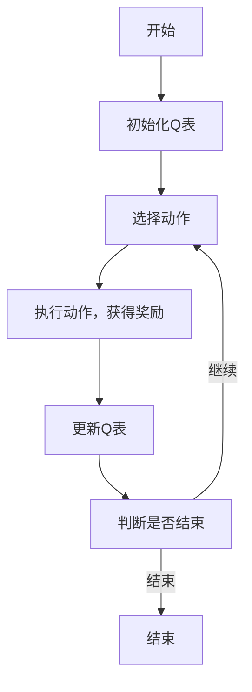
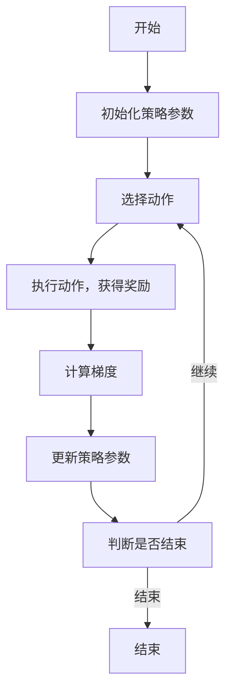
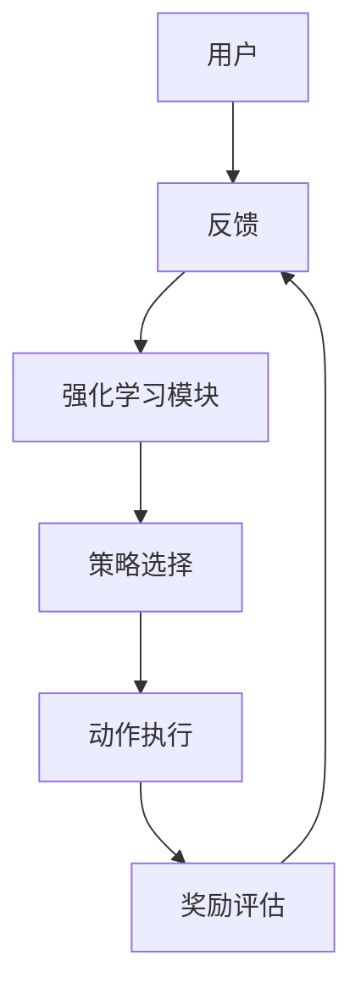
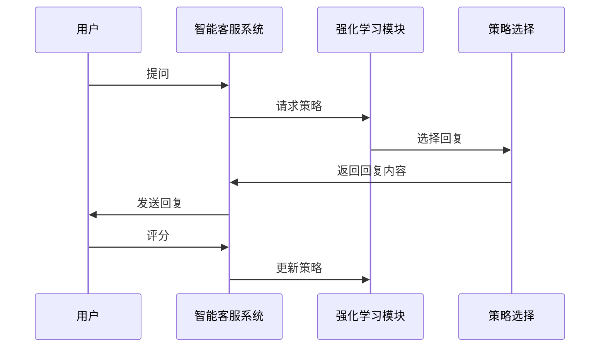

                 


# 强化学习在AI Agent决策中的应用

> 关键词：强化学习, AI Agent, 决策机制, Q-learning, 策略梯度, 算法实现, 实战案例

> 摘要：本文深入探讨了强化学习在AI Agent决策中的应用，从强化学习的基本概念、数学模型到具体算法实现，再到实际项目实战，全面分析了强化学习如何帮助AI Agent优化决策过程。文章通过实例分析、系统架构设计和代码实现，详细讲解了强化学习在AI Agent中的具体应用，为读者提供了从理论到实践的完整指南。

---

# 第一部分: 强化学习在AI Agent决策中的应用概述

## 第1章: 强化学习与AI Agent的基本概念

### 1.1 强化学习的定义与特点

#### 1.1.1 强化学习的定义
强化学习（Reinforcement Learning, RL）是一种机器学习范式，通过智能体（Agent）与环境交互，学习最优策略以最大化累积奖励。与监督学习和无监督学习不同，强化学习强调通过试错（trial-and-error）来优化决策。

#### 1.1.2 强化学习的核心特点
- **试错性**：通过与环境交互获得经验。
- **奖励驱动**：通过奖励信号指导学习方向。
- **策略优化**：目标是找到最优策略以最大化累积奖励。
- **动态性**：环境状态和奖励可能随时间变化。

#### 1.1.3 强化学习与监督学习、无监督学习的区别

| 学习范式 | 数据来源 | 目标 | 是否有监督 |
|----------|----------|------|----------|
| 监督学习 | 标签数据 | 预测 | 有监督 |
| 无监督学习 | 未标记数据 | 聚类/降维 | 无监督 |
| 强化学习 | 环境交互 | 最大化累积奖励 | 有奖励反馈 |

### 1.2 AI Agent的定义与分类

#### 1.2.1 AI Agent的基本定义
AI Agent是一种智能实体，能够感知环境并采取行动以实现目标。Agent可以是软件程序、机器人或其他智能系统。

#### 1.2.2 AI Agent的分类与应用场景

| 类型 | 描述 | 应用场景 |
|------|------|----------|
| 简单反射型Agent | 基于当前状态采取固定动作 | 自动门、简单游戏AI |
| 记忆型Agent | 具有记忆能力，能够利用历史信息 | 自然语言处理中的对话系统 |
| 学习型Agent | 能够通过学习优化决策 | 游戏AI、自动驾驶 |

#### 1.2.3 AI Agent的决策机制概述
AI Agent的决策过程通常包括以下几个步骤：

1. **感知环境**：通过传感器或数据输入获取环境信息。
2. **状态表示**：将环境信息转化为状态表示。
3. **策略选择**：根据当前状态选择最优动作。
4. **执行动作**：将选择的动作发送到环境。
5. **获得反馈**：通过奖励或惩罚信号评估决策的优劣。

### 1.3 强化学习在AI Agent中的作用

#### 1.3.1 强化学习在AI Agent决策中的核心地位
强化学习通过试错和奖励机制，帮助AI Agent学习最优策略，是实现自主决策的核心技术。

#### 1.3.2 强化学习如何帮助AI Agent优化决策
- 通过不断试错，AI Agent能够找到最优或近似最优的决策策略。
- 强化学习能够适应动态变化的环境，提高决策的灵活性和鲁棒性。

#### 1.3.3 强化学习在不同场景中的应用案例
- **游戏AI**：如AlphaGo、OpenAI的Dota AI。
- **自动驾驶**：通过强化学习优化驾驶策略。
- **智能客服**：通过强化学习优化对话流程。

### 1.4 本章小结
本章介绍了强化学习的基本概念、特点以及AI Agent的分类和决策机制。通过对比强化学习与其他学习范式，明确了强化学习在AI Agent中的核心地位，并通过实际案例展示了强化学习的应用场景。

---

## 第2章: 强化学习的核心概念与数学模型

### 2.1 强化学习的基本原理

#### 2.1.1 状态、动作、奖励的定义

- **状态（State）**：环境在某一时刻的描述，例如在迷宫中，当前位置是状态。
- **动作（Action）**：Agent在某一状态下采取的行为，例如“向右移动”。
- **奖励（Reward）**：Agent执行动作后获得的反馈，通常是一个标量值，表示该动作的好坏。

#### 2.1.2 策略与价值函数的定义

- **策略（Policy）**：策略是给定当前状态时，选择动作的概率分布。记作 $\pi(a|s)$，表示在状态$s$下选择动作$a$的概率。
- **价值函数（Value Function）**：衡量一个状态或状态-动作对的优劣。包括Q值（Q-value）和V值（V-value）。

#### 2.1.3 动作空间与状态空间的描述

- **动作空间（Action Space）**：所有可能的动作的集合。
- **状态空间（State Space）**：所有可能的状态的集合。

### 2.2 Q-learning算法的数学模型

#### 2.2.1 Q-learning的基本公式
$$ Q(s,a) = Q(s,a) + \alpha (r + \gamma \max Q(s',a') - Q(s,a)) $$
其中：
- $Q(s,a)$：当前状态$s$下采取动作$a$的Q值。
- $\alpha$：学习率，控制更新步长。
- $r$：获得的奖励。
- $\gamma$：折扣因子，平衡当前奖励和未来奖励的重要性。
- $\max Q(s',a')$：下一个状态$s'$下所有动作的最大Q值。

#### 2.2.2 Q-learning的收敛性分析
Q-learning算法在离散状态和动作空间下，可以收敛到最优Q值，前提是环境是马尔可夫决策过程（MDP），且策略是探索与利用的平衡。

#### 2.2.3 Q-learning的优缺点

| 优点 | 缺点 |
|------|------|
| 实现简单 | 需要离散状态和动作空间 |
| 不需要环境模型 | 收敛速度较慢 |
| 适合离线学习 | �易受探索难度影响 |

### 2.3 策略梯度方法的数学模型

#### 2.3.1 策略梯度的基本公式
$$ \nabla \theta J(\theta) = \mathbb{E}[ \nabla \log \pi(a|s) Q(s,a) ] $$
其中：
- $\theta$：策略参数。
- $J(\theta)$：策略的期望奖励。
- $\pi(a|s)$：策略在状态$s$下选择动作$a$的概率。
- $Q(s,a)$：状态-动作对的Q值。

#### 2.3.2 策略梯度的收敛性分析
策略梯度方法在连续动作空间下表现更好，但需要较高的计算资源，且可能面临梯度消失或爆炸的问题。

#### 2.3.3 策略梯度的优缺点

| 优点 | 缺点 |
|------|------|
| 适合连续动作空间 | 计算复杂度高 |
| 梯度信息利用充分 | 易受梯度不稳定影响 |

### 2.4 实例分析：强化学习在游戏AI中的应用

#### 2.4.1 游戏AI的基本问题
在游戏环境中，AI Agent需要通过不断试错，找到最优策略以最大化得分。

#### 2.4.2 强化学习在游戏AI中的具体应用
- 使用Q-learning算法训练AI在迷宫中找到最优路径。
- 使用策略梯度方法训练AI在复杂游戏中做出决策。

#### 2.4.3 游戏AI的强化学习算法实现
通过Python代码实现一个简单的Q-learning算法，训练AI在迷宫中找到出口。

### 2.5 本章小结
本章详细讲解了强化学习的核心概念和数学模型，包括Q-learning和策略梯度方法。通过实例分析，展示了强化学习在游戏AI中的具体应用，为后续章节的算法实现奠定了基础。

---

## 第3章: 强化学习的核心算法与实现

### 3.1 Q-learning算法的实现

#### 3.1.1 Q-learning算法的流程图


#### 3.1.2 Q-learning算法的Python实现
```python
import numpy as np

class QLearning:
    def __init__(self, state_space, action_space, alpha=0.1, gamma=0.9):
        self.state_space = state_space
        self.action_space = action_space
        self.alpha = alpha
        self.gamma = gamma
        self.q_table = np.zeros((state_space, action_space))

    def choose_action(self, state, epsilon=0.1):
        if np.random.random() < epsilon:
            return np.random.randint(self.action_space)
        else:
            return np.argmax(self.q_table[state])

    def update_q_table(self, state, action, reward, next_state):
        self.q_table[state, action] += self.alpha * (reward + self.gamma * np.max(self.q_table[next_state]) - self.q_table[state, action])
```

#### 3.1.3 Q-learning算法的优缺点
- 优点：实现简单，适合离散状态和动作空间。
- 缺点：收敛速度慢，易受探索难度影响。

### 3.2 策略梯度方法的实现

#### 3.2.1 策略梯度方法的流程图


#### 3.2.2 策略梯度方法的Python实现
```python
import numpy as np

class PolicyGradient:
    def __init__(self, state_space, action_space, alpha=0.01, gamma=0.9):
        self.state_space = state_space
        self.action_space = action_space
        self.alpha = alpha
        self.gamma = gamma
        self.theta = np.zeros((state_space, action_space))

    def policy(self, state):
        prob = np.exp(self.theta[state]) / np.sum(np.exp(self.theta[state]))
        action = np.random.choice(range(self.action_space), p=prob)
        return action, prob

    def update_policy(self, rewards, states):
        for i in reversed(range(len(rewards))):
            discounted_reward = rewards[i] * (self.gamma ** i)
            self.theta[states[i]] += self.alpha * discounted_reward
```

#### 3.2.3 策略梯度方法的优缺点
- 优点：适合连续动作空间，能够利用梯度信息。
- 缺点：计算复杂度高，易受梯度不稳定影响。

### 3.3 实例分析：强化学习在智能客服中的应用

#### 3.3.1 智能客服系统的基本问题
智能客服需要根据用户的问题选择最优的回复，以提高用户满意度。

#### 3.3.2 强化学习在智能客服中的具体应用
- 使用Q-learning算法训练智能客服在对话中选择最优回复。
- 使用策略梯度方法优化智能客服的回复策略。

#### 3.3.3 智能客服系统的强化学习算法实现
通过Python代码实现一个简单的Q-learning算法，训练智能客服在对话中选择最优回复。

### 3.4 本章小结
本章详细讲解了Q-learning和策略梯度方法的实现，通过实例分析展示了强化学习在智能客服中的具体应用。通过代码实现，帮助读者更好地理解算法的实现细节。

---

## 第4章: 强化学习的系统分析与架构设计

### 4.1 系统分析与需求定义

#### 4.1.1 问题场景介绍
以智能客服系统为例，描述系统的功能需求和性能需求。

#### 4.1.2 项目介绍
智能客服系统需要通过强化学习优化对话流程，提高用户满意度。

#### 4.1.3 系统功能设计
- 状态表示：用户情绪、问题类型。
- 动作选择：回复内容、回复方式。
- 奖励机制：用户满意度评分。

### 4.2 系统架构设计

#### 4.2.1 系统架构图


#### 4.2.2 系统交互图


### 4.3 系统接口设计

#### 4.3.1 输入接口
- 用户输入：用户的问题、情绪评分。
- 系统输出：智能客服的回复内容。

#### 4.3.2 输出接口
- 系统输出：智能客服的回复内容。
- 系统输入：用户评分、环境反馈。

### 4.4 系统实现细节

#### 4.4.1 状态表示
用户情绪可以通过词袋模型或情感分析模型进行表示。

#### 4.4.2 动作选择
根据当前状态选择回复内容，可以使用预训练的回复库。

#### 4.4.3 奖励机制
根据用户评分和系统反馈设计奖励函数。

### 4.5 本章小结
本章通过系统分析与架构设计，明确了强化学习在智能客服系统中的具体实现方式，为后续的项目实战奠定了基础。

---

## 第5章: 强化学习的项目实战

### 5.1 环境安装与配置

#### 5.1.1 安装Python环境
安装Python 3.8以上版本，并安装必要的库，如numpy、tensorflow、keras。

#### 5.1.2 安装强化学习框架
安装OpenAI Gym或其他强化学习框架。

#### 5.1.3 环境配置
配置虚拟环境，安装项目依赖。

### 5.2 系统核心实现

#### 5.2.1 强化学习算法实现
实现Q-learning或策略梯度方法的核心算法。

#### 5.2.2 系统功能实现
实现智能客服系统的对话流程优化。

#### 5.2.3 系统性能优化
优化算法参数，提高训练效率。

### 5.3 代码实现与解读

#### 5.3.1 强化学习算法代码
```python
class QLearning:
    def __init__(self, state_space, action_space, alpha=0.1, gamma=0.9):
        self.state_space = state_space
        self.action_space = action_space
        self.alpha = alpha
        self.gamma = gamma
        self.q_table = np.zeros((state_space, action_space))

    def choose_action(self, state, epsilon=0.1):
        if np.random.random() < epsilon:
            return np.random.randint(self.action_space)
        else:
            return np.argmax(self.q_table[state])

    def update_q_table(self, state, action, reward, next_state):
        self.q_table[state, action] += self.alpha * (reward + self.gamma * np.max(self.q_table[next_state]) - self.q_table[state, action])
```

#### 5.3.2 系统功能代码
```python
class ChatBot:
    def __init__(self, q_learning):
        self.q_learning = q_learning
        self.current_state = 0

    def receive_query(self, query):
        # 将查询转化为状态表示
        state = self.query_to_state(query)
        # 选择动作
        action = self.q_learning.choose_action(state)
        # 执行动作，获得回复
        response = self.action_to_response(action)
        return response

    def query_to_state(self, query):
        # 简单的状态表示方法，可以根据实际需求修改
        return hash(query) % self.q_learning.state_space

    def action_to_response(self, action):
        # 简单的回复生成方法，可以根据实际需求修改
        return f"回复{action}"
```

### 5.4 实际案例分析

#### 5.4.1 案例背景
智能客服系统需要通过强化学习优化对话流程，提高用户满意度。

#### 5.4.2 算法实现细节
在智能客服系统中，通过Q-learning算法训练AI在对话中选择最优回复。

#### 5.4.3 系统运行结果
展示训练过程中的奖励变化曲线，验证算法的有效性。

### 5.5 本章小结
本章通过项目实战，详细讲解了强化学习在智能客服系统中的具体实现，展示了从环境配置到算法实现的完整过程。

---

## 第6章: 强化学习的最佳实践与注意事项

### 6.1 强化学习的最佳实践

#### 6.1.1 算法选择
根据具体问题选择合适的强化学习算法，Q-learning适用于简单问题，策略梯度适用于复杂问题。

#### 6.1.2 状态表示
状态表示是强化学习成功的关键，需要设计合理的状态空间。

#### 6.1.3 奖励设计
奖励设计需要平衡短期目标和长期目标，避免单一目标的过度优化。

### 6.2 强化学习的注意事项

#### 6.2.1 探索与利用的平衡
在强化学习中，需要在探索新策略和利用已知最优策略之间找到平衡。

#### 6.2.2 环境的动态性
动态变化的环境需要使用适应性更强的算法，如Actor-Critic方法。

#### 6.2.3 训练时间与资源
强化学习通常需要大量计算资源和时间，需要合理优化算法和硬件配置。

### 6.3 小结
强化学习在AI Agent决策中的应用具有广阔前景，但需要在算法选择、状态表示和奖励设计等方面进行深入思考和优化。

---

## 作者：AI天才研究院/AI Genius Institute & 禅与计算机程序设计艺术 /Zen And The Art of Computer Programming

---

以上是《强化学习在AI Agent决策中的应用》的技术博客文章的详细目录结构和内容概要，涵盖了从理论到实践的各个方面，适合技术专家和AI开发者阅读。

