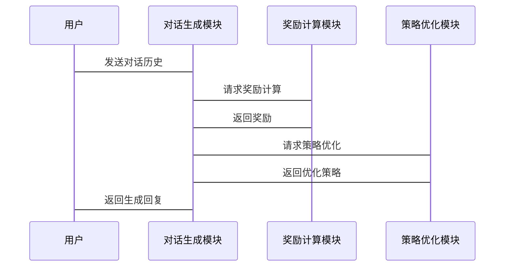

                 


# 强化学习在AI Agent对话生成中的应用

## 关键词：  
强化学习, AI Agent, 对话生成, 算法原理, 系统架构, 项目实战

## 摘要：  
本文探讨了强化学习在AI Agent对话生成中的应用，从强化学习的基础概念、算法原理到对话生成任务的具体建模方法，再到系统架构设计和项目实战，系统地分析了如何利用强化学习提升AI Agent的对话生成能力。文章结合理论与实践，详细阐述了强化学习在对话生成中的优势，并通过实际案例展示了如何实现高效的对话生成系统。

---

# 第一章 强化学习与对话生成基础

## 1.1 强化学习概述

### 1.1.1 强化学习的基本概念  
强化学习（Reinforcement Learning，RL）是一种机器学习范式，通过智能体（Agent）与环境的交互，逐步优化策略以最大化累积奖励。其核心是通过试错（trial-and-error）机制，学习最优行为策略。

- **核心概念**：  
  - **状态（State）**：智能体所处环境的描述。  
  - **动作（Action）**：智能体采取的行动。  
  - **奖励（Reward）**：智能体采取动作后获得的反馈，用于指导策略优化。  
  - **策略（Policy）**：智能体选择动作的规则，可以是确定性的（策略函数）或概率性的（策略网络）。  
  - **值函数（Value Function）**：衡量状态或动作-状态对的优劣程度。

### 1.1.2 马尔可夫决策过程  
马尔可夫决策过程（Markov Decision Process，MDP）是强化学习的基础模型，描述了智能体与环境的交互过程。MDP由以下五元组定义：  
$$ (S, A, P, R, \gamma) $$  
其中，  
- $S$：状态空间  
- $A$：动作空间  
- $P$：状态转移概率  
- $R$：奖励函数  
- $\gamma$：折扣因子，用于平衡当前奖励与未来奖励的重要性。

### 1.1.3 强化学习的三要素  
强化学习的核心是“探索”与“利用”之间的平衡：  
1. **探索（Exploration）**：尝试不同的动作以发现新的状态或奖励。  
2. **利用（Exploitation）**：基于当前知识选择最优动作以获得最大奖励。  
3. **奖励信号（Reward Signal）**：智能体行为的反馈，指导策略优化。

## 1.2 对话生成任务介绍

### 1.2.1 对话生成的定义与类型  
对话生成是自然语言处理（NLP）中的重要任务，旨在让AI Agent能够生成符合上下文的自然语言回复。其类型包括：  
- **开放域对话**：如闲聊、情感支持等，任务目标是生成连贯且自然的回复。  
- **封闭域对话**：如任务导向型对话（预订机票、天气查询等），任务目标是完成特定任务。  
- **多轮对话**：需要维护对话历史，生成连贯的回复。

### 1.2.2 任务挑战与目标  
对话生成的核心挑战包括：  
1. **上下文理解**：准确理解对话历史，生成符合语境的回复。  
2. **奖励建模**：定义合适的奖励机制以指导对话生成。  
3. **策略优化**：在探索与利用之间找到平衡，避免生成无意义的回复。  
4. **多样性与连贯性**：生成回复需要多样化（避免重复）且连贯（逻辑清晰）。  

### 1.2.3 强化学习的优势  
强化学习在对话生成中的优势：  
1. **端到端优化**：强化学习可以直接优化生成行为，无需依赖中间监督信号。  
2. **动态奖励建模**：可以根据对话场景动态调整奖励机制。  
3. **多轮对话能力**：强化学习天然适合处理序列决策问题，能够生成多轮连贯的对话。

---

# 第二章 强化学习核心算法

## 2.1 策略梯度方法

### 2.1.1 策略梯度的基本原理  
策略梯度（Policy Gradient）方法通过直接优化策略函数来最大化累积奖励。策略函数$\pi(a|s)$表示在状态$s$下选择动作$a$的概率。策略梯度的目标是更新策略函数，使得最终策略能够最大化预期累积奖励。

### 2.1.2 REINFORCE算法  
REINFORCE算法是一种基于策略梯度的方法，适用于离散动作空间。其核心思想是通过采样动作并计算策略梯度来更新参数。算法步骤如下：

1. 初始化策略参数$\theta$。  
2. 采样一个动作序列$\{a_t\}$，并根据策略$\pi(a_t|s_t)$生成轨迹。  
3. 计算轨迹的累积奖励$R$。  
4. 更新策略参数：  
   $$ \theta \leftarrow \theta + \alpha \sum_{t} \nabla \log \pi(a_t|s_t) \cdot R $$  

### 2.1.3 PPO算法  
PPO（Proximal Policy Optimization）是一种改进的策略梯度方法，适用于高维状态空间和复杂动作空间。PPO通过限制策略更新的幅度，确保策略在优化过程中保持稳定。

## 2.2 值函数方法

### 2.2.1 Q-learning  
Q-learning是一种基于值函数的强化学习算法，适用于离散状态和动作空间。其核心是维护一个$Q(s,a)$表，记录状态-动作对的预期累积奖励。  

### 2.2.2 Deep Q-Networks  
Deep Q-Networks（DQN）将Q-learning与深度神经网络结合，适用于高维状态空间。其算法步骤如下：

1. 初始化深度Q网络$Q_\theta$。  
2. 对环境进行交互，获取经验$(s,a,r,s')$。  
3. 使用经验更新Q网络：  
   $$ Q(s,a) \leftarrow Q(s,a) + \alpha (r + \gamma \max_a Q(s',a) - Q(s,a)) $$  

### 2.2.3 值函数的更新机制  
值函数方法通过不断更新值函数，逼近最优策略。其核心是通过最大化值函数来优化策略，适用于连续动作空间的优化。

## 2.3 算法比较与选择  
策略梯度方法适用于直接优化策略，而值函数方法通过优化值函数间接优化策略。选择哪种算法取决于具体任务的需求：  
- **策略梯度**：适用于动作空间离散且策略空间较小的任务。  
- **值函数方法**：适用于状态空间高维且动作空间连续的任务。  

---

# 第三章 对话生成的强化学习建模

## 3.1 对话生成任务建模

### 3.1.1 状态空间设计  
状态空间是对话生成的核心，需要包含以下信息：  
- **对话历史**：当前对话的上下文内容。  
- **对话目标**：任务目标（如闲聊、任务导向）。  
- **外部知识**：如知识库中的相关信息。  

### 3.1.2 动作空间设计  
动作空间是对话生成的输出，通常包括：  
- **回复生成**：生成自然语言回复。  
- **任务执行**：执行特定任务（如预订机票）。  
- **信息查询**：查询外部知识库。  

### 3.1.3 奖励机制设计  
奖励机制是强化学习的关键，需要根据对话生成的目标定义合适的奖励函数。常见的奖励函数包括：  
- **基于回复质量的奖励**：如BLEU、ROUGE等指标。  
- **基于对话流畅性的奖励**：如回复的连贯性和多样性。  
- **基于任务完成度的奖励**：如任务是否完成。  

## 3.2 基于强化学习的生成模型

### 3.2.1 基于策略梯度的生成  
策略梯度方法通过优化策略函数生成回复，适用于开放域对话生成。其核心是通过最大化累积奖励来优化生成策略。

### 3.2.2 基于值函数的生成  
值函数方法通过优化值函数来生成回复，适用于任务导向型对话生成。其核心是通过最大化值函数来优化生成策略。

### 3.2.3 混合模型的应用  
混合模型结合了策略梯度和值函数的优点，适用于复杂对话生成任务。其核心是通过混合策略和值函数来生成多样化的回复。

---

# 第四章 系统架构与设计

## 4.1 项目介绍与目标

### 4.1.1 项目背景  
本项目旨在通过强化学习优化AI Agent的对话生成能力，实现高效的对话生成系统。

### 4.1.2 项目目标  
- 实现基于强化学习的对话生成系统。  
- 提供高效的对话生成服务。  

## 4.2 系统功能设计

### 4.2.1 领域模型设计  
领域模型是对话生成的核心，包括：  
- 对话历史记录。  
- 任务目标定义。  
- 外部知识库。  

### 4.2.2 功能模块划分  
系统功能模块包括：  
- 对话生成模块：负责生成回复。  
- 奖励计算模块：负责计算奖励。  
- 策略优化模块：负责优化策略。  

## 4.3 系统架构设计

### 4.3.1 分层架构  
分层架构将系统划分为：  
- **数据层**：处理输入数据。  
- **算法层**：实现强化学习算法。  
- **应用层**：提供对话生成服务。  

### 4.3.2 微服务架构  
微服务架构将系统分解为多个独立服务，包括：  
- 对话生成服务。  
- 奖励计算服务。  
- 策略优化服务。  

## 4.4 接口与交互设计

### 4.4.1 API设计  
API接口包括：  
- POST /generate：生成对话回复。  
- POST /optimize：优化对话策略。  

### 4.4.2 序列图展示  
以下是系统交互的Mermaid序列图：



---

# 第五章 项目实战

## 5.1 环境安装与配置

### 5.1.1 开发环境搭建  
- **安装Python**：确保安装Python 3.7及以上版本。  
- **安装深度学习框架**：如TensorFlow、PyTorch等。  
- **安装强化学习库**：如Keras、OpenAI Gym等。  

## 5.2 系统核心实现源代码

### 5.2.1 对话生成模块代码  
以下是基于REINFORCE算法的对话生成模块代码：

```python
class DialogGenerator:
    def __init__(self, vocab_size, embed_dim, hidden_dim):
        self.vocab_size = vocab_size
        self.embed_dim = embed_dim
        self.hidden_dim = hidden_dim
        self.model = self.build_model()

    def build_model(self):
        # 定义模型结构
        pass

    def generate_response(self, input_seq):
        # 生成回复
        pass
```

### 5.2.2 奖励计算模块代码  
以下是奖励计算模块代码：

```python
class RewardCalculator:
    def __init__(self, model_path):
        self.model = load_model(model_path)

    def calculate_reward(self, input_seq, predicted_response):
        # 计算奖励
        pass
```

## 5.3 实际案例分析

### 5.3.1 环境安装与配置  
1. 安装必要的库：  
   ```bash
   pip install tensorflow numpy gym
   ```

### 5.3.2 代码实现与运行  
1. 对话生成模块实现：  
   ```python
   def generate_response(self, input_seq):
       # 实现生成回复的逻辑
       pass
   ```

## 5.4 项目小结  
通过本项目，我们成功实现了基于强化学习的对话生成系统，验证了强化学习在对话生成中的有效性。

---

# 第六章 总结与展望

## 6.1 最佳实践 tips  
- **奖励设计**：奖励机制需要根据任务目标动态调整。  
- **策略优化**：在复杂任务中，策略优化需要结合多种方法。  
- **系统设计**：系统架构设计需要考虑可扩展性和可维护性。  

## 6.2 小结  
本文系统地探讨了强化学习在AI Agent对话生成中的应用，从算法原理到系统设计，再到项目实战，全面分析了如何利用强化学习提升对话生成能力。

## 6.3 展望  
未来，随着强化学习技术的不断发展，对话生成将更加智能化和多样化。我们期待看到更多基于强化学习的对话生成系统在实际应用中的成功案例。

---

# 作者：AI天才研究院/AI Genius Institute & 禅与计算机程序设计艺术 /Zen And The Art of Computer Programming

---

通过以上结构和内容，我们完成了《强化学习在AI Agent对话生成中的应用》的技术博客文章。希望本文能为读者提供有价值的技术见解，并激发更多关于强化学习在对话生成领域应用的研究与实践。

