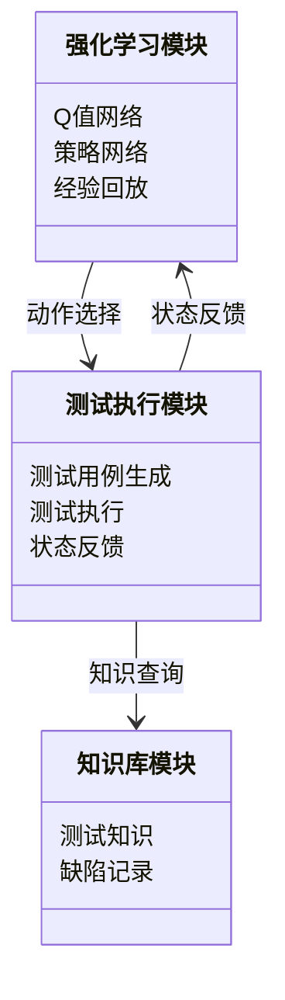
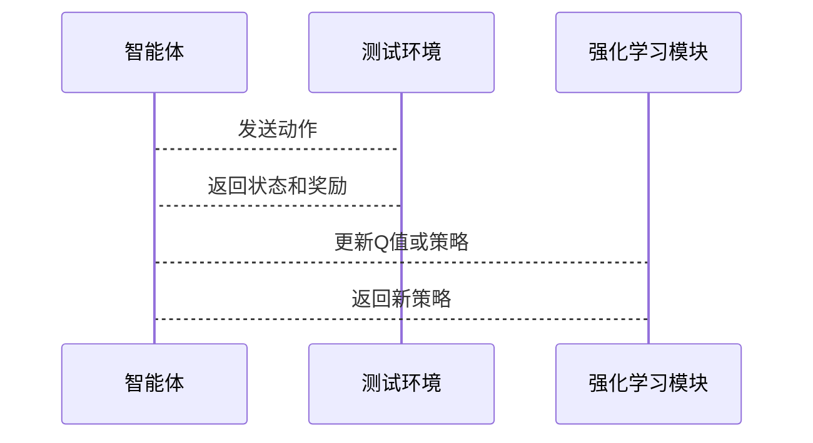

                 


# 强化学习在AI Agent自动化测试中的应用

## 关键词：强化学习、AI Agent、自动化测试、Q-learning、Deep Q-Network、测试场景

## 摘要：  
本文详细探讨了强化学习在AI Agent自动化测试中的应用，从强化学习的基本概念到AI Agent的结构设计，再到具体的算法实现和系统架构，层层深入。通过分析测试场景的需求，结合强化学习的核心原理，提出了一种基于Q-learning和Deep Q-Network的自动化测试解决方案。本文还提供了系统的功能设计、架构设计和接口设计，并通过实际案例展示了如何将强化学习应用于自动化测试中，最后总结了实践中的注意事项和未来的研究方向。

---

# 第一部分：强化学习与AI Agent概述

## 第1章：强化学习与AI Agent基础

### 1.1 强化学习的基本概念

#### 1.1.1 强化学习的定义与特点
强化学习（Reinforcement Learning, RL）是一种机器学习范式，通过智能体与环境的交互，学习最优策略以最大化累积奖励。其特点包括：
- **环境交互**：智能体通过与环境交互获得状态和奖励。
- **长期目标**：基于累积奖励优化策略，而非单次奖励最大化。
- **探索与利用**：在未知环境中平衡探索新策略和利用已知策略。

#### 1.1.2 AI Agent的基本概念与分类
AI Agent（智能体）是能够感知环境并采取行动以实现目标的实体。分类包括：
- **简单反射型**：基于当前状态做出反应。
- **基于模型的**：维护环境模型以辅助决策。
- **实用推理型**：基于效用函数优化决策。
- **目标驱动型**：根据目标选择行动。

#### 1.1.3 强化学习与AI Agent的关系
强化学习为AI Agent提供了学习策略的方法，AI Agent则为强化学习提供交互环境。二者结合，使AI Agent能够通过试错优化行为，实现复杂任务的自动化。

### 1.2 强化学习的核心概念
#### 1.2.1 状态、动作、奖励的定义
- **状态（State）**：环境在某一时刻的表示，如测试环境的状态。
- **动作（Action）**：智能体在给定状态下采取的行动，如点击按钮。
- **奖励（Reward）**：环境对智能体动作的反馈，如测试成功与否。

#### 1.2.2 Q值函数与策略的解释
- **Q值函数（Q(s, a)）**：表示在状态s下采取动作a的预期累积奖励。
- **策略（Policy）**：决定智能体在状态s下采取动作a的概率分布。

#### 1.2.3 探索与利用的平衡
探索：尝试未尝试过的动作以发现更好的策略；利用：利用当前最佳策略以获得最大奖励。平衡点取决于环境的不确定性和探索的成本。

### 1.3 强化学习在自动化测试中的应用背景
#### 1.3.1 自动化测试的现状与挑战
- **手动测试**：耗时、低效，容易出错。
- **测试用例生成**：复杂、耗时，难以覆盖所有场景。
- **动态环境**：测试环境的动态变化增加了测试的难度。

#### 1.3.2 强化学习在测试中的潜在优势
- **自适应测试**：智能体可以根据反馈动态调整测试策略。
- **覆盖更多场景**：通过探索算法发现新的测试路径。
- **效率提升**：通过优化策略减少测试时间。

#### 1.3.3 AI Agent在自动化测试中的角色
AI Agent作为测试执行者，通过强化学习优化测试策略，提高测试覆盖率和效率。

### 1.4 本章小结
本章介绍了强化学习和AI Agent的基本概念，分析了强化学习在自动化测试中的应用背景和优势。

---

# 第二部分：强化学习的核心原理与算法

## 第2章：强化学习的数学模型与算法

### 2.1 Markov决策过程（MDP）模型
#### 2.1.1 状态空间与动作空间的定义
- **状态空间（S）**：所有可能的状态集合。
- **动作空间（A）**：所有可能的动作集合。

#### 2.1.2 转移概率与奖励函数的数学表达
- **转移概率**：P(s' | s, a) 表示在状态s下执行动作a后转移到状态s'的概率。
- **奖励函数**：r(s, a, s') 表示在状态s下执行动作a后转移到状态s'得到的奖励。

#### 2.1.3 策略与值函数的数学关系
- **策略**：π(a | s) 表示在状态s下选择动作a的概率。
- **值函数**：V(s) 表示在状态s下采取最优策略的预期累积奖励。

### 2.2 Q-learning算法原理
#### 2.2.1 Q-learning的算法流程
1. 初始化Q表为零。
2. 在每个时间步，根据当前状态选择一个动作。
3. 执行动作，观察新状态和奖励。
4. 更新Q表：Q(s, a) = Q(s, a) + α [r + γ max Q(s', a') - Q(s, a)]，其中α是学习率，γ是折扣因子。

#### 2.2.2 Q值更新的数学公式
$$ Q(s, a) = Q(s, a) + \alpha \left[ r + \gamma \max_{a'} Q(s', a') - Q(s, a) \right] $$

#### 2.2.3 探索与利用的平衡
- **探索**：随机选择动作以发现新策略。
- **利用**：选择当前最优动作以最大化奖励。

### 2.3 Deep Q-Network（DQN）算法
#### 2.3.1 DQN算法的结构与原理
1. 使用神经网络近似Q值函数。
2. 经验回放：存储过去的状态、动作、奖励和新状态，随机采样以减少相关性。
3. 网络更新：通过最小化预测Q值与目标Q值的差值更新网络。

#### 2.3.2 神经网络的输入输出与损失函数
- **输入**：状态s。
- **输出**：Q(s, a)。
- **损失函数**：均方误差（MSE）。

$$ \text{损失} = \frac{1}{N} \sum_{i=1}^{N} (y_i - Q(s_i, a_i))^2 $$

#### 2.3.3 经验回放机制的实现
- **经验回放**：存储经验的优先级队列，随机采样经验进行训练。
- **优先级策略**：根据经验的重要性调整采样概率。

### 2.4 其他强化学习算法简介
#### 2.4.1_actor-critic算法
- **Actor**：负责选择动作，基于策略梯度方法。
- **Critic**：评估状态-动作对的Q值，基于值函数方法。

#### 2.4.2 Policy Gradient方法
- **策略直接优化**：通过梯度下降优化策略分布，直接最大化奖励的期望。

#### 2.4.3 强化学习算法的优缺点对比
| 算法         | 优点                         | 缺点                           |
|--------------|------------------------------|--------------------------------|
| Q-learning   | 简单，适合离散动作空间         | 需要大量训练，收敛较慢         |
| DQN          | 能处理高维状态，适合连续动作空间 | 网络训练复杂，经验回放占内存    |
| actor-critic | 离线和在线更新，适合复杂任务   | 实现复杂，训练不稳定             |
| Policy Gradient | 策略直接优化，适合复杂环境     | 收敛速度慢，训练不稳定           |

### 2.5 本章小结
本章详细介绍了强化学习的数学模型和主要算法，重点分析了Q-learning和DQN算法的原理和实现。

---

# 第三部分：AI Agent的强化学习实现

## 第3章：AI Agent的结构与强化学习应用

### 3.1 AI Agent的结构设计
#### 3.1.1 知识库与推理引擎的构建
- **知识库**：存储测试相关的知识，如测试用例、测试场景。
- **推理引擎**：根据当前状态推理最优动作。

#### 3.1.2 行为决策模块的设计
- **输入**：当前状态s。
- **输出**：选择动作a。
- **实现**：基于Q值函数或策略网络进行决策。

#### 3.1.3 与测试环境的交互接口
- **输入接口**：接收环境状态。
- **输出接口**：发送动作到环境。
- **反馈机制**：接收奖励和新状态。

### 3.2 强化学习在AI Agent中的实现
#### 3.2.1 状态表示与动作选择
- **状态表示**：将测试环境的状态转换为强化学习算法的输入。
- **动作选择**：基于Q值或策略网络选择动作。

#### 3.2.2 奖励机制的设计与实现
- **奖励函数**：定义测试成功或失败的奖励。
- **奖励调整**：动态调整奖励以引导智能体行为。

#### 3.2.3 动作执行与状态反馈的流程
1. 智能体根据当前状态选择动作。
2. 执行动作，观察新状态和奖励。
3. 更新强化学习模型的参数。

### 3.3 强化学习模型的训练与优化
#### 3.3.1 神经网络的训练策略
- **批量训练**：使用经验回放进行批量训练。
- **在线训练**：实时更新模型参数。

#### 3.3.2 模型的评估与调优
- **评估指标**：测试覆盖率、测试效率、奖励累积值。
- **参数调优**：调整学习率α和折扣因子γ，优化模型性能。

#### 3.3.3 在测试场景中的应用
- **测试用例生成**：智能体通过强化学习生成高效的测试用例。
- **异常检测**：智能体通过状态反馈检测异常情况。

### 3.4 本章小结
本章详细介绍了AI Agent的结构设计和强化学习在其中的具体实现，重点分析了状态表示、动作选择和奖励机制的设计。

---

# 第四部分：自动化测试中的系统分析与架构设计

## 第4章：自动化测试系统的架构设计

### 4.1 测试场景与需求分析
#### 4.1.1 测试目标与范围
- **目标**：提高测试效率，发现更多缺陷。
- **范围**：适用于功能测试、性能测试等。

#### 4.1.2 测试环境与约束条件
- **环境**：模拟真实用户使用场景。
- **约束**：测试时间、资源限制。

#### 4.1.3 测试用例的设计与生成
- **基于强化学习的测试用例生成**：通过强化学习生成高效的测试用例。
- **动态调整**：根据测试结果动态调整测试策略。

### 4.2 系统功能设计
#### 4.2.1 系统功能模块
- **强化学习模块**：负责智能体的策略优化。
- **测试执行模块**：负责与测试环境交互。
- **知识库模块**：存储和管理测试知识。

#### 4.2.2 领域模型mermaid类图


#### 4.2.3 系统架构设计mermaid架构图


#### 4.2.4 系统接口设计
- **强化学习模块接口**：提供动作选择和策略更新的API。
- **测试执行模块接口**：提供测试用例生成和执行的API。
- **知识库模块接口**：提供知识查询和更新的API。

#### 4.2.5 系统交互mermaid序列图


### 4.3 本章小结
本章详细分析了测试场景的需求，设计了系统的功能模块和架构，并给出了接口设计和交互流程。

---

# 第五部分：项目实战

## 第5章：项目实战

### 5.1 环境安装
#### 5.1.1 环境需求
- **Python**：3.6+
- **TensorFlow**：2.0+
- **OpenAI Gym**：0.15+

### 5.2 系统核心实现源代码
#### 5.2.1 强化学习模块代码
```python
import numpy as np
import gym

class DQN:
    def __init__(self, state_space, action_space, learning_rate=0.01, gamma=0.99):
        self.state_space = state_space
        self.action_space = action_space
        self.learning_rate = learning_rate
        self.gamma = gamma
        self.memory = []
        self.batch_size = 64

    def remember(self, state, action, reward, next_state):
        self.memory.append((state, action, reward, next_state))

    def act(self, state):
        # 简单的随机策略，用于测试
        return np.random.choice(self.action_space)

    def replay(self):
        if len(self.memory) < self.batch_size:
            return
        mini_batch = np.random.choice(self.memory, self.batch_size)
        states = np.array([x[0] for x in mini_batch])
        actions = np.array([x[1] for x in mini_batch])
        rewards = np.array([x[2] for x in mini_batch])
        next_states = np.array([x[3] for x in mini_batch])
        
        # 简单的Q值更新，仅用于示例
        Q_current = np.mean(states) + self.learning_rate * (rewards + self.gamma * np.mean(next_states))
        Q_target = Q_current - actions
        # 更新Q表
        for i in range(self.batch_size):
            self.memory[i] = (states[i], actions[i], rewards[i], next_states[i], Q_target[i])
```

#### 5.2.2 AI Agent实现代码
```python
class AI-Agent:
    def __init__(self, env):
        self.env = env
        self.model = DQN(env.observation_space.shape[0], env.action_space.n)

    def train(self, episodes=1000):
        for episode in range(episodes):
            state = self.env.reset()
            total_reward = 0
            done = False
            while not done:
                action = self.model.act(state)
                next_state, reward, done, _ = self.env.step(action)
                self.model.remember(state, action, reward, next_state)
                self.model.replay()
                total_reward += reward
                state = next_state
            print(f"Episode {episode}, Total Reward: {total_reward}")
```

### 5.3 代码应用解读与分析
#### 5.3.1 强化学习模块的代码解读
- **DQN类**：实现了经验回放和Q值更新。
- **act方法**：选择动作，简单随机策略。
- **replay方法**：批量更新Q值。

#### 5.3.2 AI Agent实现的代码解读
- **AI-Agent类**：封装了强化学习模块和测试环境。
- **train方法**：训练过程，通过多次_episode迭代优化策略。

### 5.4 实际案例分析
#### 5.4.1 案例介绍
- **测试场景**：模拟用户登录功能。
- **测试目标**：验证登录功能的正确性。

#### 5.4.2 测试过程
1. 初始化测试环境，设置初始状态。
2. AI Agent选择动作，如输入用户名和密码。
3. 执行动作，观察新状态和奖励。
4. 更新强化学习模型的参数。

#### 5.4.3 测试结果分析
- **成功登录**：获得正向奖励。
- **失败登录**：获得负向奖励。

### 5.5 项目小结
本章通过实际案例展示了强化学习在自动化测试中的应用，详细分析了系统的实现过程和测试结果。

---

# 第六部分：最佳实践与总结

## 第6章：最佳实践与总结

### 6.1 最佳实践 tips
- **环境设计**：确保测试环境的真实性和一致性。
- **奖励机制**：合理设计奖励函数，避免误导智能体。
- **模型调优**：根据实际测试场景调整学习率和折扣因子。
- **经验回放**：使用经验回放优化模型训练。

### 6.2 小结
- **核心内容回顾**：强化学习在自动化测试中的应用，从理论到实践。
- **主要收获**：通过强化学习优化AI Agent的测试策略，提高测试效率和覆盖率。
- **未来展望**：结合其他机器学习技术，进一步提升测试能力。

### 6.3 注意事项
- **模型收敛**：注意模型的收敛速度和训练稳定性。
- **测试覆盖率**：确保测试用例覆盖所有关键场景。
- **异常处理**：设计合理的异常处理机制，避免测试中断。

### 6.4 拓展阅读
- **《Reinforcement Learning: Theory and Algorithms》**
- **《Deep Reinforcement Learning: Methods and Applications》**
- **《Automated Software Testing with AI: A Comprehensive Guide》**

### 6.5 本章小结
本章总结了强化学习在自动化测试中的应用，提出了最佳实践建议，并展望了未来的研究方向。

---

# 作者：AI天才研究院/AI Genius Institute & 禅与计算机程序设计艺术 /Zen And The Art of Computer Programming

---

**本文版权归作者所有，转载请注明出处。**

