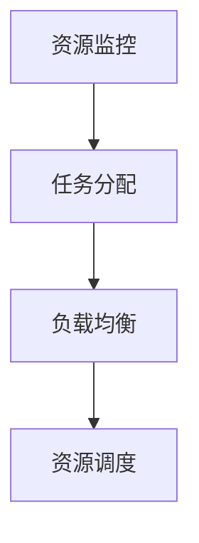
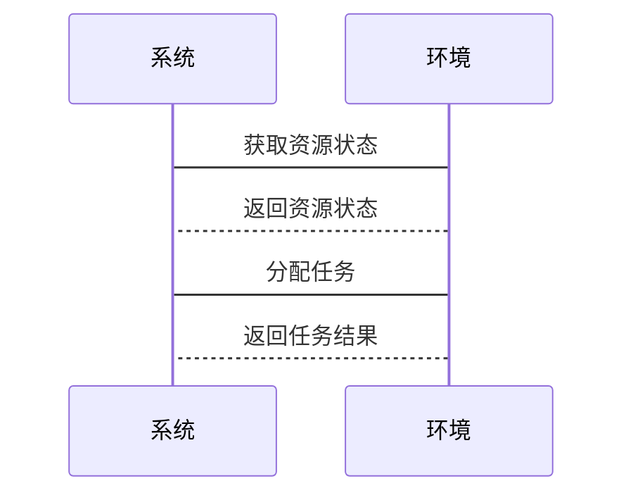

                 


# 强化学习在AI Agent资源调度中的应用

> 关键词：强化学习，AI Agent，资源调度，算法，系统架构

> 摘要：本文将探讨强化学习在AI Agent资源调度中的应用，从理论基础到实际应用，分析强化学习在资源调度中的核心问题、算法选择、系统设计以及项目实战。通过详细讲解，帮助读者全面理解强化学习在AI Agent资源调度中的原理和实践。

---

# 第1章: 强化学习与AI Agent概述

## 1.1 强化学习的基本概念

### 1.1.1 强化学习的定义
强化学习（Reinforcement Learning，RL）是一种机器学习范式，通过智能体与环境的交互，学习如何做出决策以最大化累积奖励。智能体通过试错的方式，逐步优化策略，实现目标。

### 1.1.2 强化学习的核心要素
- **状态（State）**：环境中的当前情况。
- **动作（Action）**：智能体采取的行动。
- **奖励（Reward）**：智能体行为的反馈，指导其优化决策。
- **策略（Policy）**：智能体选择动作的规则。

### 1.1.3 AI Agent的基本概念
AI Agent是一种智能实体，能够感知环境并采取行动以实现目标。Agent可以是软件程序、机器人或其他智能系统。

---

## 1.2 资源调度的背景与问题

### 1.2.1 资源调度的定义
资源调度是指在分布式系统中，合理分配和管理计算、存储等资源，以优化性能和效率。

### 1.2.2 资源调度的核心问题
- **任务分配**：将任务分配给合适的资源。
- **负载均衡**：平衡资源使用，避免瓶颈。
- **动态调度**：应对资源需求的变化。

### 1.2.3 强化学习在资源调度中的应用
强化学习通过试错优化资源分配策略，解决动态变化的资源调度问题。

---

## 1.3 本章小结
本章介绍了强化学习的基本概念和AI Agent的核心概念，并阐述了资源调度的核心问题，为后续章节奠定了基础。

---

# 第2章: 强化学习的理论基础

## 2.1 强化学习的基本原理

### 2.1.1 状态、动作、奖励的定义
- **状态**：环境的状态表示当前情况。
- **动作**：智能体采取的行动。
- **奖励**：反馈智能体行为的价值。

### 2.1.2 Q-learning算法
Q-learning是一种经典的强化学习算法，通过更新Q值表来学习最优策略。

### 2.1.3 深度强化学习的基本概念
深度强化学习结合了深度学习和强化学习，利用神经网络近似价值函数。

---

## 2.2 强化学习的核心算法

### 2.2.1 Q-learning算法的数学模型
Q值更新公式：
$$ Q(s, a) \leftarrow Q(s, a) + \alpha [r + \gamma \max Q(s', a') - Q(s, a)] $$
其中：
- $\alpha$：学习率
- $\gamma$：折扣因子

### 2.2.2 Deep Q-Networks（DQN）算法
DQN使用神经网络近似Q值函数，通过经验回放和目标网络优化。

### 2.2.3 策略梯度方法
策略梯度法直接优化策略，通过梯度上升最大化目标函数。

---

## 2.3 强化学习的挑战与解决方案

### 2.3.1 状态空间的复杂性
复杂状态空间需要高效的表示方法。

### 2.3.2 动作空间的多样性
多样动作空间要求灵活的策略选择。

### 2.3.3 奖励函数的设计
合理的奖励设计是优化的关键。

---

## 2.4 本章小结
本章详细讲解了强化学习的理论基础，包括核心算法及其挑战。

---

# 第3章: AI Agent的核心概念

## 3.1 多智能体系统

### 3.1.1 多智能体系统的定义
多智能体系统由多个协作或竞争的智能体组成。

### 3.1.2 多智能体系统的分类
- **协作型**：智能体协作完成任务。
- **竞争型**：智能体之间竞争资源。

### 3.1.3 多智能体系统中的协作与竞争
协作与竞争的平衡是系统设计的关键。

---

## 3.2 状态空间与动作空间

### 3.2.1 状态空间的构建
状态空间定义了所有可能的状态。

### 3.2.2 动作空间的设计
动作空间定义了智能体的所有可能动作。

### 3.2.3 状态与动作的转换关系
状态通过动作转换，形成闭环。

---

## 3.3 价值函数与策略

### 3.3.1 价值函数的定义
价值函数表示状态-动作对的期望收益。

### 3.3.2 策略的定义与分类
策略定义了动作选择的概率分布。

### 3.3.3 价值函数与策略的关系
价值函数指导策略的优化。

---

## 3.4 本章小结
本章深入分析了AI Agent的核心概念，包括多智能体系统、状态空间和价值函数。

---

# 第4章: 强化学习在资源调度中的应用

## 4.1 资源调度的核心问题

### 4.1.1 资源分配问题
如何高效分配资源是核心问题。

### 4.1.2 负载均衡问题
平衡资源负载，避免瓶颈。

### 4.1.3 动态资源调度问题
应对动态变化的需求。

---

## 4.2 强化学习在资源调度中的具体应用

### 4.2.1 任务分配
通过强化学习优化任务分配策略。

### 4.2.2 负载均衡
利用强化学习实现动态负载均衡。

### 4.2.3 动态调度
应对资源需求的变化。

---

## 4.3 本章小结
本章通过实际案例展示了强化学习在资源调度中的应用。

---

# 第5章: 强化学习算法的数学模型

## 5.1 Q-learning算法的数学模型

### 5.1.1 Q值更新公式
$$ Q(s, a) \leftarrow Q(s, a) + \alpha [r + \gamma \max Q(s', a') - Q(s, a)] $$

### 5.1.2 算法流程
1. 初始化Q值表。
2. 与环境交互，获取状态和奖励。
3. 更新Q值表。
4. 重复直到收敛。

---

## 5.2 Deep Q-Networks（DQN）算法

### 5.2.1 网络结构
- 输入层：接收状态。
- 隐藏层：处理特征。
- 输出层：输出Q值。

### 5.2.2 算法流程
1. 环境交互，存储经验。
2. 采样经验，训练网络。
3. 更新目标网络。

---

## 5.3 本章小结
本章详细讲解了强化学习算法的数学模型。

---

# 第6章: 系统分析与架构设计

## 6.1 系统架构设计

### 6.1.1 系统功能设计
- **资源监控**：实时监控资源状态。
- **任务分配**：基于强化学习分配任务。
- **负载均衡**：动态调整资源负载。

### 6.1.2 系统架构图


---

## 6.2 系统接口设计

### 6.2.1 系统接口
- **获取资源状态**：返回当前资源状态。
- **分配任务**：根据策略分配任务。

---

## 6.3 系统交互流程

### 6.3.1 交互流程图


---

## 6.4 本章小结
本章详细分析了系统的架构设计和交互流程。

---

# 第7章: 项目实战

## 7.1 环境搭建

### 7.1.1 安装依赖
- Python 3.x
- TensorFlow
- gym库

### 7.1.2 环境配置
配置强化学习环境，包括状态和动作空间。

---

## 7.2 核心代码实现

### 7.2.1 Q-learning算法实现
```python
class QLearning:
    def __init__(self, state_space, action_space):
        self.q_table = np.zeros((state_space, action_space))
```

### 7.2.2 DQN算法实现
```python
class DQN:
    def __init__(self, state_size, action_size):
        self.model = build_model(state_size, action_size)
        self.target_model = build_model(state_size, action_size)
```

---

## 7.3 案例分析

### 7.3.1 任务分配案例
通过强化学习优化任务分配策略。

### 7.3.2 负载均衡案例
实现动态负载均衡。

---

## 7.4 项目总结
本章通过实战展示了强化学习在资源调度中的具体应用。

---

# 第8章: 扩展与展望

## 8.1 强化学习的前沿技术

### 8.1.1 多智能体协作
研究多智能体协作的强化学习方法。

### 8.1.2 分布式强化学习
探索分布式环境下的强化学习应用。

---

## 8.2 未来研究方向

### 8.2.1 深度强化学习的优化
进一步优化深度强化学习算法。

### 8.2.2 资源调度的智能化
推动资源调度的智能化发展。

---

## 8.3 本章小结
本章展望了强化学习在资源调度中的未来发展方向。

---

# 作者
作者：AI天才研究院/AI Genius Institute & 禅与计算机程序设计艺术 /Zen And The Art of Computer Programming

---

通过以上目录结构，我们可以系统地从强化学习的理论基础到实际应用，全面探讨其在AI Agent资源调度中的应用。

