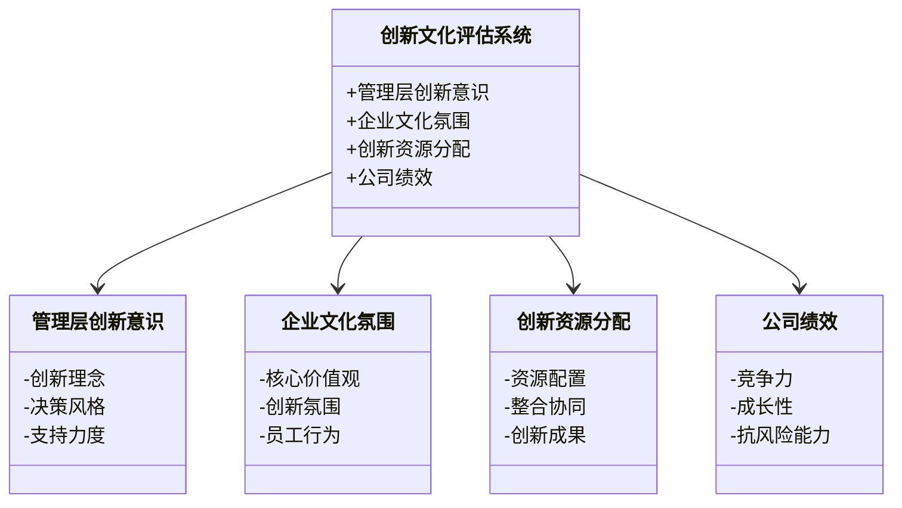
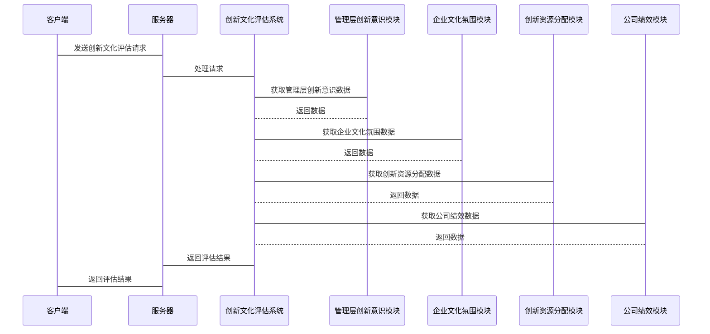

                 

# 彼得林奇对公司创新文化的定性分析方法

## 关键词：彼得林奇，创新文化，定性分析，公司分析，投资策略

## 摘要：本文从彼得林奇的投资视角出发，系统阐述了他对公司创新文化的定性分析方法。通过分析创新文化的定义、核心维度及其对公司的长期影响，本文构建了彼得林奇的创新文化评估模型，并结合实际案例，详细探讨了如何运用该模型进行公司分析。本文还深入讨论了定性分析的优势与局限性，并提出了相关的实践建议。

---

# 第一部分：彼得林奇对公司创新文化的背景介绍

## 第1章：创新文化的基本概念

### 1.1 创新文化的定义与内涵

#### 1.1.1 创新文化的定义
创新文化是指企业在内部营造的一种鼓励创新、容忍失败、重视员工创造力和主动性的工作氛围。它不仅包括技术上的创新，还包括管理方式、商业模式和组织文化的创新。

#### 1.1.2 创新文化的内涵与外延
创新文化的内涵在于其强调员工的主动性和创造性，外延则体现在企业各个层面的创新实践，如产品创新、管理创新和文化创新。

#### 1.1.3 创新文化的核心要素
创新文化的核心要素包括：
- 鼓励冒险和尝试
- 容忍失败
- 员工参与和授权
- 知识共享和协作

### 1.2 彼得林奇的分析框架

#### 1.2.1 彼得林奇的投资者背景
彼得林奇是美国著名的投资专家，以其独特的投资策略闻名。他认为，公司的长期成功不仅取决于财务数据，还取决于公司的文化和管理层的创新能力。

#### 1.2.2 彼得林奇的公司分析方法
彼得林奇的公司分析方法注重定性因素，尤其是创新文化和管理团队的质量。他认为，创新文化是公司长期竞争优势的核心。

#### 1.2.3 创新文化在公司分析中的重要性
创新文化决定了公司的适应能力和创新能力，是公司在激烈竞争中生存和发展的关键。

---

## 第2章：定性分析方法的背景与意义

### 2.1 定性分析的基本概念

#### 2.1.1 定性分析的定义
定性分析是指通过观察、访谈、案例研究等方法，对现象进行描述和解释的过程。与定量分析不同，定性分析更关注事物的本质和内在逻辑。

#### 2.1.2 定性分析的特点
定性分析的特点包括：
- 主观性：依赖研究者的判断和解释。
- 深入性：通过详细的描述揭示事物的本质。
- 灵活性：适用于复杂和动态变化的情况。

#### 2.1.3 定性分析在公司分析中的应用
定性分析在公司分析中的应用包括评估公司的文化、管理团队的创新能力以及公司的战略发展方向。

### 2.2 彼得林奇定性分析的独特性

#### 2.2.1 投资视角下的定性分析
彼得林奇从投资者的角度出发，关注公司的创新文化、管理层素质和市场地位。

#### 2.2.2 创新文化评估的独特方法
彼得林奇通过观察公司的管理团队、员工文化和创新实践，评估公司的创新潜力。

#### 2.2.3 定性分析的局限性与优势
定性分析的优势在于其灵活性和深度，但其主观性和难以量化是其局限性。

---

# 第二部分：创新文化的核心概念与联系

## 第3章：创新文化的定性分析维度

### 3.1 管理团队的创新意识

#### 3.1.1 管理层的创新理念
管理层是否具备创新理念是创新文化的核心。彼得林奇认为，创新文化始于管理层。

#### 3.1.2 高层对创新的支持力度
高层对创新的支持力度直接影响公司的创新氛围。彼得林奇建议投资者关注公司高层是否鼓励创新。

#### 3.1.3 管理层的决策风格
管理层的决策风格决定了公司的创新方向和风险承受能力。

### 3.2 企业文化与创新氛围

#### 3.2.1 企业文化的核心价值观
企业文化的核心价值观决定了公司的创新方向和员工的创新行为。

#### 3.2.2 创新氛围的营造
彼得林奇认为，公司可以通过奖励机制、开放沟通和知识共享来营造创新氛围。

#### 3.2.3 员工的创新意识与行为
员工的创新意识与行为是创新文化的重要表现。彼得林奇建议关注员工的参与度和创造力。

### 3.3 创新资源的配置与利用

#### 3.3.1 创新资源的分配
创新资源的分配是否合理直接影响公司的创新能力。彼得林奇认为，公司应优先分配资源到有潜力的创新项目。

#### 3.3.2 创新资源的整合与协同
创新资源的整合与协同是实现创新文化的重要手段。彼得林奇强调跨部门协作的重要性。

#### 3.3.3 资源配置对创新的影响
资源配置不当可能导致创新失败，而合理的资源配置则能推动创新成功。

## 第4章：创新文化与公司绩效的关系

### 4.1 创新文化对公司的长期影响

#### 4.1.1 创新文化与公司竞争力
创新文化是公司竞争力的核心，能够帮助公司在市场中保持领先地位。

#### 4.1.2 创新文化与公司成长性
创新文化决定了公司的成长潜力。彼得林奇认为，具有强大创新文化的公司更具成长性。

#### 4.1.3 创新文化与公司抗风险能力
创新文化能够增强公司的抗风险能力，帮助公司在危机中找到新的机会。

### 4.2 彼得林奇的定性分析模型

#### 4.2.1 分析模型的构建
彼得林奇的创新文化评估模型包括管理团队、企业文化、创新资源和公司绩效四个维度。

#### 4.2.2 模型的变量与关系
模型的变量包括创新文化的核心要素，变量之间的关系是相互影响和相互促进。

#### 4.2.3 模型的应用
通过模型可以系统评估公司的创新文化，为投资者提供决策依据。

---

# 第三部分：系统分析与架构设计

## 第5章：创新文化评估的系统分析

### 5.1 系统功能设计（领域模型）

### 5.2 系统架构设计

### 5.3 系统交互设计

---

# 第四部分：项目实战

## 第6章：创新文化评估的项目实战

### 6.1 案例分析：某科技公司的创新文化评估

#### 6.1.1 环境安装
选择一家科技公司作为案例，收集相关数据。

#### 6.1.2 数据收集与处理
通过问卷调查、访谈和公司公开资料收集数据。

#### 6.1.3 创新文化评估过程
使用彼得林奇的模型进行评估，分析管理层创新意识、企业文化氛围和创新资源分配。

#### 6.1.4 结果解读与策略建议
根据评估结果提出改进建议，如加强创新文化建设、优化资源配置等。

### 6.2 实际案例分析

#### 6.2.1 案例背景介绍
介绍公司的基本情况和行业地位。

#### 6.2.2 评估过程
详细描述评估过程，包括数据收集、分析和结果解读。

#### 6.2.3 结果分析
分析评估结果，指出公司的优势和不足。

#### 6.2.4 改进建议
根据评估结果提出改进建议，如优化创新流程、加强员工培训等。

---

# 第五部分：总结与展望

## 第7章：总结与展望

### 7.1 最佳实践

#### 7.1.1 创新文化建设的关键点
创新文化建设的关键点包括领导支持、员工参与和资源配置。

#### 7.1.2 定性分析的注意事项
定性分析需要注意主观性和数据的客观性，建议结合定量分析。

### 7.2 小结
彼得林奇的创新文化定性分析方法为投资者和企业提供了一种系统评估公司创新潜力的工具。

### 7.3 注意事项
在实际应用中，需要注意定性分析的局限性，结合定量分析和其他方法进行综合评估。

### 7.4 拓展阅读
推荐相关的书籍和文献，供读者进一步学习。

---

# 作者：AI天才研究院/AI Genius Institute & 禅与计算机程序设计艺术 /Zen And The Art of Computer Programming

---

本文通过详细分析彼得林奇的创新文化定性分析方法，为投资者和企业管理者提供了一种新的视角来评估公司的创新潜力。希望本文能为相关领域的研究和实践提供有价值的参考。

