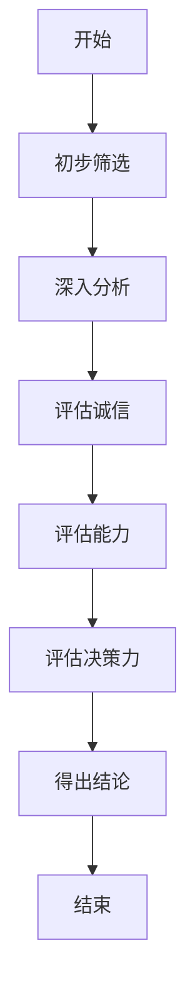

                 


# 彼得林奇对公司管理层的要求

> 关键词：彼得林奇，管理层要求，投资理念，诚信，能力，决策力，公司价值

> 摘要：本文详细分析了彼得林奇对优秀公司管理层的要求，从诚信、能力、决策力和责任感四个方面进行了深入探讨。通过构建数学模型和算法流程图，展示了如何评估管理层的能力，并结合实际案例进行了系统分析。

---

## 第一部分：彼得林奇对公司管理层的要求背景介绍

### 第1章：彼得林奇的背景与投资理念

#### 1.1 彼得林奇的背景介绍
- 1.1.1 彼得林奇的生平简介
  - 彼得林奇（Peter Lynch）是美国著名的共同基金经理，以其在富达投资管理公司的出色表现而闻名。
  - 他在1977年至1990年期间管理的麦哲伦基金创造了年化29%的惊人回报率。
- 1.1.2 彼得林奇的投资风格与成就
  - 价值投资与成长投资的结合者。
  - 强调长期投资和对公司基本面的深入研究。
- 1.1.3 彼得林奇的投资哲学与理念
  - 买入并持有优质股票，直到基本面发生变化。
  - 强调管理层的重要性，认为管理层是公司价值的核心驱动力。

#### 1.2 彼得林奇对管理层的要求的背景
- 1.2.1 投资者与管理层之间的关系
  - 管理层的决策直接影响公司的股价和投资者的收益。
  - 管理层的诚信与能力是投资者选择公司的重要标准。
- 1.2.2 管理层对公司价值的影响
  - 管理层的战略决策决定了公司的发展方向。
  - 管理层的执行力影响公司的市场竞争力。
- 1.2.3 彼得林奇对管理层要求的核心问题
  - 管理层是否具备诚信、能力和决策力。
  - 管理层是否能够为股东创造长期价值。

---

## 第二部分：彼得林奇对管理层要求的核心概念与联系

### 第2章：核心概念的原理

#### 2.1 核心概念的定义与组成
- 2.1.1 管理层诚信的重要性
  - 诚信是管理层的基本素质。
  - 诚信的管理层更可能为股东创造长期价值。
- 2.1.2 管理层能力的关键性
  - 包括战略规划能力、执行能力和创新能力。
  - 能力强的管理层更容易带领公司取得成功。
- 2.1.3 管理层决策力的影响
  - 决策力决定公司的发展方向。
  - 正确的决策能够提升公司竞争力。

#### 2.2 核心概念的属性特征对比
- 2.2.1 诚信与能力的对比分析
  - 诚信是基础，能力是关键。
  - 两者共同作用，才能确保管理层的有效性。
- 2.2.2 决策力与责任感的对比分析
  - 决策力是管理层的核心能力。
  - 责任感是管理层的基本素质。
- 2.2.3 核心概念的属性特征表格

| 属性 | 特征 |
|------|------|
| 诚信 | 正直、透明 |
| 能力 | 战略规划、执行力 |
| 决策力 | 准确性、果断性 |
| 责任感 | 对公司和股东负责 |

#### 2.3 实体关系图

```mermaid
erDiagram
    company --> manager : 拥有
    manager --> capability : 具备
    manager --> integrity : 具备
    manager --> decision_making : 具备
```

---

## 第三部分：彼得林奇对管理层要求的算法原理

### 第3章：算法原理的流程图

#### 3.1 管理层评估的流程图



#### 3.2 管理层能力评估的Python代码实现

```python
def evaluate_management(management团队):
    诚信评分 = 0
    能力评分 = 0
    决策力评分 = 0
    for 管理者 in management团队:
        if 管理者.诚信:
            诚信评分 += 1
        if 管理者.能力:
            能力评分 += 1
        if 管理者.决策力:
            决策力评分 += 1
    总评分 = 诚信评分 + 能力评分 + 决策力评分
    return 总评分
```

---

## 第四部分：数学模型与公式

### 第4章：数学模型的构建

#### 4.1 管理层评分公式

$$
\text{总评分} = \alpha \times \text{诚信评分} + \beta \times \text{能力评分} + \gamma \times \text{决策力评分}
$$

其中，$\alpha$, $\beta$, $\gamma$ 分别为诚信、能力和决策力的权重，通常 $\alpha = 0.4$, $\beta = 0.3$, $\gamma = 0.3$。

---

## 第五部分：系统分析与架构设计

### 第5章：系统功能设计

#### 5.1 系统功能模块
- 公司分析模块：分析公司的财务状况和市场表现。
- 管理层评估模块：评估管理层的诚信、能力和决策力。
- 投资决策模块：基于评估结果做出投资决策。

#### 5.2 系统架构图

```mermaid
graph TD
    company --> management_evaluator : 输入
    management_evaluator --> investor_decision : 输出
```

---

## 第六部分：项目实战

### 第6章：项目实战分析

#### 6.1 环境安装
- 安装Python和相关库（如pandas、numpy）。
- 安装mermaid工具。

#### 6.2 核心代码实现

```python
import pandas as pd

def calculate_management_score(management_team):
    score = 0
    for manager in management_team:
        if manager['integrity']:
            score += 1
        if manager['ability']:
            score += 1
        if manager['decision_making']:
            score += 1
    return score

management_team = [
    {'name': 'Manager1', 'integrity': True, 'ability': True, 'decision_making': True},
    {'name': 'Manager2', 'integrity': False, 'ability': True, 'decision_making': False}
]

print(calculate_management_score(management_team))
```

---

## 第七部分：最佳实践与总结

### 第7章：最佳实践

#### 7.1 彼得林奇的成功经验
- 重视管理层的诚信、能力和决策力。
- 长期投资，避免短期波动。

#### 7.2 投资注意事项
- 选择具备优秀管理层的公司。
- 定期评估管理层的表现。

#### 7.3 未来研究方向
- 结合人工智能技术，进一步优化管理层评估模型。
- 研究管理层行为对公司股价的影响。

---

## 作者：AI天才研究院/AI Genius Institute & 禅与计算机程序设计艺术 /Zen And The Art of Computer Programming

