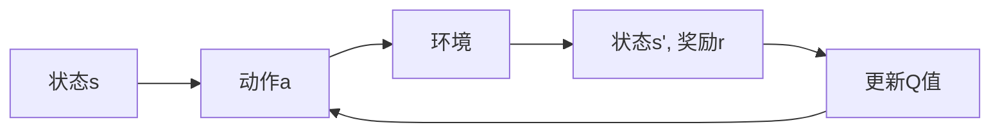
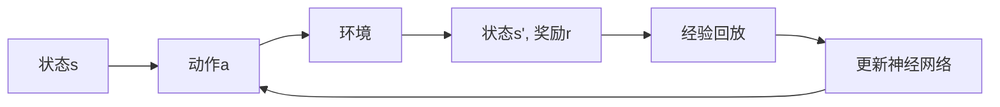
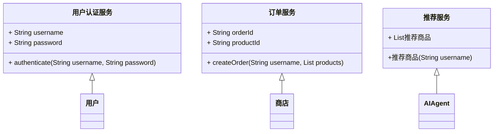
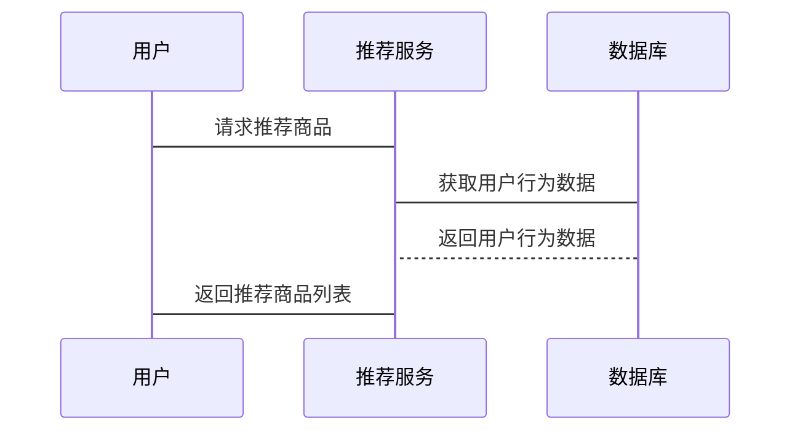

                 


# 微服务架构：构建模块化的AI Agent系统

## 关键词：微服务架构, AI Agent, 模块化设计, 系统架构, 分布式系统

## 摘要：本文详细探讨了在微服务架构下构建模块化AI Agent系统的原理、设计和实现。通过分析微服务架构的核心概念和AI Agent的基本原理，结合实际案例，阐述了如何在微服务架构中实现AI Agent系统的模块化设计、服务治理、算法实现和系统优化。本文还提供了详细的系统架构设计、数学模型和代码示例，帮助读者系统地理解和掌握微服务架构下AI Agent系统的核心技术。

---

## 第一部分: 微服务架构与AI Agent系统概述

### 第1章: 微服务架构概述

#### 1.1 微服务架构的核心概念

##### 1.1.1 微服务的定义与特点

微服务架构是一种将应用程序分解为多个小型、独立服务的架构风格。每个服务负责处理特定的业务逻辑，通过轻量级通信机制（如HTTP或消息队列）进行交互。微服务架构的核心特点包括：

- **独立性**：每个服务独立开发、部署和扩展。
- **松耦合**：服务之间通过明确的接口进行通信，避免紧密耦合。
- **可扩展性**：可以根据需求灵活扩展特定服务。
- **技术多样性**：每个服务可以使用不同的技术栈。

##### 1.1.2 微服务与传统单体架构的区别

传统的单体架构将所有功能集中在一个单一的应用程序中，而微服务架构将功能分解为多个独立的服务。以下是两者的对比：

| 特性                | 单体架构                | 微服务架构               |
|---------------------|-------------------------|--------------------------|
| 可扩展性            | 有限，整体扩展          | 高，每个服务独立扩展     |
| 独立性              | 低，所有功能紧密耦合    | 高，每个服务独立开发     |
| 技术多样性          | 低，统一技术栈          | 高，每个服务可选技术栈   |
| 部署复杂性          | 低，整体部署            | 高，每个服务独立部署     |

##### 1.1.3 微服务架构的优缺点分析

**优点：**
- **灵活性**：可以根据业务需求快速调整和扩展功能。
- **可维护性**：每个服务独立维护，降低整体复杂性。
- **团队协作**：不同团队可以并行开发不同的服务。

**缺点：**
- **复杂性**：增加了服务之间的通信、协调和管理的复杂性。
- **成本**：需要额外的工具和服务（如服务发现、熔断器）来管理微服务架构。
- **运维挑战**：需要复杂的运维策略来确保服务的稳定性和可用性。

#### 1.2 AI Agent的基本概念

##### 1.2.1 AI Agent的定义与分类

AI Agent（智能体）是指能够感知环境并采取行动以实现目标的实体。AI Agent可以分为以下几类：

- **反应式AI Agent**：根据当前感知做出反应，不依赖于历史信息。
- **认知式AI Agent**：具有复杂推理和规划能力，能够处理复杂任务。
- **学习型AI Agent**：能够通过经验改进性能，如强化学习或深度学习模型。

##### 1.2.2 AI Agent的核心功能与应用场景

AI Agent的核心功能包括：

- **感知环境**：通过传感器或接口获取外部信息。
- **决策与行动**：基于感知信息做出决策并执行行动。
- **学习与优化**：通过反馈不断优化自身的决策策略。

AI Agent的应用场景广泛，包括自动驾驶、智能推荐系统、机器人控制等。

##### 1.2.3 AI Agent与传统软件的区别

以下是AI Agent与传统软件的主要区别：

| 特性                | AI Agent                | 传统软件                |
|---------------------|-------------------------|-------------------------|
| 行为驱动           | 是，基于环境反馈       | 否，基于输入输出        |
| 学习能力           | 是，能够改进性能       | 否，遵循固定规则        |
| 适应性             | 是，能够自适应环境变化 | 否，固定功能             |

#### 1.3 微服务架构与AI Agent的结合

##### 1.3.1 微服务架构在AI Agent系统中的优势

微服务架构为AI Agent系统提供了以下优势：

- **模块化设计**：AI Agent的功能可以分解为多个独立的服务，每个服务负责特定任务。
- **灵活性**：可以根据AI Agent的需求动态扩展或调整服务。
- **可维护性**：每个服务独立维护，降低整体系统的复杂性。

##### 1.3.2 AI Agent在微服务架构中的角色

AI Agent在微服务架构中可以作为独立的服务运行，负责处理特定的业务逻辑或与外部系统交互。例如，一个AI Agent可以作为推荐服务，根据用户行为推荐商品。

##### 1.3.3 微服务架构与AI Agent结合的案例分析

例如，一个在线零售平台可以使用微服务架构构建AI Agent推荐系统。推荐服务（AI Agent）通过分析用户行为数据，向用户推荐商品。推荐服务可以独立扩展，并与其他服务（如用户认证服务、订单服务）通过API进行交互。

#### 1.4 本章小结

本章介绍了微服务架构的核心概念和AI Agent的基本原理，探讨了两者结合的优势和应用场景。通过分析微服务架构的特点和AI Agent的功能，我们可以更好地理解如何在微服务架构下构建模块化的AI Agent系统。

---

## 第二部分: 微服务架构的核心原理

### 第2章: 微服务架构的设计原则

#### 2.1 分散化原则

##### 2.1.1 服务的独立性与可扩展性

每个微服务应独立开发和部署，具有明确的功能边界。例如，用户认证服务和订单服务是独立的服务，可以通过API进行交互。

##### 2.1.2 服务的松耦合设计

微服务之间的依赖应通过明确的接口进行管理。例如，订单服务依赖用户认证服务，但通过API网关进行交互，避免直接耦合。

#### 2.2 服务发现与通信机制

##### 2.2.1 服务发现的实现方式

服务发现是通过注册中心（如Eureka）或服务发现工具（如Consul）实现的。服务消费者可以通过注册中心获取服务提供者的地址。

##### 2.2.2 微服务间的通信协议与方式

微服务之间的通信可以通过以下方式实现：

- **API Gateway**：统一的API入口，负责路由、认证和速率限制。
- **Direct Communication**：服务之间通过HTTP或RPC直接通信。
- **Message Queue**：通过消息队列（如Kafka、RabbitMQ）异步通信。

#### 2.3 服务治理与监控

##### 2.3.1 服务注册与注销

服务启动时向注册中心注册，停止时注销。例如，Spring Boot应用可以使用Eureka进行服务注册。

##### 2.3.2 服务熔断与限流

为了防止服务链中的某个服务成为瓶颈，可以使用熔断器（如Hystrix）和限流器（如Ribbon）进行流量控制。

##### 2.3.3 服务监控与日志管理

通过监控工具（如Prometheus、Grafana）和日志管理工具（如ELK）实时监控服务状态和日志。

#### 2.4 本章小结

本章探讨了微服务架构的设计原则，包括分散化原则、服务发现与通信机制、服务治理与监控。通过合理设计，可以实现系统的高可用性和可扩展性。

---

## 第三部分: AI Agent系统的算法与数学模型

### 第3章: AI Agent的核心算法原理

#### 3.1 强化学习算法

##### 3.1.1 强化学习的基本概念

强化学习是一种通过试错学习的算法，智能体通过与环境交互获得奖励，目标是最大化累积奖励。强化学习的核心要素包括：

- **状态（State）**：智能体所处的环境情况。
- **动作（Action）**：智能体采取的行为。
- **奖励（Reward）**：智能体采取动作后获得的反馈。
- **策略（Policy）**：智能体选择动作的规则。

##### 3.1.2 Q-learning算法的数学模型

Q-learning算法是一种经典的强化学习算法，其数学模型如下：

$$ Q(s, a) = r + \gamma \max_{a'} Q(s', a') $$

其中：
- \( Q(s, a) \) 表示状态 \( s \) 下采取动作 \( a \) 的价值。
- \( r \) 是获得的奖励。
- \( \gamma \) 是折扣因子，介于0和1之间。
- \( s' \) 是采取动作 \( a \) 后的新状态。

##### 3.1.3 算法流程图（使用Mermaid）



#### 3.2 深度强化学习

##### 3.2.1 DQN算法的数学模型

深度强化学习（DQN，Deep Q-Network）通过深度神经网络近似Q值函数。其数学模型如下：

$$ Q(s, a) = \theta \cdot \phi(s, a) $$

其中：
- \( \theta \) 是神经网络的参数。
- \( \phi(s, a) \) 是状态-动作对的特征表示。

##### 3.2.2 算法流程图（使用Mermaid）



#### 3.3 联合学习与分布式训练

##### 3.3.1 联合学习的基本原理

联合学习（Federated Learning）是在分布式数据源上训练模型，而不将数据集中到一个中心位置。每个设备或服务器在本地训练模型，然后将模型参数上传到中心服务器进行聚合。

##### 3.3.2 分布式训练的实现方式

分布式训练可以通过以下方式实现：

- **数据并行**：将数据分成多个批次，分别在不同的GPU上训练，然后将梯度汇总。
- **模型并行**：将模型的不同部分分布在不同的GPU上，以并行方式处理输入数据。

#### 3.4 本章小结

本章介绍了AI Agent的核心算法，包括强化学习和深度强化学习的基本原理和数学模型。通过算法流程图和数学公式，帮助读者理解AI Agent的决策过程。

---

## 第四部分: 微服务架构与AI Agent系统的结合设计

### 第4章: 微服务架构下的AI Agent系统设计

#### 4.1 系统功能设计

##### 4.1.1 领域模型设计（使用Mermaid类图）



##### 4.1.2 系统架构设计（使用Mermaid架构图）

```mermaid
docker
    services {
        api-gateway
        user-service
        order-service
        recommendation-service
        database
    }
    api-gateway --> user-service
    api-gateway --> order-service
    api-gateway --> recommendation-service
    user-service --> database
    order-service --> database
    recommendation-service --> database
```

##### 4.1.3 系统接口设计

以下是系统的主要接口：

- **用户认证接口**：
  - `/auth/login`：用户登录接口。
  - `/auth/register`：用户注册接口。

- **订单接口**：
  - `/order/create`：创建订单接口。
  - `/order/query`：查询订单接口。

- **推荐接口**：
  - `/recommendation/retrieve`：获取推荐商品接口。

##### 4.1.4 系统交互设计（使用Mermaid序列图）



#### 4.2 项目实战

##### 4.2.1 环境安装

以下是项目实战所需的环境和工具：

- **编程语言**：Python 3.8+
- **框架**：Django或Flask（用于Web服务）
- **AI框架**：TensorFlow或Keras（用于深度学习）
- **服务发现**：Eureka或Consul
- **API Gateway**：Spring Cloud Gateway或Kong
- **消息队列**：RabbitMQ或Kafka

##### 4.2.2 系统核心实现源代码

以下是一个简单的推荐服务实现示例：

```python
# 推荐服务代码示例
import requests
import json

class RecommendationService:
    def __init__(self):
        self.user_behavior_url = "http://localhost:8000/api/user_behavior"
        self.product_info_url = "http://localhost:8000/api/product_info"

    def get_user_behavior(self, user_id):
        response = requests.get(f"{self.user_behavior_url}/{user_id}")
        return json.loads(response.text)

    def get_recommendation(self, user_id):
        user_behavior = self.get_user_behavior(user_id)
        # 假设用户行为数据包含用户购买过的商品ID
        purchased_product_ids = [item['product_id'] for item in user_behavior if item['action'] == 'purchase']
        # 获取商品信息
        product_info_response = requests.get(f"{self.product_info_url}?ids={','.join(purchased_product_ids)}")
        product_info = json.loads(product_info_response.text)
        # 返回推荐商品
        return [product['name'] for product in product_info if product['popularity'] > 0.8]

# 使用示例
if __name__ == "__main__":
    service = RecommendationService()
    recommendations = service.get_recommendation("user123")
    print("推荐商品:", recommendations)
```

##### 4.2.3 代码应用解读与分析

上述代码实现了推荐服务的基本功能，包括从用户行为数据库获取用户购买记录，并基于商品 popularity 属性推荐商品。实际应用中，可以进一步优化推荐算法，例如使用协同过滤或深度学习模型。

##### 4.2.4 实际案例分析和详细讲解剖析

假设我们有一个在线零售平台，用户可以通过推荐服务获取个性化推荐。推荐服务通过分析用户的购买记录和浏览行为，利用机器学习算法生成推荐列表。以下是推荐服务的工作流程：

1. **用户请求推荐**：用户向推荐服务发送推荐请求，包含用户ID。
2. **获取用户行为数据**：推荐服务查询用户行为数据库，获取用户的购买记录和浏览记录。
3. **生成推荐列表**：基于用户行为数据，利用机器学习算法生成推荐商品列表。
4. **返回推荐结果**：推荐服务将推荐商品列表返回给用户。

##### 4.2.5 项目小结

通过上述实战，我们了解了如何在微服务架构下实现AI Agent推荐系统。通过模块化设计和微服务之间的协作，可以构建高效、灵活的AI Agent系统。

#### 4.3 最佳实践 tips、小结、注意事项、拓展阅读

##### 4.3.1 最佳实践 tips

- **服务隔离**：确保每个服务独立运行，避免服务之间的紧耦合。
- **容错设计**：使用熔断器和限流器来防止服务链中的单点故障。
- **日志管理**：通过集中式日志管理工具（如ELK）进行日志收集和分析。
- **持续集成**：使用CI/CD工具实现持续集成和持续交付。

##### 4.3.2 小结

本章通过实际案例分析和代码实现，展示了如何在微服务架构下构建模块化的AI Agent系统。通过合理的系统设计和实现，可以充分发挥微服务架构的优势，构建高效、灵活的AI Agent系统。

##### 4.3.3 注意事项

- **数据一致性**：在分布式系统中，确保数据一致性是一个挑战，可以通过最终一致性或强一致性协议来实现。
- **安全性**：确保微服务之间的通信安全，使用SSL证书和OAuth2进行身份验证和授权。
- **性能优化**：通过缓存、分片等技术优化系统的性能。

##### 4.3.4 拓展阅读

- **《微服务设计》**：深入探讨微服务架构的设计原则和实践。
- **《深度学习》**：学习深度学习的基本原理和算法实现。
- **《分布式系统》**：了解分布式系统的设计与实现。

---

## 作者：AI天才研究院/AI Genius Institute & 禅与计算机程序设计艺术 /Zen And The Art of Computer Programming

---

通过以上内容，我们详细探讨了微服务架构与AI Agent系统的结合设计，从理论到实践，帮助读者系统地理解和掌握相关技术。

