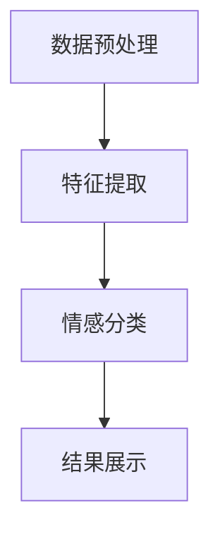
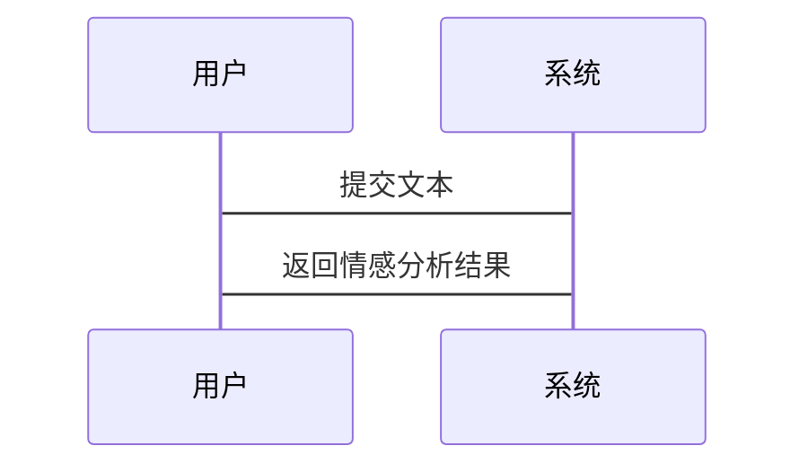

                 

# 情感分析：赋予AI Agent理解人类情绪的能力

## 关键词：情感分析、人工智能、自然语言处理、深度学习、文本挖掘

## 摘要：情感分析是一种通过计算机技术来识别和理解人类情绪的技术。本文将从情感分析的基本概念、核心算法、系统架构、项目实战以及进阶应用等方面进行全面阐述，帮助读者深入理解情感分析的技术原理和实际应用。

---

# 第1章: 情感分析概述

## 1.1 情感分析的背景与意义

### 1.1.1 人工智能与情感理解的必要性
人工智能（AI）的进步使得机器能够处理越来越多的任务，但理解人类情感一直是其短板。情感分析通过分析文本中的情绪，使AI能够更好地与人类交互，提升用户体验。

### 1.1.2 情感分析的定义与目标
情感分析是利用自然语言处理（NLP）技术，对文本中的情感倾向进行识别和分类。其目标是帮助AI理解人类的情感表达，从而实现更智能的交互。

### 1.1.3 情感分析的应用场景
情感分析广泛应用于社交媒体分析、客户反馈分析、舆情监控等领域，帮助企业更好地了解用户需求和市场趋势。

## 1.2 情感分析的核心问题

### 1.2.1 情感分类的基本问题
情感分类是情感分析的核心任务，主要分为二分类（如正面/负面）和多分类（如正面、中性、负面）。

### 1.2.2 情感强度分析与情感定位
情感强度分析是对情感程度的量化，如“非常满意”与“满意”。情感定位则是确定情感在文本中的位置。

### 1.2.3 多语言情感分析的挑战
多语言情感分析需要处理不同语言的特点，如语法结构和文化差异，增加了技术难度。

## 1.3 情感分析的边界与外延

### 1.3.1 情感分析与文本分类的区分
情感分析是文本分类的一种，但其关注点是情感信息的提取。

### 1.3.2 情感分析与自然语言理解的关系
情感分析是自然语言理解的一部分，但更关注情感信息的识别和分类。

### 1.3.3 情感分析的典型应用案例
如社交媒体情感分析、电影评论分析等。

## 1.4 情感分析的核心要素

### 1.4.1 情感数据的特征提取
特征提取是情感分析的关键步骤，包括词袋模型、词嵌入等方法。

### 1.4.2 情感分析的评价指标
常用的评价指标包括准确率、召回率、F1值等。

### 1.4.3 情感分析系统的组成要素
包括数据预处理、特征提取、模型训练、结果展示等模块。

## 1.5 本章小结
本章介绍了情感分析的背景、核心问题、边界和外延，为后续内容打下基础。

---

# 第2章: 情感分析的核心概念

## 2.1 情感分析的原理与流程

### 2.1.1 数据预处理与特征提取
数据预处理包括分词、去除停用词等。特征提取方法有词袋模型、TF-IDF等。

### 2.1.2 情感分类算法的选择
根据任务需求选择合适的算法，如基于规则的分类器或机器学习模型。

### 2.1.3 模型训练与评估
通过训练数据训练模型，并通过测试数据评估模型性能。

## 2.2 情感分析的特征工程

### 2.2.1 词袋模型与词嵌入
词袋模型将文本表示为词袋，词嵌入（如Word2Vec）将词转化为向量表示。

### 2.2.2 基于规则的特征提取
使用情感词典提取情感词，计算情感强度。

### 2.2.3 深度学习特征的自动提取
深度学习模型（如CNN、RNN）能够自动提取文本特征。

## 2.3 情感分析的评价指标

### 2.3.1 分类准确率、召回率与F1值
准确率=正确预测数/总预测数；召回率=正确预测数/实际正类数；F1值=2*准确率*召回率/(准确率+召回率)。

### 2.3.2 情感强度分析的指标
如情感得分、情感分布等。

### 2.3.3 多标签情感分析的评价方法
如精确度、召回率、F1值的加权平均。

## 2.4 情感分析的挑战与解决方案

### 2.4.1 数据不平衡问题
采用过采样、欠采样等方法平衡数据。

### 2.4.2 领域适应与数据迁移
使用迁移学习或领域适配技术解决领域差异。

### 2.4.3 多语言情感分析的难点
需要处理语言结构和文化差异。

## 2.5 本章小结
本章详细讲解了情感分析的核心概念和特征工程，为后续算法实现打下基础。

---

# 第3章: 情感分析的算法原理与实现

## 3.1 基于规则的情感分析算法

### 3.1.1 情感词典的构建
使用如AFINN、SentiWordNet等情感词典。

### 3.1.2 基于情感词的文本特征提取
统计文本中情感词的数量和强度。

### 3.1.3 基于规则的分类器实现
如使用情感词典和逻辑规则进行分类。

## 3.2 基于机器学习的情感分析算法

### 3.2.1 支持向量机（SVM）在情感分类中的应用
SVM适用于小规模数据，通过特征向量化进行分类。

### 3.2.2 朴素贝叶斯（Naive Bayes）的情感分类实现
Naive Bayes基于概率论，适用于大规模数据。

### 3.2.3 随机森林在情感分析中的应用
随机森林通过集成学习提高分类准确率。

## 3.3 情感分析的特征提取与选择

### 3.3.1 词袋模型的实现
将文本表示为词的集合。

### 3.3.2 词嵌入（Word2Vec、GloVe）的使用
将词转化为向量表示，捕捉语义信息。

### 3.3.3 深度学习中的自动特征提取
如卷积神经网络（CNN）、循环神经网络（RNN）等。

## 3.4 情感分析的算法实现

### 3.4.1 基于SVM的情感分类器实现
使用SVM进行二分类或多分类。

### 3.4.2 基于RNN的情感分析模型
RNN适合处理序列数据，但存在梯度消失问题。

### 3.4.3 基于LSTM的情感分析模型
LSTM通过门控机制解决长序列训练难题。

## 3.5 本章小结
本章详细讲解了基于规则和机器学习的情感分析算法，以及深度学习模型的实现。

---

# 第4章: 情感分析的系统架构与设计

## 4.1 情感分析系统的功能模块

### 4.1.1 数据预处理模块
包括分词、去除停用词、处理特殊字符等。

### 4.1.2 特征提取模块
如TF-IDF、Word2Vec等特征提取方法。

### 4.1.3 情感分类模块
选择合适的算法进行情感分类。

### 4.1.4 结果展示模块
将结果以可视化形式展示。

## 4.2 情感分析系统的架构图

### 4.3 系统接口设计
接口设计包括数据输入接口、模型调用接口和结果输出接口。

## 4.4 系统交互流程

## 4.5 本章小结
本章详细讲解了情感分析系统的架构设计和交互流程。

---

# 第5章: 情感分析项目实战

## 5.1 项目概述

### 5.1.1 项目背景
以Twitter情感分析为例，分析用户对某一产品的反馈。

### 5.1.2 项目目标
实现一个能够自动分析Twitter评论情感的系统。

## 5.2 项目环境与工具安装

### 5.2.1 环境配置
安装Python、Jupyter Notebook、scikit-learn、Keras等工具。

### 5.2.2 数据集准备
获取Twitter评论数据，标注情感类别。

## 5.3 项目核心实现

### 5.3.1 数据预处理
分词、去除停用词、处理特殊字符。

### 5.3.2 特征提取
使用TF-IDF提取特征向量。

### 5.3.3 模型训练
选择SVM或LSTM进行训练。

### 5.3.4 模型评估
计算准确率、召回率、F1值。

## 5.4 项目结果分析

### 5.4.1 模型性能分析
分析不同算法的性能差异。

### 5.4.2 情感分布分析
展示不同情感类别在数据中的分布。

## 5.5 本章小结
本章通过一个实战项目，展示了情感分析的完整实现流程。

---

# 第6章: 情感分析的进阶应用

## 6.1 情感分析与自然语言理解的结合

### 6.1.1 基于BERT的情感分析实现
使用预训练语言模型进行情感分类。

### 6.1.2 情感分析与问答系统的结合
通过情感分析优化问答系统的回答质量。

## 6.2 情感分析与强化学习的结合

### 6.2.1 强化学习在情感对话中的应用
通过强化学习训练智能对话系统。

### 6.2.2 情感分析在游戏AI中的应用
分析玩家情感，优化游戏体验。

## 6.3 情感分析的实际应用挑战

### 6.3.1 数据稀疏性问题
处理数据量不足的情况。

### 6.3.2 情感漂移问题
处理情感随时间变化的情况。

## 6.4 本章小结
本章探讨了情感分析的进阶应用和挑战，展示了其广阔的应用前景。

---

# 作者：AI天才研究院 & 禅与计算机程序设计艺术

