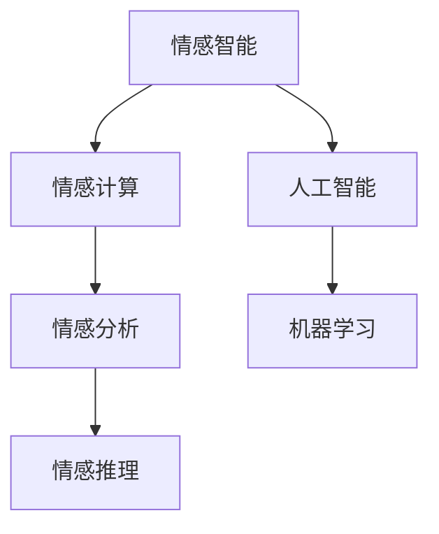
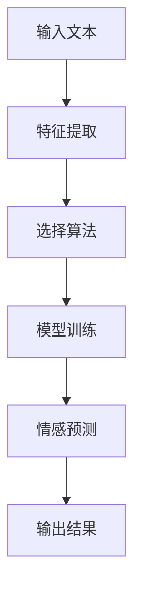
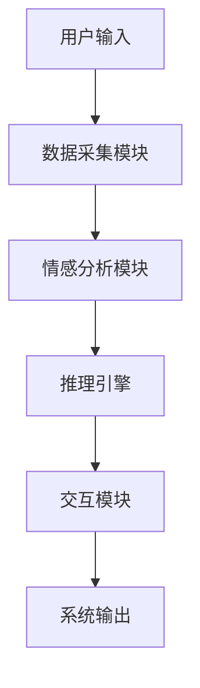

                 


# 情感智能：构建具有EQ的AI Agent

---

## 关键词：情感智能, EQ, AI Agent, 情感计算, 情感分析, 情感推理

---

## 摘要：本文详细探讨了情感智能（EQ）在人工智能代理（AI Agent）中的应用，从概念、算法到系统架构，全面解析如何构建具备情感理解与响应能力的AI代理。文章首先介绍情感智能的核心概念，包括情感计算、情感分析与情感推理的定义与联系，接着深入分析情感分析的算法原理，涵盖规则-based方法与机器学习方法，随后讲解情感推理的算法实现，包括基于知识图谱与深度学习的推理方法。文章进一步讨论了AI代理系统的整体架构设计，包括数据采集、情感分析、推理引擎与交互模块的设计，并通过实际案例展示如何构建情感智能系统。最后，本文总结了情感智能的关键技术与未来发展方向。

---

## 第一部分: 情感智能的背景与核心概念

### 第1章: 情感智能的定义与背景

#### 1.1 情感智能的定义
情感智能（Emotional Intelligence，EQ）是指个体识别、理解和管理自己及他人情感的能力。在AI领域，情感智能使机器能够理解、识别和响应人类的情感状态，从而实现更自然的交互。

#### 1.2 情感智能与人工智能的关系
人工智能（AI）关注的是智能体（Agent）的理性行为，而情感智能则关注智能体的情感理解和响应能力。情感智能是人工智能的一个重要分支，旨在增强AI系统的社交能力和用户体验。

#### 1.3 情感智能的应用场景
- 智能客服：通过情感分析识别客户情绪，提供更贴心的服务。
- 智能音箱：根据用户的情感状态调整回应方式。
- 医疗健康：分析患者情感状态，辅助诊断和治疗。

### 第2章: 情感智能的核心概念与联系

#### 2.1 情感计算的原理
- 情感计算：通过分析多模态数据（如文本、语音、面部表情）来识别人的情感状态。
- 情感计算的核心要素：数据采集、特征提取、情感分析、情感推理。
- 情感计算与认知科学的联系：情感计算借鉴了心理学、认知科学的研究成果，试图模拟人类的情感处理过程。

#### 2.2 情感分析与情感推理
- 情感分析：基于文本内容判断情感倾向（正面、负面、中性）。
- 情感推理：基于上下文理解情感之间的关系，推断隐含的情感信息。
- 情感分析与情感推理的区别与联系：情感分析关注表面的情感倾向，情感推理关注深层次的情感关系。

#### 2.3 情感智能的实体关系图


---

## 第二部分: 情感智能的算法原理

### 第3章: 情感分析算法原理

#### 3.1 基于规则的情感分析
- 规则的情感分析方法：通过预定义的规则和关键词匹配情感倾向。
- 规则库的构建与优化：基于语料库统计高频情感词汇，优化规则库的准确率。
- 规则情感分析的优缺点：优点是简单易懂，缺点是难以处理复杂的情感表达。

#### 3.2 基于机器学习的情感分析
- 机器学习情感分析的流程：
  1. 数据预处理：文本清洗、分词、特征提取。
  2. 选择算法：如支持向量机（SVM）、随机森林（Random Forest）。
  3. 模型训练：使用训练数据训练情感分类器。
  4. 模型评估：通过准确率、召回率、F1值评估模型性能。
- 深度学习在情感分析中的应用：使用词嵌入（如Word2Vec）和深度神经网络（如CNN、RNN）进行情感分类。

#### 3.3 情感分析的流程图


#### 3.4 情感分析的数学模型
- 基于SVM的情感分类模型：
  $$ \text{模型训练}：y = \text{sign}(w \cdot x + b) $$
  $$ \text{损失函数}：L = \sum_{i=1}^{n} \max(0, 1 - y_i (w \cdot x_i + b)) $$

### 第4章: 情感推理算法原理

#### 4.1 情感推理的定义与特点
- 情感推理：基于上下文理解情感之间的关系，推断隐含的情感信息。
- 情感推理的特点：复杂性、动态性、情境依赖性。

#### 4.2 基于知识图谱的情感推理
- 知识图谱：构建情感相关实体的关系网络，如“愤怒”与“指责”的关系。
- 情感推理流程：
  1. 实体识别：从文本中提取情感相关实体。
  2. 关系推理：基于知识图谱推理实体之间的关系。
  3. 情感推断：结合关系推理结果，推断文本中的隐含情感。

#### 4.3 基于深度学习的情感推理
- 深度学习模型：使用Transformer架构进行情感推理，如BERT模型。
- 情感推理的数学模型：
  $$ \text{注意力机制}：\alpha_i = \frac{\exp(e_i)}{\sum_{j} \exp(e_j)} $$
  $$ \text{最终表示}：h = \sum_{i=1}^{n} \alpha_i x_i $$

---

## 第三部分: AI Agent的系统架构设计

### 第5章: AI Agent的系统架构

#### 5.1 系统功能设计
- 数据采集模块：采集用户输入的文本、语音、面部表情等数据。
- 情感分析模块：对数据进行情感分析，识别情感倾向。
- 推理引擎：基于情感分析结果，推理用户的情感需求。
- 交互模块：根据推理结果生成适当的回应。

#### 5.2 系统架构设计


#### 5.3 系统接口设计
- 输入接口：文本输入、语音输入、面部表情输入。
- 输出接口：文本输出、语音输出、视觉反馈输出。

#### 5.4 系统交互流程
- 用户输入：用户发送一条带有情感色彩的文本。
- 数据采集：系统接收文本并进行预处理。
- 情感分析：系统分析文本的情感倾向。
- 推理引擎：系统推理用户的深层需求。
- 交互模块：系统生成并输出适当的回应。

---

## 第四部分: 项目实战

### 第6章: 情感智能项目的实战

#### 6.1 环境安装
- 安装Python环境：如Anaconda。
- 安装相关库：如NLTK、scikit-learn、TensorFlow。

#### 6.2 核心代码实现
- 情感分析代码示例：
```python
from sklearn.feature_extraction.text import TfidfVectorizer
from sklearn.svm import SVC

# 数据预处理
corpus = ["I love this movie!", "I hate this film.", "This is okay."]
labels = [1, 0, 0]

# 特征提取
vectorizer = TfidfVectorizer()
X = vectorizer.fit_transform(corpus)

# 模型训练
model = SVC()
model.fit(X, labels)

# 模型预测
test_text = "I like this product."
test_X = vectorizer.transform([test_text])
predicted_label = model.predict(test_X)
print(predicted_label)
```

- 情感推理代码示例：
```python
import tensorflow as tf
from tensorflow import keras

# 模型训练
model = keras.Sequential()
model.add(keras.layers.Embedding(input_dim=10000, output_dim=16))
model.add(keras.layers.GlobalAveragePooling1D())
model.add(keras.layers.Dense(1, activation='sigmoid'))

model.compile(optimizer='adam', loss='binary_crossentropy', metrics=['accuracy'])
model.fit(train_data, train_labels, epochs=10, batch_size=32)
```

#### 6.3 案例分析与代码解读
- 情感分析案例：训练一个二分类模型，识别电影评论的情感倾向。
- 情感推理案例：使用BERT模型分析复杂的情感关系。

#### 6.4 项目总结
- 项目实现的关键点：数据预处理、特征提取、模型选择与优化。
- 项目遇到的挑战：数据不平衡、模型泛化能力不足。
- 解决方案：使用数据增强、调整模型结构、优化超参数。

---

## 第五部分: 最佳实践与总结

### 第7章: 最佳实践与小结

#### 7.1 关键技术总结
- 情感智能的核心技术：情感识别、情感分析、情感推理。
- AI Agent的系统架构：数据采集、情感分析、推理引擎、交互模块。

#### 7.2 开发注意事项
- 数据质量：确保数据的多样性和代表性。
- 模型优化：通过交叉验证、超参数调优提升模型性能。
- 伦理与隐私：保护用户数据隐私，避免算法偏见。

#### 7.3 拓展阅读
- 推荐书籍：《情感计算：人工智能的新维度》。
- 推荐论文：《基于深度学习的情感分析研究》。

---

## 作者信息

作者：AI天才研究院/AI Genius Institute & 禅与计算机程序设计艺术 /Zen And The Art of Computer Programming

---

感谢您的阅读！希望这篇文章能为您提供关于情感智能和AI Agent的深入见解，并激发您在这一领域的探索与实践！

