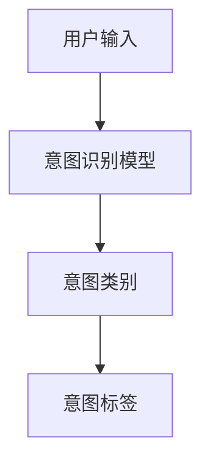
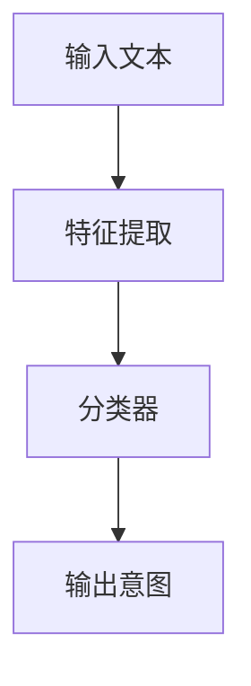

                 


# 意图识别：准确把握用户需求的关键

---

## 关键词  
意图识别、自然语言处理、深度学习、对话系统、用户需求分析

---

## 摘要  
意图识别是自然语言处理领域中的核心任务之一，旨在准确理解用户输入的文本或语音背后的真实意图。本文从意图识别的背景、核心概念、算法原理、系统架构到项目实战，全面解析意图识别的关键技术与实际应用。通过理论与实践相结合的方式，帮助读者掌握意图识别的核心原理，理解其在实际场景中的应用，最终能够设计和实现高效的意图识别系统。

---

## 第一部分: 意图识别的背景与核心概念

### 第1章: 意图识别概述

#### 1.1 问题背景与挑战
- **1.1.1 从用户需求到意图识别**  
  用户需求是多样的，且常常隐含在文本或语音中。意图识别的目标是从这些输入中提取出明确的意图，以便系统能够准确响应用户的需求。  
- **1.1.2 意图识别的核心问题**  
  意图识别的核心问题包括：如何准确理解用户输入的含义，如何处理歧义和模糊表达，如何适应不同语言和文化背景下的用户需求。  
- **1.1.3 意图识别的边界与外延**  
  意图识别的边界在于明确区分意图与具体需求，外延则涉及语义理解、情感分析等相关领域。

#### 1.2 意图识别的核心概念
- **1.2.1 意图识别的定义与特点**  
  意图识别是通过分析用户输入，确定其背后的意图。其特点包括准确性、实时性和适应性。  
- **1.2.2 意图识别的分类与应用场景**  
  意图识别可以分为基于规则的意图识别和基于模型的意图识别。其应用场景包括智能客服、智能音箱、聊天机器人等。  
- **1.2.3 意图识别的关键技术与方法**  
  关键技术包括自然语言处理、机器学习和深度学习等。

#### 1.3 意图识别的流程与框架
- **1.3.1 数据输入与预处理**  
  数据输入包括文本和语音两种形式，预处理包括分词、去停用词等。  
- **1.3.2 模型训练与优化**  
  模型训练包括特征提取、分类器训练等，优化则通过调整参数和评估指标实现。  
- **1.3.3 意图识别的输出与反馈**  
  输出包括意图标签和置信度，反馈则用于模型的持续优化。

#### 1.4 本章小结  
本章主要介绍了意图识别的背景、核心概念和流程框架，为后续章节的学习奠定了基础。

---

### 第2章: 意图识别的核心概念与联系

#### 2.1 意图识别的核心原理
- **2.1.1 意图识别的数学模型**  
  意图识别可以看作是一个分类问题，常用的方法包括朴素贝叶斯、支持向量机和神经网络等。  
- **2.1.2 意图识别的特征提取方法**  
  特征提取包括关键词提取、句法分析和语义分析等。  
- **2.1.3 意图识别的分类算法**  
  常见的分类算法包括决策树、随机森林和卷积神经网络等。

#### 2.2 意图识别的核心概念对比
- **2.2.1 基于规则的意图识别与基于统计学习的意图识别对比**  
  基于规则的方法依赖于人工定义的规则，而基于统计学习的方法依赖于数据和模型训练。  
- **2.2.2 基于关键词匹配与基于语义理解的意图识别对比**  
  基于关键词匹配的方法简单但不够智能，而基于语义理解的方法能够更好地捕捉用户意图。  
- **2.2.3 基于规则的意图识别与基于深度学习的意图识别对比**  
  基于规则的方法适用于简单场景，而基于深度学习的方法适用于复杂场景。

#### 2.3 意图识别的ER实体关系图


#### 2.4 本章小结  
本章通过对比分析意图识别的核心概念，帮助读者更好地理解其原理和应用场景。

---

### 第3章: 意图识别的算法原理与数学模型

#### 3.1 意图识别的算法原理
- **3.1.1 基于统计学习的意图识别算法**  
  常见的算法包括朴素贝叶斯和线性分类器等。  
- **3.1.2 基于深度学习的意图识别算法**  
  常见的算法包括卷积神经网络和循环神经网络等。  
- **3.1.3 基于规则的意图识别算法**  
  通过预定义的规则进行意图分类。

#### 3.2 意图识别的数学模型
- **3.2.1 朴素贝叶斯分类器**  
  $$ P(y|x) = \frac{P(x|y)P(y)}{P(x)} $$
- **3.2.2 支持向量机分类器**  
  最大化间隔：$$ \text{最大化} \frac{1}{||w||} \text{的间隔} $$
- **3.2.3 神经网络模型**  
  $$ y = \text{softmax}(Wx + b) $$

#### 3.3 意图识别的算法流程


#### 3.4 本章小结  
本章详细讲解了意图识别的算法原理和数学模型，为后续章节的实现奠定了基础。

---

### 第4章: 意图识别的系统分析与架构设计

#### 4.1 意图识别系统的需求分析
- **4.1.1 问题场景介绍**  
  以智能客服为例，分析意图识别在实际场景中的需求。  
- **4.1.2 系统功能需求**  
  包括意图识别、对话管理、反馈优化等功能。  
- **4.1.3 系统性能需求**  
  包括准确率、响应时间和可扩展性等。

#### 4.2 意图识别系统的功能设计
- **4.2.1 领域模型设计**  
  ```mermaid
  classDiagram
  class 用户输入 {
    +文本内容
    +语音内容
    - 提取特征()
    - 转换格式()
  }
  class 意图识别模型 {
    +特征向量
    +分类器
    - 预测意图()
  }
  class 意图标签 {
    +意图类别
    +置信度
  }
  用户输入 --> 意图识别模型
  意图识别模型 --> 意图标签
  ```

- **4.2.2 系统架构设计**  
  ```mermaid
  graph TD
  A[用户输入] --> B[意图识别服务]
  B --> C[自然语言理解模块]
  C --> D[对话管理模块]
  D --> E[反馈优化模块]
  ```

- **4.2.3 系统接口设计**  
  包括输入接口和输出接口的设计。  
- **4.2.4 系统交互设计**  
  ```mermaid
  sequenceDiagram
  participant 用户
  participant 意图识别服务
  participant 对话管理模块
  用户 -> 意图识别服务: 提交输入
  意图识别服务 -> 对话管理模块: 返回意图标签
  对话管理模块 -> 用户: 返回响应
  ```

#### 4.3 本章小结  
本章通过系统分析与架构设计，帮助读者理解意图识别在实际系统中的应用。

---

## 第二部分: 意图识别的项目实战

### 第5章: 意图识别的项目实战

#### 5.1 项目环境与工具安装
- **5.1.1 环境搭建**  
  安装Python、Jupyter Notebook、spaCy等工具。  
- **5.1.2 数据集准备**  
  使用公开数据集或自定义数据集。  
- **5.1.3 模型训练**  
  使用预训练模型或自训练模型。

#### 5.2 意图识别系统的核心实现
- **5.2.1 特征提取与分类器实现**  
  使用spaCy进行文本处理，使用Scikit-learn进行分类器训练。  
  ```python
  import spacy
  nlp = spacy.load("en_core_web_sm")
  doc = nlp("What's the weather?")
  for token in doc:
      print(token.text, token.pos_)
  ```

- **5.2.2 模型优化与部署**  
  使用交叉验证优化模型参数，并部署到实际系统中。

#### 5.3 实际案例分析与详细讲解
- **5.3.1 案例分析**  
  以智能音箱为例，分析意图识别的实现过程。  
- **5.3.2 代码实现与解读**  
  ```python
  from sklearn.feature_extraction.text import TfidfVectorizer
  from sklearn.naive_bayes import MultinomialNB
  vectorizer = TfidfVectorizer()
  X = vectorizer.fit_transform(X)
  clf = MultinomialNB().fit(X, y)
  ```

#### 5.4 项目小结  
本章通过项目实战，帮助读者掌握意图识别系统的实现过程。

---

### 第6章: 意图识别的最佳实践与注意事项

#### 6.1 意图识别的最佳实践
- **6.1.1 数据质量的重要性**  
  数据清洗和标注是关键。  
- **6.1.2 模型选择与优化**  
  根据场景选择合适的模型，并通过调参优化性能。  
- **6.1.3 系统的可扩展性与维护性**  
  设计模块化的系统架构，便于后续扩展和维护。

#### 6.2 意图识别的注意事项
- **6.2.1 处理歧义与模糊表达**  
  需要结合上下文进行理解。  
- **6.2.2 跨语言与跨文化的适应性**  
  需要针对不同语言和文化背景进行适配。  
- **6.2.3 模型的实时性和响应速度**  
  需要优化模型的运行效率，以满足实时需求。

#### 6.3 拓展阅读与深入学习
- **6.3.1 深度学习在意图识别中的应用**  
  推荐学习 Transformer 模型和预训练语言模型。  
- **6.3.2 意图识别与对话系统的结合**  
  推荐学习对话系统的整体架构与实现。

#### 6.4 本章小结  
本章总结了意图识别的最佳实践和注意事项，并提供了进一步学习的方向。

---

## 作者：AI天才研究院/AI Genius Institute & 禅与计算机程序设计艺术 /Zen And The Art of Computer Programming

---

以上是《意图识别：准确把握用户需求的关键》一书的完整目录大纲，涵盖从理论到实践的各个方面，帮助读者全面理解和掌握意图识别的核心技术与实际应用。

