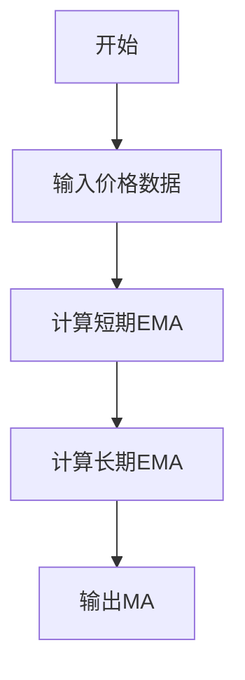
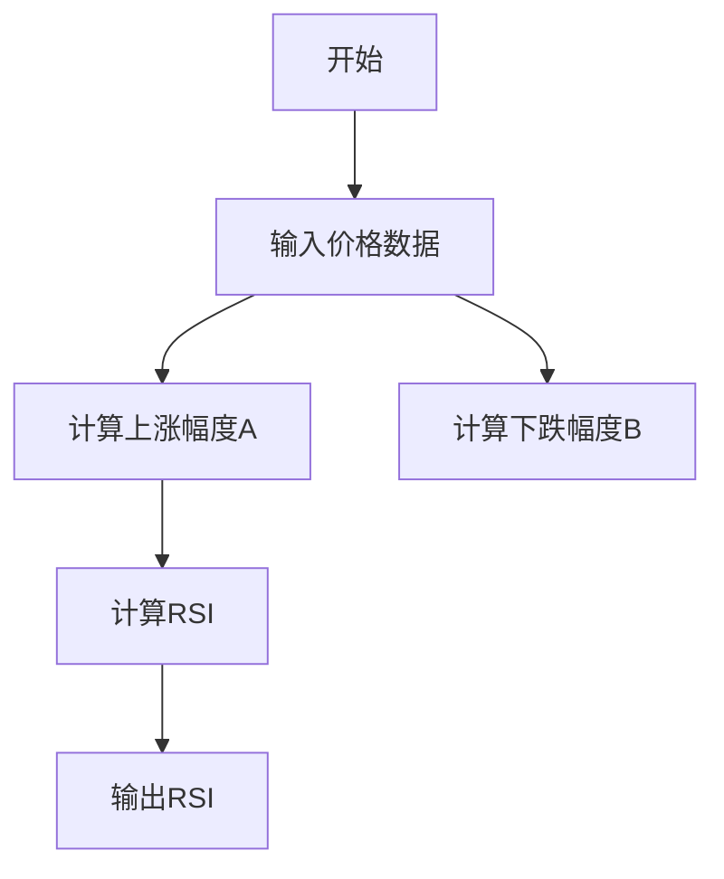
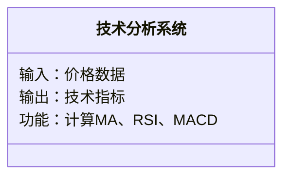
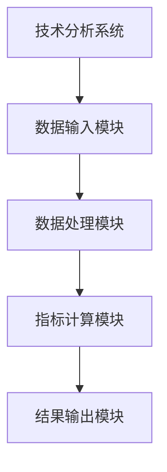
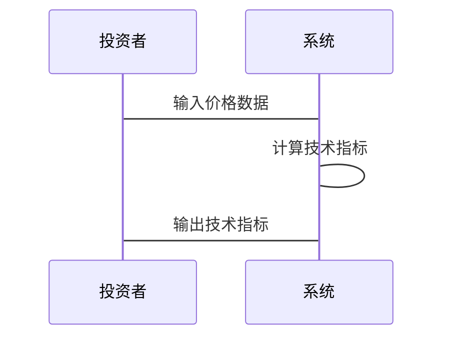

                 


# 技术分析在全球股市估值中的作用

## 关键词：技术分析、股市估值、技术指标、K线图、相对强弱指数（RSI）、移动平均线（MA）

## 摘要：  
技术分析是金融市场中一种重要的投资分析方法，通过研究历史价格数据和市场行为，预测未来的价格走势。本文详细探讨了技术分析在全球股市估值中的作用，从基本概念、核心理论、数学模型到实际应用，全面解析技术分析在股市估值中的重要性。文章还结合了具体的技术指标和案例分析，帮助读者更好地理解技术分析在全球股市中的实际应用。

---

# 第一部分：技术分析基础与全球股市估值概述

## 第1章：技术分析的基本概念与背景

### 1.1 技术分析的定义与核心假设

#### 1.1.1 技术分析的定义  
技术分析是一种通过研究历史价格数据和市场行为，预测未来价格走势的投资分析方法。它基于以下核心假设：  
1. 市场价格反映所有信息（有效市场假说）。  
2. 历史价格走势具有重复性，即“历史会重演”。  
3. 市场价格具有趋势性，且趋势会保持一段时间。  

#### 1.1.2 技术分析的核心假设  
技术分析的核心假设包括：  
- **价格反映所有信息**：市场价格已经反映了所有相关信息，因此投资者可以通过价格走势预测未来走势。  
- **历史会重演**：历史价格走势会重复出现，投资者可以通过识别价格形态和模式来预测未来走势。  
- **趋势的存在**：市场价格走势通常会形成趋势，投资者可以通过识别趋势来制定投资策略。  

#### 1.1.3 技术分析与基本面分析的区别  
- **基本面分析**：关注公司的财务状况、行业地位、盈利能力等内在因素，预测股票的内在价值。  
- **技术分析**：关注市场交易数据（价格、成交量等），预测价格走势，不考虑公司的基本面。  

### 1.2 技术分析在股市估值中的作用  
#### 1.2.1 股市估值的基本概念  
股市估值是指通过对公司基本面的分析，估算其股票的内在价值。技术分析不直接用于估值，但它可以帮助投资者判断市场情绪和价格走势，从而辅助估值决策。  

#### 1.2.2 技术分析如何影响股市估值  
技术分析通过以下方式影响股市估值：  
1. **识别价格形态**：通过K线图识别支撑位、阻力位、头肩顶等价格形态，帮助投资者判断价格的买卖点。  
2. **预测价格趋势**：通过技术指标和趋势线预测价格的短期和中期走势，辅助投资者制定买卖策略。  
3. **判断市场情绪**：通过成交量和价格走势判断市场的买卖力量，辅助投资者判断市场的强弱。  

#### 1.2.3 技术分析在全球股市中的应用现状  
技术分析在全球股市中得到了广泛应用，尤其是在美国、欧洲和亚洲的股市中。投资者通过技术分析工具（如K线图、技术指标等）制定投资策略，帮助他们在复杂的市场环境中做出更明智的投资决策。

---

## 第2章：技术分析的核心理论与工具

### 2.1 技术分析的核心理论

#### 2.1.1 道氏理论  
道氏理论是技术分析的基石，由查尔斯·道（Charles Dow）提出。其核心观点包括：  
1. 市场价格反映所有信息。  
2. 市场价格走势由主要趋势、次要趋势和短暂趋势组成。  
3. 主要趋势是长期趋势，次要趋势是对主要趋势的修正，短暂趋势是对次要趋势的修正。  

#### 2.1.2 波浪理论  
艾略特·波浪理论（Elliott Wave Theory）认为市场价格走势是由一系列上升和下降的波浪组成的，这些波浪遵循一定的模式。  
- **主浪**：推动价格上升的主要趋势。  
- **调整浪**：对主浪的修正。  
- **子浪**：主浪和调整浪中的小级别趋势。  

#### 2.1.3 艾略特的五浪理论  
艾略特的五浪理论认为，主要趋势由五个波浪组成：三个上升浪（1、3、5）和两个调整浪（2、4）。  

### 2.2 技术分析的主要工具

#### 2.2.1 K线图与价格形态  
K线图是技术分析中最常用的工具之一。通过分析K线图中的价格形态（如头肩顶、双底等），投资者可以判断价格的买卖点。  

#### 2.2.2 移动平均线（MA）  
移动平均线是技术分析中常用的指标，用于平滑价格数据，识别价格趋势。  
- **计算公式**：  
  $$ MA_n = \frac{p_t + p_{t-1} + \dots + p_{t-n+1}}{n} $$  
  其中，$p$ 表示价格，$n$ 表示周期数。  

#### 2.2.3 相对强弱指数（RSI）  
RSI 是衡量市场强弱的重要指标，用于判断价格是否超买或超卖。  
- **计算公式**：  
  $$ RSI = \frac{100}{1 + \frac{A}{B}} $$  
  其中，$A$ 是上涨幅度，$B$ 是下跌幅度。  

#### 2.2.4 MACD指标  
MACD 是衡量价格动量的指标，用于判断价格趋势的强弱。  
- **计算公式**：  
  $$ MACD = \text{短期EMA} - \text{长期EMA} $$  
  其中，EMA 是指数移动平均线。  

### 2.3 技术分析的支撑与阻力位

#### 2.3.1 支撑位与阻力位的定义  
- **支撑位**：价格下跌时遇到支撑，阻止价格继续下跌的水平。  
- **阻力位**：价格上涨时遇到阻力，阻止价格继续上涨的水平。  

#### 2.3.2 支撑位与阻力位的计算方法  
支撑位和阻力位通常通过价格形态和历史价格数据确定。例如，头肩顶形态的颈线就是阻力位，而双底形态的底部就是支撑位。  

#### 2.3.3 支撑位与阻力位在股市估值中的应用  
支撑位和阻力位是技术分析中重要的价格水平，投资者可以通过它们判断价格的买卖点。例如，当价格突破阻力位时，可能意味着价格上涨趋势的开始。

---

## 第3章：技术分析的核心算法与数学模型

### 3.1 技术分析指标的数学公式

#### 3.1.1 移动平均线（MA）的计算公式  
$$ MA_n = \frac{p_t + p_{t-1} + \dots + p_{t-n+1}}{n} $$  
例如，计算5天的移动平均线：  
$$ MA_5 = \frac{p_1 + p_2 + p_3 + p_4 + p_5}{5} $$  

#### 3.1.2 相对强弱指数（RSI）的计算公式  
$$ RSI = \frac{100}{1 + \frac{A}{B}} $$  
其中，$A$ 是上涨幅度，$B$ 是下跌幅度。  

### 3.2 技术分析指标的计算流程

#### 3.2.1 移动平均线（MA）的计算流程  


#### 3.2.2 RSI的计算流程  


### 3.3 技术分析的数学模型

#### 3.3.1 移动平均线模型  
$$ \text{短期EMA} = \alpha \times p_t + (1-\alpha) \times \text{短期EMA}_{t-1} $$  
$$ \text{长期EMA} = \beta \times p_t + (1-\beta) \times \text{长期EMA}_{t-1} $$  
其中，$\alpha$ 和 $\beta$ 是衰减系数，通常取0.3到0.7之间。  

#### 3.3.2 MACD模型  
$$ MACD = \text{短期EMA} - \text{长期EMA} $$  
$$ \text{信号线} = \text{短期EMA}(\text{MACD}, n) $$  

---

## 第4章：技术分析的系统分析与架构设计

### 4.1 系统功能设计

#### 4.1.1 领域模型  


#### 4.1.2 系统架构  


### 4.2 系统接口设计

#### 4.2.1 输入接口  
- 数据输入：价格数据（如开盘价、收盘价、最高价、最低价、成交量）。  

#### 4.2.2 输出接口  
- 技术指标输出：MA、RSI、MACD。  

### 4.3 系统交互设计

#### 4.3.1抽取出一个简单的交互流程  


---

## 第5章：技术分析的项目实战

### 5.1 环境安装

#### 5.1.1 Python环境  
安装Python和相关库（如Pandas、Matplotlib、TA-lib）。  

### 5.2 系统核心实现

#### 5.2.1 计算移动平均线（MA）  
```python
import pandas as pd

def calculate_ma(data, window):
    return data['收盘价'].rolling(window).mean()
```

#### 5.2.2 计算相对强弱指数（RSI）  
```python
def calculate_rsi(data, window):
    up = data['收盘价'].diff().fillna(0)
    down = -data['收盘价'].diff().fillna(0)
    rsi = data['收盘价'].rolling(window).apply(lambda x: (100 / (1 + (x[-1] / (x.sum() - x[-1])))))
    return rsi
```

### 5.3 代码应用解读与分析

#### 5.3.1 MA指标的应用  
移动平均线可以帮助投资者识别价格趋势。例如，当短期MA上穿长期MA时，可能意味着价格上涨趋势的开始。  

#### 5.3.2 RSI指标的应用  
RSI可以帮助投资者判断价格是否超买或超卖。例如，当RSI高于70时，可能意味着价格超买，可能下跌；当RSI低于30时，可能意味着价格超卖，可能上涨。  

### 5.4 实际案例分析

#### 5.4.1 苹果公司（AAPL）的案例分析  
通过计算AAPL的MA和RSI指标，投资者可以判断其价格走势。  

#### 5.4.2 亚马逊（AMZN）的案例分析  
通过计算AMZN的MA和RSI指标，投资者可以判断其价格走势。  

### 5.5 项目小结  
通过Python代码实现技术指标的计算，可以帮助投资者更好地理解技术分析的应用。

---

## 第6章：技术分析的注意事项与最佳实践

### 6.1 注意事项

#### 6.1.1 技术分析的局限性  
技术分析不能预测市场的长期走势，且受市场情绪和技术性因素的影响较大。  

#### 6.1.2 结合基本面分析  
技术分析应结合基本面分析，才能更准确地预测股票的内在价值和市场走势。  

### 6.2 最佳实践

#### 6.2.1 使用多种技术指标  
结合多种技术指标（如MA、RSI、MACD等）可以提高分析的准确性。  

#### 6.2.2 灵活调整策略  
根据市场变化灵活调整投资策略，避免死守单一的技术指标。  

#### 6.2.3 长期观察与实践  
技术分析需要长期的观察和实践，才能熟练掌握其应用技巧。  

### 6.3 小结  
技术分析是股市估值中不可或缺的工具，但需要结合基本面分析和其他分析方法，才能更好地指导投资决策。

---

## 结语

技术分析在全球股市估值中扮演着重要角色，通过技术指标和价格形态的分析，投资者可以更好地理解市场走势，制定投资策略。然而，技术分析并非万能的，投资者需要结合基本面分析和其他方法，才能在复杂多变的市场中做出明智的投资决策。

---

## 作者：AI天才研究院/AI Genius Institute & 禅与计算机程序设计艺术 /Zen And The Art of Computer Programming

