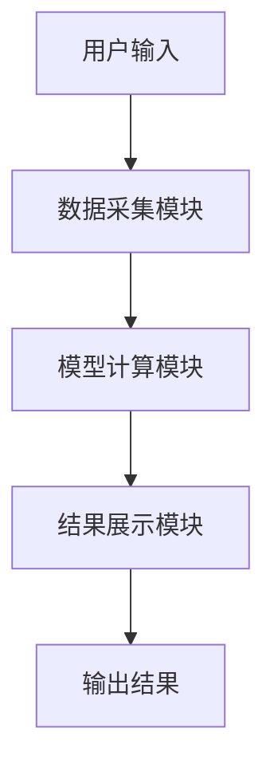
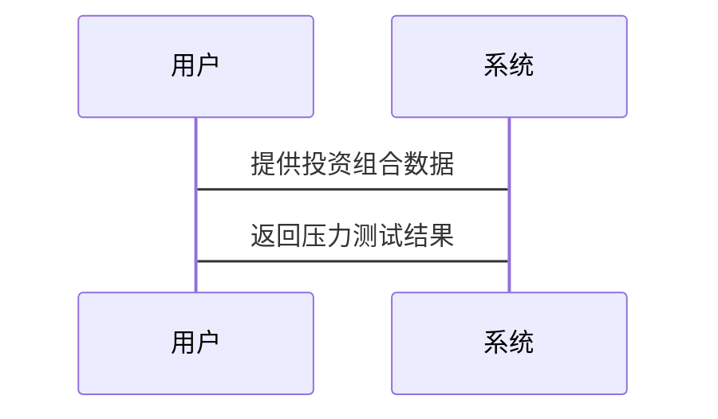

                 


# 投资组合压力测试：评估极端情景下的风险敞口

## 关键词：
- 投资组合
- 压力测试
- 风险敞口
- 极端情景
- 数学模型

## 摘要：
投资组合压力测试是评估投资组合在极端市场条件下的表现和风险的重要工具。本文详细探讨压力测试的核心概念、数学模型、算法实现、系统架构和项目实战。通过分析极端情景，量化风险敞口，并提供最佳实践，帮助投资者和金融机构有效管理投资风险。

---

# 第1章: 投资组合压力测试概述

## 1.1 压力测试的定义与目的

### 1.1.1 什么是压力测试
压力测试是一种金融工具，用于评估投资组合在极端市场条件下的表现。通过模拟市场崩盘、经济衰退等极端情景，压力测试帮助投资者了解投资组合在极端情况下的潜在损失。

### 1.1.2 压力测试的目的
压力测试的主要目的是识别投资组合中的风险敞口，评估极端情景下的损失，帮助投资者制定风险管理和对冲策略。

### 1.1.3 压力测试在金融中的重要性
压力测试是金融机构评估和管理风险的重要手段，特别是在金融危机期间，压力测试能够帮助机构提前准备，避免重大损失。

---

## 1.2 极端情景分析

### 1.2.1 极端情景的定义
极端情景是指超出正常市场波动的极端情况，如市场崩盘、经济衰退、流动性危机等。

### 1.2.2 极端情景的分类
极端情景可以分为市场风险、信用风险、流动性风险和操作风险等类别。

### 1.2.3 极端情景的应用案例
通过历史案例分析，如2008年金融危机，说明压力测试在极端情景下的应用和效果。

---

## 1.3 投资组合风险敞口

### 1.3.1 风险敞口的定义
风险敞口是指投资组合在特定市场条件下的潜在损失。

### 1.3.2 风险敞口的量化
通过数学模型和统计方法，量化投资组合在不同情景下的风险敞口。

### 1.3.3 风险敞口的管理
介绍风险管理策略，如分散投资、对冲交易和风险限额等。

---

## 1.4 本章小结
本章介绍了压力测试的基本概念、极端情景分析以及投资组合风险敞口的定义和量化方法。

---

# 第2章: 压力测试模型基础

## 2.1 压力测试的核心概念

### 2.1.1 风险因子
风险因子是影响投资组合风险的主要因素，如市场波动率、利率变化等。

### 2.1.2 情景生成
情景生成是压力测试的关键步骤，通过模拟不同极端情景，评估投资组合的表现。

### 2.1.3 模型假设
压力测试模型需要假设极端情景的概率分布和相关性。

---

## 2.2 单因素压力测试模型

### 2.2.1 模型定义
单因素模型假设只有一个风险因子影响投资组合，如市场波动率。

### 2.2.2 模型假设
假设市场波动率是唯一的风险因子，且服从特定的概率分布。

### 2.2.3 模型实现
通过数学公式和代码实现单因素压力测试模型。

---

## 2.3 多因素压力测试模型

### 2.3.1 模型定义
多因素模型考虑多个风险因子，如市场波动率和利率变化。

### 2.3.2 模型假设
假设多个风险因子之间存在相关性，并且服从特定的概率分布。

### 2.3.3 模型实现
通过数学公式和代码实现多因素压力测试模型。

---

## 2.4 模型对比与选择

### 2.4.1 单因素与多因素模型对比
比较单因素和多因素模型在假设、复杂性和计算效率方面的差异。

### 2.4.2 模型选择的考虑因素
考虑投资组合的复杂性、数据的可用性和计算能力等因素。

### 2.4.3 模型的优缺点
分析单因素和多因素模型的优缺点，帮助读者选择合适的模型。

---

## 2.5 本章小结
本章详细介绍了压力测试模型的核心概念、单因素和多因素模型的实现方法，并对比了两种模型的优缺点。

---

# 第3章: 投资组合风险敞口的量化

## 3.1 风险敞口的量化方法

### 3.1.1 历史波动率法
通过历史数据计算投资组合的波动率，评估风险敞口。

### 3.1.2 情景分析法
通过模拟极端情景，评估投资组合在不同情景下的表现。

### 3.1.3 方差协方差法
利用方差协方差矩阵量化投资组合的风险敞口。

---

## 3.2 风险敞口的数学模型

### 3.2.1 方差协方差矩阵
$$\text{方差协方差矩阵} = \begin{bmatrix} \sigma_1^2 & \sigma_{1,2} & \dots & \sigma_{1,n} \\ \sigma_{2,1} & \sigma_2^2 & \dots & \sigma_{2,n} \\ \vdots & \vdots & \ddots & \vdots \\ \sigma_{n,1} & \sigma_{n,2} & \dots & \sigma_n^2 \end{bmatrix}$$

### 3.2.2 投资组合收益与风险的公式
$$\text{投资组合收益} = \mathbf{w}^T \mu$$
$$\text{投资组合风险} = \mathbf{w}^T \Sigma \mathbf{w}$$

### 3.2.3 风险敞口的计算公式
$$\text{风险敞口} = \text{投资组合价值} \times \text{风险因子}$$

---

## 3.3 风险敞口的可视化

### 3.3.1 风险敞口的图表展示
使用柱状图、折线图等图表展示投资组合的风险敞口。

### 3.3.2 风险敞口的热力图
通过热力图展示投资组合在不同情景下的风险敞口。

### 3.3.3 风险敞口的三维图
使用三维图展示投资组合在不同情景下的风险敞口。

---

## 3.4 本章小结
本章详细介绍了风险敞口的量化方法，包括历史波动率法、情景分析法和方差协方差法，并通过数学公式和图表展示了风险敞口的计算和可视化方法。

---

# 第4章: 压力测试的算法实现

## 4.1 压力测试算法概述

### 4.1.1 算法原理
压力测试算法通过模拟极端情景，计算投资组合在不同情景下的表现。

### 4.1.2 算法步骤
1. 确定极端情景
2. 计算投资组合在极端情景下的表现
3. 评估风险敞口

### 4.1.3 算法实现的注意事项
考虑数据的准确性和计算效率。

---

## 4.2 压力测试算法的数学模型

### 4.2.1 压力测试的数学公式
$$\text{投资组合损失} = \text{投资组合价值} \times \text{损失率}$$

### 4.2.2 压力测试的优化方法
使用优化算法（如蒙特卡罗模拟）提高计算效率。

### 4.2.3 压力测试的收敛性分析
分析算法的收敛性，确保计算结果的准确性。

---

## 4.3 算法实现的Python代码

### 4.3.1 单因素压力测试模型

```python
import numpy as np

def single_factor_stress_test(returns, factor):
    # 计算投资组合的收益波动率
    portfolio_volatility = np.std(returns)
    # 计算风险因子的波动率
    factor_volatility = np.std(factor)
    # 计算压力测试结果
    stress_test_results = returns * (1 + np.random.normal(0, factor_volatility))
    return stress_test_results
```

### 4.3.2 多因素压力测试模型

```python
import numpy as np

def multi_factor_stress_test(returns, factors):
    # 计算投资组合的收益波动率
    portfolio_volatility = np.std(returns)
    # 计算多个风险因子的协方差矩阵
    factor_covariance = np.cov(factors)
    # 计算压力测试结果
    stress_test_results = np.dot(returns, factor_covariance)
    return stress_test_results
```

---

## 4.4 本章小结
本章详细介绍了压力测试算法的实现方法，包括单因素和多因素模型的代码实现，并分析了算法的收敛性。

---

# 第5章: 系统架构与项目实战

## 5.1 系统架构设计

### 5.1.1 系统功能设计
1. 数据采集模块
2. 模型计算模块
3. 结果展示模块

### 5.1.2 系统架构图



### 5.1.3 系统交互图



---

## 5.2 项目实战

### 5.2.1 环境安装
安装必要的Python库，如NumPy、Pandas和Matplotlib。

### 5.2.2 核心代码实现

```python
import numpy as np
import pandas as pd
import matplotlib.pyplot as plt

def perform_stress_test(returns, scenarios):
    # 计算投资组合在不同情景下的表现
    stressed_returns = returns * scenarios
    # 计算投资组合的损失
    portfolio_loss = np.mean(stressed_returns)
    return portfolio_loss

# 示例数据
returns = pd.Series([0.01, 0.02, 0.01, 0.03, 0.02])
scenarios = pd.Series([-0.1, -0.2, 0.1, 0.2, -0.15])

# 执行压力测试
portfolio_loss = perform_stress_test(returns, scenarios)
print("投资组合损失:", portfolio_loss)
```

### 5.2.3 案例分析与结果解读
通过具体案例分析，解读压力测试结果，并提出风险管理建议。

---

## 5.3 本章小结
本章详细介绍了压力测试系统的架构设计和项目实战，展示了如何通过代码实现压力测试，并分析了测试结果。

---

# 第6章: 总结与展望

## 6.1 本章总结
总结全文，回顾压力测试的核心概念、数学模型和算法实现。

## 6.2 未来展望
探讨压力测试技术的未来发展方向，如人工智能和大数据技术的应用。

---

# 作者：AI天才研究院/AI Genius Institute & 禅与计算机程序设计艺术 /Zen And The Art of Computer Programming

---

# END

