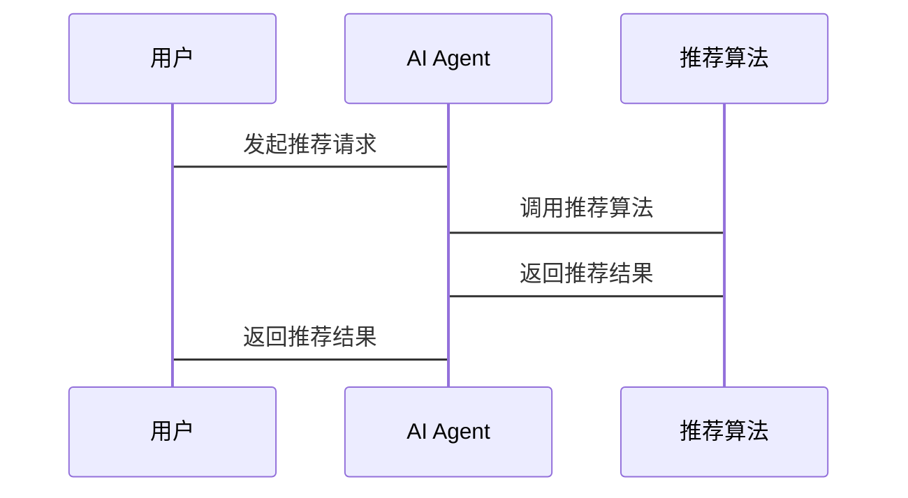

                 


# 推荐系统集成：个性化建议的AI Agent

> 关键词：推荐系统、AI Agent、个性化推荐、协同过滤、机器学习、自然语言处理

> 摘要：推荐系统在现代信息技术中扮演着越来越重要的角色，尤其是在个性化建议方面。随着人工智能技术的快速发展，AI Agent逐渐成为推荐系统的核心驱动力。本文将详细介绍推荐系统的集成过程，探讨如何通过AI Agent实现个性化的建议。从推荐系统的算法原理到AI Agent的核心技术，再到两者的集成与优化，本文将全面解析推荐系统集成的实现过程。

---

# 第1章 推荐系统的背景与概念

## 1.1 推荐系统的定义与应用

推荐系统是一种基于用户行为和偏好，提供个性化建议的系统。它广泛应用于电商、社交网络、视频平台等领域。例如， Netflix 的推荐系统可以根据用户的观看历史和偏好，推荐相似的电影或电视剧。

$$推荐系统的本质是通过分析数据，预测用户对某些物品的偏好，并提供个性化建议。$$

---

## 1.2 AI Agent的核心功能

AI Agent（智能代理）是一种能够感知环境并采取行动以实现目标的智能实体。它可以通过自然语言处理、强化学习等技术，与用户进行交互，并根据用户需求提供个性化服务。

$$AI Agent的核心功能包括：感知、决策、执行和反馈。$$

---

## 1.3 推荐系统与AI Agent的结合

推荐系统的个性化建议可以通过AI Agent实现。AI Agent可以实时分析用户行为，调用推荐算法，为用户提供动态的个性化建议。

$$通过AI Agent，推荐系统可以更加智能化，能够理解用户的上下文和情感，提供更精准的推荐。$$

---

# 第2章 推荐系统的算法原理

## 2.1 协同过滤算法

协同过滤是一种基于用户相似性或物品相似性的推荐算法。常用的协同过滤算法包括基于用户的协同过滤（UBCF）和基于物品的协同过滤（IBCF）。

### 2.1.1 协同过滤的基本原理

协同过滤通过分析用户的行为数据，找到与当前用户相似的用户群体，或者与当前物品相似的物品集合，进而推荐给用户。

$$相似度计算公式：$$

$$
similarity(u_i, u_j) = \frac{\sum_{k} (r_{i,k} - \bar{r_i})(r_{j,k} - \bar{r_j})}
}
$$

其中，$r_{i,k}$表示用户$i$对物品$k$的评分，$\bar{r_i}$表示用户$i$的平均评分。

### 2.1.2 基于用户的协同过滤（UBCF）

UBCF的核心思想是找到与当前用户相似的其他用户，并将这些用户喜欢的物品推荐给当前用户。

$$代码示例：$$

```python
import numpy as np

# 用户-物品评分矩阵
rating_matrix = np.array([[4, 3, 2],
                            [5, 1, 3],
                            [3, 4, 2]])

# 计算用户相似度
def compute_similarity(rating_matrix):
    n_users, n_items = rating_matrix.shape
    similarity_matrix = np.zeros((n_users, n_users))
    for i in range(n_users):
        for j in range(n_users):
            if i != j:
                # 计算相似度
                similarity = np.corrcoef(rating_matrix[i], rating_matrix[j])[0, 1]
                similarity_matrix[i, j] = similarity
    return similarity_matrix

similarity_matrix = compute_similarity(rating_matrix)
print(similarity_matrix)
```

---

## 2.2 基于内容的推荐算法

基于内容的推荐算法通过分析物品的属性（如文本、图像等），生成与当前用户兴趣相似的内容。

### 2.2.1 基于文本挖掘的推荐

文本挖掘技术可以提取物品的关键词，并通过语义分析生成推荐结果。

$$代码示例：$$

```python
from sklearn.feature_extraction.text import TfidfVectorizer

# 文本数据
texts = ["This is a sample text.", "Another sample text here.", "This is the third text."]

# 提取TF-IDF特征
vectorizer = TfidfVectorizer()
tfidf_matrix = vectorizer.fit_transform(texts)

print(tfidf_matrix)
```

---

## 2.3 基于矩阵分解的推荐算法

矩阵分解是一种将用户-物品评分矩阵分解为两个低维矩阵的技术，常用的方法包括奇异值分解（SVD）。

### 2.3.1 矩阵分解的基本原理

矩阵分解通过分解用户-物品评分矩阵，提取潜在的特征向量，进而生成推荐结果。

$$矩阵分解公式：$$

$$
R = P \times Q^T
$$

其中，$R$是用户-物品评分矩阵，$P$是用户特征矩阵，$Q$是物品特征矩阵。

### 2.3.2 矩阵分解的实现

$$代码示例：$$

```python
import numpy as np

# 用户-物品评分矩阵
R = np.array([[4, 3, 2],
              [5, 1, 3],
              [3, 4, 2]])

# 矩阵分解
def matrix_factorization(R, K=2):
    P = np.random.randn(len(R), K)
    Q = np.random.randn(len(R[0]), K)
    for _ in range(10):
        # 更新P和Q
        Q = Q * (R.dot(P)) / (P.T.dot(P) + 1e-5)
        P = P * (R.T.dot(Q)) / (Q.T.dot(Q) + 1e-5)
    return P, Q

P, Q = matrix_factorization(R)
print("P:", P)
print("Q:", Q)
```

---

# 第3章 AI Agent的核心技术

## 3.1 自然语言处理（NLP）

NLP技术可以帮助AI Agent理解用户的需求，并生成自然的回复。

### 3.1.1 NLP的基本概念

NLP包括文本处理、语义分析、情感分析等功能。

### 3.1.2 NLP在推荐系统中的应用

通过NLP技术，AI Agent可以理解用户的查询内容，并生成相关的推荐结果。

$$代码示例：$$

```python
from transformers import pipeline

# 情感分析
sentiment_analyzer = pipeline("sentiment-analysis")
result = sentiment_analyzer("I love this movie.")
print(result)
```

---

## 3.2 强化学习

强化学习是一种通过与环境交互，不断优化决策策略的技术。

### 3.2.1 强化学习的基本原理

强化学习通过定义状态、动作和奖励，训练智能体做出最优决策。

$$强化学习的马尔可夫决策过程（MDP）公式：$$

$$
V(s) = \max_a \left( r(s,a) + \gamma \sum_{s'} P(s'|s,a) V(s') \right)
$$

其中，$s$是状态，$a$是动作，$r$是奖励函数，$\gamma$是折扣因子。

### 3.2.2 强化学习在推荐系统中的应用

通过强化学习，AI Agent可以动态调整推荐策略，以最大化用户的满意度。

$$代码示例：$$

```python
import gym
from gym import spaces

class RecommendationEnv(gym.Env):
    def __init__(self):
        self.action_space = spaces.Discrete(3)  # 推荐列表长度为3
        self.observation_space = spaces.Discrete(5)  # 用户类别为5种
        self.current_state = 0

    def step(self, action):
        # 返回奖励和下一个状态
        pass

    def reset(self):
        # 初始化环境
        pass
```

---

## 3.3 知识图谱

知识图谱是一种以图结构表示知识的技术，可以用于推荐系统的语义分析。

### 3.3.1 知识图谱的构建

知识图谱的构建包括数据抽取、实体识别和关系抽取等步骤。

### 3.3.2 知识图谱在推荐系统中的应用

通过知识图谱，AI Agent可以理解推荐结果的语义，并提供更精准的推荐。

---

# 第4章 推荐系统与AI Agent的集成

## 4.1 数据处理与特征提取

### 4.1.1 数据预处理

数据预处理包括清洗、归一化和特征提取等步骤。

$$代码示例：$$

```python
import pandas as pd
from sklearn.preprocessing import StandardScaler

# 数据清洗
data = pd.read_csv("data.csv")
data.dropna(inplace=True)

# 特征归一化
scaler = StandardScaler()
scaled_data = scaler.fit_transform(data[["age", "score"]])
```

---

## 4.2 系统架构设计

### 4.2.1 分层架构

分层架构包括数据层、算法层和应用层。

### 4.2.2 微服务架构

微服务架构适合复杂推荐系统的开发。

$$微服务架构的组成部分：$$

1. 数据服务
2. 推荐算法服务
3. 用户交互服务
4. API网关

---

## 4.3 系统交互流程

### 4.3.1 用户请求

用户向AI Agent发送推荐请求。

### 4.3.2 系统响应

AI Agent调用推荐算法，生成推荐结果，并返回给用户。

$$系统交互流程图：$$



---

# 第5章 项目实战：基于AI Agent的推荐系统实现

## 5.1 项目介绍

### 5.1.1 项目背景

本项目旨在开发一个基于AI Agent的推荐系统，实现个性化建议。

### 5.1.2 项目目标

通过本项目，读者可以掌握推荐系统的集成方法。

---

## 5.2 系统实现

### 5.2.1 环境配置

#### 5.2.1.1 安装依赖库

```bash
pip install numpy scikit-learn transformers gym
```

### 5.2.2 核心代码实现

#### 5.2.2.1 数据预处理

```python
import pandas as pd

# 加载数据
data = pd.read_csv("user_ratings.csv")

# 删除缺失值
data.dropna(inplace=True)

# 归一化处理
from sklearn.preprocessing import StandardScaler
scaled_data = StandardScaler().fit_transform(data[['age', 'score']])
```

#### 5.2.2.2 推荐算法实现

```python
from sklearn.decomposition import NMF

# 矩阵分解
model = NMF(n_components=2, random_state=42)
model.fit(scaled_data)

# 推荐结果
user_features = model.components_
item_features = model.transform(scaled_data)
```

---

## 5.3 项目分析与优化

### 5.3.1 系统性能优化

#### 5.3.1.1 算法优化

通过调整矩阵分解的参数，优化推荐系统的性能。

### 5.3.2 系统扩展性设计

#### 5.3.2.1 高可用性设计

通过负载均衡和容灾设计，提高推荐系统的可用性。

---

## 5.4 项目总结

通过本项目，我们掌握了推荐系统的集成方法，了解了AI Agent的核心技术。同时，我们还探讨了如何优化推荐系统的性能和扩展性。

---

# 第6章 系统分析与优化

## 6.1 系统性能分析

### 6.1.1 算法性能分析

通过分析不同算法的计算复杂度，优化推荐系统的性能。

### 6.1.2 系统资源分配

合理分配计算资源，提高推荐系统的运行效率。

---

## 6.2 系统优化策略

### 6.2.1 算法优化

通过改进推荐算法，提高推荐系统的准确性和响应速度。

### 6.2.2 系统架构优化

通过优化系统架构，提高推荐系统的扩展性和可用性。

---

# 第7章 未来展望与挑战

## 7.1 未来发展方向

### 7.1.1 新兴技术的应用

如图神经网络、联邦学习等新技术的应用。

### 7.1.2 多模态推荐系统

结合文本、图像等多种模态信息，提供更精准的推荐。

---

## 7.2 当前挑战

### 7.2.1 数据隐私问题

如何在保护用户隐私的前提下，实现精准推荐。

### 7.2.2 算法解释性问题

如何提高推荐系统的透明度和可解释性。

---

# 作者：AI天才研究院 & 禅与计算机程序设计艺术

---

**本文通过详细分析推荐系统的算法原理和AI Agent的核心技术，探讨了两者结合的实现方法。通过实际案例分析，读者可以掌握推荐系统的集成技巧，并了解未来的发展方向和挑战。**

