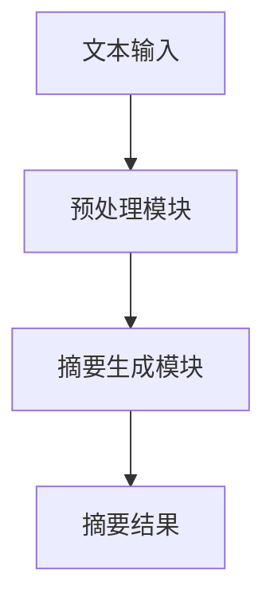
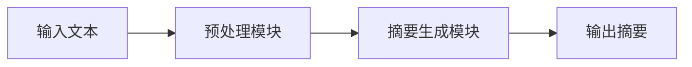
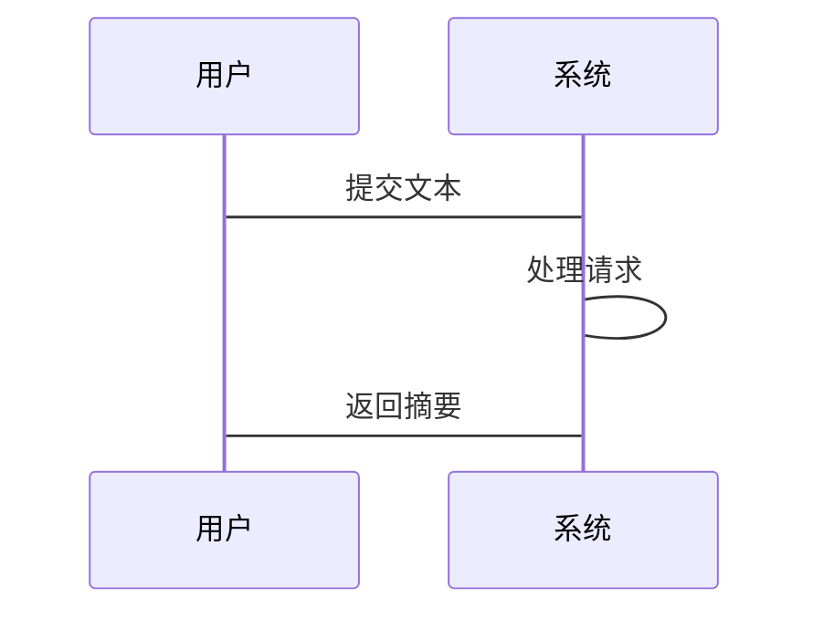

                 


# 文本摘要技术：AI Agent信息处理的利器

---

## 关键词  
文本摘要，自然语言处理，AI Agent，信息抽取，信息提取，信息处理  

---

## 摘要  
文本摘要技术是自然语言处理领域的重要技术，能够帮助AI Agent高效地理解和处理海量文本信息。本文从文本摘要的基本原理出发，结合AI Agent的应用场景，详细分析了文本摘要的核心概念、算法原理、系统架构设计以及项目实战，旨在为读者提供一个全面而深入的技术指南。

---

# 第一部分: 背景介绍

## 第1章: 问题背景与技术解决

### 1.1 问题背景
在信息爆炸的时代，每天产生的文本数据呈指数级增长。如何快速提取文本中的核心信息，成为一项重要挑战。文本摘要技术通过自动化方式提取文本的关键内容，解决了人工阅读效率低的问题。

### 1.2 技术解决
文本摘要技术利用自然语言处理算法，将长文本转化为简洁的摘要，帮助AI Agent快速理解输入内容。通过生成式或抽取式方法，模型可以自动生成高质量的摘要。

### 1.3 AI Agent中的应用
AI Agent通过文本摘要技术，能够高效处理大量文本数据，例如从社交媒体中提取情感分析信息、从新闻中提取关键事件等。这种能力使得AI Agent在多个领域展现出强大的应用潜力。

---

# 第二部分: 核心概念与原理

## 第2章: 文本摘要的核心概念

### 2.1 核心原理
文本摘要通过分析文本的语义结构，提取关键信息并生成摘要。生成式方法基于语言模型生成新的文本，抽取式方法直接从原文中选择重要片段。

### 2.2 生成式与抽取式对比
| 对比维度 | 生成式摘要 | 抽取式摘要 |
|----------|------------|------------|
| 方法 | 基于语言模型生成新文本 | 从原文中选择重要片段 |
| 优势 | 摘要更具连贯性 | 更忠实于原文 |
| 缺点 | 可能偏离原文信息 | 受原文限制 |

### 2.3 实体关系图


---

# 第三部分: 算法原理

## 第3章: 算法流程与实现

### 3.1 算法流程
1. **预处理**：对文本进行分词、去停用词等处理。
2. **模型训练**：基于大规模数据训练语言模型。
3. **摘要生成**：利用模型生成或抽取摘要内容。

### 3.2 模型实现
#### 3.2.1 生成式模型
基于GPT的生成式摘要模型：
```python
def generate_summary(model, tokenizer, text):
    inputs = tokenizer(text, return_tensors='pt')
    outputs = model.generate(inputs.input_ids, max_length=100)
    return tokenizer.decode(outputs[0], skip_special_tokens=True)
```

#### 3.2.2 抽取式模型
基于BERT的抽取式摘要模型：
```python
from transformers import pipeline
summarizer = pipeline("summarization")
summary = summarizer(text, max_length=50, min_length=10, do_xla= False)
```

### 3.3 数学模型与公式
#### 生成式模型的损失函数
$$ \text{Loss} = -\sum_{i=1}^{n} \log p(x_i|y) $$

#### 注意力机制公式
$$ \text{Attention}(Q, K, V) = \text{softmax}\left(\frac{QK^T}{\sqrt{d_k}}\right)V $$

---

# 第四部分: 系统分析与架构设计

## 第4章: 系统架构设计

### 4.1 系统功能设计
系统包括预处理模块、摘要生成模块和结果输出模块。

### 4.2 系统架构图


### 4.3 接口设计
系统提供RESTful API接口，支持批量处理和回调机制。

### 4.4 交互流程


---

# 第五部分: 项目实战

## 第5章: 文本摘要系统开发

### 5.1 环境安装
安装必要的依赖：
```bash
pip install transformers
```

### 5.2 核心代码实现
生成式摘要实现：
```python
from transformers import AutoTokenizer, AutoModelForMaskedLM
tokenizer = AutoTokenizer.from_pretrained('bert-base-uncased')
model = AutoModelForMaskedLM.from_pretrained('bert-base-uncased')
```

### 5.3 案例分析
使用训练好的模型处理一篇新闻文本，生成100字摘要。

### 5.4 项目小结
通过实战，我们掌握了文本摘要技术的实现方法，并了解了系统开发的流程。

---

# 第六部分: 最佳实践与小结

## 第6章: 最佳实践

### 6.1 技术选型建议
根据具体需求选择生成式或抽取式方法，合理配置模型参数。

### 6.2 性能优化技巧
使用并行计算和模型剪枝等方法提升效率。

### 6.3 注意事项
确保数据质量和模型的可解释性，避免摘要偏差。

## 第7章: 总结与展望

### 7.1 全文总结
文本摘要技术是AI Agent处理文本信息的重要工具，通过多种方法和模型的结合，能够有效提升信息处理效率。

### 7.2 未来展望
随着深度学习技术的发展，文本摘要技术将更加智能化和个性化，应用场景也将更加广泛。

---

## 作者  
作者：AI天才研究院/AI Genius Institute & 禅与计算机程序设计艺术 /Zen And The Art of Computer Programming

