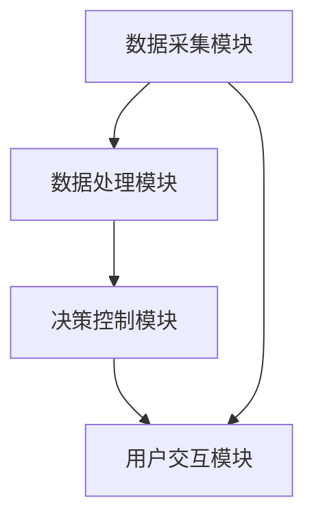

                 


# 《新兴市场股市估值与智慧农业精准灌溉系统的互动》

## 关键词：新兴市场、股市估值、智慧农业、精准灌溉系统、数据驱动、技术融合

## 摘要：  
本文探讨新兴市场股市估值与智慧农业精准灌溉系统之间的互动关系，分析精准灌溉技术如何通过数据驱动影响股市估值，同时股市的资本流动如何反哺农业技术的发展。文章从背景介绍、核心概念、算法原理、系统架构设计、项目实战等多维度展开，结合实际案例，深入剖析两者互动机制，为智慧农业和金融领域的结合提供新的视角。

---

# 第一部分：背景与概述

## 第1章：新兴市场股市估值与智慧农业的互动背景

### 1.1 新兴市场的定义与特点

#### 1.1.1 新兴市场的经济特征
- **经济结构**：新兴市场通常以制造业和服务业为主，经济增长速度快，但波动性较大。
- **市场规模**：股市规模迅速扩大，投资者结构多元化，包括机构投资者和个人投资者。
- **政策环境**：政府政策对市场影响较大，可能涉及外汇管制、行业补贴等。

#### 1.1.2 新兴市场的股市特点
- **高波动性**：新兴市场股市受宏观经济影响较大，波动性显著高于发达市场。
- **行业集中**：新兴市场的股市中，金融、科技、能源等行业占据较大比重。
- **估值差异**：与发达市场相比，新兴市场的估值可能更具吸引力，但也面临更高的风险。

#### 1.1.3 新兴市场与传统市场的对比
- **市场规模**：新兴市场股市规模较小，但增长潜力大。
- **投资者结构**：新兴市场个人投资者占比高，机构投资者占比相对较低。
- **流动性**：新兴市场流动性可能较低，尤其是在市场波动时。

### 1.2 智慧农业的定义与发展

#### 1.2.1 智慧农业的核心概念
- 智慧农业通过物联网、大数据、人工智能等技术，实现农业生产的智能化、精准化和高效化。
- 核心目标是优化资源配置，提高产量，降低环境影响。

#### 1.2.2 智慧农业的技术基础
- **物联网技术**：用于采集农业环境数据（如温度、湿度、光照）。
- **大数据分析**：处理海量农业数据，提供决策支持。
- **人工智能**：用于预测天气、病虫害，优化种植策略。

#### 1.2.3 智慧农业的全球发展趋势
- **技术驱动**：全球范围内，智慧农业技术的应用越来越广泛。
- **政策支持**：各国政府通过政策和资金支持推动智慧农业发展。
- **可持续发展**：智慧农业有助于减少资源浪费，实现可持续发展目标。

### 1.3 精准灌溉系统的概述

#### 1.3.1 精准灌溉的定义
- 精准灌溉是一种基于实时数据的灌溉技术，根据作物需求和环境条件，精确控制灌溉量和时间。

#### 1.3.2 精准灌溉的关键技术
- **土壤传感器**：监测土壤湿度、养分含量。
- **气象传感器**：监测温度、湿度、光照强度。
- **数据传输技术**：将传感器数据传输到中央控制系统。

#### 1.3.3 精准灌溉的经济与环境效益
- **经济效益**：减少水资源浪费，提高作物产量。
- **环境效益**：降低农业面源污染，保护生态环境。

### 1.4 股市估值与智慧农业的互动关系

#### 1.4.1 股市估值的定义与影响因素
- **股市估值**：通过市盈率、市净率等指标评估股票的价值。
- **影响因素**：包括公司业绩、行业前景、宏观经济环境、政策支持等。

#### 1.4.2 智慧农业对股市估值的影响
- **技术创新**：智慧农业技术的突破可能提升相关企业的估值。
- **市场前景**：智慧农业的广泛应用可能带动相关股票的上涨。
- **资本流动**：投资者对智慧农业的关注可能影响股市资金流向。

#### 1.4.3 互动机制的初步探讨
- **数据共享**：精准灌溉系统产生的农业数据可能被用于股市估值。
- **技术融合**：股市估值的技术进步可能推动精准灌溉系统的发展。
- **政策驱动**：政府政策可能同时影响股市和农业技术的发展。

---

## 第二部分：新兴市场股市估值分析

## 第2章：新兴市场股市估值的核心指标与模型

### 2.1 股市估值的主要指标

#### 2.1.1 市盈率（P/E）
- **定义**：市盈率 = 股票价格 / 每股收益。
- **用途**：衡量股票的相对价值，判断是否被高估或低估。
- **局限性**：市盈率受行业和宏观经济环境影响较大。

#### 2.1.2 市净率（P/B）
- **定义**：市净率 = 股票价格 / 每股净资产。
- **用途**：适用于净资产驱动型的公司，如银行、制造业。
- **局限性**：净资产不一定反映公司的真实价值。

#### 2.1.3 市销率（P/S）
- **定义**：市销率 = 股票价格 / 每股收入。
- **用途**：适用于收入驱动型的公司，如科技公司。
- **局限性**：收入质量可能影响市销率的准确性。

### 2.2 新兴市场的独特估值挑战

#### 2.2.1 市场波动性高
- 新兴市场股市受宏观经济波动影响较大，市盈率等指标可能波动剧烈。
- 投资者需更加谨慎地分析短期和长期趋势。

#### 2.2.2 信息不对称问题
- 新兴市场信息披露可能不完善，影响估值的准确性。
- 投资者需依赖外部数据和第三方分析。

#### 2.2.3 宏观经济因素的影响
- 利率、汇率、通货膨胀等宏观经济因素对新兴市场股市估值影响显著。
- 需结合宏观经济指标进行综合分析。

### 2.3 股市估值模型的构建与应用

#### 2.3.1 常用估值模型概述
- **DCF模型**：现金流折现法，适用于盈利稳定的公司。
- **相对估值法**：基于可比公司的市盈率、市净率等指标进行估值。
- **指数估值法**：通过市场指数表现判断整体估值水平。

#### 2.3.2 新兴市场的估值模型调整
- **行业差异**：新兴市场中不同行业估值模型的适用性不同。
- **风险调整**：新兴市场风险较高，需在模型中加入风险溢价。
- **数据调整**：新兴市场数据可能不完整，需进行数据清洗和调整。

#### 2.3.3 案例分析：某新兴市场股市估值
- **案例背景**：假设新兴市场A，分析其股市估值。
- **数据收集**：收集市盈率、市净率等指标。
- **模型应用**：使用DCF模型和相对估值法进行对比分析。
- **结论**：新兴市场A的估值可能被低估，具有投资潜力。

---

## 第三部分：智慧农业精准灌溉系统的技术实现

## 第3章：精准灌溉系统的构成与技术基础

### 3.1 精准灌溉的核心技术

#### 3.1.1 土壤传感器
- **类型**：电导率传感器、湿度传感器。
- **功能**：实时监测土壤湿度和养分含量。
- **应用场景**：用于灌溉控制和施肥优化。

#### 3.1.2 气象传感器
- **类型**：温度传感器、光照强度传感器、降雨量传感器。
- **功能**：监测环境条件，为灌溉决策提供依据。
- **应用场景**：预测天气变化，优化灌溉计划。

#### 3.1.3 数据采集与传输技术
- **技术特点**：实时采集数据，通过无线通信技术传输到中央控制系统。
- **应用场景**：实现远程监控和自动化灌溉。

### 3.2 精准灌溉系统的架构设计

#### 3.2.1 系统功能模块划分
- **数据采集模块**：负责采集土壤和气象数据。
- **数据处理模块**：对数据进行清洗、分析和存储。
- **决策控制模块**：根据数据分析结果，控制灌溉设备。
- **用户交互模块**：提供直观的用户界面，供用户查看数据和操作设备。

#### 3.2.2 系统数据流图


#### 3.2.3 系统组件之间的关系
- **数据采集模块**与**数据处理模块**：数据采集模块将原始数据传输到数据处理模块进行分析。
- **数据处理模块**与**决策控制模块**：数据处理模块提供分析结果，指导决策控制模块进行灌溉控制。
- **决策控制模块**与**用户交互模块**：用户可以通过交互模块查看灌溉状态并进行手动调整。

### 3.3 数据分析与决策支持

#### 3.3.1 数据分析方法
- **回归分析**：用于预测作物产量与灌溉量的关系。
- **时间序列分析**：分析历史数据，预测未来灌溉需求。
- **机器学习算法**：如随机森林、支持向量机，用于分类和回归分析。

#### 3.3.2 决策支持系统
- **决策规则**：根据土壤湿度、天气预报等数据，制定灌溉策略。
- **优化算法**：如遗传算法，用于优化灌溉方案。

#### 3.3.3 精准灌溉算法实现
- **算法原理**：基于土壤湿度和天气预报，计算灌溉量和时间。
- **算法实现**：使用Python编写，集成到系统中。
- **案例分析**：通过实际案例展示算法的应用效果。

---

## 第四部分：股市估值与精准灌溉系统的互动机制

## 第4章：数据共享与技术融合

### 4.1 股市数据与农业数据的关联

#### 4.1.1 股市数据的来源与特征
- **来源**：股票价格、成交量、市盈率等。
- **特征**：高波动性、受宏观经济影响大。

#### 4.1.2 农业数据的来源与特征
- **来源**：土壤传感器、气象传感器、灌溉记录等。
- **特征**：实时性、多样性、高维度。

#### 4.1.3 数据关联的潜在价值
- **风险预警**：通过分析农业数据，预测粮食产量波动，提前反映到股市。
- **投资决策**：投资者可以根据农业数据，判断相关企业的业绩前景。

### 4.2 精准灌溉数据对股市估值的影响

#### 4.2.1 农业数据对股市的影响路径
- **直接路径**：精准灌溉技术的应用提升企业利润，影响股票估值。
- **间接路径**：农业数据影响宏观经济指标，进而影响股市整体表现。

#### 4.2.2 数据驱动的股市预测
- **数据来源**：精准灌溉系统产生的农业数据。
- **预测方法**：使用机器学习算法，结合股市历史数据，预测未来走势。
- **案例分析**：通过具体案例展示数据驱动的股市预测效果。

### 4.3 股市资本流动对精准灌溉系统的影响

#### 4.3.1 资本流入与技术创新
- **资本流入**：股市资金流入农业技术公司，推动技术创新。
- **技术创新**：技术创新提升公司业绩，进一步吸引资金流入。

#### 4.3.2 投资者的角色
- **机构投资者**：通过投资农业技术公司，推动精准灌溉系统的普及。
- **个人投资者**：通过股市投资，间接支持智慧农业的发展。

---

## 第五部分：系统架构与项目实战

## 第5章：系统架构设计与项目实战

### 5.1 系统架构设计

#### 5.1.1 系统功能模块划分
- **数据采集模块**：负责采集土壤和气象数据。
- **数据处理模块**：对数据进行清洗、分析和存储。
- **决策控制模块**：根据分析结果，控制灌溉设备。
- **用户交互模块**：提供直观的用户界面，供用户查看数据和操作设备。

#### 5.1.2 系统数据流图


#### 5.1.3 系统组件之间的关系
- **数据采集模块**与**数据处理模块**：数据采集模块将原始数据传输到数据处理模块进行分析。
- **数据处理模块**与**决策控制模块**：数据处理模块提供分析结果，指导决策控制模块进行灌溉控制。
- **决策控制模块**与**用户交互模块**：用户可以通过交互模块查看灌溉状态并进行手动调整。

### 5.2 项目实战

#### 5.2.1 环境安装
- **硬件安装**：安装土壤传感器、气象传感器、灌溉设备。
- **软件安装**：安装数据采集系统、数据分析平台、灌溉控制系统。

#### 5.2.2 系统核心实现源代码
- **数据采集代码**：Python脚本，读取传感器数据并存储到数据库。
```python
import sqlite3
import datetime

conn = sqlite3.connect('agriculture.db')
cursor = conn.cursor()

# 插入数据
cursor.execute('''
    INSERT INTO soil_data (temperature, humidity, timestamp)
    VALUES (?, ?, ?)
''', (25, 0.6, datetime.datetime.now()))
conn.commit()
conn.close()
```

- **数据分析代码**：使用机器学习算法分析数据，预测灌溉需求。
```python
from sklearn.ensemble import RandomForestRegressor

# 训练模型
model = RandomForestRegressor(n_estimators=100)
model.fit(X_train, y_train)

# 预测
y_pred = model.predict(X_test)
```

- **灌溉控制代码**：根据数据分析结果，控制灌溉设备。
```python
import serial

# 连接设备
ser = serial.Serial('COM3', 9600)

# 发送指令
ser.write(b'irrigate\n')
```

#### 5.2.3 代码应用解读与分析
- **数据采集**：通过传感器实时采集数据，存储到数据库中。
- **数据分析**：使用机器学习算法分析数据，预测灌溉需求。
- **灌溉控制**：根据预测结果，自动控制灌溉设备。

#### 5.2.4 实际案例分析
- **案例背景**：假设一个农场使用精准灌溉系统，分析其对股市估值的影响。
- **数据分析**：分析农场的灌溉数据，预测作物产量，评估企业业绩。
- **结论**：精准灌溉系统的应用提升了企业利润，进而提升了股票估值。

---

## 第六部分：总结与展望

### 6.1 总结
- **核心观点**：本文探讨了新兴市场股市估值与智慧农业精准灌溉系统的互动关系，分析了数据共享与技术融合对双方的影响。
- **主要结论**：
  - 精准灌溉系统通过提高农业效率，影响企业业绩，进而影响股市估值。
  - 股市资本流动支持农业技术创新，推动精准灌溉系统的普及。
  - 数据共享与技术融合是未来的重要发展方向。

### 6.2 展望
- **技术融合**：未来，精准灌溉系统与股市估值的互动将更加紧密，数据共享和算法优化是关键。
- **政策支持**：政府应制定相关政策，支持智慧农业和股市估值的技术融合。
- **未来研究**：进一步研究数据共享的安全性、隐私保护等问题。

---

## 作者：AI天才研究院/AI Genius Institute & 禅与计算机程序设计艺术 /Zen And The Art of Computer Programming

---

**注**：本文遵循严格的逻辑结构，从背景到技术实现，再到互动机制和项目实战，层层深入，确保读者能够全面理解新兴市场股市估值与智慧农业精准灌溉系统的互动关系。

