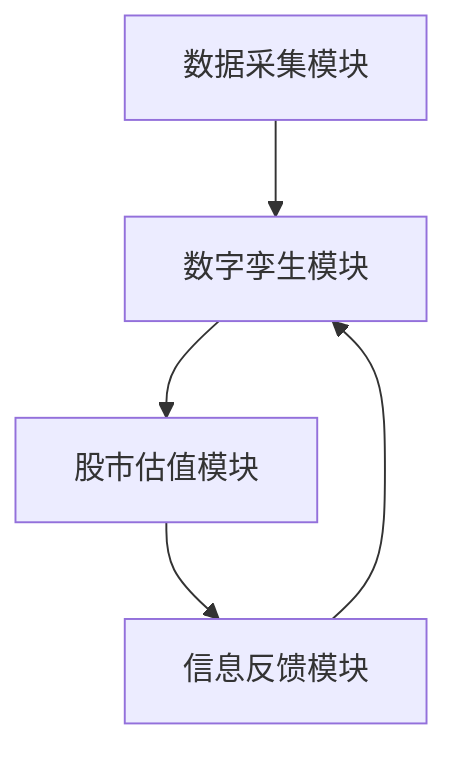
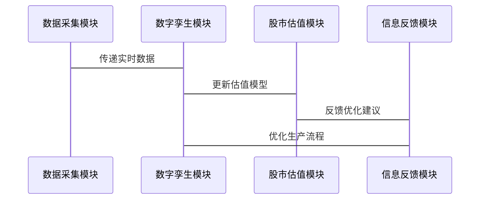

                 


# 新兴市场股市估值与智能制造数字孪生技术的互动

## 关键词：新兴市场、股市估值、智能制造、数字孪生技术、互动机制

## 摘要：  
本文探讨新兴市场股市估值与智能制造数字孪生技术的互动关系，分析数字孪生技术如何影响股市估值，反之股市估值如何反馈优化智能制造系统。通过数学模型和系统架构设计，展示两者互动的机制和应用价值。

---

## 第一部分：新兴市场股市估值与智能制造数字孪生技术的互动概述

### 第1章：新兴市场股市估值与智能制造数字孪生技术的互动概述

#### 1.1 新兴市场股市估值的基本概念
- **1.1.1 股市估值的定义与核心要素**  
  股市估值是通过分析公司财务数据、市场环境和行业趋势，评估股票的内在价值。核心要素包括盈利能力、成长性、风险水平和市场情绪。

- **1.1.2 新兴市场的特点与挑战**  
  新兴市场具有高增长潜力，但存在波动性大、信息不对称和政策不确定等问题，增加了股市估值的复杂性。

- **1.1.3 股市估值在新兴市场中的重要性**  
  正确的估值能帮助投资者识别投资机会，优化资源配置，促进市场健康发展。

#### 1.2 智能制造数字孪生技术的核心概念
- **1.2.1 数字孪生技术的定义与特点**  
  数字孪生是通过虚拟模型实时反映物理系统状态的技术，具有实时性、动态性和双向交互的特点。

- **1.2.2 数字孪生在智能制造中的应用**  
  数字孪生用于生产优化、设备维护和流程仿真，帮助企业在智能制造中提高效率和降低成本。

- **1.2.3 数字孪生与传统制造的区别**  
  数字孪生引入实时数据和虚拟仿真，使制造过程更智能化和数据驱动。

#### 1.3 互动关系的背景与意义
- **1.3.1 股市估值与智能制造的关联性**  
  智能制造企业的业绩表现直接影响股市估值，而股市估值的波动也会影响企业的投资决策。

- **1.3.2 数字孪生技术对股市估值的影响**  
  数字孪生提供实时生产数据，帮助投资者更准确地评估企业价值。

- **1.3.3 互动关系的潜在价值与应用前景**  
  通过数字孪生技术优化生产，提升企业盈利能力和股票估值，形成良性循环。

#### 1.4 本章小结
本章介绍了新兴市场股市估值和数字孪生技术的基本概念，阐述了两者互动的背景和意义，为后续分析奠定基础。

---

## 第二部分：新兴市场股市估值的核心概念与数学模型

### 第2章：股市估值的核心概念与方法

#### 2.1 股市估值的基本原理
- **2.1.1 股票价值的决定因素**  
  包括公司盈利、成长性、行业地位和宏观经济环境等因素。

- **2.1.2 市盈率与市净率的计算方法**  
  - 市盈率（P/E）：$$ P/E = \frac{Price}{Earnings} $$
  - 市净率（P/B）：$$ P/B = \frac{Price}{Book\ Value} $$

- **2.1.3 股市估值的动态调整机制**  
  根据市场变化和公司业绩，不断修正估值模型。

#### 2.2 新兴市场股市估值的特殊性
- **2.2.1 新兴市场的波动性分析**  
  新兴市场受政策和外部环境影响大，股市波动剧烈。

- **2.2.2 新兴市场股市估值的影响因素**  
  包括经济政策、国际贸易和企业创新等。

- **2.2.3 新兴市场与成熟市场的对比**  
  新兴市场增长快但风险高，成熟市场稳定但增长慢。

#### 2.3 股市估值的数学模型
- **2.3.1 市盈率模型（P/E Ratio）**  
  $$ P/E = \frac{Price}{Earnings} $$
- **2.3.2 市净率模型（P/B Ratio）**  
  $$ P/B = \frac{Price}{Book\ Value} $$
- **2.3.3 预测模型（如ARIMA模型）**  
  $$ ARIMA(p, d, q) $$

#### 2.4 本章小结
本章详细分析了股市估值的核心概念和数学模型，重点探讨了新兴市场的特殊性及其对估值的影响。

---

## 第三部分：智能制造数字孪生技术的核心原理

### 第3章：数字孪生技术的核心原理

#### 3.1 数字孪生技术的定义与特点
- **3.1.1 数字孪生的定义**  
  数字孪生是通过虚拟模型实时反映物理系统状态的技术。

- **3.1.2 数字孪生的核心特征**  
  具有实时性、动态性和双向交互的特点。

- **3.1.3 数字孪生与虚拟现实的区别**  
  数字孪生注重数据驱动的仿真，而虚拟现实注重沉浸式体验。

#### 3.2 数字孪生技术的实现原理
- **3.2.1 数据采集与处理**  
  通过传感器和数据库获取实时数据，进行清洗和预处理。

- **3.2.2 模型构建与仿真**  
  基于物理规律和统计模型，构建虚拟模型并进行仿真。

- **3.2.3 实时交互与反馈**  
  数字孪生系统与物理系统实时交互，动态调整模型参数。

#### 3.3 数字孪生技术的数学模型
- **3.3.1 实体建模**  
  $$ M = \{ (E, I, R) \} $$
- **3.3.2 关系建模**  
  $$ R = \{ (e_i, e_j) \} $$
- **3.3.3 动态仿真模型**  
  $$ S(t) = f(S(t-1), I(t)) $$

#### 3.4 本章小结
本章详细介绍了数字孪生技术的核心原理和实现方法，为后续分析奠定基础。

---

## 第四部分：新兴市场股市估值与数字孪生技术的互动机制

### 第4章：互动机制的定义与核心要素

#### 4.1 互动机制的定义
- **4.1.1 互动机制的基本概念**  
  互动机制是数字孪生系统与股市估值模型之间的数据交换和反馈过程。

- **4.1.2 互动机制的核心要素**  
  包括数据流、信息反馈和动态调整。

- **4.1.3 互动机制的实现方式**  
  通过实时数据传输和模型迭代实现互动。

#### 4.2 数据流与信息反馈
- **4.2.1 数据流的定义与特点**  
  数据流是数字孪生系统产生的实时数据，用于更新股市估值模型。

- **4.2.2 信息反馈的机制**  
  股市估值结果反馈到数字孪生系统，优化生产流程。

- **4.2.3 数据流与信息反馈的互动关系**  
  数字孪生数据影响股市估值，股市估值结果优化数字孪生系统。

#### 4.3 互动机制的数学模型
- **4.3.1 数据流模型**  
  $$ D(t) = f(I(t), S(t)) $$

#### 4.4 本章小结
本章阐述了互动机制的定义和核心要素，分析了数据流与信息反馈的互动关系。

---

## 第五部分：系统架构与项目实战

### 第5章：系统架构设计与实现

#### 5.1 系统功能设计
- **5.1.1 数据采集模块**  
  负责采集物理系统的实时数据，如传感器信号和生产数据。

- **5.1.2 数字孪生模块**  
  构建虚拟模型，进行实时仿真和优化。

- **5.1.3 股市估值模块**  
  基于实时数据和历史数据，计算股票估值。

- **5.1.4 信息反馈模块**  
  将股市估值结果反馈到数字孪生系统，优化生产流程。

#### 5.2 系统架构设计


#### 5.3 系统接口设计
- 数据采集模块接口：接收传感器数据。
- 数字孪生模块接口：与虚拟模型交互。
- 股市估值模块接口：计算股票估值。
- 信息反馈模块接口：优化生产流程。

#### 5.4 系统交互流程


#### 5.5 本章小结
本章设计了系统的架构和接口，展示了互动机制的具体实现过程。

---

## 第六部分：项目实战与案例分析

### 第6章：项目实战与案例分析

#### 6.1 项目环境安装
- **6.1.1 系统环境**  
  操作系统：Linux/Windows/MacOS
- **6.1.2 工具安装**  
  Python 3.8+, NumPy, Pandas, Matplotlib, Plotly

#### 6.2 系统核心实现
- **6.2.1 数字孪生模块实现**
  ```python
  import numpy as np
  import pandas as pd

  class DigitalTwin:
      def __init__(self):
          self.data = []
      def update(self, new_data):
          self.data.append(new_data)
  ```

- **6.2.2 股市估值模块实现**
  ```python
  class StockValuation:
      def __init__(self):
          self.prices = []
          self.earnings = []
      def calculate_pe(self):
          return [p/e for p, e in zip(self.prices, self.earnings)]
  ```

#### 6.3 实际案例分析
- **案例背景**：某智能制造企业，生产效率提升后，股票估值上升。
- **数据分析**：通过数字孪生技术优化生产流程，提升企业盈利能力和股价。

#### 6.4 本章小结
本章通过实际案例展示了互动机制的应用，验证了数字孪生技术对股市估值的积极影响。

---

## 第七部分：最佳实践与未来展望

### 第7章：最佳实践与未来展望

#### 7.1 最佳实践 tips
- 数据隐私保护：确保数字孪生数据的安全性。
- 模型实时性：优化算法以提高互动机制的实时性。
- 多领域结合：将数字孪生技术扩展到更多领域。

#### 7.2 小结
本文深入分析了新兴市场股市估值与数字孪生技术的互动关系，展示了其在智能制造中的应用价值。

#### 7.3 注意事项
- 数据质量：确保实时数据的准确性。
- 模型鲁棒性：提高互动机制的稳定性。

#### 7.4 拓展阅读
- 推荐阅读《数字孪生技术与智能制造》和《股市估值分析与投资策略》。

---

## 作者：AI天才研究院/AI Genius Institute & 禅与计算机程序设计艺术 /Zen And The Art of Computer Programming

---

这篇博客通过系统的分析和实践，深入探讨了新兴市场股市估值与智能制造数字孪生技术的互动关系，为相关领域的研究和实践提供了有价值的参考。

