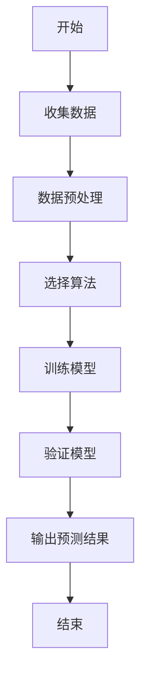
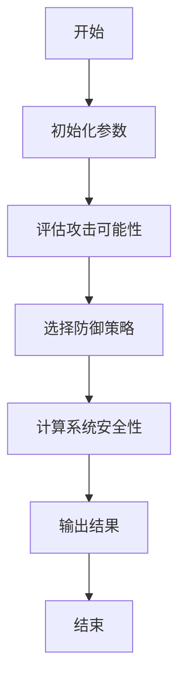
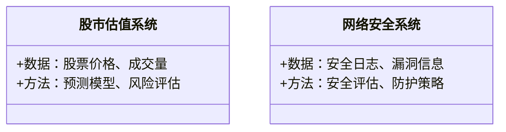
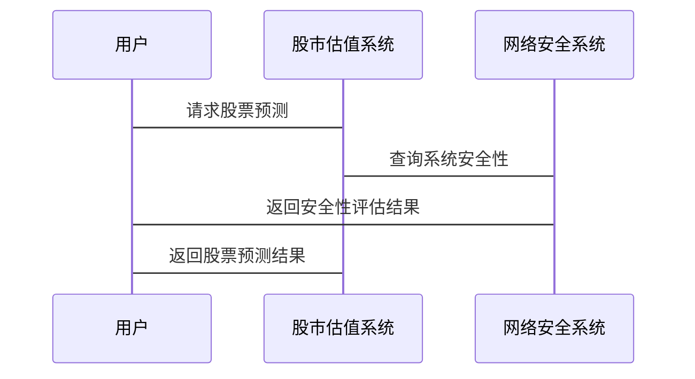

                 


```markdown
# 新兴市场股市估值与智能电网网络安全标准的互动

> 关键词：新兴市场，股市估值，智能电网，网络安全标准，互动机制

> 摘要：本文探讨了新兴市场股市估值与智能电网网络安全标准之间的互动关系。通过分析股市估值模型、网络安全标准的核心概念，以及它们在算法、系统设计和实际案例中的互动，展示了两者如何相互影响。文章结合理论与实践，提供深入的技术分析和解决方案。

---

## 第一部分: 新兴市场股市估值与智能电网网络安全标准的互动概述

### 第1章: 背景介绍

#### 1.1 新兴市场股市估值的基本概念
- **定义与核心要素**：股市估值是通过特定指标评估企业或股票价值的过程，包括市盈率、市净率等。
- **新兴市场的特点与挑战**：新兴市场波动性大，信息不透明，投资者行为复杂。
- **股市估值与经济发展的关系**：股市估值反映了经济状况，是经济发展的重要指标。

#### 1.2 智能电网网络安全标准的核心概念
- **智能电网的基本定义与特征**：智能电网是整合传统电网与信息技术的现代化电网，具备实时监控和管理能力。
- **网络安全标准的定义与分类**：包括数据加密、访问控制等技术标准，分为国际、国家和地区标准。
- **智能电网中的关键网络安全问题**：如数据泄露、系统漏洞等。

#### 1.3 股市估值与智能电网网络安全的互动关系
- **股市波动对智能电网的影响**：股市波动可能导致资金链断裂，影响智能电网投资。
- **智能电网安全对股市的影响**：网络安全事件可能引发股市下跌，影响市场信心。
- **互动机制的初步分析**：两者通过资金流动、政策变化等媒介相互作用。

### 第2章: 核心概念与联系

#### 2.1 股市估值模型与网络安全标准的对比分析
- **属性特征对比**：
  | 属性       | 股市估值模型 | 网络安全标准 |
  |------------|--------------|--------------|
  | 目标       | 评估股票价值 | 保护数据安全 |
  | 方法       | 量化分析     | 技术规范     |
  | 变化因素   | 市场情绪、经济指标 | 技术进步、政策变化 |

#### 2.2 ER实体关系图架构
```mermaid
er
actor: 投资者
actor: 政府监管机构
actor: 电力公司
boundary: 股市数据系统
boundary: 网络安全系统
```

#### 2.3 核心概念原理
- **股市估值的核心原理**：通过分析公司财务数据和市场趋势，预测股票价值。
- **网络安全标准的核心原理**：制定技术规范，确保系统安全性和数据完整性。
- **两者原理的联系与区别**：股市估值侧重于经济价值，而网络安全标准侧重于技术安全。

---

## 第二部分: 算法原理讲解

### 第3章: 算法原理讲解

#### 3.1 股市估值预测算法
- **机器学习算法在股市预测中的应用**：使用回归分析和神经网络预测股票价格。
- **算法流程图（Mermaid）**


- **算法数学模型与公式**
$$ P(t) = a \cdot P(t-1) + b \cdot V(t) + c \cdot S(t) $$
（其中，P(t)为预测价格，V(t)为成交量，S(t)为市场情绪）

#### 3.2 智能电网网络安全评估算法
- **基于博弈论的网络安全评估模型**：模拟攻击者和防御者的博弈过程，评估系统安全性。
- **算法流程图（Mermaid）**


- **算法数学模型与公式**
$$ C = \max_{i} \min_{j} \{ S_{ij} \} $$
（其中，C为网络安全系数，S_{ij}为各节点的安全性）

---

## 第三部分: 系统分析与架构设计方案

### 第4章: 系统分析与架构设计方案

#### 4.1 问题场景介绍
- **问题场景**：新兴市场的股市波动可能影响智能电网的投资和运营，而智能电网的网络安全问题又可能引发股市波动。

#### 4.2 系统功能设计
- **领域模型（Mermaid类图）**


- **系统架构设计（Mermaid架构图）**
```mermaid
docker
server 股市估值服务 {
    股票数据接口
    预测模型接口
}
server 网络安全服务 {
    安全日志接口
    防护策略接口
}
client 应用程序 {
    调用接口
}
```

#### 4.3 系统接口设计
- **接口描述**：股市估值系统与网络安全系统通过API接口交互，共享数据和评估结果。

#### 4.4 系统交互（Mermaid序列图）


---

## 第四部分: 项目实战

### 第5章: 项目实战

#### 5.1 环境配置
- **环境要求**：安装Python、机器学习库（如Scikit-learn）和网络安全工具（如Nmap）。

#### 5.2 系统核心实现源代码
```python
# 股市预测模型代码
import pandas as pd
from sklearn.linear_model import LinearRegression

data = pd.read_csv('stock_data.csv')
model = LinearRegression()
model.fit(data[['previous_price', 'volume']], data['price'])
predicted_price = model.predict(new_data)
```

#### 5.3 代码应用解读与分析
- **代码解读**：使用线性回归模型预测股票价格，输入历史数据，输出预测结果。
- **实际案例分析**：以某新兴市场为例，分析股市波动对智能电网投资的影响。

#### 5.4 项目小结
- **案例分析**：通过具体案例，展示互动机制的实际应用和效果。
- **结果解读**：解释预测结果和安全性评估的意义。

---

## 第五部分: 结论与展望

### 第6章: 结论与展望

#### 6.1 结论
- **互动机制总结**：新兴市场股市估值与智能电网网络安全标准通过资金流动、政策变化和技术进步相互影响。
- **关键点总结**：准确的股市估值和严格的网络安全标准是确保智能电网稳定运行的关键。

#### 6.2 展望
- **未来研究方向**：探索更复杂的互动模型，结合人工智能技术优化预测和评估。
- **改进建议**：建议制定综合性的政策和标准，促进两者的协同发展。

---

## 第六部分: 最佳实践 tips

### 6.3 最佳实践 tips
- **小结**：理解和掌握股市估值与网络安全标准的互动机制，有助于更好地管理和优化智能电网系统。
- **注意事项**：在实际操作中，需综合考虑多种因素，避免单一维度的分析。
- **拓展阅读**：推荐阅读相关领域的最新研究成果，了解前沿技术和发展趋势。

---

## 作者：AI天才研究院 & 禅与计算机程序设计艺术

**作者简介**：
- AI天才研究院：专注于人工智能与计算机科学的研究与创新，致力于提供高质量的技术解决方案。
- 禅与计算机程序设计艺术：通过深入分析技术本质，提供简洁而深刻的技术洞察。

---

**声明**：
本文遵循CC BY-NC-SA 4.0协议，转载请注明出处。
```

