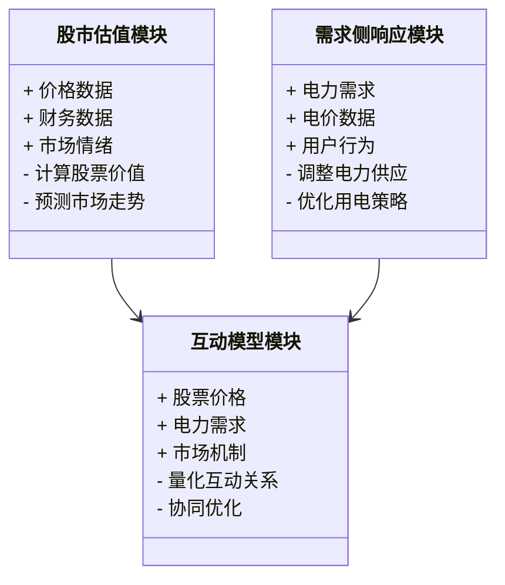
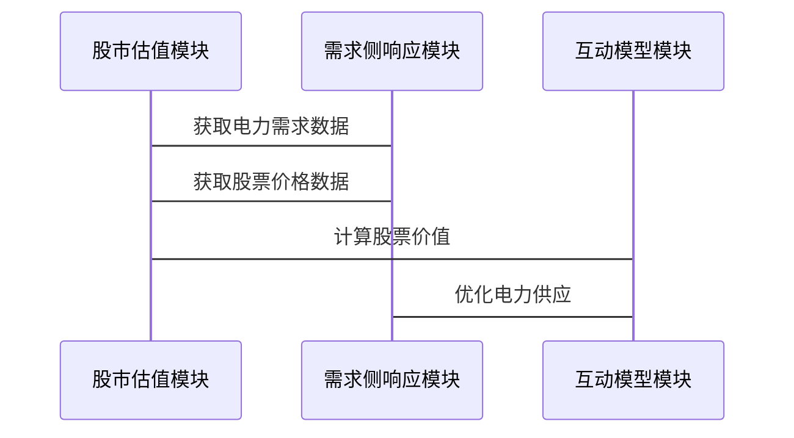

                 


# 新兴市场股市估值与智能电网需求侧响应技术的互动

> 关键词：新兴市场，股市估值，智能电网，需求侧响应，互动模型

> 摘要：本文探讨新兴市场股市估值与智能电网需求侧响应技术之间的互动关系，分析股市估值模型与算法，智能电网需求侧响应技术的核心算法，以及两者的互动模型的数学模型与算法实现。通过实际案例分析，展示互动模型在实际中的应用效果。

---

## 第一章：背景与概念

### 1.1 新兴市场股市估值的背景与现状

#### 1.1.1 新兴市场的定义与特点
新兴市场是指那些经济快速发展、但尚未完全工业化的国家，如中国、印度等。这些市场具有高增长潜力，但也伴随着高波动性和不确定性。

#### 1.1.2 股市估值的核心概念与方法
股市估值是通过对公司财务数据、市场环境等因素进行分析，估算股票的合理价格。常用的估值方法包括PE（市盈率）、PB（市净率）、DCF（现金流折现法）等。

#### 1.1.3 新兴市场股市的独特性与挑战
新兴市场股市具有高波动性、信息不对称、监管不完善等特点。这些特点使得股市估值更具挑战性，但也为投资者提供了高收益的机会。

### 1.2 智能电网需求侧响应技术的背景与现状

#### 1.2.1 智能电网的定义与特点
智能电网是通过智能化技术实现电力系统高效运行的新型电网系统。它能够实时监测和管理电力供需，提高电网的可靠性和效率。

#### 1.2.2 需求侧响应技术的核心概念与方法
需求侧响应技术是通过价格信号、激励机制等手段，引导用户调整电力使用行为，以优化电力供需平衡。常用的技术包括分时电价、可中断负荷管理等。

#### 1.2.3 智能电网在新兴市场的应用与发展
随着新兴市场电力需求的增长，智能电网技术的应用越来越广泛。通过智能电网，可以有效管理电力供需，减少能源浪费，降低电力成本。

### 1.3 股市估值与智能电网需求侧响应的互动关系

#### 1.3.1 互动机制的定义与特点
互动机制是指股市估值与需求侧响应技术之间相互影响、相互作用的关系。这种互动可以通过数据共享、协同优化等方式实现。

#### 1.3.2 互动关系的背景与现状
随着智能电网的普及和股市估值技术的不断发展，两者的互动关系逐渐受到关注。通过互动，可以实现电力市场的优化管理和资本市场的高效运作。

#### 1.3.3 互动关系的核心概念与方法
互动关系的核心在于通过数据共享和协同优化，实现电力市场与资本市场的有机结合。这需要在技术和机制上进行创新，以确保互动的有效性和可持续性。

---

## 第二章：股市估值模型与算法

### 2.1 股市估值模型的原理与应用

#### 2.1.1 股市估值模型的分类与特点
股市估值模型主要分为基本面模型和市场模型。基本面模型基于公司财务数据，市场模型基于市场行为和价格走势。

#### 2.1.2 常见的股市估值模型
- **PE模型**：通过市盈率指标评估股票价值。
- **PB模型**：通过市净率指标评估股票价值。
- **DCF模型**：通过现金流折现法评估股票价值。

#### 2.1.3 股市估值模型的优缺点与适用场景
PE和PB模型简单易用，但可能受市场波动影响较大。DCF模型较为复杂，但能够更准确地反映公司价值。

### 2.2 基于机器学习的股市预测模型

#### 2.2.1 机器学习在股市预测中的应用
机器学习通过分析历史数据，预测未来市场走势。常用算法包括线性回归、神经网络等。

#### 2.2.2 常见的机器学习算法
- **线性回归**：用于预测股票价格趋势。
- **神经网络**：用于复杂市场模式的识别。

#### 2.2.3 基于机器学习的股市预测模型的实现与优化
通过训练模型，可以提高预测的准确率。优化方法包括参数调整、特征选择等。

---

## 第三章：智能电网需求侧响应技术的核心算法

### 3.1 需求侧响应技术的原理与应用

#### 3.1.1 需求侧响应技术的分类与特点
需求侧响应技术分为价格型和激励型两类。价格型通过调整电价引导用户用电，激励型通过提供奖励鼓励用户节约用电。

#### 3.1.2 常见的需求侧响应技术
- **分时电价**：根据不同时段的电价差异，引导用户调整用电行为。
- **可中断负荷管理**：在高峰时段中断部分负荷，降低电网压力。

### 3.2 基于优化算法的需求侧响应模型

#### 3.2.1 常见的优化算法
- **线性规划**：用于资源优化分配。
- **遗传算法**：用于复杂问题的全局优化。

#### 3.2.2 基于优化算法的需求侧响应模型的实现与优化
通过优化算法，可以提高需求侧响应的效率和效果。优化目标包括最小化电力成本、最大化能源效率等。

---

## 第四章：互动模型的数学模型与算法实现

### 4.1 互动模型的定义与特点

#### 4.1.1 互动模型的分类与特点
互动模型分为数据驱动型和机制驱动型两类。数据驱动型基于历史数据进行预测，机制驱动型基于市场机制进行优化。

#### 4.1.2 互动模型的优缺点与适用场景
数据驱动型模型具有较高的预测精度，但可能受数据质量和数量的限制。机制驱动型模型能够更好地反映市场机制，但实现较为复杂。

### 4.2 互动模型的数学模型

#### 4.2.1 股市估值与智能电网需求侧响应的数学关系
通过建立数学模型，可以量化两者之间的互动关系。例如，电力需求的变化会影响电价，进而影响股市估值。

#### 4.2.2 互动模型的数学表达式与公式
$$ P_{stock} = \alpha \cdot P_{electricity} + \beta \cdot D_{demand} + \gamma \cdot S_{market} $$
其中，$P_{stock}$为股票价格，$P_{electricity}$为电价，$D_{demand}$为需求量，$S_{market}$为市场情绪。

### 4.3 互动模型的算法实现

#### 4.3.1 基于数据共享的互动模型
通过共享电力需求和电价数据，可以提高股市估值的准确性。例如，智能电网可以向股市提供实时电力数据，帮助投资者做出更明智的决策。

#### 4.3.2 基于协同优化的互动模型
通过协同优化，可以实现电力市场与资本市场的双赢。例如，智能电网可以通过调整电价，引导用户节约用电，同时降低电力成本，提高股市估值。

---

## 第五章：系统架构与设计

### 5.1 问题场景介绍
本章将介绍一个智能电网与股市估值互动的综合平台设计。该平台旨在通过数据共享和协同优化，实现电力市场与资本市场的有机结合。

### 5.2 系统功能设计

#### 5.2.1 领域模型（Mermaid 类图）


### 5.3 系统架构设计（Mermaid 架构图）
```mermaid
archiecture
    股市估值模块 -->(数据库)
    需求侧响应模块 -->(数据库)
    互动模型模块 -->(数据库)
    股市估值模块 <--> 需求侧响应模块
```

### 5.4 系统接口设计
系统接口包括数据接口和功能接口。数据接口用于模块之间的数据共享，功能接口用于模块之间的协同优化。

### 5.5 系统交互（Mermaid 序列图）


---

## 第六章：项目实战

### 6.1 环境安装
需要安装Python、Pandas、NumPy、Scikit-learn等工具。

### 6.2 核心实现源代码

#### 6.2.1 股市估值模型代码
```python
import pandas as pd
import numpy as np

def calculate_pe(stock_data):
    pe = stock_data['市盈率']
    return pe

def calculate_pb(stock_data):
    pb = stock_data['市净率']
    return pb

def calculate_dcf(stock_data):
    cash_flow = stock_data['现金流']
    discount_rate = 0.05
    dcf = cash_flow / (1 + discount_rate)
    return dcf

# 示例数据
stock_data = pd.DataFrame({
    '市盈率': [15, 20, 25],
    '市净率': [2, 3, 4],
    '现金流': [100, 200, 300]
})

pe = calculate_pe(st

