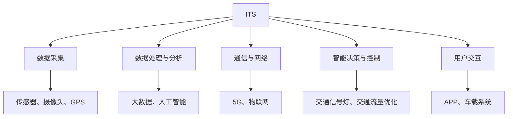
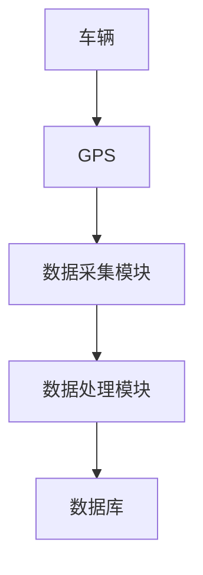
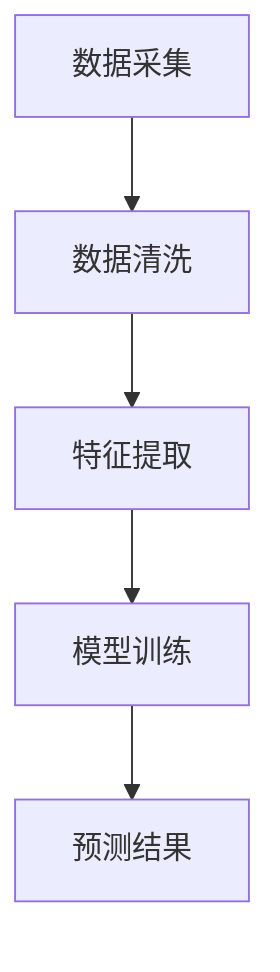
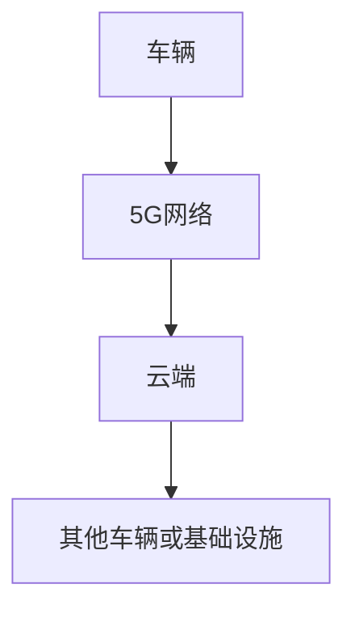
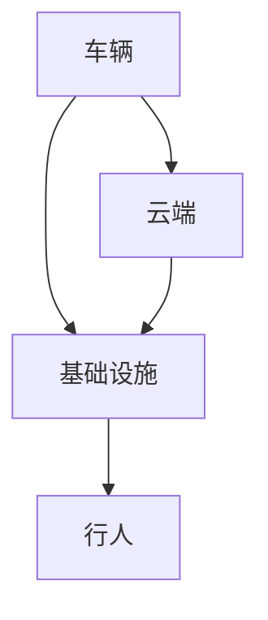
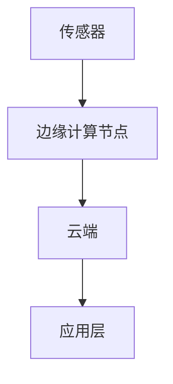
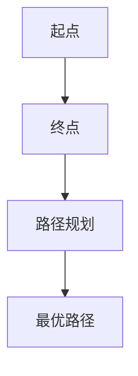
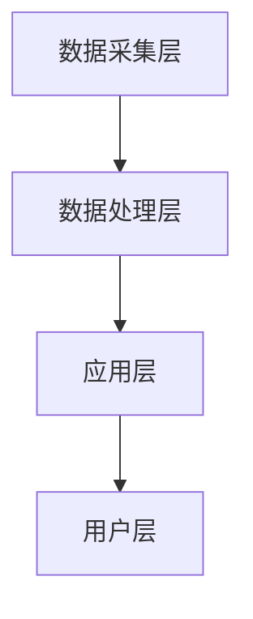

                 


# 智能交通系统的推广与相关产业投资

> **关键词**：智能交通系统（ITS）、交通拥堵、产业投资、自动驾驶、5G通信、边缘计算

> **摘要**：智能交通系统（ITS）作为一种结合了先进技术的现代交通管理解决方案，正在全球范围内得到推广和应用。本文将从ITS的核心概念、技术原理、推广策略、产业链分析以及投资机会等方面进行详细探讨。通过分析ITS的技术优势、应用场景、产业链结构以及投资潜力，本文旨在为相关产业投资者和政策制定者提供参考和启示。

---

# 第1章: 智能交通系统（ITS）的背景与概念

## 1.1 智能交通系统的定义与核心要素

### 1.1.1 什么是智能交通系统（ITS）

智能交通系统（Intelligent Transportation System，ITS）是一种通过先进的信息技术、数据通信技术、人工智能技术等，对交通系统进行智能化管理的综合体系。ITS的目标是通过优化资源配置、提高交通效率、减少交通拥堵和环境污染，为用户提供更安全、更便捷的出行体验。

**核心概念术语说明**：
- **ITS**：Intelligent Transportation System，智能交通系统。
- **V2X**：Vehicle to Everything，车辆与外界的信息交互，包括车辆与车辆（V2V）、车辆与基础设施（V2I）、车辆与行人（V2P）等。
- **边缘计算**：在靠近数据源的地方进行数据处理和存储的技术，能够减少数据传输延迟，提高实时性。

### 1.1.2 ITS的核心要素与功能

ITS的核心要素包括以下几个方面：
1. **数据采集**：通过传感器、摄像头、GPS等设备收集交通数据。
2. **数据处理与分析**：利用大数据和人工智能技术对交通数据进行分析，提取有价值的信息。
3. **通信与网络**：通过5G、物联网等技术实现数据的实时传输和共享。
4. **智能决策与控制**：基于分析结果，优化交通信号灯、调整交通流量、提供导航建议等。
5. **用户交互**：通过APP、车载系统等方式向用户传递实时信息，提升用户体验。

**概念结构与核心要素组成**：

以下是ITS的核心要素组成图：



### 1.1.3 ITS与传统交通系统的主要区别

| **方面** | **ITS** | **传统交通系统** |
|----------|---------|------------------|
| 数据处理 | 实时采集、分析和反馈 | 依赖人工观察和经验 |
| 通信方式 | 高速、实时的网络通信 | 依赖交通信号灯和道路标志 |
| 决策方式 | 智能化、动态优化 | 固定模式、静态管理 |
| 用户体验 | 个性化、实时反馈 | 单一、被动接收 |

---

## 1.2 ITS的发展背景与现状

### 1.2.1 交通拥堵与资源浪费的现状

随着城市化进程的加快，交通拥堵问题日益严重。据统计，全球每年因交通拥堵造成的经济损失高达数千亿美元。ITS的出现为解决这一问题提供了新的思路。

### 1.2.2 智能交通系统的全球发展概况

目前，全球多个国家和地区已经开始推广智能交通系统。例如，欧洲的智能交通系统发展较为成熟，美国在自动驾驶技术上处于领先地位，而中国则在5G和车联网技术上取得了显著进展。

### 1.2.3 中国智能交通系统的发展现状

中国在 ITS 方面的发展主要集中在以下几个方面：
1. **交通信号灯优化**：通过智能算法实现交通信号灯的动态调整，减少等待时间。
2. **自动驾驶试点**：在部分城市开展自动驾驶汽车的试点运营。
3. **智慧公路建设**：通过高速公路上的传感器和摄像头实现对交通流量的实时监控。

---

## 1.3 ITS的技术优势与挑战

### 1.3.1 ITS的主要技术优势

1. **高效性**：通过实时数据分析和优化，提高交通系统的运行效率。
2. **安全性**：通过智能决策和用户交互，降低交通事故的发生率。
3. **环保性**：通过减少交通拥堵和优化车辆行驶路线，降低碳排放。

### 1.3.2 ITS在实际应用中的主要挑战

1. **技术成熟度**：部分技术（如自动驾驶）尚未完全成熟，存在安全隐患。
2. **数据隐私**：ITS需要收集大量用户数据，如何保护用户隐私是一个重要问题。
3. **成本问题**：智能交通系统的建设和维护成本较高，可能对中小城市造成负担。

---

## 1.4 本章小结

本章主要介绍了智能交通系统（ITS）的定义、核心要素、发展背景以及技术优势与挑战。通过分析ITS的核心概念和实际应用，为后续章节的深入探讨奠定了基础。

---

# 第2章: 智能交通系统的核心技术与实现原理

## 2.1 数据采集与处理技术

### 2.1.1 交通数据的采集方式

ITS的数据采集主要通过以下几种方式：
1. **传感器**：如交通流量计、红外传感器等。
2. **摄像头**：用于监控道路状况和车辆位置。
3. **GPS**：用于定位车辆位置。

**传感器数据采集流程图**：



### 2.1.2 数据处理与分析技术

数据处理与分析是ITS的核心技术之一。通过大数据和人工智能技术，可以实现交通流量预测、路径优化等功能。

**交通流量预测算法流程图**：



### 2.1.3 数据存储与管理

ITS需要处理大量的交通数据，因此需要高效的数据库管理技术。常用的技术包括关系型数据库和NoSQL数据库。

---

## 2.2 通信与网络技术

### 2.2.1 5G在智能交通中的应用

5G技术的高速和低延迟特性为ITS提供了强大的支持。例如，通过5G网络可以实现车辆与车辆之间的实时通信。

**5G在ITS中的应用场景图**：



### 2.2.2 车联网（V2X）技术

车联网（Vehicle to Everything，V2X）是指车辆与其他车辆、基础设施、行人之间的信息交互。V2X技术是ITS的重要组成部分。

**车联网信息交互流程图**：



### 2.2.3 云计算与边缘计算在ITS中的应用

云计算用于存储和处理大量的交通数据，而边缘计算则用于实时数据处理和本地决策。

**云计算与边缘计算架构图**：



---

## 2.3 智能算法与决策系统

### 2.3.1 交通流预测算法

交通流预测算法主要用于预测未来一段时间内的交通流量，从而优化交通信号灯和道路资源的分配。

**交通流预测算法实现代码**：

```python
import pandas as pd
from sklearn.model_selection import train_test_split
from sklearn.linear_model import LinearRegression

# 数据加载
data = pd.read_csv('traffic_data.csv')
# 特征与目标分离
X = data[['time', 'weather']]
y = data['traffic_flow']
# 数据划分
X_train, X_test, y_train, y_test = train_test_split(X, y, test_size=0.2)
# 模型训练
model = LinearRegression()
model.fit(X_train, y_train)
# 预测结果
y_pred = model.predict(X_test)
```

### 2.3.2 路径优化与调度算法

路径优化算法用于为车辆提供最优的行驶路线，减少拥堵和时间浪费。

**路径优化算法流程图**：



### 2.3.3 人工智能在交通决策中的应用

人工智能技术（如深度学习、强化学习）在ITS中的应用越来越广泛，主要用于交通流量预测、自动驾驶决策等领域。

---

## 2.4 系统架构与标准化

### 2.4.1 ITS系统架构设计

ITS系统架构通常包括数据采集层、数据处理层、应用层和用户层。

**ITS系统架构图**：



### 2.4.2 ITS标准化与规范

为了确保ITS系统的兼容性和可扩展性，需要制定相关的标准化和规范。例如，国际标准化组织（ISO）和国际电工委员会（IEC）已经制定了多项ITS相关的标准。

---

## 2.5 本章小结

本章主要介绍了智能交通系统的核心技术，包括数据采集与处理技术、通信与网络技术、智能算法与决策系统，以及系统架构与标准化。通过详细的技术分析，为ITS的推广和应用提供了技术基础。

---

（由于篇幅限制，后续章节的内容将逐步展开，包括推广策略、产业链分析、投资机会等内容。）

---

# 作者信息

作者：AI天才研究院/AI Genius Institute & 禅与计算机程序设计艺术 /Zen And The Art of Computer Programming

---

（注：以上内容为部分章节内容，完整文章将涵盖更多细节和案例分析。）

