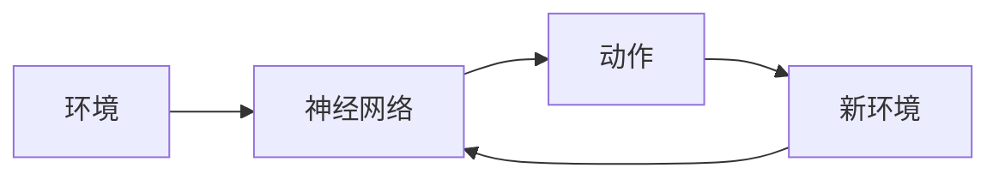
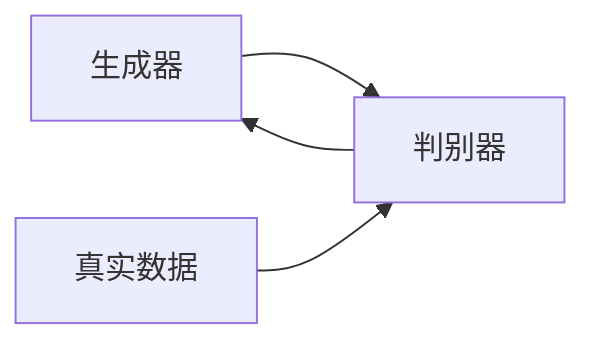
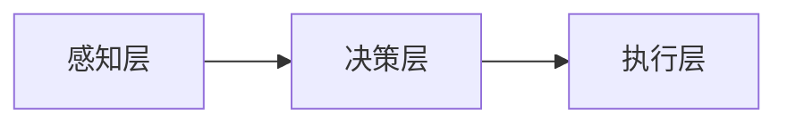
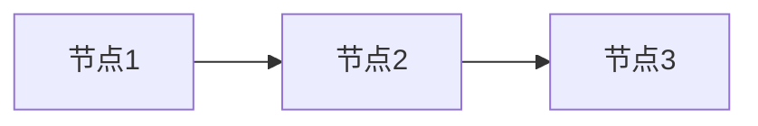
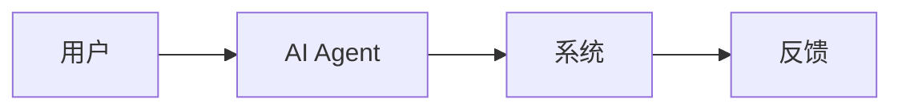

                 


# 构建AI Agent常见挑战及解决方案

## 关键词：
AI Agent, 人工智能, 强化学习, 多模态数据, 知识表示, 系统架构, 决策算法

## 摘要：
本文深入探讨了构建AI Agent过程中面临的常见挑战，并提供了相应的解决方案。通过详细分析AI Agent的核心概念、算法原理、系统架构和项目实战，本文为读者提供了全面的技术指导。从知识表示到动态环境中的实时决策，从模型可解释性到安全性，本文一一解析了这些挑战，并通过具体案例展示了如何有效应对这些问题。

---

## 第1章: AI Agent 的概述与挑战

### 1.1 AI Agent 的定义与背景
AI Agent（人工智能代理）是指能够感知环境、自主决策并执行任务的智能实体。它广泛应用于自动驾驶、智能助手、机器人控制等领域。AI Agent的核心在于其能够通过传感器获取信息，利用算法进行推理和决策，并通过执行器与环境互动。

#### 1.1.1 AI Agent 的定义
AI Agent是一种智能系统，具备以下核心特征：
- **自主性**：能够在没有外部干预的情况下独立运作。
- **反应性**：能够实时感知环境并做出反应。
- **目标导向**：基于目标或任务进行决策。
- **学习能力**：能够通过经验改进性能。

#### 1.1.2 AI Agent 的核心特点
1. **多模态交互**：能够处理文本、图像、语音等多种输入形式。
2. **动态环境适应**：能够在不断变化的环境中实时调整策略。
3. **可解释性要求**：需要提供决策的透明性和可解释性，以满足用户和监管的需求。

#### 1.1.3 AI Agent 的应用场景与优势
- **自动驾驶**：通过实时感知和决策实现车辆控制。
- **智能助手**：如Siri、Alexa等，通过语音交互提供服务。
- **机器人控制**：在工业或服务场景中执行复杂任务。

### 1.2 AI Agent 的常见挑战
1. **知识表示与推理**：如何有效地表示和处理复杂知识，使其能够被算法理解和利用。
2. **多模态数据处理**：整合和处理来自不同传感器的多模态数据是AI Agent面临的重大挑战。
3. **动态环境中的实时决策**：在快速变化的环境中做出实时决策需要高效的算法和强大的计算能力。
4. **模型可解释性**：复杂的算法往往缺乏透明性，这在实际应用中是一个重要障碍。
5. **安全性与伦理问题**：AI Agent的决策可能对人类或环境造成重大影响，因此确保其安全性和符合伦理标准至关重要。

---

## 第2章: AI Agent 的核心概念与原理

### 2.1 AI Agent 的核心概念
#### 2.1.1 知识表示与推理
知识表示是AI Agent理解世界的基础。常见的知识表示方法包括：
- **符号表示**：使用符号逻辑表示知识，如一阶逻辑。
- **语义网络**：通过节点和边表示概念及其关系。
- **概率表示**：如贝叶斯网络，用于表示不确定性的知识。

#### 2.1.2 多模态数据处理
AI Agent需要处理多种类型的数据，包括文本、图像、语音等。多模态数据处理的关键在于如何有效地融合这些数据，以提高决策的准确性和鲁棒性。

#### 2.1.3 强化学习与决策
强化学习（Reinforcement Learning）是AI Agent决策的核心方法。通过与环境的互动，AI Agent学习最优策略以最大化累积奖励。

#### 2.1.4 模型可解释性
可解释性是AI Agent的重要特性，尤其是在需要用户信任和监管合规的场景中。通过解释模型的决策过程，可以增强用户对AI Agent的信任。

#### 2.1.5 安全性与伦理
AI Agent的设计必须考虑安全性，避免潜在的滥用或误用。同时，伦理问题也需要被纳入设计和决策过程中。

### 2.2 AI Agent 的系统架构
#### 2.2.1 分层架构
分层架构将系统划分为多个层次，每个层次负责不同的功能。例如：
- **感知层**：负责数据的采集和初步处理。
- **决策层**：基于感知层提供的信息进行决策。
- **执行层**：根据决策层的指令执行具体操作。

#### 2.2.2 分布式架构
分布式架构将系统功能分布在多个节点上，通过协作完成任务。这种架构适用于大规模和复杂的应用场景。

#### 2.2.3 混合架构
混合架构结合了分层和分布式架构的优点，适用于需要同时处理多种任务和数据类型的情况。

---

## 第3章: AI Agent 的算法原理

### 3.1 强化学习算法
#### 3.1.1 Q-Learning 算法
Q-Learning是一种经典的强化学习算法，通过更新Q值表来学习最优策略。其核心公式为：
$$ Q(s, a) = Q(s, a) + \alpha (r + \max Q(s', a') - Q(s, a)) $$
其中，$s$是当前状态，$a$是动作，$r$是奖励，$\alpha$是学习率。

#### 3.1.2 DQN 算法
深度Q网络（DQN）通过神经网络近似Q值函数，适用于高维状态空间的情况。DQN的核心流程如下：


### 3.2 监督学习与生成模型
#### 3.2.1 监督学习基础
监督学习通过训练数据学习输入与输出之间的映射关系，公式为：
$$ y = \theta x + b $$
其中，$\theta$是模型参数，$b$是偏置项。

#### 3.2.2 生成对抗网络 (GAN)
GAN由生成器和判别器组成，通过对抗训练生成逼真的数据。其流程如下：


---

## 第4章: AI Agent 的系统分析与架构设计

### 4.1 系统功能设计
#### 4.1.1 知识库管理
知识库是AI Agent的核心存储单元，负责存储和管理各种类型的知识，如事实、规则、案例等。

#### 4.1.2 多模态数据处理
多模态数据处理模块负责整合和处理来自不同传感器的数据，确保数据的准确性和一致性。

#### 4.1.3 决策与执行
决策模块基于当前状态和目标，选择最优动作并执行。

#### 4.1.4 监控与反馈
监控模块负责实时监控系统运行状态，并根据反馈调整策略。

### 4.2 系统架构设计
#### 4.2.1 分层架构设计
分层架构将系统划分为感知层、决策层和执行层，每层负责不同的功能。其架构图如下：


#### 4.2.2 分布式架构设计
分布式架构将系统功能分布在多个节点上，通过协作完成任务。其架构图如下：


### 4.3 接口设计与交互
#### 4.3.1 API 接口设计
API接口是AI Agent与其他系统交互的重要通道，需要设计合理的接口规范。

#### 4.3.2 交互流程设计
交互流程设计需要考虑用户的输入、系统的处理和输出的反馈。其流程图如下：


---

## 第5章: AI Agent 的项目实战

### 5.1 环境安装与配置
#### 5.1.1 安装 Python 环境
安装Python 3.8及以上版本，并配置虚拟环境。

#### 5.1.2 安装依赖库
安装必要的库，如TensorFlow、Keras、OpenCV等。

### 5.2 核心算法实现
#### 5.2.1 Q-Learning 实现
以下是一个简单的Q-Learning实现示例：
```python
class QLearning:
    def __init__(self, state_space, action_space):
        self.state_space = state_space
        self.action_space = action_space
        self.q_table = np.zeros((state_space, action_space))
    
    def choose_action(self, state, epsilon=0.1):
        if np.random.random() < epsilon:
            return np.random.randint(self.action_space)
        else:
            return np.argmax(self.q_table[state])
    
    def update_q_table(self, state, action, reward, next_state, gamma=0.9):
        self.q_table[state, action] = self.q_table[state, action] + 0.1 * (reward + gamma * np.max(self.q_table[next_state]) - self.q_table[state, action])
```

#### 5.2.2 DQN 实现
以下是一个简单的DQN实现示例：
```python
import tensorflow as tf

class DQN:
    def __init__(self, state_dim, action_dim):
        self.state_dim = state_dim
        self.action_dim = action_dim
        self.model = self.build_model()
    
    def build_model(self):
        model = tf.keras.Sequential([
            tf.keras.layers.Dense(64, activation='relu', input_dim=self.state_dim),
            tf.keras.layers.Dense(64, activation='relu'),
            tf.keras.layers.Dense(self.action_dim, activation='linear')
        ])
        return model
    
    def predict(self, state):
        return self.model.predict(state)
    
    def train(self, state, target):
        self.model.fit(state, target, epochs=1, verbose=0)
```

### 5.3 项目实战案例
#### 5.3.1 案例介绍
以一个简单的迷宫导航问题为例，展示如何使用Q-Learning算法实现路径规划。

#### 5.3.2 代码实现
```python
import numpy as np
import matplotlib.pyplot as plt

class MazeEnv:
    def __init__(self, size=5):
        self.size = size
        self.start = (0, 0)
        self.goal = (4, 4)
    
    def get_state(self):
        return (self.start[0], self.start[1])
    
    def get_actions(self):
        return [(0, 1), (1, 0), (0, -1), (-1, 0)]
    
    def step(self, action):
        current = self.get_state()
        next_state = (
            current[0] + action[0],
            current[1] + action[1]
        )
        if next_state == self.goal:
            return next_state, 1, True
        elif 0 <= next_state[0] < self.size and 0 <= next_state[1] < self.size:
            return next_state, 0, False
        else:
            return current, -1, False

# 初始化环境和AI Agent
env = MazeEnv()
agent = QLearning(5*5, 4)

# 训练过程
for episode in range(100):
    state = env.get_state()
    while True:
        action = agent.choose_action(env.get_state())
        next_state, reward, done = env.step(action)
        agent.update_q_table(env.get_state(), action, reward, next_state)
        if done:
            break

# 展示结果
plt.imshow(agent.q_table, cmap='hot')
plt.title('Q-Table Visualization')
plt.show()
```

### 5.4 案例分析与总结
通过上述案例，我们可以看到Q-Learning算法在简单迷宫导航中的应用。虽然在复杂环境中可能表现不佳，但通过结合其他算法和优化策略，可以显著提升性能。

---

## 第6章: 总结与展望

### 6.1 总结
本文系统地介绍了AI Agent的核心概念、算法原理、系统架构和项目实战。通过详细分析构建AI Agent过程中面临的常见挑战，并提供相应的解决方案，为读者提供了全面的技术指导。

### 6.2 展望
随着人工智能技术的不断发展，AI Agent的应用场景将更加广泛。未来的研究方向包括：
1. 提高模型的可解释性，增强用户信任。
2. 结合边缘计算，提升实时决策能力。
3. 研究更高效的算法，降低计算成本。

### 6.3 注意事项
在实际应用中，需要注意以下几点：
1. 确保系统的安全性，防止滥用或误用。
2. 注重数据隐私保护，遵守相关法律法规。
3. 定期更新和优化模型，适应环境变化。

---

## 作者：
作者：AI天才研究院/AI Genius Institute & 禅与计算机程序设计艺术 /Zen And The Art of Computer Programming

---

以上是《构建AI Agent常见挑战及解决方案》的技术博客文章，内容涵盖了从基础概念到实际应用的各个方面，旨在为读者提供全面的技术指导和实践参考。

