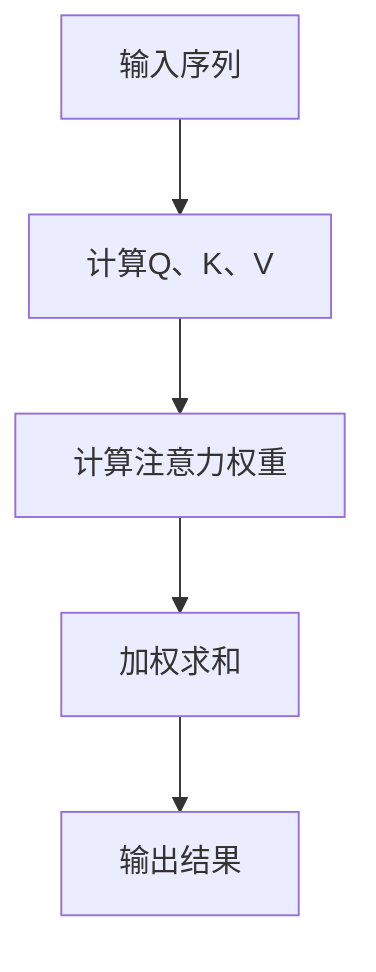
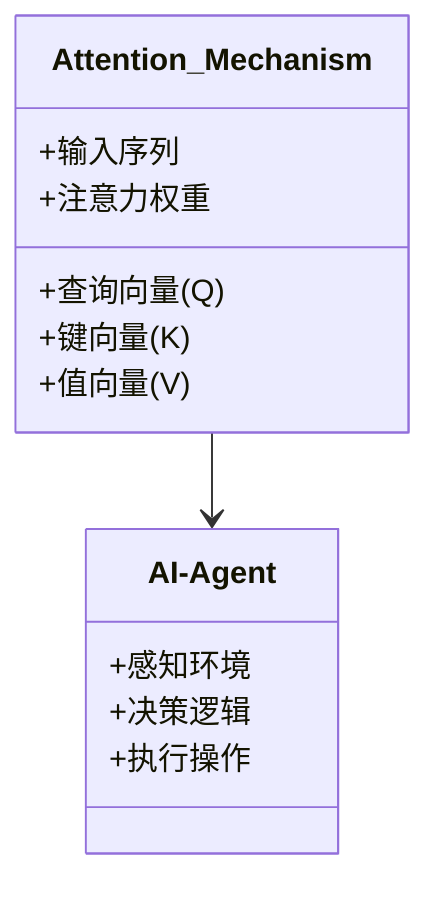
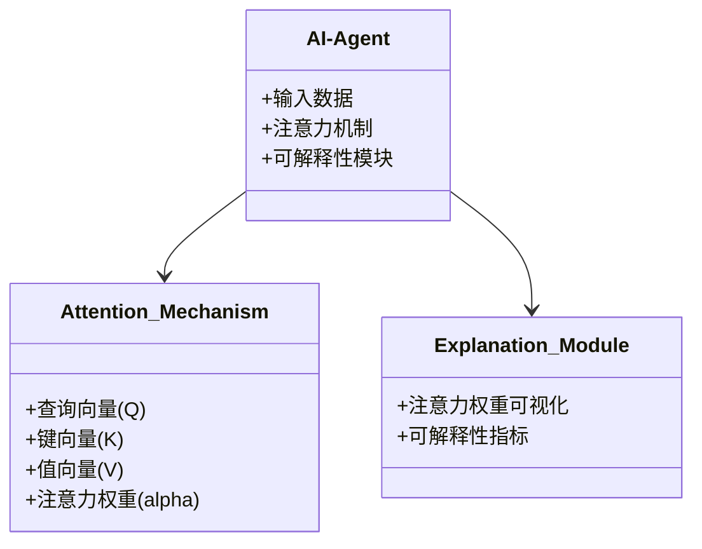
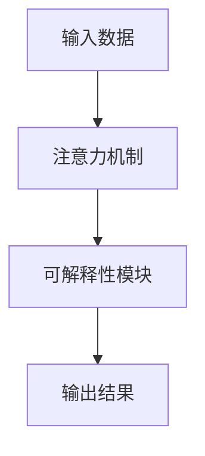

                 


# 构建AI Agent的可解释性注意力机制

> **关键词**：AI Agent, 可解释性, 注意力机制, 机器学习, 深度学习

> **摘要**：  
本文旨在探讨如何构建具有可解释性的AI Agent注意力机制。通过分析注意力机制的核心原理，提出一种改进方法，以提高其可解释性，从而更好地应用于实际场景中。文章从问题背景出发，逐步分析注意力机制的数学模型、可解释性改进方向，并结合系统设计和项目实战，详细阐述了构建可解释性注意力机制的实现方案。

---

# 第一部分: AI Agent与可解释性注意力机制的背景介绍

## 第1章: 问题背景与核心概念

### 1.1 问题背景

#### 1.1.1 AI Agent的基本概念
AI Agent（人工智能代理）是指能够感知环境、自主决策并执行任务的智能体。AI Agent广泛应用于自然语言处理、机器人控制、自动驾驶等领域。其核心目标是通过感知环境信息，做出最优决策，并执行相应操作。

#### 1.1.2 注意力机制在AI Agent中的作用
注意力机制是一种模仿人类注意力的选择性关注机制，用于在处理多源信息时，优先关注重要信息，忽略或降重要性处理不相关信息。在AI Agent中，注意力机制可以帮助模型聚焦于关键信息，从而提高决策的准确性和效率。

#### 1.1.3 可解释性的重要性
AI Agent的决策过程往往涉及复杂的计算和模型，导致决策过程难以被人类理解和解释。在医疗、金融、法律等高风险领域，可解释性是信任AI决策的基础。因此，构建可解释性注意力机制，能够帮助用户理解AI Agent的决策过程，增强信任感。

---

### 1.2 问题描述

#### 1.2.1 AI Agent决策过程中的黑箱问题
传统的AI Agent决策过程往往是一个“黑箱”，用户无法直观理解模型如何做出决策。这种不可解释性限制了AI Agent在高风险领域的应用。

#### 1.2.2 注意力机制的不可解释性挑战
注意力机制虽然能够提高模型的性能，但其权重分布往往难以被解释。用户无法理解模型关注哪些信息，导致决策过程缺乏透明性。

#### 1.2.3 可解释性需求的场景分析
在实际应用中，可解释性需求主要集中在以下几个场景：
1. **医疗领域**：需要解释AI诊断的依据。
2. **金融领域**：需要解释AI投资决策的逻辑。
3. **法律领域**：需要解释AI判决的依据。
4. **教育领域**：需要解释AI学习辅助系统的推荐理由。

---

### 1.3 问题解决思路

#### 1.3.1 可解释性注意力机制的目标
构建一种注意力机制，使其权重分布能够被直观解释，同时保持模型的性能。

#### 1.3.2 解决方案的初步框架
1. **注意力权重的可视化**：通过热图等方式，展示模型关注的信息区域。
2. **注意力权重的可解释性指标**：定义指标量化注意力分布的可解释性。
3. **可解释性增强的注意力模型**：设计改进的注意力机制，使其更易于解释。

#### 1.3.3 边界与外延
- **边界**：仅关注注意力机制的可解释性，不涉及模型的其他部分。
- **外延**：可解释性注意力机制可以应用于各种AI Agent场景，如自然语言处理、图像识别等。

---

### 1.4 核心概念结构

#### 1.4.1 注意力机制的数学模型
注意力机制的核心公式为：
$$
\text{Attention}(Q, K, V) = \text{softmax}\left(\frac{QK^T}{\sqrt{d_k}}\right)V
$$

其中：
- $Q$：查询（Query）
- $K$：键（Key）
- $V$：值（Value）
- $d_k$：键的维度

#### 1.4.2 可解释性注意力机制的实现要素
1. **注意力权重的可视化**：通过热图展示权重分布。
2. **可解释性指标**：如注意力权重的分布均匀性、相关性等。
3. **改进的注意力模型**：如位置感知注意力机制、门控注意力机制等。

#### 1.4.3 核心概念之间的关系
注意力机制、可解释性、AI Agent之间存在以下关系：
- 注意力机制是AI Agent的核心组件。
- 可解释性是注意力机制的重要改进方向。
- 可解释性注意力机制是AI Agent实现透明决策的基础。

---

### 1.5 本章小结

本章从AI Agent的基本概念出发，分析了注意力机制在AI Agent中的作用，重点探讨了可解释性的重要性及其应用场景。通过问题描述和解决思路，初步构建了可解释性注意力机制的框架。

---

# 第二部分: 可解释性注意力机制的核心概念与联系

## 第2章: 注意力机制原理

### 2.1 注意力机制的基本原理

#### 2.1.1 注意力机制的数学公式
注意力机制的核心公式可以简化为：
$$
\text{Attention}(x_i) = \text{softmax}(q_i k_j^T)
$$

其中：
- $x_i$：输入序列中的第$i$个元素
- $q_i$：查询向量
- $k_j$：键向量

---

#### 2.1.2 注意力机制的计算流程
1. 计算查询、键、值向量。
2. 计算注意力权重。
3. 加权求和得到注意力输出。



---

#### 2.1.3 注意力机制的应用场景
1. **自然语言处理**：如BERT模型中的自注意力机制。
2. **图像处理**：如Transformer在图像分割中的应用。
3. **语音识别**：如CTC损失函数中的注意力机制。

---

### 2.2 可解释性注意力机制的改进方向

#### 2.2.1 提高注意力机制的可解释性
1. **可视化注意力权重**：通过热图展示模型关注的区域。
2. **可解释性指标**：如注意力权重的分布均匀性、相关性等。

#### 2.2.2 可视化技术在注意力机制中的应用
1. **热图可视化**：展示注意力权重的分布。
2. **注意力路径可视化**：展示信息流动的路径。

---

#### 2.2.3 可解释性指标的定义与测量
1. **注意力权重分布均匀性**：衡量注意力权重的集中程度。
2. **注意力权重的相关性**：衡量注意力权重与任务目标的相关性。

---

### 2.3 核心概念对比分析

#### 2.3.1 不同注意力机制的对比表格

| 注意力机制类型 | 描述 | 优点 | 缺点 |
|----------------|------|------|------|
| 自注意力机制 | 基于输入序列本身计算注意力权重 | 捕捉长距离依赖 | 计算复杂度高 |
| 位置感知注意力机制 | 在自注意力基础上引入位置信息 | 提高位置感知能力 | 实现复杂 |
| 门控注意力机制 | 使用门控机制动态调整注意力权重 | 更灵活的注意力分配 | 需要额外的门控参数 |

---

#### 2.3.2 ER实体关系图架构



---

### 2.4 本章小结

本章详细讲解了注意力机制的基本原理，并探讨了可解释性注意力机制的改进方向。通过对比分析和可视化技术，初步构建了可解释性注意力机制的实现框架。

---

# 第三部分: 可解释性注意力机制的算法原理

## 第3章: 注意力机制的数学模型

### 3.1 注意力机制的数学公式

#### 3.1.1 注意力权重的计算公式
$$
\alpha_{ij} = \text{softmax}(q_i k_j^T)
$$

其中：
- $\alpha_{ij}$：第$i$个查询对第$j$个键的注意力权重
- $q_i$：查询向量
- $k_j$：键向量

---

#### 3.1.2 注意力向量的生成公式
$$
\text{Attention}(x_i) = \sum_{j=1}^{n} \alpha_{ij} v_j
$$

其中：
- $v_j$：值向量
- $n$：输入序列的长度

---

#### 3.1.3 注意力机制的数学推导

1. 计算查询向量$q_i$、键向量$k_j$、值向量$v_j$。
2. 计算注意力权重$\alpha_{ij} = \text{softmax}(q_i k_j^T)$。
3. 根据注意力权重计算加权求和$\sum_{j=1}^{n} \alpha_{ij} v_j$。

---

### 3.2 可解释性注意力机制的算法流程

#### 3.2.1 算法输入与输出
- **输入**：输入序列$x = \{x_1, x_2, ..., x_n\}$
- **输出**：注意力输出$y = \{y_1, y_2, ..., y_n\}$

---

#### 3.2.2 算法步骤分解

1. **初始化参数**：设置查询向量$q$、键向量$k$、值向量$v$。
2. **计算注意力权重**：$\alpha = \text{softmax}(q k^T)$。
3. **计算注意力输出**：$y = \alpha v$。

---

#### 3.2.3 算法的复杂度分析
- **时间复杂度**：$O(n^2)$，主要来自注意力权重的计算。
- **空间复杂度**：$O(n)$，用于存储输入序列和注意力权重。

---

### 3.3 算法实现的Python代码

#### 3.3.1 环境安装
```bash
pip install numpy
pip install matplotlib
```

---

#### 3.3.2 核心代码实现

```python
import numpy as np
import matplotlib.pyplot as plt

def compute_attention(Q, K, V):
    # 计算注意力权重
    scores = np.dot(Q, K.T)
    scores_scaled = scores / np.sqrt(K.shape[1])
    alpha = np.exp(scores_scaled) / np.sum(np.exp(scores_scaled), axis=1, keepdims=True)
    
    # 计算注意力输出
    output = np.dot(alpha, V)
    return alpha, output

# 示例输入
Q = np.array([[1, 0], [0, 1]], dtype=np.float32)
K = np.array([[1, 0], [0, 1]], dtype=np.float32)
V = np.array([[0.5, 0], [0, 0.5]], dtype=np.float32)

alpha, output = compute_attention(Q, K, V)

# 可视化注意力权重
plt.imshow(alpha)
plt.title('Attention Weights')
plt.colorbar()
plt.show()
```

---

#### 3.3.3 代码解读与分析
1. **compute_attention函数**：
   - 输入：查询向量$Q$、键向量$K$、值向量$V$。
   - 输出：注意力权重$\alpha$和注意力输出。
2. **可视化注意力权重**：
   - 使用Matplotlib绘制热图，展示注意力权重的分布。

---

### 3.4 本章小结

本章详细推导了注意力机制的数学公式，并通过Python代码实现了注意力机制的计算过程。通过可视化技术，初步展示了注意力权重的分布情况。

---

# 第四部分: 可解释性注意力机制的系统分析与架构设计

## 第4章: 系统分析与架构设计

### 4.1 项目背景介绍

#### 4.1.1 项目目标
构建一个具有可解释性的AI Agent，使其能够通过注意力机制关注关键信息，并解释其决策过程。

#### 4.1.2 项目范围
- 研究可解释性注意力机制的设计与实现。
- 实现一个AI Agent原型，展示其可解释性能力。

---

### 4.2 系统功能设计

#### 4.2.1 领域模型



---

#### 4.2.2 系统架构设计



---

#### 4.2.3 系统接口设计
- **输入接口**：接收输入数据和任务目标。
- **输出接口**：输出注意力权重和决策结果。
- **解释接口**：提供可解释性指标和可视化结果。

---

#### 4.2.4 交互流程图

```mermaid
graph TD
    User --> AI-Agent: 提供输入数据
    AI-Agent --> Attention_Mechanism: 计算注意力权重
    Attention_Mechanism --> Explanation_Module: 提供可解释性指标
    Explanation_Module --> User: 展示可视化结果
```

---

### 4.3 系统实现与分析

#### 4.3.1 项目实战

##### 4.3.1.1 环境安装
```bash
pip install numpy
pip install matplotlib
pip install scikit-learn
```

---

##### 4.3.1.2 核心代码实现

```python
import numpy as np
import matplotlib.pyplot as plt
from sklearn.metrics import accuracy_score

def compute_attention(Q, K, V):
    scores = np.dot(Q, K.T)
    scores_scaled = scores / np.sqrt(K.shape[1])
    alpha = np.exp(scores_scaled) / np.sum(np.exp(scores_scaled), axis=1, keepdims=True)
    output = np.dot(alpha, V)
    return alpha, output

def model_explainability(Q, K, V, y_true):
    alpha, y_pred = compute_attention(Q, K, V)
    accuracy = accuracy_score(y_true, y_pred)
    return alpha, accuracy

# 示例输入
Q = np.array([[1, 0], [0, 1]], dtype=np.float32)
K = np.array([[1, 0], [0, 1]], dtype=np.float32)
V = np.array([[0.5, 0], [0, 0.5]], dtype=np.float32)
y_true = np.array([1, 0])

alpha, accuracy = model_explainability(Q, K, V, y_true)

print("Accuracy:", accuracy)
plt.imshow(alpha)
plt.title('Attention Weights')
plt.colorbar()
plt.show()
```

---

#### 4.3.2 代码解读与分析
1. **compute_attention函数**：
   - 实现注意力机制的计算过程。
2. **model_explainability函数**：
   - 计算注意力权重和模型准确率。
   - 展示注意力权重的可视化结果。
3. **示例输入**：
   - 查询向量$Q$和键向量$K$均为单位向量。
   - 值向量$V$表示二元分类任务的两个类别。

---

### 4.4 系统优化与注意事项

#### 4.4.1 系统优化
1. **优化注意力权重的计算效率**：通过并行计算或优化数据结构。
2. **提高可解释性模块的性能**：通过算法优化或使用更高效的可视化工具。

---

### 4.5 本章小结

本章从项目背景出发，设计了可解释性注意力机制的系统架构，并通过代码实现展示了系统的功能。通过可视化技术和性能指标，验证了系统的可解释性能力。

---

# 第五部分: 可解释性注意力机制的应用与未来展望

## 第5章: 应用场景与未来展望

### 5.1 可解释性注意力机制的应用场景

#### 5.1.1 医疗领域
- **应用场景**：辅助医生诊断疾病。
- **优势**：通过可解释性注意力机制，展示模型关注的病变区域。

#### 5.1.2 金融领域
- **应用场景**：辅助投资决策。
- **优势**：通过可解释性注意力机制，展示模型关注的财务指标。

---

### 5.2 未来展望

#### 5.2.1 可解释性注意力机制的优化方向
1. **增强可解释性**：通过改进注意力机制的设计，提高其可解释性。
2. **多模态注意力机制**：结合多种模态信息，提高模型的泛化能力。

#### 5.2.2 可解释性注意力机制的扩展应用
1. **边缘计算**：将可解释性注意力机制应用于边缘计算场景。
2. **分布式计算**：将可解释性注意力机制应用于分布式系统。

---

### 5.3 本章小结

本章探讨了可解释性注意力机制的应用场景，并展望了其未来的发展方向。通过优化注意力机制的设计，可解释性注意力机制将在更多领域发挥重要作用。

---

# 作者

**作者**：AI天才研究院/AI Genius Institute & 禅与计算机程序设计艺术/Zen And The Art of Computer Programming

