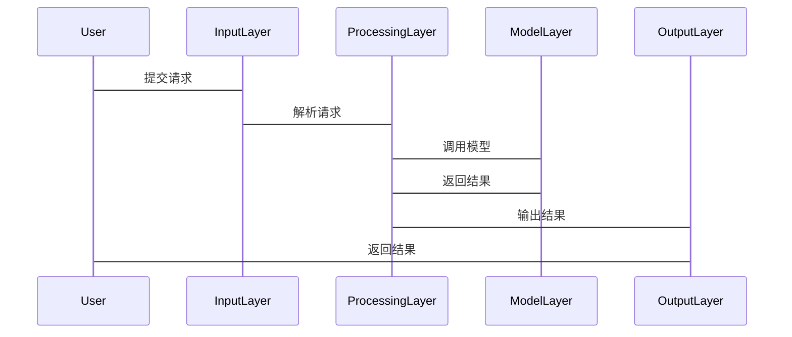

                 


# 构建AI Agent的技术栈选择指南

> 关键词：AI Agent, 技术栈选择, 模型, 开发框架, 系统架构, 项目实战

> 摘要：构建AI Agent需要选择合适的技术栈，本文从背景、技术栈选择标准、主流技术栈分析、系统架构设计、项目实战到最佳实践，全面指导读者如何选择和实施AI Agent技术栈。

---

# 第一部分: AI Agent技术栈选择的背景与概述

## 第1章: AI Agent的基本概念与构建背景

### 1.1 AI Agent的定义与类型

#### 1.1.1 AI Agent的定义
AI Agent（人工智能代理）是一种能够感知环境、自主决策并执行任务的智能实体。它可以是软件程序、机器人或其他智能系统，旨在通过学习和推理完成特定目标。

#### 1.1.2 AI Agent的主要类型
- **简单反射型Agent**：基于规则执行任务，适用于简单场景。
- **基于模型的反射型Agent**：使用内部模型进行推理，适用于复杂场景。
- **目标驱动型Agent**：基于目标进行决策和行动。
- **效用驱动型Agent**：通过最大化效用函数来优化决策。

#### 1.1.3 AI Agent的核心特征
- **自主性**：无需外部干预自主运行。
- **反应性**：能够实时感知并响应环境变化。
- **目标导向性**：基于目标驱动行为。
- **学习能力**：通过数据和经验提升性能。

### 1.2 AI Agent的构建背景

#### 1.2.1 当前AI技术的发展趋势
AI技术迅速发展，特别是在自然语言处理（NLP）、计算机视觉和强化学习等领域，为AI Agent的构建提供了强大的技术支持。

#### 1.2.2 AI Agent在企业中的应用场景
- **客服自动化**：智能客服系统。
- **智能推荐**：个性化推荐系统。
- **自动化运维**：IT运维自动化。
- **智能监控**：实时监控与预警。

#### 1.2.3 构建AI Agent的必要性与挑战
- **必要性**：提升效率、降低成本、增强用户体验。
- **挑战**：复杂性、实时性、安全性和可解释性。

### 1.3 本章小结
本章介绍了AI Agent的基本概念、类型和构建背景，强调了选择合适技术栈的重要性。

---

# 第二部分: 技术栈选择的标准与分析

## 第2章: 技术栈选择的关键标准

### 2.1 技术栈选择的核心要素

#### 2.1.1 模型选择标准
- **模型性能**：准确性、响应速度。
- **模型规模**：小、中、大模型选择。
- **模型适应性**：是否支持定制化需求。

#### 2.1.2 开发框架的选择
- **框架功能**：是否支持多模态、分布式训练。
- **社区支持**：活跃度、文档丰富性。
- **兼容性**：与现有系统的兼容性。

#### 2.1.3 工具链与生态系统的考量
- **工具丰富性**：是否有完善的调试和部署工具。
- **生态系统支持**：是否有丰富的预训练模型和开发资源。

### 2.2 技术栈选择的决策流程

#### 2.2.1 明确项目需求与目标
- **项目目标**：明确AI Agent的目标和功能。
- **资源限制**：预算、团队能力和时间限制。
- **扩展性需求**：是否需要未来的扩展和维护。

#### 2.2.2 评估技术栈的优缺点
- **模型评估**：模型的性能、训练成本和推理效率。
- **框架评估**：框架的功能、易用性和社区支持。
- **工具链评估**：工具的完善性和生态系统支持。

#### 2.2.3 综合评估与最终选择
- **综合对比**：根据项目需求和技术栈的优缺点进行综合评估。
- **试错与调整**：在实际开发中不断验证和调整技术栈。

### 2.3 本章小结
本章详细分析了技术栈选择的标准和决策流程，帮助读者根据项目需求选择合适的技术。

---

# 第三部分: 主流技术栈的详细分析

## 第3章: 常见AI Agent技术栈介绍

### 3.1 模型选择

#### 3.1.1 GPT系列模型
- **GPT-3**：大规模预训练模型，性能强大，但成本高。
- **GPT-4**：更强的多模态能力，适合复杂任务。

#### 3.1.2 PaLM模型
- **特点**：专为理解和生成长文本设计，适合需要深度理解的任务。

#### 3.1.3 LLaMA系列模型
- **特点**：开源模型，适合需要自定义和部署的场景。

### 3.2 开发框架

#### 3.2.1 LangChain框架
- **特点**：专注于对话式AI Agent的构建，支持多轮对话和复杂任务。

#### 3.2.2 AGI Stack框架
- **特点**：提供端到端的AI Agent构建工具，简化开发流程。

#### 3.2.3 其他常用框架
- **例如**：Ray、Dask等分布式计算框架，适合复杂场景。

### 3.3 工具链与生态系统

#### 3.3.1 Hugging Face平台
- **特点**：提供丰富的预训练模型和开发工具，适合快速开发。

#### 3.3.2 OpenAI API
- **特点**：提供强大的API接口，适合快速部署。

#### 3.3.3 其他工具与服务
- **例如**：Amazon SageMaker、Google AI Platform等云服务。

### 3.4 本章小结
本章分析了主流AI Agent技术栈，帮助读者根据项目需求选择合适的技术。

---

# 第四部分: 系统架构与设计

## 第4章: AI Agent系统的架构设计

### 4.1 系统功能设计

#### 4.1.1 需求分析与功能模块划分
- **功能模块**：输入处理、模型调用、结果输出、反馈机制。

#### 4.1.2 系统功能模块的交互流程
- **流程图**：输入->处理->模型调用->输出->反馈。

#### 4.1.3 功能模块的优先级排序
- **优先级**：核心功能优先，后续逐步扩展。

### 4.2 系统架构设计

#### 4.2.1 系统架构的总体设计
- **分层架构**：分为输入层、处理层、模型层和输出层。

#### 4.2.2 系统架构的分层设计
- **输入层**：接收用户输入。
- **处理层**：解析输入并调用模型。
- **模型层**：运行AI模型生成结果。
- **输出层**：将结果返回给用户。

#### 4.2.3 系统架构的扩展性设计
- **模块化设计**：各模块独立，便于扩展和维护。

### 4.3 系统接口设计

#### 4.3.1 API接口设计
- **输入接口**：HTTP POST请求，包含输入数据和参数。
- **输出接口**：JSON格式返回结果和状态码。

#### 4.3.2 模块间接口设计
- **内部通信**：通过队列或消息中间件实现模块间通信。

### 4.4 系统交互流程

#### 4.4.1 交互流程图


### 4.5 本章小结
本章详细设计了AI Agent系统的架构，包括功能设计、分层架构和交互流程。

---

# 第五部分: 项目实战

## 第5章: AI Agent项目实战

### 5.1 环境安装与配置

#### 5.1.1 安装Python环境
- **命令**：`python -m pip install --upgrade pip`

#### 5.1.2 安装依赖库
- **命令**：`pip install langchain openai`

### 5.2 系统核心实现

#### 5.2.1 核心代码实现
```python
from langchain.chat import ChatOpenAI
from langchain.prompts import PromptTemplate
from langchain.chains import LLMChain

# 初始化Chat模型
llm = ChatOpenAI(model="gpt-3.5-turbo")

# 定义提示模板
prompt = PromptTemplate(
    inputVariables=["input"],
    template="请根据输入生成一个回答：{input}"
)

# 创建链路
llm_chain = LLMChain(llm=llm, prompt=prompt)
```

#### 5.2.2 代码解读与分析
- **代码功能**：定义提示模板，创建LLM链路，实现对话式交互。

### 5.3 项目实战案例

#### 5.3.1 案例分析
- **场景**：构建一个简单的智能客服系统。
- **实现步骤**：环境安装、模型选择、功能实现、测试优化。

#### 5.3.2 代码实现
```python
# 定义输入
input_text = "请问如何处理订单问题？"

# 调用模型
response = llm_chain.run(input_text)
print(response)
```

#### 5.3.3 性能优化
- **优化点**：缓存机制、负载均衡、错误处理。

### 5.4 本章小结
本章通过实战案例详细讲解了AI Agent的实现过程，从环境配置到代码实现，再到案例分析。

---

# 第六部分: 最佳实践与总结

## 第6章: 最佳实践与总结

### 6.1 最佳实践

#### 6.1.1 技术选择
- **选择适合的模型和框架**：根据项目需求选择合适的技术栈。

#### 6.1.2 开发流程
- **迭代开发**：从小功能开始，逐步完善系统。

#### 6.1.3 优化建议
- **持续优化**：通过反馈不断优化模型和系统架构。

### 6.2 小结与展望

#### 6.2.1 本章小结
- **总结**：本文详细介绍了AI Agent技术栈选择的各个方面，从背景到实战。

#### 6.2.2 未来展望
- **发展趋势**：多模态AI Agent、可解释性AI、强化学习的应用。

### 6.3 注意事项

#### 6.3.1 开发注意事项
- **数据安全**：确保数据隐私和安全。
- **模型可解释性**：提升模型的可解释性。
- **性能优化**：优化模型和系统的性能。

#### 6.3.2 部署注意事项
- **高可用性**：确保系统的高可用性。
- **容错设计**：设计完善的容错机制。

### 6.4 本章小结
本章总结了本文的主要内容，并提出了未来的展望和注意事项。

---

# 作者：AI天才研究院/AI Genius Institute & 禅与计算机程序设计艺术 /Zen And The Art of Computer Programming

---

本文通过详细分析AI Agent的技术栈选择，从背景到实战，为读者提供了全面的指导。希望本文能帮助读者在构建AI Agent时做出明智的技术选择，提升开发效率和系统性能。

