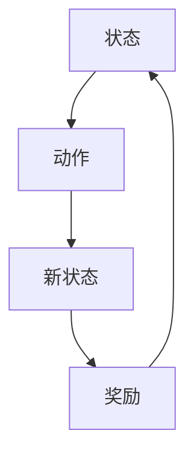
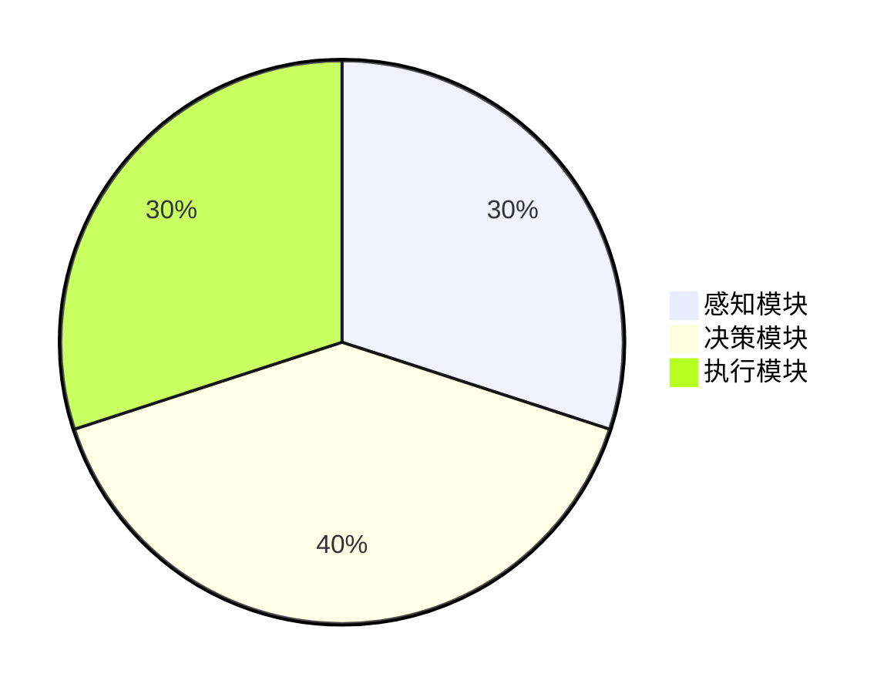

                 


# 构建AI Agent的敏捷开发流程

> 关键词：AI Agent、敏捷开发、系统架构、算法实现、项目实战

> 摘要：本文详细探讨了构建AI Agent的敏捷开发流程，从背景介绍、核心概念、算法实现到系统架构设计、项目实战，再到最佳实践，全面解析如何高效开发AI Agent。

---

## 引言

### 1.1 AI Agent的基本概念

AI Agent（人工智能代理）是一种能够感知环境、自主决策并采取行动以实现目标的智能系统。它广泛应用于自动驾驶、智能助手、游戏AI、推荐系统等领域。

#### 问题背景与描述

AI Agent的开发涉及感知、决策和执行三个核心模块。传统开发流程可能面临需求变更频繁、复杂性高、迭代慢等问题，而敏捷开发强调快速迭代和客户合作，适合应对这些挑战。

#### 问题解决

敏捷开发通过小步快跑的方式，快速验证假设，及时调整方向，确保开发过程灵活高效。同时，持续交付可工作的软件，让客户尽早获得价值。

### 1.2 敏捷开发的基本概念

敏捷开发是一种以迭代、增量方式开发产品的模式，强调个体互动、客户合作、响应变化和交付可用的软件。

---

## 核心概念与联系

### 2.1 AI Agent的结构

AI Agent由感知模块、决策模块和执行模块组成。感知模块负责收集环境信息，决策模块基于信息做出决策，执行模块将决策转化为行动。

#### 核心要素组成

- **感知模块**：通过传感器或API获取环境数据。
- **决策模块**：基于感知信息选择最优动作。
- **执行模块**：将决策转化为实际操作。

#### 实体关系图

```mermaid
er
actor: 用户
agent: AI Agent
environment: 环境
repository: 数据库
```

AI Agent与环境交互，感知信息，做出决策并执行动作，同时与用户和数据库交互。

---

## 算法原理讲解

### 3.1 概率论基础

概率论在AI Agent中用于处理不确定性。例如，贝叶斯网络用于推理概率分布。

#### 概率分布公式

$$P(A|B) = \frac{P(B|A)P(A)}{P(B)}$$

贝叶斯定理用于计算条件概率，帮助AI Agent在不确定性环境中做出决策。

### 3.2 强化学习基础

强化学习通过试错机制优化决策策略。Q-learning算法是常见的强化学习算法。

#### Q-learning算法流程



Q-learning通过状态-动作-奖励-状态（SARSA）更新Q值，逐步逼近最优策略。

---

## 系统分析与架构设计

### 4.1 系统架构设计

AI Agent系统由感知层、决策层和执行层组成。

#### 系统架构图



各模块协同工作，确保AI Agent高效运行。

#### 接口设计

- 感知模块提供API获取环境数据。
- 决策模块通过接口接收感知数据，返回决策结果。
- 执行模块接收决策指令，执行操作。

---

## 项目实战

### 5.1 环境配置与安装

安装必要的库，如TensorFlow、NumPy、OpenAI Gym等。

### 5.2 核心代码实现

以下是AI Agent的Python实现示例：

```python
class AI-Agent:
    def __init__(self, environment):
        self.environment = environment
        self.perception = PerceptionModule()
        self.decision = DecisionModule()
        self.execution = ExecutionModule()

    def process(self):
        while True:
            perception_data = self.perception感知环境数据
            action = self.decision做决定
            self.execution执行动作
```

### 5.3 案例分析与解读

通过一个简单的导航任务，展示AI Agent的实现过程，包括感知数据处理、决策算法选择和执行动作实现。

---

## 最佳实践与总结

### 6.1 最佳实践

- **持续集成**：频繁交付功能，及时反馈。
- **客户合作**：与客户保持沟通，确保开发方向正确。
- **技术债务管理**：定期清理技术债务，保持代码健康。

### 6.2 未来展望

AI Agent将在更多领域发挥重要作用，如自动驾驶、智能医疗等。随着技术进步，AI Agent的开发流程将更加高效和人性化。

---

## 作者信息

作者：AI天才研究院 & 禅与计算机程序设计艺术

---

**本文为AI天才研究院原创，未经授权不得转载。**

